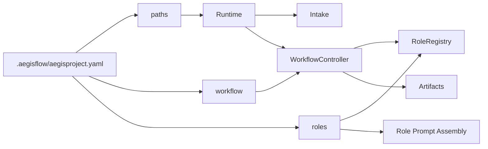

# AegisFlow

AegisFlow 是一个面向真实软件开发工作的 Agentic Dev Workflow System。

当前 `v0.1` 的主线能力，是把 CLI 用户输入组织进一条受控工作流：

- `Intake`：接收自然语言需求、初始化运行时、启动或恢复任务
- `Workflow`：维护状态机、推进 phase、写工件、发事件
- `Role`：按职责执行具体阶段任务

当前 `v0.1` 支持的任务范围：

- `Feature Change`
- `Bugfix`
- `Small New Feature`

当前 `v0.1` 的默认 phase 顺序：

```text
clarify -> explore -> plan -> build -> review -> test-design -> unit-test -> test
```

## 当前目录约定

```text
.aegisflow/
  aegisproject.yaml
  artifacts/
  roles/
roleflow/
  clarifications/
  context/
  implementation/
```

- `.aegisflow/aegisproject.yaml`：项目配置入口
- `.aegisflow/roles/`：项目级角色提示词目录
- `roleflow/clarifications/0.1.0/`：当前 `v0.1` PRD 集合

## 配置文件位置

当前配置文件路径固定为：

```yaml
.aegisflow/aegisproject.yaml
```

如果你要接入一个新项目，优先修改这个文件，而不是散落地修改代码常量。

## 一个最小可用示例

```yaml
project:
  name: "AegisFlow"
  description: "AegisFlow 项目配置"

paths:
  cwd: "."
  artifactDir: ".aegisflow/artifacts"
  snapshotDir: ".aegisflow/state"
  logDir: ".aegisflow/logs"

workflow:
  type: "default-workflow"
  phases:
    - name: "clarify"
      hostRole: "clarifier"
      needApproval: false
    - name: "explore"
      hostRole: "explorer"
      needApproval: false
    - name: "plan"
      hostRole: "planner"
      needApproval: true
    - name: "build"
      hostRole: "builder"
      needApproval: false
    - name: "review"
      hostRole: "critic"
      needApproval: true
    - name: "test-design"
      hostRole: "test-designer"
      needApproval: false
    - name: "unit-test"
      hostRole: "test-writer"
      needApproval: false
    - name: "test"
      hostRole: "tester"
      needApproval: false

roles:
  prototypeDir: "/Users/aaron/code/roleflow/roles"
  promptDir: ".aegisflow/roles"

artifacts:
  structure: "by-phase"
  format: "md"

runtime:
  maxRetries: 2
  timeoutMs: 300000

logging:
  level: "info"
  saveToFile: true
```

## 配置重点

### `project`

```yaml
project:
  name: "AegisFlow"
  description: "AegisFlow 项目配置"
```

- `name`：项目名，用于标识当前目标项目
- `description`：项目描述，建议写清项目性质或接入目的

这两个字段主要用于项目识别和上下文展示，不参与 phase 编排。

### `paths`

```yaml
paths:
  cwd: "."
  artifactDir: ".aegisflow/artifacts"
  snapshotDir: ".aegisflow/state"
  logDir: ".aegisflow/logs"
```

- `cwd`：目标项目目录
- `artifactDir`：工件输出根目录
- `snapshotDir`：任务状态快照目录
- `logDir`：日志目录

推荐约束：

- 所有路径都放在 `.aegisflow/` 下，避免污染业务目录
- `cwd` 在本仓库场景下可直接用 `.`
- 若接入外部项目，可改成绝对路径

### `workflow`

```yaml
workflow:
  type: "default-workflow"
  phases:
    - name: "clarify"
      hostRole: "clarifier"
      needApproval: false
```

这是当前最重要的配置块之一，用来定义工作流编排。

字段说明：

- `type`：当前工作流类型，`v0.1` 使用 `default-workflow`
- `phases`：phase 列表，按顺序执行

每个 phase 至少包含：

- `name`：phase 名称
- `hostRole`：主持该 phase 的角色
- `needApproval`：该 phase 结束后是否等待人工审批

当前 `v0.1` 已确认 phase 名称：

- `clarify`
- `explore`
- `plan`
- `build`
- `review`
- `test-design`
- `unit-test`
- `test`

当前 `v0.1` 已确认角色名：

- `clarifier`
- `explorer`
- `planner`
- `builder`
- `critic`
- `test-designer`
- `test-writer`
- `tester`

推荐做法：

- 不要随意新增 phase 名称
- 不要让 `hostRole` 与已注册角色名漂移
- `plan`、`review` 这类高风险阶段优先开启 `needApproval`

### `roles`

```yaml
roles:
  prototypeDir: "/Users/aaron/code/roleflow/roles"
  promptDir: ".aegisflow/roles"
```

这是当前 README 最重要的配置块。

#### `prototypeDir`

- 角色原型目录
- 当前约定为跨项目复用的稳定角色职责来源
- 例如：
  - `clarifier.md`
  - `planner.md`
  - `builder.md`
  - `critic.md`

当前仓库约定：

```yaml
prototypeDir: "/Users/aaron/code/roleflow/roles"
```

#### `promptDir`

- 项目级角色提示词目录
- 当前约定为 `.aegisflow/roles`
- 运行时会把这个目录加载到 `ProjectConfig.targetProjectRolePromptPath`

当前仓库中，`.aegisflow/roles/` 已经放入了项目侧角色文件，例如：

- `.aegisflow/roles/clarifier.md`
- `.aegisflow/roles/planner.md`
- `.aegisflow/roles/builder.md`
- `.aegisflow/roles/critic.md`
- `.aegisflow/roles/tester.md`

#### 角色提示词装载规则

当前 PRD 约束下，角色 prompt 组装遵循下面的顺序：

```text
角色原型 -> 项目级角色提示词 -> 运行时执行
```

语义规则：

- 先读取 `prototypeDir` 中的角色原型
- 再追加 `promptDir` 下的项目级同名角色提示词
- 若两者冲突，以项目级角色提示词为准
- 若项目级文件缺失，允许回退到角色原型

#### `roles.overrides`（可选）

虽然当前示例里没有启用，但 PRD 已保留 override 机制。

可选写法：

```yaml
roles:
  prototypeDir: "/Users/aaron/code/roleflow/roles"
  promptDir: ".aegisflow/roles"
  overrides:
    critic:
      extraInstructions: ".aegisflow/roles/custom-critic.md"
```

适用场景：

- 同名文件不足以表达项目需求
- 某个角色需要单独绑定另一份补充提示词

### `artifacts`

```yaml
artifacts:
  structure: "by-phase"
  format: "md"
```

- `structure`：工件目录结构
  - 当前推荐 `by-phase`
- `format`：工件格式
  - 当前 `v0.1` 使用 `md`

当前 PRD 语义下，`Workflow` 统一负责工件落盘，`Role` 返回结果但不直接写工件。

### `runtime`

```yaml
runtime:
  maxRetries: 2
  timeoutMs: 300000
```

- `maxRetries`：最大重试次数
- `timeoutMs`：单次运行超时，单位毫秒

推荐：

- `timeoutMs` 先保持在 5 分钟量级
- 不要把 `maxRetries` 设得过大，否则 CLI 体验会变差

### `logging`

```yaml
logging:
  level: "info"
  saveToFile: true
```

- `level`：日志级别
  - 可按 PRD 语义理解为 `debug / info / warn / error`
- `saveToFile`：是否落日志文件

推荐：

- 默认使用 `info`
- 排查问题时再提升到更详细级别

## 一张图看懂配置和运行时关系



## 当前 v0.1 范围总结

基于 `roleflow/clarifications/0.1.0/` 当前 PRD，`v0.1` 的重点是：

- CLI `Intake` 入口
- `WorkflowController` 状态机与 phase 流转
- `RoleRegistry / RoleRuntime / RoleResult` 等角色公共契约
- 项目级角色提示词目录 `.aegisflow/roles/`
- 配置入口 `.aegisflow/aegisproject.yaml`

当前不应过度假设的内容：

- 复杂 UI
- 多 workflow 市场
- 超出 `default-workflow` 的大规模扩展

## 推荐接入步骤

1. 创建 `.aegisflow/` 目录。
2. 写入 `.aegisflow/aegisproject.yaml`。
3. 在 `.aegisflow/roles/` 中准备项目级角色提示词。
4. 确认 `roles.prototypeDir` 指向角色原型目录。
5. 确认 `workflow.phases` 与角色名一一对应。
6. 再启动 CLI 入口进行任务创建、运行和恢复。

## 当前仓库中的实际配置文件

当前仓库已经存在一份实际配置：

- [.aegisflow/aegisproject.yaml](/Users/aaron/code/Aegisflow/.aegisflow/aegisproject.yaml)

当前仓库已经存在项目级角色提示词目录：

- [.aegisflow/roles/index.md](/Users/aaron/code/Aegisflow/.aegisflow/roles/index.md)

## 参考 PRD

- [default-workflow-intake-layer-prd.md](/Users/aaron/code/Aegisflow/roleflow/clarifications/0.1.0/default-workflow-intake-layer-prd.md)
- [default-workflow-workflow-layer-prd.md](/Users/aaron/code/Aegisflow/roleflow/clarifications/0.1.0/default-workflow-workflow-layer-prd.md)
- [default-workflow-role-layer-prd.md](/Users/aaron/code/Aegisflow/roleflow/clarifications/0.1.0/default-workflow-role-layer-prd.md)
- [default-workflow-role-prompt-bootstrap-prd.md](/Users/aaron/code/Aegisflow/roleflow/clarifications/0.1.0/default-workflow-role-prompt-bootstrap-prd.md)
- [default-workflow-role-codex-agent-prd.md](/Users/aaron/code/Aegisflow/roleflow/clarifications/0.1.0/default-workflow-role-codex-agent-prd.md)
