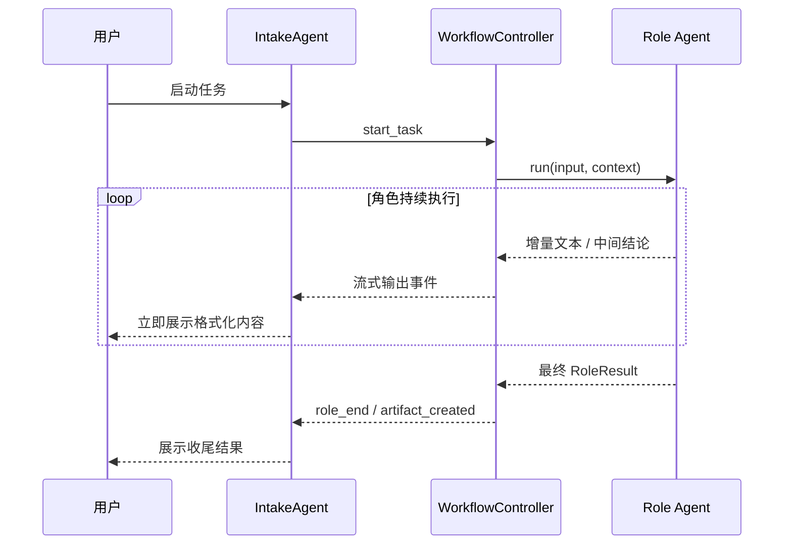
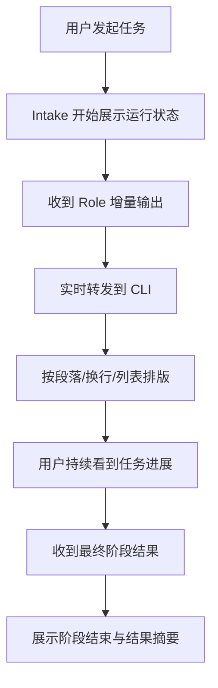

# Default Workflow CLI 流式输出 PRD

## 文档信息

| 字段 | 内容 |
|------|------|
| 模块名 | `default-workflow-cli-streaming-output` |
| 本文范围 | `default-workflow` 的 CLI 输出体验、流式反馈与排版展示 |
| 文档路径 | `roleflow/clarifications/0.1.0/default-workflow-cli-streaming-output-prd.md` |
| 直接使用者 | AegisFlow 开发者、Planner、Builder |
| 信息来源 | 当前产品问题、`roleflow/clarifications/0.1.0/default-workflow-intake-layer-prd.md`、`roleflow/clarifications/0.1.0/default-workflow-workflow-layer-prd.md`、用户澄清结论 |

## Background

当前 `default-workflow` 已具备 `Intake -> Workflow -> Role` 的基础链路，但 CLI 输出体验存在三个明确问题：

1. 信息不是流式输出，用户只能看到延迟后的结果。
2. `Role` 层 Agent 返回的内容没有完整展示到 `Intake` 层，用户无法理解任务当前在做什么。
3. 输出到 `Intake` 层的文本没有经过任何排版处理，换行、段落和列表都难以阅读。

现有 `Intake` PRD 只要求“展示 `WorkflowEvent`”，现有 `Workflow` PRD 只要求“发送 `WorkflowEvent`”，但还没有把“流式反馈”“角色内容透传”“CLI 排版”明确收敛为可交付需求。因此本 PRD 作为新增文档，专门补齐这一块。

## Goal

本 PRD 的目标是明确 `default-workflow` 在 CLI 中的输出体验，使系统能够：

1. 在任务执行过程中以流式方式持续输出信息，而不是仅在阶段结束后一次性展示。
2. 将所有 `Role` 层 Agent 的用户可见输出持续展示到 `Intake` 层。
3. 对展示到 CLI 的内容做基础排版处理，至少保证换行、段落、列表和代码块可读。
4. 让用户在不查看日志文件的前提下，也能理解系统当前正在做什么、做到哪一步、输出了什么结论。

## In Scope

- `Intake` 层的 CLI 流式展示能力
- `Workflow -> Intake` 的实时反馈语义
- `Role -> Workflow -> Intake` 的用户可见内容转发
- 输出内容的基础文本排版
- 基于事件的增量输出约束

## Out of Scope

- 图形化界面或 TUI
- 富文本主题、美术设计、颜色系统
- 角色内部 prompt 细节
- 日志文件格式重构
- 新增新的 workflow 或 role

## 已确认事实

- 当前信息不是流式输出，需要改成流式输出
- 所有 `Role` 层 Agent 返回的内容都应该展示到 `Intake` 层
- 当前输出到 `Intake` 层的内容没有经过排版，连 `\n` 都不支持，阅读体验很差
- 上述三项属于当前产品问题，不是可选优化项

## 需求总览

## 流式关系图

## 用户视角流程图

## Functional Requirements

### FR-1 CLI 输出必须支持流式展示

- `Intake` 层必须支持流式展示运行信息。
- 当任务正在执行时，CLI 不得只在阶段结束后一次性输出全部内容。
- 只要 `Workflow` 或 `Role` 产生新的用户可见内容，`Intake` 就应尽快展示。
- “尽快展示”在产品语义上指增量到达后即时刷新，而不是等待完整 `RoleResult` 才统一打印。

### FR-2 Role 层用户可见输出必须透传到 Intake

- 所有 `Role` 层 Agent 的用户可见输出，都必须通过 `Workflow` 转发到 `Intake` 层展示。
- 这里的“用户可见输出”包括但不限于：
  - 当前正在执行的动作说明
  - 中间分析结论
  - 阶段性小结
  - 最终结果摘要
- 不应只展示 `phase_start`、`phase_end` 这类骨架事件，而隐藏角色实际输出内容。
- 若某些内容属于纯内部元数据或调试信息，可不直接展示，但其判定规则必须保守，默认优先展示而不是默认吞掉。

### FR-3 Workflow 必须承担 Role 输出的转发职责

- `Workflow` 层必须承担 `Role -> Intake` 可见内容转发职责。
- `Intake` 不应直接调用 `Role` 获取内容。
- `Role` 也不应直接向 CLI 写输出。
- `Workflow` 应作为中间协调层，将角色的增量内容和最终结果统一封装为可供 `Intake` 展示的事件或消息。

### FR-4 CLI 输出必须支持基础排版

- 展示到 `Intake` 层的文本必须经过基础排版处理。
- 至少必须支持以下能力：
  - 将换行正确显示为多行
  - 保留段落间距
  - 保留列表结构
  - 保留代码块或类代码块内容的可读边界
- 不允许把包含换行的内容压成单行长串直接输出。

### FR-5 必须正确处理 `\n`

- 当上游消息中包含换行语义时，CLI 展示必须正确换行。
- 对于文本中的 `\n`，至少要满足“用户能看到实际换行，而不是字面量转义字符”这一要求。
- 不论换行来自角色输出、工作流事件还是工件摘要，都必须按统一规则处理。

### FR-6 必须保留输出顺序与上下文

- 流式展示时必须尽量保留原始输出顺序。
- 不应因为排版处理而打乱消息时间顺序。
- 用户应能分辨每段输出来自哪个阶段或哪个角色。
- 阶段切换时，CLI 至少应提供清晰的分隔或标题提示。

### FR-7 阶段骨架事件与角色内容必须同时存在

- 系统仍应保留 `task_start`、`phase_start`、`phase_end`、`role_start`、`role_end` 等骨架事件的展示能力。
- 但骨架事件不能替代角色内容展示。
- 用户看到的输出应同时包括：
  - 当前系统状态
  - 当前角色真实输出
  - 最终阶段结果

### FR-8 失败与中断时也要保持可读输出

- 当任务失败、中断或等待审批时，CLI 仍应以同样的排版规则输出。
- 错误信息不应退化为未格式化的原始对象串。
- 若在失败前已有部分角色输出，这些内容应继续保留在用户可见的输出序列中，而不是被覆盖或丢弃。

## Constraints

- 仅覆盖 `v0.1`
- 不扩展新的 workflow 或 role
- 不引入图形化 UI
- 以 CLI 可读性为优先
- 默认展示角色用户可见输出，而不是默认隐藏

## Acceptance

- 任务运行中，CLI 能看到持续更新的流式输出，而不是只在结束后一次性打印
- `Role` 层 Agent 的用户可见输出能够展示到 `Intake` 层
- CLI 正确支持换行，不再把 `\n` 当作普通字符直接输出
- 多段文本、列表和代码块的可读性明显优于当前未排版输出
- 用户仅通过 CLI 就能理解“当前在做什么”和“角色已经输出了什么”
- 中断、失败、等待审批场景下，输出仍保持可读和有序

## Risks

- 如果流式输出与最终 `RoleResult` 没有去重策略，用户可能会看到重复内容
- 如果默认展示范围界定不清，可能把内部噪音也直接输出到 CLI
- 如果排版处理和流式刷新耦合过深，后续实现容易出现闪烁或顺序错乱

## Open Questions

- 无

## Assumptions

- 无
