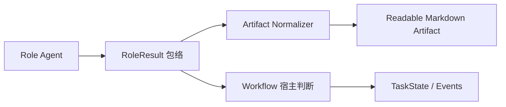
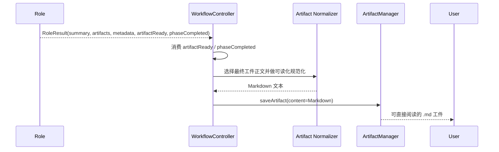

# Default Workflow Final Artifact Markdown Output PRD

## 文档信息

| 字段 | 内容 |
|------|------|
| 模块名 | `default-workflow-final-artifact-markdown-output` |
| 本文范围 | `default-workflow` 中各 phase 最终工件的 Markdown 可读性与结构化包络边界 |
| 文档路径 | `roleflow/clarifications/0.1.0/default-workflow-final-artifact-markdown-output-prd.md` |
| 直接使用者 | AegisFlow 开发者、Planner、Builder |
| 信息来源 | 用户提供的现有工件样本、`src/default-workflow/role/model.ts`、`src/default-workflow/workflow/controller.ts`、`src/default-workflow/persistence/task-store.ts`、`roleflow/clarifications/0.1.0/default-workflow-role-layer-prd.md` |

## Background

当前 `default-workflow` 的 phase 工件统一以 `.md` 文件落到 `.aegisflow/artifacts/tasks/<taskId>/artifacts/<phase>/` 下。

用户已经明确指出，现有至少两个“最终工件”存在同一类问题：

- `clarify/final-prd.md`
- `plan/plan-planner-1.md`

这两个文件的扩展名虽然是 `.md`，但文件正文却是整段 `RoleResult` 风格的 JSON 包络，典型结构为：

- `summary`
- `artifacts`
- `artifactReady`
- `phaseCompleted`
- `metadata`

而真正可供人阅读的正文，其实被包在 `artifacts[0]` 这个字符串里。  
这会带来几个直接问题：

- 人类打开最终工件时，首先看到的是机器协议，而不是实际内容。
- “工件正文”与“角色执行返回包络”混在一起，职责边界不清晰。
- `clarifier` 输出 PRD、`planner` 输出计划时，虽然已经生成了 Markdown 正文，但最终落盘物仍然表现为“Markdown 文件包了一层 JSON”。
- 当 `metadata` 中包含阻塞问题、附加说明等信息时，当前表现形式对人类阅读不友好。

同时，现有代码已经有两个明确前提：

- `WorkflowController` 与 `FileArtifactManager` 负责“保存工件内容”，不会主动把普通字符串改写成可读文档。
- `Role` 执行协议当前要求返回结构化 JSON，`RoleResult` 作为运行时包络仍有存在价值。

因此，本次需求不是取消结构化 `RoleResult`，而是明确区分：

1. 运行时用于宿主判断和解析的结构化包络。
2. 最终面向人类阅读的 phase 工件正文。

## Goal

本 PRD 的目标是新增一份独立需求文档，明确 `default-workflow` 中“最终工件的可读 Markdown 输出”约束，使系统能够：

1. 让每个 phase 的最终工件文件真正呈现为可读 Markdown，而不是原始 JSON 包络。
2. 保留 `RoleResult` 作为运行时结构化协议，不破坏 `artifactReady`、`phaseCompleted` 等宿主判断语义。
3. 在不丢失信息的前提下，把 `summary`、`metadata` 等附加信息转换成可读的 Markdown 区块或转移到更合适的持久化位置。
4. 优先解决已确认出问题的 `clarify` 最终 PRD 和 `plan` 最终计划工件。
5. 为后续其他 phase 的最终工件建立统一的输出约束，避免再次出现“`.md` 文件正文是 JSON”的情况。

## In Scope

- `default-workflow` 各 phase 最终工件的正文格式约束
- `RoleResult` 结构化包络与工件正文的职责边界
- `clarify/final-prd.md` 的可读 Markdown 要求
- `plan` 阶段最终计划工件的可读 Markdown 要求
- 当角色返回 JSON 包络或 JSON 风格工件正文时的规范化/解包策略
- `summary`、`artifactReady`、`phaseCompleted`、`metadata` 的信息保留策略

## Out of Scope

- 重写已经落盘的历史工件文件
- `task-state.json`、`task-context.json` 等机器状态文件的格式调整
- 事件日志、快照日志的存储格式调整
- 改变现有 phase 顺序或审批流程
- 重定义 `RoleResult` 这个公共类型名

## 已确认事实

- `.aegisflow/artifacts/tasks/<taskId>/artifacts/<phase>/*.md` 是当前 phase 工件落盘位置。
- `FileArtifactManager.saveArtifact(...)` 会把收到的 `artifact.content` 原样写入 `.md` 文件。
- `WorkflowController` 的普通 phase 工件落盘依赖 `RoleResult.artifacts: string[]`。
- `clarify` 阶段最终 PRD 的落盘依赖 `prdResult.artifacts[0]`。
- `Role` 层当前统一要求返回结构化 JSON 包络，且其中 `artifacts` 被定义为“可直接落盘为 md 的完整内容”。
- 用户已经确认至少两个最终工件出现“`.md` 文件正文是 JSON 包络”的问题：`clarify/final-prd.md` 与 `plan/plan-planner-1.md`。
- 在这些问题工件中，真正的可读正文已经存在于 `artifacts[0]`，问题主要出在“最终落盘物的人类可读性与结构边界”。

## 与既有 PRD 的关系

- 本文是新增 PRD，不覆盖既有 `role-layer`、`workflow-layer`、`child-process-subcommand` 等文档。
- `default-workflow-role-layer-prd.md` 中关于 `RoleResult` 为结构化结果对象的要求继续成立。
- 本文新增的是“结构化结果对象”和“最终工件正文”之间的显示与持久化边界。
- 若既有文档中“工件内容字符串可直接落盘”的描述与本文冲突，应以本文对“最终工件必须是可读 Markdown”的约束为准。

## 术语

### RoleResult 包络

- 指角色执行完成后返回给 `Workflow` 的结构化结果对象。
- 至少包含 `summary`、`artifacts`、`artifactReady?`、`phaseCompleted?`、`metadata?`。
- 它服务于宿主判断、流程推进和结构化解析，不等同于最终给人看的工件正文。

### 最终工件正文

- 指最终落盘到 `.aegisflow/artifacts/tasks/<taskId>/artifacts/<phase>/*.md` 的人类可读内容。
- 它必须是面向阅读的 Markdown 文档。
- 它不应把整个 `RoleResult` JSON 包络原样暴露给人类读者。

### 规范化输出

- 指当角色返回的结果中混入 JSON 包络、JSON 字符串或机器协议文本时，系统在落盘前将其转换为可读 Markdown 的过程。
- 规范化的目标是“保留信息，不保留原始 JSON 展示形态”。

## 需求总览

## 执行关系图

## Functional Requirements

### FR-1 每个 phase 的最终工件必须是可读 Markdown 文档

- `default-workflow` 中每个 phase 的最终工件文件必须以可读 Markdown 形式落盘。
- 最终工件文件不得把整段 `RoleResult` JSON 包络原样作为正文保存。
- 人类打开最终工件时，应直接看到需求、计划、评审、测试等实际正文，而不是宿主协议字段。

### FR-2 `RoleResult` 包络与工件正文必须明确分离

- `RoleResult` 继续作为 `Workflow` 消费的结构化运行时包络保留。
- `RoleResult.summary`、`artifactReady`、`phaseCompleted`、`metadata` 不得再被默认视为最终工件正文的一部分。
- `RoleResult.artifacts` 中用于落盘的元素，必须代表“最终工件正文”或可被规范化为最终工件正文的内容。

### FR-3 当最终工件收到 JSON 形态内容时，系统必须先规范化再落盘

- 若角色返回的是完整 `RoleResult` JSON 字符串，系统必须先提取其中真实的工件正文，再进行落盘。
- 若 `artifacts[0]` 自身仍是 JSON 对象、JSON 数组或 JSON fenced block，系统必须将其转换成等价的可读 Markdown 结构后再落盘。
- 规范化过程不得静默丢弃已有字段信息。
- 规范化失败时，系统不得把未经处理的原始 JSON 直接当作“成功的最终工件”落盘。

### FR-4 信息保留必须成立，但保留方式必须可读

- 对最终工件有价值的附加信息在落盘时必须保留。
- 保留的信息至少包括：
  - `summary`
  - `metadata` 中对人类理解有帮助的字段
  - 阻塞问题、待确认项、补充说明等结构化附加信息
- 这些信息必须通过可读 Markdown 区块表达，例如：
  - `## 文档摘要`
  - `## Blocking Questions`
  - `## Artifact Envelope`
  - 表格、列表、分节说明
- `artifactReady` 与 `phaseCompleted` 这类宿主判断字段如需进入工件，也必须以可读文字表达，不能继续以裸 JSON 键值形式出现。

### FR-5 `clarify/final-prd.md` 必须以 PRD 结构直接呈现

- `clarify` 阶段的最终工件必须首先呈现 PRD 正文，而不是外层执行包络。
- `clarify/final-prd.md` 的首屏内容必须是 PRD 标题、背景、目标、范围、约束、验收等可读章节。
- 若存在需要保留的附加信息，应作为 PRD 的附录或补充章节呈现，而不是替代 PRD 正文。
- `clarifier` 的职责应继续定位为“输出 PRD”，而不是“输出一个包着 PRD 字符串的 JSON 容器给人读”。

### FR-6 `plan` 阶段最终计划工件必须以计划文档结构直接呈现

- `plan` 阶段最终工件必须首先呈现实现计划、输入输出、流程、约束、TODO 等计划正文。
- 若 `metadata` 中存在 `blockingQuestions` 之类结构化信息，必须将其渲染为可读章节，而不是保留在 JSON 对象里。
- 当 `plan` 工件表达“当前不建议继续推进”时，该结论应出现在 Markdown 的摘要或阻塞章节中，而不是只藏在包络布尔字段里。

### FR-7 只有机器状态文件可以继续使用 JSON 作为正文格式

- `task-state.json`、`task-context.json` 等明确面向机器消费的文件，允许继续使用 JSON。
- phase 工件目录下的 `.md` 文件必须遵守人类可读的 Markdown 约束。
- 不允许因为“底层协议是 JSON”而把 phase 最终工件降级为 JSON dump。

### FR-8 已确认问题阶段必须被视为最小验收样本

- 本次需求至少要覆盖已确认有问题的两个最终工件类别：
  - `clarify/final-prd.md`
  - `plan` 阶段最终计划工件
- 这两个样本必须作为后续实现与测试的最小回归集合。
- 若系统支持更多 phase 的最终主工件，同样应按本文约束收敛，而不是只对单个 phase 打补丁。

## Constraints

- 不改变 `RoleResult` 作为结构化运行时协议的地位。
- 不要求把所有机器持久化文件都改成 Markdown。
- 不允许通过删除 `summary`、`metadata` 或阻塞问题字段来换取“看起来更简洁”的工件。
- 最终工件的人读体验必须优先于底层协议直出。
- 输出路径、文件名和 phase 命名必须继续与当前 AegisFlow 实际目录一致。

## Acceptance

- 新生成的最终 phase 工件 `.md` 文件打开后，首个主要内容块是人类可读 Markdown，而不是 JSON 包络。
- `clarify/final-prd.md` 能直接作为 PRD 阅读，不需要读者手动去 JSON 中寻找 `artifacts[0]`。
- `plan` 阶段最终工件能直接作为计划文档阅读，阻塞问题以 Markdown 章节或列表呈现。
- `summary`、`metadata` 等对人有价值的信息没有丢失，只是被转换为可读表达。
- `artifactReady` 与 `phaseCompleted` 仍然可以被 `Workflow` 正常消费，不因人读格式收敛而丢失宿主判断能力。
- 至少存在针对 `clarify` 与 `plan` 最终工件的自动化测试或等价校验，能防止 `.md` 文件再次回归为原始 JSON 包络。

## Risks

- 如果只改提示词、不加规范化兜底，模型一旦再次输出 JSON 包络，问题会重复出现。
- 如果把 `RoleResult` 包络和工件正文彻底混成一种对象，后续 `Workflow` 的宿主判断与人读工件边界会继续混乱。
- 如果规范化过程没有明确的信息保留规则，容易在“去 JSON 化”时丢掉阻塞问题、附加说明等关键内容。
- 如果只修 `clarify` 而不覆盖 `plan` 及其他最终工件，同类问题会在其他 phase 继续出现。

## Open Questions

- `summary`、`artifactReady`、`phaseCompleted` 是否都需要进入最终工件正文，还是部分仅保留在事件/状态层即可；需要在实现阶段定稿统一策略。
- 对于非最终的中间工件，是否也要统一执行“可读 Markdown，不得是 JSON dump”的约束；本期至少必须覆盖每个 phase 的最终工件。

## Assumptions

- 当前用户主要关心的是 phase 最终工件的人类可读性，而不是底层传输协议本身是否为 JSON。
- `clarify` 与 `plan` 已经足以代表当前问题形态，后续 phase 的主工件可以复用同一类规范化策略。
- 若某些结构化字段只服务宿主判断、对人类阅读没有实际价值，允许不进入正文，但不得因此影响 `Workflow` 的既有状态消费。
