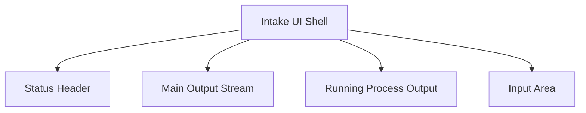

# Default Workflow Intake Codex Style Output Stream PRD

## 文档信息

| 字段 | 内容 |
|------|------|
| 模块名 | `default-workflow-intake-codex-style-output-stream` |
| 本文范围 | `default-workflow` Intake UI 的输出结构切换为更接近 codex 的轻量时间流：骨架输出与结果输出融合、过程输出单独弱化、取消输出外框 |
| 文档路径 | `roleflow/clarifications/0.1.0/default-workflow-intake-codex-style-output-stream-prd.md` |
| 直接使用者 | AegisFlow 开发者、Planner、Builder |
| 信息来源 | 用户新增需求、用户冲突确认、`src/cli/app.ts`、`src/cli/theme.ts`、既有 Intake UI 相关 PRD |

## Background

此前的 Intake UI 相关 PRD 曾要求：

- 结果输出区、骨架输出区、过程输出区保持独立结构
- 结果区作为主区域，骨架区作为辅助区域
- 使用 panel / 边框 / 分区容器来强化层次

但用户最新澄清已经明确要求切换方向，目标不再是“多个独立输出 panel 的强分区结构”，而是更接近 `codex cli` 的轻量终端内容组织方式：

1. `过程输出` 分为摘要与详细内容两层
2. `过程输出` 只在执行中显示
3. `骨架输出` 和 `结果输出` 融合，并按时间顺序排列
4. `过程输出`、`骨架输出`、`结果输出` 都去掉外框，只靠文字颜色区分
5. `系统消息` 的正文颜色调整为卡其色，与骨架色拉开距离
6. 总体视觉框架参考 `codex`

这意味着当前输出设计要从“分区面板”切换为“单主时间流 + 轻量过程区”的结构。之前那份要求“结果区 / 骨架区 / 过程输出区必须结构分离”的 PRD，已经不再适合作为本轮实现依据。

因此，本 PRD 的目标不是继续细化 panel 分区，而是正式收敛一套新的输出结构：用单一主输出流承载骨架与结果，用运行中过程区承载临时过程信息，并通过颜色和排版而非边框来建立层次。

## Goal

本 PRD 的目标是为 `default-workflow` Intake UI 定义一套新的 codex 风格输出结构，使系统能够：

1. 用单一主输出流承载骨架输出与结果输出，并保持时间顺序。
2. 把 `过程输出` 收敛为执行中才出现的轻量辅助区。
3. 移除输出区块的外框，改用字体颜色、间距和标签建立层次。
4. 让 `系统消息` 与骨架输出的颜色语义明显区分。
5. 在保持暗红主题的前提下，使整体结构明显向 codex 风格靠拢。

## In Scope

- `src/cli/app.ts` 中 Intake 输出区域的结构组织
- `骨架输出` 与 `结果输出` 的合流规则
- `过程输出` 的展示条件、摘要/详细布局和截断规则
- 输出区域的外框移除策略
- `系统消息`、骨架输出、结果输出、过程输出的颜色语义
- 更接近 codex 的整体视觉框架

## Out of Scope

- 改动 Workflow 状态机
- 改动 Role 执行协议
- 改动 phase 工件格式
- 像素级复刻 `codex cli`
- 多主题切换
- 复杂动效、图表化展示或富交互滚动控件

## 已确认事实

- 当前 `src/cli/app.ts` 已存在 `结果输出`、`骨架输出`、`过程输出` 的独立渲染区域。
- 当前这些区域主要通过 `ContentSection` 边框容器来区分。
- 当前 `finalBlocks` 与 `skeletonBlocks` 都已有时间顺序字段，可用于合并后按时序排列。
- 当前 `process output` 已有截断能力，但还不是“摘要固定 + 详细 6 行”的双层结构。
- 当前 `系统消息` 的正文颜色与骨架区辅助色仍然较近。
- 用户已经明确确认：本轮新需求覆盖此前关于输出结构分离的要求。

## 与既有 PRD 的关系

- 本文会覆盖以下既有要求中的冲突部分：
  - `default-workflow-intake-output-structure-separation-prd.md` 中关于“结果区 / 骨架区 / 过程输出区必须结构分离”的要求
  - `default-workflow-intake-ui-theme-refinement-prd.md` 中关于“结果区和骨架区应继续作为独立 panel 强分区”的要求
- 本文不覆盖以下仍然成立的要求：
  - Intake UI 仍基于 `Ink + React`
  - 整体主题仍是暗红色系
  - 错误态仍需明确可辨
  - 最终结果仍需完整可读
- 若旧 PRD 与本文在输出结构、边框策略、骨架/结果关系上有冲突，应以本文为准。

## 术语

### Main Output Stream

- 指融合了 `骨架输出` 与 `结果输出` 的单一主输出流。
- 它按时间顺序排列，承载用户主要阅读内容。

### Process Summary

- 指 `过程输出` 中始终展示的摘要部分。
- 用于让用户快速知道当前运行到了什么程度。

### Process Detail

- 指 `过程输出` 中的详细临时内容。
- 只展示有限行数，不承担最终结果展示职责。

### Borderless Output

- 指输出结构不再依赖 `round border`、panel 边框或独立盒子来建立层次。
- 改由颜色、标签、空白和顺序来建立可读性。

## 需求总览

## Functional Requirements

### FR-1 骨架输出与结果输出必须融合为单一主输出流

- `骨架输出` 与 `结果输出` 不再作为两个独立区域展示。
- 它们必须合并成一个主输出流。
- 主输出流中的内容按时间顺序排列，不再按“结果区优先、骨架区次之”的区域分栏展示。
- 该主输出流仍需通过颜色、标签或轻量前缀让用户分辨不同消息类型。

### FR-2 主输出流必须按统一时序排序

- 合并后的骨架块与结果块必须基于统一排序字段按时间顺序排列。
- 不得再先按类型分区、再在区内排序。
- 当骨架事件发生在结果之前时，应自然显示在结果前；反之亦然。

### FR-3 过程输出必须拆成“摘要 + 详细内容”两部分

- `过程输出` 必须至少包含两层：
  - 摘要区
  - 详细区
- 摘要区必须始终展示当前过程概览。
- 详细区用于展示临时过程内容，不承担最终结果展示职责。
- 摘要区和详细区可以位于同一轻量容器中，但语义必须清晰可分。

### FR-4 过程输出详细区最多展示 6 行

- `过程输出` 的详细内容最多展示 6 行。
- 超出 6 行时，必须截断后续内容。
- 截断时应使用明确的省略语义，例如 `...` 或等价表达。
- 不得因为过程内容过多而撑满主阅读区域。

### FR-5 过程输出摘要必须固定可见

- 在 `过程输出` 可见时，摘要部分必须固定展示在详细区之前。
- 详细内容更新或截断时，摘要区不能消失。
- 终端中的“固定”应理解为：用户总能先看到摘要，再看到最多 6 行详细内容，而不是摘要被大量过程行淹没。

### FR-6 过程输出只在执行中展示

- 当任务处于执行中时，`过程输出` 可以显示。
- 当任务已经得到结果或进入非运行状态时，`过程输出` 可以不显示。
- 若任务已完成且主输出流中已有足够结果内容，默认不再展示 `过程输出` 区。

### FR-7 输出区域必须取消外框

- `过程输出`、主输出流中的骨架输出、主输出流中的结果输出，都不应继续使用外框容器强化层次。
- 不应再依赖 `borderStyle: "round"`、区块边框颜色或 panel 盒子来区分消息类型。
- 输出层次必须主要通过字体颜色、标签、前后留白和顺序建立。

### FR-8 主输出流中的消息类型必须仅靠轻量视觉语义区分

- 合并后的主输出流中，不同消息类型必须至少通过以下一种或多种方式区分：
  - 文本颜色
  - 标签前缀
  - 标题/正文层次
  - 留白节奏
- 但不再允许重新引入独立框体作为主要区分方式。

### FR-9 系统消息正文颜色必须调整为卡其色

- 当前 `系统消息` 的正文颜色与骨架输出颜色过近，需要重新拉开。
- `系统消息` 正文必须调整为明显偏卡其的暖色语义。
- 该卡其色必须仍处在暗红主题体系内，不能偏成绿色或冷黄。
- `系统消息` 与骨架输出在终端中应一眼可分。

### FR-10 骨架输出颜色必须保留低权重辅助语义

- 骨架输出并入主输出流后，仍应使用较低权重的辅助色。
- 骨架输出不能和结果输出使用完全相同的高强调正文色。
- 但它也不能弱到和过程输出混淆。

### FR-11 结果输出仍必须可读且具备更高权重

- 虽然结果输出与骨架输出合流，但结果输出仍应在同一主流内保持更高视觉权重。
- 这种权重差异应主要通过文字颜色、标题强调、正文亮度和间距体现。
- 不要求结果输出再作为独立 panel 存在。

### FR-12 总体视觉框架应向 codex 风格靠拢

- Intake UI 的输出区域整体应更接近 `codex cli` 的轻量终端结构。
- 这种靠拢至少应体现为：
  - 主输出流是阅读中心
  - 过程输出是运行中的临时辅助区
  - 去掉厚重边框后界面仍清晰
  - 内容组织克制，不做多 panel 堆叠
- 但不要求像素级复刻 `codex cli`。

### FR-13 空状态必须与新结构一致

- 当没有骨架输出和结果输出时，主输出流可以显示轻量空状态。
- 当任务不在执行中时，默认不显示空的 `过程输出` 区。
- 不得为了保留布局占位而显示空的边框区块。

### FR-14 必须增加针对新结构的防回退校验

- 自动化测试或等价校验至少要覆盖：
  - 骨架输出与结果输出已合流
  - 合流后按时序排序
  - `过程输出` 只有运行中才显示
  - `过程输出` 详细内容最多 6 行并有省略语义
  - 输出区不再依赖外框
  - 系统消息正文已切到卡其色

## 非功能要求

### NFR-1 可读性

- 即使去掉外框，用户仍应快速分辨：
  - 主输出流
  - 过程输出
  - 结果消息
  - 骨架消息
  - 系统消息

### NFR-2 克制感

- 整体输出不能回到多个厚重 panel 垂直堆叠的观感。
- 界面应更接近 codex 的轻量、节制、直接。

### NFR-3 暗红主题一致性

- 虽然结构更接近 codex，但主色仍必须保持暗红主题。
- 不得切换成蓝色、青色、紫色主调。

## 推荐色彩方向

以下颜色仅作为推荐方向，Builder 不必逐值照抄，但语义应一致：

- 结果输出标题/高亮：`#dc2626`
- 结果输出正文：`#f5f5f4`
- 系统消息正文卡其色：`#c2a76d` 到 `#caa472`
- 骨架输出辅助色：`#a8a29e` 到 `#8b6b61`
- 过程输出摘要：`#a8a29e`
- 过程输出详细内容：`#94a3b8` 或接近的低权重中性色
- 错误强调：`#f87171`

## 验收标准

- `骨架输出` 与 `结果输出` 在 UI 中不再作为独立区域或独立框体存在，而是作为同一主输出流按时序展示。
- `过程输出` 分为摘要和详细区，详细区最多 6 行，超出后有省略语义。
- `过程输出` 只在运行中展示；任务已有结果或已结束时，默认不再展示该区。
- 输出层不再使用外框来区分 `过程输出`、骨架输出、结果输出。
- `系统消息` 的正文颜色已明显转为卡其色，并与骨架色可区分。
- 整体观感相比旧版本更接近 codex 的轻量时间流，而不是多 panel 分区界面。

## Open Questions

- 无。

## Assumptions

- 用户已经明确接受：本次新 PRD 覆盖此前“输出区必须结构分离”的要求。
- 当“codex 风格”与此前旧 PRD 冲突时，应优先遵循本文描述的轻量时间流结构。

## Todolist (todoList)

- [x] 明确记录用户新增的 6 条界面优化需求。
- [x] 明确本轮需求会覆盖旧的输出结构分离 PRD。
- [x] 收敛新的主输出流结构：骨架输出与结果输出合流并按时序排列。
- [x] 收敛新的过程输出结构：摘要固定、详细最多 6 行、仅运行中显示。
- [x] 收敛新的视觉策略：去掉外框，只用颜色和排版区分。
- [x] 明确系统消息正文切换为卡其色。
- [x] 明确整体视觉框架以更接近 codex 为方向。

