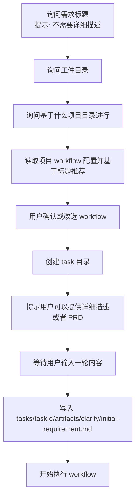

# Default Workflow Intake Initial Requirement Bootstrap PRD

## 文档信息

| 字段 | 内容 |
|------|------|
| 模块名 | `default-workflow-intake-initial-requirement-bootstrap` |
| 本文范围 | `default-workflow` 中 `Intake` 的任务启动前置流程调整，以及 `initial-requirement.md` 在正式执行前的创建与记录语义 |
| 文档路径 | `roleflow/clarifications/0.1.0/default-workflow-intake-initial-requirement-bootstrap-prd.md` |
| 直接使用者 | AegisFlow 开发者、Planner、Builder |
| 信息来源 | 用户新增需求、用户澄清结论、`src/default-workflow/intake/agent.ts`、`src/default-workflow/workflow/controller.ts`、既有 Intake / Clarify PRD |

## Background

当前 `default-workflow` 的 Intake 启动链路已经支持在需求收集前先确认工件目录，并允许用户把已有 PRD 放进工件目录后再引用。  
这条主方向是合理的，但当前实现仍有两个核心问题：

1. 首轮输入会被当作“完整需求草稿”处理，而不是“仅标题”。
2. 真正的 `clarify/initial-requirement.md` 直到 `clarify` 阶段开始执行时才会创建，而不是在正式执行前就完成记录。

用户希望把启动流程进一步收敛为：

1. 先收集一个简短的需求标题，并明确提示“不需要详细描述”。
2. 完成工件目录、项目目录、workflow 选择。
3. 在正式执行前先创建 task 目录。
4. 再提示用户补充“详细描述或者 PRD”。
5. 将这一轮输入写入 `tasks/<taskId>/artifacts/clarify/initial-requirement.md`。
6. 完成记录后再开始执行 workflow。

这样做的直接目的，是让用户在被提示补充“详细描述或者 PRD”时，可以把 PRD 文件直接放进已经存在的 task 目录，再把该路径记录到 `initial-requirement.md` 中。

## 代码澄清结论

基于当前仓库代码阅读，可以确认以下事实：

### 结论 1：当前实现没有单独的“是否开始”询问步骤

- 当前第一轮新任务输入会直接进入 `startDraftTask(...)`
- 后续只要 workflow 被确认，就会进入 `initializeRuntimeAndStartTask(...)`
- `initializeRuntimeAndStartTask(...)` 内部会连续发送 `init_task` 与 `start_task`
- 因此当前代码并不存在独立的“是否开始”用户确认步骤

### 结论 2：当前第一轮输入被视为需求草稿，而不是仅标题

- `startDraftTask(initialDescriptionHint)` 会把第一轮输入保存为 `initialDescriptionHint`
- 后续 `collectDescription(...)` 允许用户直接回车复用这段内容作为完整需求
- 这说明当前产品语义是“先给一段需求草稿，后续可补全”，而不是“先给一个不要求详细的标题”

### 结论 3：当前 workflow 推荐依据是完整需求描述

- `recommendWorkflowForDraft(...)` 使用的是 `this.draft.description`
- `this.draft.description` 由 `collectDescription(...)` 收集
- 因此当前推荐依据是“完整需求描述”，不是“需求标题”

### 结论 4：当前 task 创建与 workflow 执行是连在一起的

- 当前只有在 `initializeRuntimeAndStartTask(...)` 中才会调用 `buildRuntimeForNewTask(...)`
- `buildRuntimeForNewTask(...)` 会生成 `taskId` 并初始化 task 目录
- 这意味着当前 task 目录是在 Runtime 初始化阶段才创建，而不是在“正式执行前、收集详细描述前”创建

### 结论 5：当前 `clarify/initial-requirement.md` 是在 clarify 阶段运行时写入的

- `runClarifyPhase(...)` 首轮执行时，如果 `clarify/initial-requirement` 不存在且当前有输入，会调用 `buildInitialRequirementArtifact(...)` 写入
- 当前这份工件路径实际为 `tasks/<taskId>/artifacts/clarify/initial-requirement.md`
- 也就是说，现有实现中 `initial-requirement.md` 不是 Intake 提前记录的，而是 Workflow 进入 `clarify` 后补写的

## Goal

本 PRD 的目标是明确 `default-workflow` 中 Intake 启动前置流程的新约束，使系统能够：

1. 先收集需求标题，而不是一开始就要求完整需求。
2. 继续在 Intake 阶段完成工件目录、项目目录、workflow 选择。
3. 在正式执行前提前生成 task 目录。
4. 在 task 目录已经存在的前提下，引导用户提供详细描述或 PRD 路径。
5. 将该输入写入 `tasks/<taskId>/artifacts/clarify/initial-requirement.md`。
6. 在 `initial-requirement.md` 已记录完成后，才开始执行 workflow。

## In Scope

- `Intake` 新任务启动顺序的调整
- “需求标题”与“详细描述 / PRD”两段式输入语义
- workflow 推荐依据从“完整需求”改为“需求标题”
- task 目录的提前创建时机
- `tasks/<taskId>/artifacts/clarify/initial-requirement.md` 的记录时机与内容语义
- Intake 与现有 `clarify` 工件机制的职责边界调整

## Out of Scope

- 非 `default-workflow` 的 Intake 入口
- `explore` / `plan` / `build` 等后续 phase 的职责重定义
- `clarify-dialogue.md` 的格式重设计
- 最终 PRD 的 Markdown 模板重设计
- PRD 文件正文的自动解析、摘要、改写或内联展开能力

## 已确认事实

- 用户接受提前生成 `taskId` 并在正式执行前创建 `tasks/<taskId>/` 目录
- `initial-requirement.md` 的目标路径固定为 `tasks/<taskId>/artifacts/clarify/initial-requirement.md`
- 在提示“可以提供详细描述或者 PRD”后，系统必须等待用户再输入一轮内容，不能直接跳过
- workflow 推荐机制继续沿用“读取项目配置并推荐 / 确认”的路线
- 唯一变化是：workflow 推荐依据从“完整需求”改为“需求标题”
- 如果用户提供的是 PRD 文件路径，`initial-requirement.md` 只记录该路径，不内联 PRD 文件正文

## 术语

### Requirement Title

- 指用户在任务启动第一步提供的简短需求标题
- 其主要作用是帮助 Intake 判断任务主题，并驱动 workflow 推荐
- 该输入阶段必须显式提示用户“不需要详细描述”

### Initial Requirement Input

- 指在 task 目录已经创建完成后，用户补充提供的那一轮“详细描述或者 PRD”
- 这是 `initial-requirement.md` 的直接来源

### Bootstrap Task Directory

- 指在正式执行 workflow 前就已经创建完成的 `tasks/<taskId>/` 目录
- 它存在的目的，是让用户在执行前就能把 PRD 放到 task 目录下

## 目标流程

## 与当前实现的关键差异

### 差异 1：首轮输入语义从“完整需求草稿”改为“需求标题”

- 当前实现会把首轮输入当作可直接复用的完整需求草稿
- 新流程必须把首轮输入收敛为“标题”，并显式提示用户此时不需要详细描述

### 差异 2：workflow 推荐必须前移到详细描述之前

- 当前实现先收集完整需求，再基于完整需求推荐 workflow
- 新流程必须改为基于标题推荐 workflow

### 差异 3：task 目录必须在正式执行前创建

- 当前 task 目录是在 Runtime 初始化和正式启动时一起出现
- 新流程必须在“等待详细描述或 PRD”之前先生成 task 目录

### 差异 4：`initial-requirement.md` 必须由 Intake 在执行前写入

- 当前该工件由 `WorkflowController.runClarifyPhase(...)` 首轮执行时补写
- 新流程要求在 workflow 开始前就已经存在这份工件

## Functional Requirements

### FR-1 Intake 启动第一问必须改为收集需求标题

- 当用户开始一个新任务时，Intake 的第一问必须是“需求标题”。
- 该提示语必须明确告诉用户：此时不需要详细描述。
- 首轮输入的产品语义必须是“标题”，而不是“完整需求正文”。

### FR-2 需求标题必须作为 workflow 推荐依据

- Intake 在读取项目 workflow 配置并做推荐时，必须使用需求标题作为主要推荐依据。
- 本阶段不得要求用户先写完整需求后才能推荐 workflow。
- workflow 推荐、确认、改选机制可继续沿用现有项目配置驱动模型。

### FR-3 工件目录与项目目录的收集顺序必须保持在 workflow 推荐之前

- 新流程中仍需先收集工件目录与目标项目目录。
- 只有在能够确定 task 最终落盘位置后，系统才应进入 task 目录创建阶段。
- 工件目录的解析规则仍可区分绝对路径与相对 / 默认路径，但对用户可见的流程顺序必须保持为：
  - 需求标题
  - 工件目录
  - 项目目录
  - workflow 推荐与确认

### FR-4 workflow 确认后必须先创建 Bootstrap Task Directory

- 一旦 workflow 被确认，系统必须在正式执行前创建当前任务的 `tasks/<taskId>/` 目录。
- 此时必须已经能够确定：
  - `taskId`
  - `artifactDir`
  - `projectDir`
  - `selected workflow`
- task 目录创建完成后，用户应能立即把 PRD 文件放入该 task 目录中。

### FR-5 创建 task 目录后必须再提示用户补充“详细描述或者 PRD”

- 在 Bootstrap Task Directory 创建完成后，Intake 必须提示用户：
  - 可以提供详细描述
  - 或者提供 PRD
- 该提示必须发生在正式执行 workflow 之前。
- 该提示之后，系统必须等待用户再输入一轮内容，不能自动跳过。

### FR-6 `initial-requirement.md` 必须在开始执行前写入

- 用户完成上一条输入后，系统必须先把该输入写入 `tasks/<taskId>/artifacts/clarify/initial-requirement.md`。
- 只有这份文件写入成功后，系统才可以开始执行 workflow。
- `initial-requirement.md` 的创建责任必须前移到 Intake 启动流程，而不是继续完全依赖 `clarify` 阶段首轮执行时补写。

### FR-7 当用户输入详细描述时，`initial-requirement.md` 必须记录该描述文本

- 如果用户在该阶段输入的是普通自然语言详细描述，`initial-requirement.md` 必须记录这段描述。
- 该记录结果必须作为后续 `clarify` 阶段的初始需求来源之一。

### FR-8 当用户输入 PRD 路径时，`initial-requirement.md` 只记录路径

- 如果用户在该阶段输入的是一个 PRD 文件路径，`initial-requirement.md` 必须只记录该路径。
- 本期不得在该步骤自动读取 PRD 正文并内联写入 `initial-requirement.md`。
- 本期不得把“记录路径”静默升级为“记录路径 + 记录正文”。

### FR-9 `initial-requirement.md` 的内容语义必须与输入类型一致

- 系统必须保留“详细描述文本”和“PRD 路径”这两种输入形态的差异。
- 不能把 PRD 路径伪装成普通正文描述。
- 不能要求用户在标题阶段就完成这种区分。

### FR-10 正式执行必须发生在 `initial-requirement.md` 写入之后

- `init_task`、`start_task` 或其等价正式执行入口，必须在 `initial-requirement.md` 已存在之后才触发。
- 系统不得再沿用“workflow 一确认就立刻开始跑”的现有语义。

### FR-11 Clarify 首轮不得覆盖 Intake 预写入的 `initial-requirement.md`

- 既然 `initial-requirement.md` 已经由 Intake 在执行前写入，后续 `clarify` 首轮执行不得再以首轮输入覆盖这份文件。
- 如果该工件已存在，`clarify` 阶段应把它视为既有上下文，而不是重新生成一份新的“初始需求”。

### FR-12 Intake 提示文案必须显式反映两段式输入语义

- 与标题相关的提示必须强调“不需要详细描述”。
- 与第二轮补充相关的提示必须强调“现在可以提供详细描述或者 PRD”。
- 当前“请输入完整需求；如果沿用当前草稿，直接回车即可”的文案不再符合目标语义，不应继续作为最终产品话术。

## Constraints

- 仅覆盖 `v0.1`
- `initial-requirement.md` 路径固定为 `tasks/<taskId>/artifacts/clarify/initial-requirement.md`
- workflow 推荐继续基于项目下 `.aegisflow/aegisproject.yaml`
- workflow 推荐依据从完整需求切换为需求标题
- “详细描述或者 PRD”阶段必须等待用户显式输入一轮内容
- PRD 路径场景下，`initial-requirement.md` 只记录路径，不内联正文

## 与既有 PRD 的关系

- 本文不替代 `default-workflow-intake-layer-prd.md`，而是补充并收紧其“任务启动前资料收集”部分。
- 本文不替代 `default-workflow-intake-project-workflows-prd.md`，而是把 workflow 推荐的输入依据从“完整需求”改成“需求标题”。
- 本文不替代 `default-workflow-clarify-dialogue-artifact-reinjection-prd.md`，而是把 `initial-requirement.md` 的创建时机前移到 Intake 启动前置流程。
- 若既有文档中仍保留“先完整描述需求，再推荐 workflow，再直接启动”的表述，则以本文为准。

## Acceptance

- 新任务启动时，第一问变为“需求标题”，并明确提示“不需要详细描述”
- workflow 推荐依据变为需求标题，而不是完整需求描述
- workflow 确认后，系统会先创建 `tasks/<taskId>/` 目录
- 用户能在该 task 目录已存在的情况下，再补充详细描述或放入 PRD
- Intake 会等待这一轮补充输入，并将其写入 `tasks/<taskId>/artifacts/clarify/initial-requirement.md`
- 如果用户输入的是 PRD 路径，`initial-requirement.md` 只记录该路径
- `initial-requirement.md` 写入完成后，系统才开始正式执行 workflow
- 后续 `clarify` 首轮不会覆盖这份已由 Intake 预写入的 `initial-requirement.md`

## Risks

- 如果实现只提前创建了 artifact root、但没有提前创建 `tasks/<taskId>/`，用户仍然无法把 PRD 放到目标 task 目录下
- 如果 workflow 仍然基于完整需求推荐，会和新流程的“标题优先”目标冲突
- 如果 `clarify` 继续沿用首轮补写 `initial-requirement.md` 的逻辑，可能覆盖 Intake 已记录的路径或详细描述
- 如果 PRD 路径仅被写入 `initial-requirement.md`，但后续执行链没有办法消费这条路径，系统可能出现“记录了路径但实际没用上”的语义断裂

## Open Questions

- 无

## Assumptions

- task 目录的提前创建不会破坏现有恢复机制、调试记录机制和 artifact 目录结构
- `initial-requirement.md` 将继续作为 `clarify` 阶段的稳定上下文输入物存在
