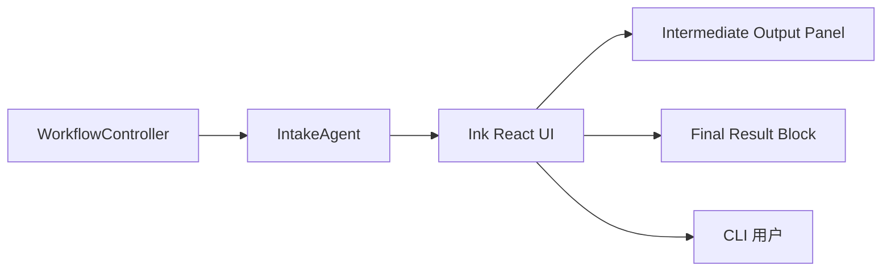
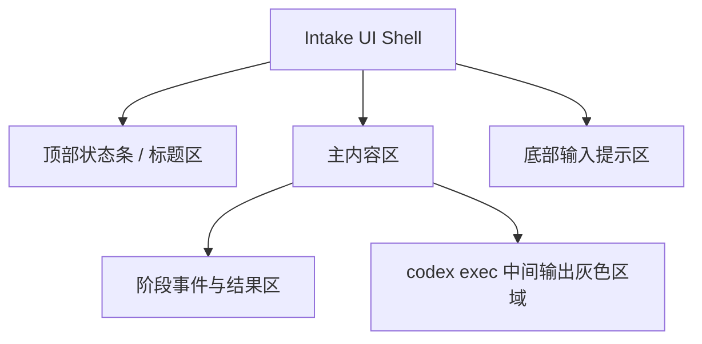

# Default Workflow Intake Ink UI PRD

## 文档信息

| 字段 | 内容 |
|------|------|
| 模块名 | `default-workflow-intake-ink-ui` |
| 本文范围 | `default-workflow` 的 `Intake` 终端展示层 UI 与排版体验 |
| 文档路径 | `roleflow/clarifications/0.1.0/default-workflow-intake-ink-ui-prd.md` |
| 直接使用者 | AegisFlow 开发者、Planner、Builder |
| 信息来源 | `roleflow/clarifications/0.1.0/default-workflow-intake-layer-prd.md`、`roleflow/clarifications/0.1.0/default-workflow-cli-streaming-output-prd.md`、用户澄清结论 |

## Background

当前 `default-workflow` 已具备 `Intake -> Workflow -> Role` 的基本事件链路，但终端展示层仍停留在普通字符串打印阶段。  
这会带来三个直接问题：

1. `Intake` 层缺少稳定的布局结构，状态信息、流式输出和最终结果都挤在同一条文本流里。
2. `codex exec` 的中间输出与最终结果没有视觉分层，用户很难快速分辨“当前正在流动的过程”与“已经确认的结论”。
3. 当前 CLI 视觉风格过于朴素，尚未形成可持续演进的终端 UI 基座。

用户已明确要求：

- `Intake` 展示层引入 `ink` 与 `react`
- UI 方向可参考 `codex cli`
- 主色调使用暗红色
- `codex exec` 的中间输出应作为偏灰色内容展示在一个受限区域内
- 最终结果应完整展示，而不是与中间流式输出混在一起

因此需要新增一份 PRD，把 `Intake` 的终端渲染基座、布局分区、颜色语义和输出分层规则收敛为明确需求。

## Goal

本 PRD 的目标是明确 `default-workflow` 中 `Intake` 展示层的 UI 需求，使系统能够：

1. 使用 `Ink + React` 作为 `Intake` 的终端渲染基座。
2. 让 CLI 从“逐行打印”升级为“结构化终端界面”。
3. 让 `codex exec` 中间输出和最终结果在视觉上清晰分层。
4. 在 `v0.1` 提供一版可用、可继续迭代的暗红色终端 UI 基线。

## In Scope

- `Intake` 层终端展示基座改为 `Ink + React`
- 终端界面的基础布局分区
- CLI 主题色、信息层级与基础视觉语义
- `WorkflowEvent` / `role_output` 在 `Intake` 中的展示映射
- `codex exec` 中间输出与最终结果的分层展示规则
- `v0.1` 的最小可交付终端 UI 风格

## Out of Scope

- `WorkflowController` 的状态机修改
- `Role` 层 prompt、执行协议或 `codex exec` 命令协议修改
- 图形化桌面界面或 Web UI
- 完整复刻 `codex cli` 的全部交互细节
- 多主题系统、主题编辑器或自定义皮肤能力
- 超出 `Intake` 展示层范围的代码实现细节

## 已确认事实

- `Intake` 是 `default-workflow` 的终端入口与展示层
- 当前 `WorkflowEvent` 与 `role_output` 已能进入 `Intake`
- 当前 CLI 展示还没有稳定的布局结构
- 当前需要新增终端 UI 渲染能力，而不是继续堆叠纯文本输出格式化
- 用户明确指定 `ink` 与 `react` 作为本期终端展示层技术基座

## 用户补充约束

- `Intake` 展示层必须引入 `ink`
- `Intake` 展示层必须引入 `react`
- UI 风格可以参考 `codex cli`
- 主色调必须使用暗红色
- `codex exec` 中间输出必须作为偏灰色内容展示在一个受限区域中
- 最终结果必须完整展示，不应被折叠进中间输出区

## 术语

### Intake UI Shell

- 指 `Intake` 在终端中渲染出的整体界面骨架
- 至少包含状态信息区域、主内容区域和输入提示区域

### Intermediate Output Panel

- 指专门承载 `codex exec` 中间过程输出的展示区域
- 该区域强调“过程流”，不是最终结果承载区

### Final Result Block

- 指用于展示阶段最终结论、最终摘要或可直接阅读结果的主内容块
- 该区域必须完整展示结果内容

## 需求总览

## 布局示意

## Functional Requirements

### FR-1 Intake 展示层必须使用 Ink + React

- `default-workflow` 的 `Intake` 终端展示层在本期必须以 `ink` 与 `react` 为基础。
- 本期不再把“直接向 stdout 逐行打印字符串”视为目标展示方案。
- `Ink + React` 在本文中是明确需求，不是可替换的开放选项。

### FR-2 Intake UI 必须具备稳定的终端布局骨架

- `Intake` 终端界面必须至少包含以下区域：
  - 顶部状态区
  - 主内容区
  - 底部输入提示区
- 顶部状态区至少应表达：
  - 当前产品名或当前会话标题
  - 当前阶段
  - 当前任务状态
- 主内容区必须承载事件展示、过程输出与结果展示。
- 底部输入提示区必须继续保留 CLI 输入可见性，不得因引入 UI 框架而丢失基本交互入口。

### FR-3 视觉方向必须参考 Codex CLI，但不要求像素级复刻

- 本期终端 UI 的视觉方向可以参考 `codex cli`。
- 这里的“参考”主要指：
  - 清晰的区域分层
  - 克制的终端配色
  - 以内容可读性为优先的排版方式
- 本期不要求完整复刻 `codex cli` 的全部交互细节、动画或布局比例。

### FR-4 主题主色必须为暗红色

- `Intake` UI 的主色调必须使用暗红色系。
- 暗红色应主要用于：
  - 标题强调
  - 当前激活状态
  - 分隔线或关键标识
- 本期允许终端能力差异导致颜色显示略有偏差，但整体语义必须保持为暗红主调，而不是默认蓝色、紫色或无主题色。

### FR-5 codex exec 中间输出必须进入灰色受限区域

- `codex exec` 的中间输出必须在 `Intake` 中进入单独的 `Intermediate Output Panel`。
- 该区域必须使用偏灰色视觉语义，以表达“过程流”“暂态输出”而不是最终确认结论。
- 该区域必须是受限区域，不能无限制挤占整个终端主内容区。
- “受限区域”至少应满足以下产品语义：
  - 有明确边界
  - 高度受控
  - 超出区域时优先保留最新内容

### FR-6 最终结果必须完整展示

- 阶段最终结果、总结性输出和最终结论必须在独立于中间输出区的主内容区域完整展示。
- 最终结果不得只保留最后几行，也不得默认折叠到灰色中间输出面板中。
- 当中间输出很多时，仍必须保证最终结果区域的可读性与完整性。

### FR-7 必须区分“中间输出”和“最终结果”

- `Intake` 展示层必须在产品层面明确区分以下两类内容：
  - 中间过程输出
  - 最终结果输出
- 中间过程输出优先进入灰色受限区域。
- 最终结果输出优先进入主结果区域。
- 若上游事件已能表达输出类型，`Intake` 必须基于该类型做分流。
- 若上游事件暂时无法稳定表达输出类型，本期也必须有保守默认规则，避免把所有输出都塞进同一个区域。

### FR-8 阶段骨架事件仍需可见，但视觉权重低于结果内容

- `task_start`、`phase_start`、`phase_end`、`role_start`、`role_end` 等骨架事件仍需保留展示能力。
- 这些骨架事件应作为辅助状态信息存在，而不是主内容的唯一载体。
- 在视觉层级上，骨架事件的权重应低于最终结果，高于普通中间噪声输出。

### FR-9 Intake UI 必须优先保证可读性，而不是追求复杂动效

- 本期终端 UI 的首要目标是可读性和分层清晰，而不是炫技式终端效果。
- 本期不要求复杂动画、终端图表或高频闪烁更新。
- 当流式输出频繁到达时，UI 仍应尽量保持稳定，不造成明显阅读干扰。

### FR-10 输入交互不能因 UI 升级而退化

- 引入 `Ink + React` 后，现有 CLI 输入体验不能明显退化。
- 用户仍应能够：
  - 正常输入需求
  - 正常输入补充信息
  - 正常触发中断或恢复相关操作
- UI 改造不得破坏 `Intake` 作为入口层的基本可用性。

### FR-11 v0.1 只要求初步美化，不要求完整终端设计系统

- 本期目标是完成 `Intake` 展示层的初步美化与结构化升级。
- 本期不要求建立完整设计系统。
- 只要已经稳定实现以下能力，即视为满足本期目标：
  - 有结构化终端布局
  - 有暗红主调
  - 有灰色中间输出区
  - 有完整结果展示区

## Constraints

- 仅覆盖 `v0.1`
- 只描述 PRD，不展开实现代码
- `Intake` 展示层必须使用 `ink + react`
- 主色必须为暗红色
- `codex exec` 中间输出必须进入灰色受限区域
- 最终结果必须完整展示
- 不要求完整复刻 `codex cli`

## Acceptance

- 存在一份独立 PRD，明确 `Intake` 展示层使用 `Ink + React`
- 终端界面具备顶部状态区、主内容区和底部输入提示区
- `codex exec` 的中间输出与最终结果能够在视觉上分层
- 中间输出进入灰色受限区域，而不是与最终结果混排
- 最终结果能够完整展示
- 整体 UI 主色调为暗红色
- 视觉方向与普通纯文本打印相比有明确升级

## Risks

- 若中间输出与最终结果的分流规则不清晰，容易造成内容误分类
- 若灰色中间输出区没有边界，终端仍会被过程流内容淹没
- 若终端颜色能力差异较大，暗红主题的一致性可能受限
- 若引入 UI 框架后破坏输入体验，用户会感知为功能退化而不是美化升级

## Open Questions

- 无

## Assumptions

- 上游事件流至少能提供足够的语义，让 `Intake` 对“中间输出”和“最终结果”做基础分层
