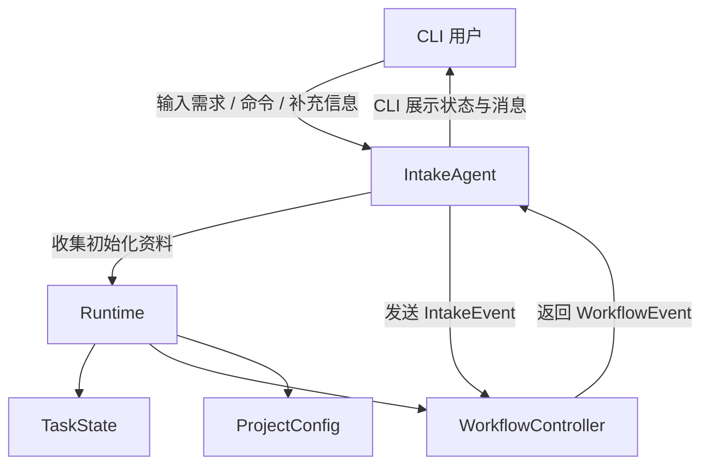
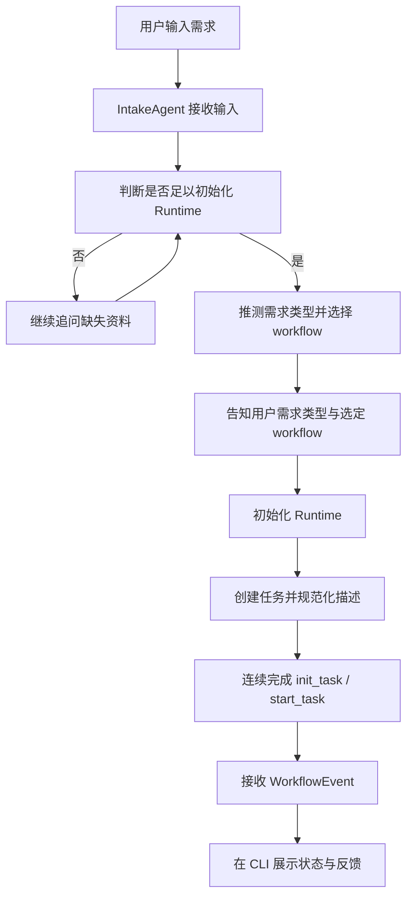
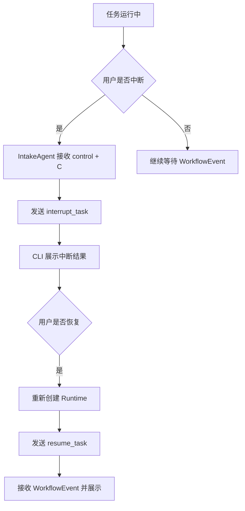
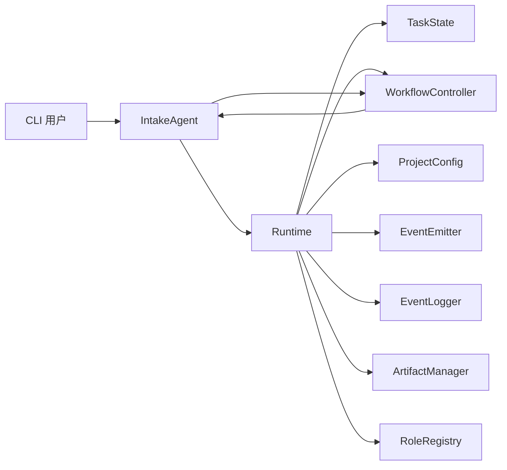

# Default Workflow Intake 层 PRD

## 文档信息

| 字段 | 内容 |
|------|------|
| 模块名 | `default-workflow` |
| 本文范围 | `Intake` 层 |
| 文档路径 | `roleflow/clarifications/0.1.0/default-workflow-intake-layer-prd.md` |
| 目标用户 | CLI 用户 |
| 信息来源 | `roleflow/context/project.md`、用户澄清结论 |

## Background

AegisFlow 的目标是面向真实软件开发工作的 Agentic Dev Workflow System，通过将需求澄清、代码探索、计划拆解、实现、审查、测试建议等环节组织成一条可控的开发流程，降低上下文污染、越界修改和返工风险。

在该架构中，`Intake` 层是用户进入 `default-workflow` 的入口。它负责与 CLI 用户沟通、补齐 `Runtime` 初始化所需信息、选择具体 `workflow`，并将规范化后的用户输入发送给 `WorkflowController`。`project.md` 已将 `Intake` 定义为一个 `UI层 + 轻决策层`，其目标不是实现业务编排，而是承接用户输入、驱动任务开始/恢复/中断等入口动作，并展示来自 `Workflow` 层的反馈。

## Goal

本 PRD 的目标是明确 `default-workflow` 中 `Intake` 层的产品需求，使其能够：

1. 作为 CLI 用户与系统交互的唯一入口。
2. 在任务开始前补齐 `Runtime` 初始化需要的资料。
3. 在接收到用户描述后，规范化需求并将其传递给 `WorkflowController`。
4. 在任务运行过程中承接中断、恢复、补充输入和结束等交互动作。
5. 将 `WorkflowEvent` 以 CLI 可理解的方式展示给用户。

## In Scope

- `IntakeAgent` 作为 `default-workflow` 的 CLI 入口角色
- 面向 CLI 用户的任务创建、启动、取消、中断、恢复、补充输入能力
- 面向 `Runtime` 初始化的资料收集
- 面向 `WorkflowController` 的 `IntakeEvent` 发送
- 面向 CLI 的 `WorkflowEvent` 展示
- 将 `Runtime`、`TaskState`、`ProjectConfig`、`WorkflowController` 作为 Intake 明确依赖对象进行需求约束描述

## Out of Scope

- `Explore`、`Plan`、`Build`、`Review`、`Test Design`、`Unit Test`、`Test` 阶段的详细需求
- `WorkflowController` 的内部编排实现
- `RoleRegistry`、`ArtifactManager`、`EventLogger` 的内部实现细节
- 代码级接口设计、类结构、目录结构、参数命名等技术方案
- `Archive`、`Architect` 等 v0.1 范围外增强能力
- 图形化界面或 Web UI

## 已确认事实

以下内容来自 `roleflow/context/project.md`，在本文中视为已确认事实：

- `Intake` 本身是一个 Agent，对象名倾向于 `IntakeAgent`
- `Intake` 是一个 `UI层 + 轻决策层`
- `Intake` 第一次与用户沟通的主要目标是补齐 `Runtime` 初始化所需资料
- `Intake` 唯一需要做的决策是选择具体的 `workflow`
- 用户只要描述内容，`Intake` 就需要根据描述猜测用户意图，并询问“是不是想要 XXX”
- `Intake` 以自然语言交互为主
- `Intake` 当前提供的能力包括：
  - 创建任务，并描述
  - 开始任务
  - 取消任务
  - 中断任务，支持 `control + C`
  - 继续未完成任务
  - 对任务内容进行补充
- `Intake` 负责跟用户沟通，将用户需求规范化后传给 `Workflow`
- `Intake` 接收 `Workflow` 层消息并展示到 CLI
- `Intake` 负责初始化 `Runtime`
- `Intake` 给 `Workflow` 发送 `IntakeEvent`，并接收 `WorkflowEvent`
- `Runtime` 初始化时需要包含：`TaskState`、`WorkflowController`、`ProjectConfig`、`EventEmitter`、`EventLogger`、`ArtifactManager`、`RoleRegistry`
- `Runtime` 在任务恢复时必须重新创建
- 本期范围只覆盖 `v0.1`，支持 `Feature Change`、`Bugfix`、`Small New Feature`

## 用户补充约束

以下内容由用户后续明确追加，在本文中视为已确认需求约束：

- `IntakeAgent` 当前模型接入约束为使用 `import { ChatOpenAI } from "@langchain/openai"`
- 当前默认模型配置为：
  - `model = gpt5.4`
  - `base_url = https://co.yes.vg/v1`
  - `apiKey = process.env.OPENAI_API_KEY`
- 本期交付结果必须包含一个可直接测试和验收的 `Intake` 层成品，而不是仅交付底层模块或半成品文档
- 若 `Runtime` 某些初始化能力在本期暂时无法完整落地，可以采用带注释的受控占位实现过渡，但不能导致 CLI 入口不可启动
- `IntakeAgent` 对超出本期范围的请求统一回复“敬请期待”

## 需求总览

## User Flow

### 主流程

### 中断与恢复流程

## Functional Requirements

### FR-1 作为 CLI 入口接收用户输入

- `IntakeAgent` 必须作为 CLI 用户与 `default-workflow` 交互的入口。
- 用户首次输入时，系统必须允许以自然语言描述任务，而不是要求固定命令格式。
- `IntakeAgent` 在本期必须以自然语言交互为主。
- 当用户只提供需求描述时，`IntakeAgent` 必须根据描述推测用户意图，并以确认式问句与用户校对。
- 当 `IntakeAgent` 完成初步判断后，必须告知用户识别出的需求类型以及所选择的 `workflow`。
- 当用户提出超出本期范围的请求时，`IntakeAgent` 必须统一回复“敬请期待”。

### FR-1A IntakeAgent 模型接入约束

- `IntakeAgent` 当前必须基于 `@langchain/openai` 的 `ChatOpenAI` 接入模型能力。
- 当前默认模型配置必须为：
  - `model = gpt5.4`
  - `base_url = https://co.yes.vg/v1`
  - `apiKey = process.env.OPENAI_API_KEY`
- 本文将上述内容视为当前版本的已确认接入约束，而不是开放性实现选项。

### FR-2 补齐 Runtime 初始化资料

- 在启动任务前，`IntakeAgent` 必须补齐 `Runtime` 初始化所需资料。
- 已确认需要用于初始化 `Runtime` 的资料包括：
  - 目标项目目录
  - `workflow` 具体流程编排
  - 工件保存目录
- 在初始化完成前，`IntakeAgent` 不应进入正式任务启动。

### FR-3 初始化 Runtime

- `IntakeAgent` 必须负责初始化 `Runtime`。
- 初始化后的 `Runtime` 需具备以下对象：
  - `TaskState`
  - `WorkflowController`
  - `ProjectConfig`
  - `EventEmitter`
  - `EventLogger`
  - `ArtifactManager`
  - `RoleRegistry`
- 当用户执行恢复未完成任务时，`IntakeAgent` 必须重新创建 `Runtime`，不能复用旧内存实例。
- 若 `Runtime` 的部分初始化能力在本期暂时无法完整落地，可以使用带注释的受控占位实现过渡，但不能影响 CLI 入口启动和基础 `Intake` 交互执行。

### FR-4 创建与启动任务

- `IntakeAgent` 必须支持创建任务并为任务补充描述。
- `taskId` 的生成时机与生成责任由 `IntakeAgent` 决定。
- 当用户确认开始任务后，`IntakeAgent` 必须将任务启动请求发送给 `WorkflowController`。
- 在满足启动条件时，`创建任务` 与 `开始任务` 可以连续完成，不要求拆成两个用户可见动作。
- `IntakeAgent` 必须支持 `start_task` 相关动作。

### FR-5 对任务内容进行补充

- 在任务已创建但仍需补充上下文时，`IntakeAgent` 必须支持用户继续补充任务内容。
- 补充内容必须以 `IntakeEvent` 形式进入 `Workflow`，而不是仅停留在 CLI 展示层。
- `IntakeAgent` 必须支持 `participate` 相关动作。
- 除非用户明确表达“继续执行”“继续”“继续完成任务”等继续运行任务的意图，否则其他补充说明、回答问题、追加上下文的输入都应优先识别为 `participate`。
- `participate` 与 `resume_task` 在本期必须保持为两个独立动作，不做合并。

### FR-6 中断、取消与恢复任务

- `IntakeAgent` 必须支持用户取消任务。
- `IntakeAgent` 必须支持任务中断，且中断操作支持 `control + C`。
- `IntakeAgent` 必须支持继续未完成任务。
- 只有当用户明确表达“继续执行”“继续”“继续完成任务”等继续运行任务的意图时，`IntakeAgent` 才应识别并触发 `resume_task`。
- 与上述动作相关的事件应分别通过 `cancel_task`、`interrupt_task`、`resume_task` 进入 `Workflow`。

### FR-7 发送 IntakeEvent

- `IntakeAgent` 必须向 `Workflow` 发送 `IntakeEvent`。
- 当前已确认的 `IntakeEventType` 包括：
  - `init_task`
  - `start_task`
  - `cancel_task`
  - `interrupt_task`
  - `resume_task`
  - `participate`
- `IntakeEvent` 必须包含：
  - `type`
  - `taskId`
  - `message`
  - `timestamp`
  - `metadata?`

### FR-8 展示 WorkflowEvent

- `IntakeAgent` 必须接收来自 `Workflow` 的 `WorkflowEvent`。
- `IntakeAgent` 必须将 `WorkflowEvent` 展示到 CLI。
- 当前阶段，`WorkflowEvent` 中可展示的信息先全部展示，不区分仅日志字段与仅界面字段。
- 当前已确认的 `WorkflowEventType` 包括：
  - `task_start`
  - `task_end`
  - `phase_start`
  - `phase_end`
  - `role_start`
  - `role_end`
  - `artifact_created`
  - `progress`
  - `error`

### FR-9 暴露 TaskState 摘要

- `IntakeAgent` 必须在 CLI 中暴露当前 `TaskState` 摘要。
- 当前至少应包含以下用户可感知信息：
  - `currentPhase`
  - `status`
- 当 `resumeFrom` 存在时，显示 `resumeFrom`

### FR-10 维护轻决策边界

- `IntakeAgent` 只负责轻决策，不负责流程编排。
- `IntakeAgent` 在本期唯一需要承担的决策，是根据用户描述选择具体 `workflow`。
- `IntakeAgent` 不应替代 `WorkflowController` 修改 `TaskState` 的编排规则，也不应替代 `Role` 层执行具体阶段任务。

### FR-11 对明确需求对象施加产品约束

- 本 PRD 将以下对象视为 `Intake` 层的明确需求对象，而不是仅作为背景描述：
  - `Runtime`
  - `TaskState`
  - `ProjectConfig`
  - `WorkflowController`
- `Intake` 层的产品行为必须与这些对象的既定职责保持一致：
  - `Runtime` 由 `Intake` 初始化，并在恢复时重建
  - `WorkflowController` 负责接收 `Intake` 指令并推进任务
  - `TaskState` 是任务状态载体，但其合法修改者是 `WorkflowController`
  - `ProjectConfig` 为 `Runtime` 初始化提供配置上下文

### FR-12 交付与验收约束

- 本期最终交付物必须包含一个可直接测试和验收的 `Intake` 层成品。
- 交付结果不能只包含底层模块、接口定义、计划文档或无法独立启动的半成品。
- 即使部分 `Runtime` 能力采用受控占位实现，CLI 入口仍必须可启动，且基础 `Intake` 交互必须可执行。

## 关键对象关系

## Constraints

- 仅覆盖 `v0.1` 范围，不扩展到 `Archive`、`Architect` 等后续能力
- `Intake` 是 `UI层 + 轻决策层`，不能承担 `WorkflowController` 的编排职责
- `TaskState` 的合法修改者是 `WorkflowController`，`Intake` 不应越权改写状态机
- 所有需求描述以 CLI 用户交互为中心，不包含图形界面要求
- 文档中的对象名、事件名、状态名、路径名必须与 `project.md` 中现有命名保持一致
- 本文只描述需求，不展开类设计、接口实现、代码目录和工程实现策略
- 当前模型接入约束固定为 `ChatOpenAI` + `gpt5.4` + `https://co.yes.vg/v1` + `process.env.OPENAI_API_KEY`
- 对超出本期范围的请求，`IntakeAgent` 的统一响应为“敬请期待”
- 若存在受控占位实现，不得牺牲 CLI 入口可启动性和基础交互可执行性

## Acceptance

- CLI 用户可以直接输入自然语言需求并触发 `IntakeAgent` 进入澄清与初始化流程
- 在资料不足时，`IntakeAgent` 会继续追问，直至满足 `Runtime` 初始化前提
- `IntakeAgent` 会向用户明确展示识别出的需求类型和所选 `workflow`
- `IntakeAgent` 当前基于 `ChatOpenAI` 接入，且默认模型配置符合 `gpt5.4`、`https://co.yes.vg/v1`、`process.env.OPENAI_API_KEY`
- `IntakeAgent` 可以初始化 `Runtime` 所需的核心对象集合
- `IntakeAgent` 可以创建任务、启动任务、取消任务、中断任务、恢复任务，并支持补充任务内容
- `创建任务` 与 `开始任务` 可以在满足条件时连续完成
- `control + C` 可作为中断任务的用户动作入口
- `IntakeAgent` 能向 `WorkflowController` 发送已定义的 `IntakeEvent`
- `IntakeAgent` 能接收并在 CLI 展示 `WorkflowEvent` 的全部当前可用信息
- `IntakeAgent` 会在 CLI 暴露当前 `TaskState` 摘要
- 恢复未完成任务时，系统会重新创建 `Runtime`
- 普通补充说明默认进入 `participate`，只有明确“继续执行”语义时才进入 `resume_task`
- `taskId` 由 `IntakeAgent` 决定和生成
- 对超出本期范围的请求，`IntakeAgent` 统一回复“敬请期待”
- 即使存在受控占位实现，CLI 入口仍可启动，且基础 `Intake` 交互可执行
- `Intake` 的职责仍停留在入口交互与轻决策层，不承担工作流编排职责

## Risks

- 如果 `Runtime` 初始化所需资料定义不完整，`Intake` 可能无法判断何时可以进入正式启动
- 如果用户意图识别规则不清晰，`Intake` 在选择 `workflow` 时可能产生误判
- 当前选择先展示全部 `WorkflowEvent` 信息，后续可能带来 CLI 信息噪音
- 用户自然语言可能同时包含“补充说明”和“继续执行”意图，`participate` 与 `resume_task` 的识别仍存在歧义风险

## Open Questions

- 无

## Assumptions

- 无
