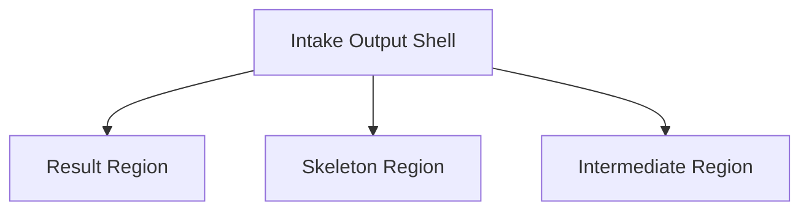

# Default Workflow Intake Output Structure Separation PRD

## 文档信息

| 字段 | 内容 |
|------|------|
| 模块名 | `default-workflow-intake-output-structure-separation` |
| 本文范围 | `default-workflow` Intake UI 的结果区、骨架区、过程输出区必须保持结构分离，不能回退为单一混排输出面板 |
| 文档路径 | `roleflow/clarifications/0.1.0/default-workflow-intake-output-structure-separation-prd.md` |
| 直接使用者 | AegisFlow 开发者、Planner、Builder |
| 信息来源 | 用户新增澄清、提交 `1b19ec20f2e251c198dd398432315dceaa17a538`、`src/cli/app.ts`、`src/cli/theme.ts`、`roleflow/clarifications/0.1.0/default-workflow-intake-ui-theme-refinement-prd.md` |

## Background

此前已经有一份独立 PRD 明确要求 Intake UI 在保持暗红主调的前提下，向 `codex cli` 的输出结构收敛。该需求的核心不是单纯换色，而是建立稳定的三级视觉层次：

- 结果区是主阅读区
- 骨架区是辅助状态区
- 过程输出区是最低优先级的暂态信息区

对提交 `1b19ec20f2e251c198dd398432315dceaa17a538` 的合并结果复核后，当前代码存在明确偏差：

- `src/cli/app.ts` 中的 `OutputPanel` 回到了单一 `ContentSection(title: "输出")`
- `buildOutputEntries(...)` 将 `finalBlocks` 与 `skeletonBlocks` 混合排序后统一渲染
- `intermediateLines` 也继续追加在同一输出面板中
- 结果区与骨架区虽然在 token 定义上已有不同语义，但在结构上不再是独立区域

这意味着当前实现实际上退回成“单面板内的多类标签行输出”，而不是“结果 > 骨架 > 过程”的分区结构。该偏差会直接削弱已有主题 refinement PRD 的目标，使结果区无法成为真正的主视觉区域。

因此本 PRD 的目的不是新增一套全新视觉方案，而是明确补充一个不可退让的结构约束：主题优化不能通过合并分区来完成，结果区、骨架区、过程输出区必须在结构上保持分离。

## Goal

本 PRD 的目标是补充一份针对合并回归的澄清文档，明确 `default-workflow` Intake UI 的输出结构约束，使 Builder 在后续实现中必须：

1. 恢复并保持结果区、骨架区、过程输出区的独立结构。
2. 保证结果区始终是最高优先级的主阅读区域。
3. 保证骨架区与过程输出区不会因为代码合并或样式收敛而重新混入结果流。
4. 保证主题 token 的语义能真实映射到组件结构，而不是只停留在颜色常量层。
5. 为后续代码 review 和测试提供明确的“结构回退”判定标准。

## In Scope

- `src/cli/app.ts` 中 Intake 输出区的区域组织方式
- 结果区、骨架区、过程输出区的结构边界
- 三区域的排序优先级与空状态策略
- 主题 token 与输出区域结构之间的映射关系
- 对“混排单面板输出”这一回归模式的禁止性约束

## Out of Scope

- 重写 Workflow 状态机
- 改动 `CliViewModel` 的事件来源协议
- 新增多主题系统
- 重做整个 Intake UI 的所有细节排版
- 改动 phase 工件、角色协议或非 Intake 输出页面

## 已确认事实

- 提交 `1b19ec20f2e251c198dd398432315dceaa17a538` 已合并主题 refinement 相关代码。
- 当前 `src/cli/theme.ts` 已存在结果区、骨架区、过程输出区的独立 token 定义。
- 当前 `src/cli/app.ts:371` 的 `OutputPanel` 只渲染一个标题为 `"输出"` 的 `ContentSection`。
- 当前 `src/cli/app.ts:489` 的 `buildOutputEntries(...)` 会把 `finalBlocks` 与 `skeletonBlocks` 合并排序。
- 当前 `src/cli/app.ts:514` 起，最终输出采用 `[结果输出]`、`[骨架输出]`、`[过程输出]` 标签行混排在同一面板内。
- 这种实现与既有 PRD 中“主结果优先、骨架降权、过程输出受控”的结构要求不一致。

## 与既有 PRD 的关系

- 本文不替代 `default-workflow-intake-ui-theme-refinement-prd.md`。
- 本文是对该 PRD 的补充澄清，专门约束“主题 refinement 的结构落地方式”。
- 若后续实现出现“颜色 token 更细，但区域结构被合并”的情况，应以本文为准判定为不满足需求。
- 本文与既有 Intake Ink UI PRD 不冲突；它只是在输出层级上增加更严格的结构保护。

## 术语

### Result Region

- 承载最终结论、总结性输出、关键说明和结果块的主区域。
- 这是用户进入输出区后默认应先阅读的区域。

### Skeleton Region

- 承载 `task_start`、`phase_start`、`role_start`、`phase_end` 等流程骨架事件的辅助区域。
- 它服务于“我现在执行到哪里了”的快速理解，不承担主结论展示职责。

### Intermediate Region

- 承载执行过程中的临时日志、过程流或流式行输出的低优先级区域。
- 它可以滚动、截断或压缩，但不能盖过结果区。

### Single Mixed Output Panel

- 指把结果块、骨架事件、过程输出统一塞进一个 panel，并通过文字标签区分来源的展示方式。
- 本 PRD 明确禁止这种方式作为最终输出结构。

## 需求总览

## Functional Requirements

### FR-1 输出区必须保持三区域结构分离

- Intake 输出层必须至少保留三个逻辑区域：
  - 结果区
  - 骨架区
  - 过程输出区
- 这三个区域必须在组件结构上可区分，不能只在同一列表里通过标签文本区分。
- 是否显示某个区域可以依据内容有无决定，但“结构能力”本身必须存在。

### FR-2 结果区必须是固定的主阅读区域

- 一旦存在 `finalBlocks`，结果区必须以独立主区域承载它们。
- 结果区不能退化成与骨架事件同权的标签行列表。
- 结果区在布局优先级上必须高于骨架区和过程输出区。

### FR-3 骨架区必须独立存在且低于结果区

- 骨架事件必须继续可见。
- 但骨架区必须是独立的辅助区域，而不是混入结果区内部。
- 骨架区可以被压缩为轻量事件列表、摘要流或弱面板，但仍必须保持独立容器语义。

### FR-4 过程输出区必须独立存在且低于骨架区

- `intermediateLines` 必须由独立的过程输出区域承载。
- 过程输出区不能与结果区或骨架区共享同一输出列表。
- 过程输出区必须保持最低视觉优先级和最低结构优先级。

### FR-5 不允许以单一“输出”面板混排三区域内容

- Builder 不得把 `finalBlocks`、`skeletonBlocks`、`intermediateLines` 扁平化为同一 panel 内的统一行列表作为最终结构。
- 不得仅通过 `[结果输出]`、`[骨架输出]`、`[过程输出]` 这类前缀标签来代替区域分离。
- 如果保留总标题容器，它也只能作为外层壳层，内部仍必须存在分离区域，而不是单列表。

### FR-6 区域优先级必须稳定，不受事件时间顺序反向打乱

- 输出区的一级结构顺序必须稳定体现：
  - 结果区
  - 骨架区
  - 过程输出区
- 不得因为 `block.order` 的跨类型排序，就让骨架事件重新插入结果区前后形成混排。
- 各区域内部仍可以保留各自的顺序语义，但不能用跨区域混排来替代分区。

### FR-7 主题 token 必须落实到区域结构，而不是只停留在颜色定义

- 结果区、骨架区、过程输出区的 token 不仅要存在，还必须被各自独立区域真实消费。
- 若代码中存在结果区、骨架区、过程输出区 token，但渲染结构只有单一区块，则应视为未满足需求。
- 主题优化与结构优化必须一致交付，不能只完成其一。

### FR-8 空状态与稀疏状态必须符合区域语义

- 当只有结果块时，可以只显示结果区，不强制展示空骨架区或空过程区。
- 当只有骨架事件时，可以让骨架区成为当前可见主内容，但其样式仍不能伪装成结果区。
- 当只有过程输出时，可以只显示过程输出区。
- 当完全无输出内容时，可以显示整体空状态，但不得因此删除三区域架构能力。

### FR-9 代码结构必须让 reviewer 能直接辨认三区域职责

- 输出层代码应能清晰看出：
  - 哪段代码构建结果区
  - 哪段代码构建骨架区
  - 哪段代码构建过程输出区
- 不应继续把三类内容先混成同一数组，再在最后一步统一渲染。
- 允许共享底层样式组件，但不允许共享到丢失区域职责。

### FR-10 必须增加防回退校验

- 自动化测试或等价校验必须能覆盖“三区域分离”的核心约束。
- 至少需要保护以下风险：
  - 结果块与骨架块再次混排
  - 过程输出重新并入单一列表
  - 结果区丢失主区域地位
  - token 存在但未映射到独立结构

## 非功能要求

### NFR-1 可读性

- 输出结构必须让用户一眼分辨“结论、流程骨架、过程流”三类信息。
- 不允许为了压缩代码而牺牲终端阅读层级。

### NFR-2 可维护性

- 区域拆分后的实现应保持职责清晰，便于后续继续调主题和布局。
- 结构边界应尽量稳定，避免未来 merge 时再次因为“复用一套渲染函数”而退化。

### NFR-3 一致性

- 本文要求必须与暗红主题 refinement PRD 一起成立。
- 后续任何 UI 收敛方案都不能通过合并三区域来满足“更克制、更简洁”的目标。

## 验收标准

- 当 `finalBlocks`、`skeletonBlocks`、`intermediateLines` 同时存在时，终端中可明确看到三个独立区域，而不是一个混合列表。
- 结果区始终位于输出层级最高处，骨架区次之，过程输出区最低。
- 骨架区和过程输出区即使样式较弱，也不会消失在结果区内部。
- 代码 review 时，可以直接定位负责构建三个区域的独立逻辑，而不是只能看到一个 `buildOutputEntries()` 式的扁平化汇总函数。
- 自动化测试或等价校验可以在未来 merge 后识别出“单面板混排”这一回归。

## 设计约束

- 可以保留一个更外层的输出壳层，但内部必须是分区结构。
- 可以继续复用 `ContentSection` 或等价组件，但结果区、骨架区、过程输出区不能退化成同一种内容列表。
- 可以为了接近 `codex cli` 而进一步压缩骨架区和过程输出区，但不允许牺牲结果区的独立主区定位。

## Open Questions

- 无。

## Assumptions

- 用户接受为了恢复主结果优先结构而调整当前 `OutputPanel` 的组织方式。
- 当前最重要的问题是结构回退，而不是新增更多色板细节。

## Todolist (todoList)

- [x] 识别合并后是否出现“单一输出面板混排三区域内容”的回归。
- [x] 明确该回归与既有 `default-workflow-intake-ui-theme-refinement-prd.md` 的不一致之处。
- [x] 新增独立 PRD，补充“三区域结构不可合并”的强约束。
- [x] 规定区域优先级、空状态策略和禁止性实现模式。
- [x] 要求补充防回退测试或等价校验。

