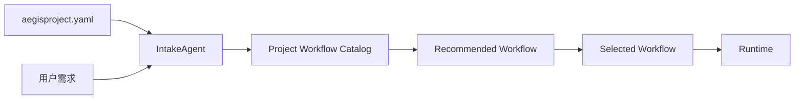
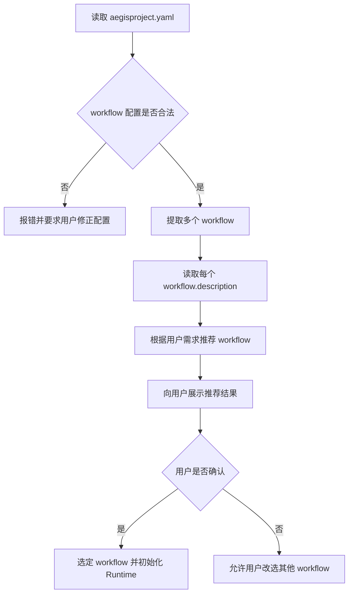

# Default Workflow Intake Project Workflows PRD

## 文档信息

| 字段 | 内容 |
|------|------|
| 模块名 | `default-workflow-intake-project-workflows` |
| 本文范围 | `default-workflow` 中 `Intake` 读取项目侧 `aegisproject.yaml` workflow 列表并进行推荐选择的需求 |
| 文档路径 | `roleflow/clarifications/0.1.0/default-workflow-intake-project-workflows-prd.md` |
| 直接使用者 | AegisFlow 开发者、Planner、Builder |
| 信息来源 | `roleflow/context/project.md`、`roleflow/clarifications/0.1.0/default-workflow-intake-layer-prd.md`、用户澄清结论 |

## Background

当前 `Intake` 层需求默认把 workflow 选择理解成“从系统内置选项中做判断”。  
但用户已明确要求：

1. 可选 workflow 不能由代码写死。
2. `Intake` 必须从项目下 `.aegisflow/aegisproject.yaml` 读取 workflow 配置。
3. 项目配置里应声明多个 workflow，而不是单个 workflow。
4. 每个 workflow 都必须包含 `description`，供 `Intake` 根据用户需求语义进行推荐。
5. 如果 `aegisproject.yaml` 中 workflow 配置不合规范，系统不应静默回退，而应明确报错，要求用户先修正 `aegisproject.yaml`。

这意味着 `Intake` 的 workflow 选择逻辑需要从“系统内置固定工作流”收敛为“项目配置驱动的 workflow 推荐与确认”。

## Goal

本 PRD 的目标是明确 `default-workflow` 中 `Intake` 的项目侧 workflow 读取与选择需求，使系统能够：

1. 从项目下 `aegisproject.yaml` 读取多个可选 workflow。
2. 对 workflow 配置做结构校验，而不是盲目信任配置内容。
3. 基于每个 workflow 的 `description` 对用户需求做推荐。
4. 在配置非法时立即阻断并提示用户修正 `aegisproject.yaml`。
5. 在用户确认后，将选中的 workflow 作为当前任务的编排输入。

## In Scope

- `Intake` 从项目下 `.aegisflow/aegisproject.yaml` 读取 workflow 列表
- workflow 配置的最小结构约束
- workflow 配置校验失败时的报错语义
- `Intake` 基于 workflow `description` 的推荐逻辑
- 用户确认推荐 workflow 的交互约束
- 选中 workflow 后对 `Runtime / ProjectConfig` 的输入要求

## Out of Scope

- `WorkflowController` 的内部 phase 编排实现
- 各 workflow 内部 phase 的详细角色职责定义
- `aegisproject.yaml` 的完整解析器代码设计
- 项目配置热更新
- 非 `Intake` 层的 workflow 执行策略扩展

## 已确认事实

- workflow 不能由代码写死
- workflow 必须从项目下 `aegisproject.yaml` 中读取
- 项目配置中应声明多个 workflow
- 每个 workflow 需要 `description`
- `Intake` 需要根据 `description` 给用户推荐 workflow
- 如果 `aegisproject.yaml` 中 workflow 配置不合规范，需要明确报错并要求用户重新填写 `aegisproject.yaml`

## 术语

### Project Workflow Catalog

- 指项目下 `aegisproject.yaml` 中声明的全部 workflow 列表
- 这是 `Intake` 做 workflow 推荐时唯一可信来源

### Recommended Workflow

- 指 `Intake` 基于用户需求语义与 workflow `description` 做出的推荐结果
- 推荐结果在用户确认前不是最终选择

### Selected Workflow

- 指用户最终确认后用于当前任务执行的 workflow
- 其 `phases` 会成为当前任务的实际编排输入

## 需求总览

## 选择流程图

## Functional Requirements

### FR-1 Intake 必须从项目下 aegisproject.yaml 读取 workflow 列表

- `Intake` 在做 workflow 推荐前，必须从项目下 `.aegisflow/aegisproject.yaml` 读取 workflow 配置。
- `Intake` 不得继续依赖代码内置的固定 workflow 集合作为推荐来源。
- 项目配置必须成为 workflow 选择的唯一可信输入源。

### FR-2 项目配置中必须声明多个 workflow

- `aegisproject.yaml` 中必须能表达多个 workflow。
- 本期按复数语义收敛为 `workflows` 列表。
- 单个 workflow 对象不再满足本文目标场景。

### FR-3 每个 workflow 必须包含 description

- `workflows[*]` 中的每个 workflow 都必须包含：
  - `name`
  - `description`
  - `phases`
- `description` 必须用于表达该 workflow 适用的任务类型、目标场景或执行倾向。
- 若缺少 `description`，该 workflow 应视为不合规范。

### FR-4 phases 必须作为 workflow 的内嵌配置存在

- 每个 workflow 必须自带自己的 `phases` 配置。
- `phases` 中的每个 phase 至少应包含：
  - `name`
  - `hostRole`
  - `needApproval`
- 当前任务的 `workflowPhases` 必须来源于最终选中的 workflow，而不是全局写死配置。

### FR-5 Intake 必须校验 workflow 配置结构

- `Intake` 在使用项目侧 workflow 前，必须先校验其结构是否合法。
- 至少应校验：
  - `workflows` 是否存在
  - `workflows` 是否为非空列表
  - 每个 workflow 是否包含 `name`
  - 每个 workflow 是否包含非空 `description`
  - 每个 workflow 是否包含合法 `phases`
- 对不合规范的 workflow 配置，系统不得静默忽略并继续运行。

### FR-6 配置不合规范时必须明确报错并阻断继续执行

- 若 `aegisproject.yaml` 中的 workflow 配置不合规范，`Intake` 必须明确报错。
- 报错时必须明确指向需要用户修正的是 `aegisproject.yaml`，而不是泛化为普通系统错误。
- 在配置修正前，`Intake` 不应继续进入 workflow 推荐或任务启动。

### FR-7 Intake 必须基于 workflow.description 做推荐

- `Intake` 必须基于用户需求描述与各 workflow 的 `description` 做匹配和推荐。
- 推荐逻辑的输入重点应是：
  - 用户当前需求
  - workflow 的 `description`
- `Intake` 不应仅根据 workflow 名称做推荐。

### FR-8 推荐结果必须向用户显式展示

- `Intake` 完成推荐后，必须向用户展示：
  - 推荐的 workflow 名称
  - 推荐理由或与 `description` 对应的简要说明
- 用户需要能够理解“为什么推荐这个 workflow”，而不是只看到一个名字。

### FR-9 用户必须能够确认或改选 workflow

- 推荐结果不是最终选择，`Intake` 必须允许用户确认或改选。
- 当用户不接受推荐结果时，系统必须允许其改选当前项目配置中其他合法 workflow。
- `Intake` 不应把推荐结果直接当成最终选择而跳过确认。

### FR-10 Selected Workflow 必须成为 Runtime 的实际编排输入

- 用户确认后的 `Selected Workflow` 必须成为当前任务实际使用的 workflow。
- `Selected Workflow.phases` 必须被写入当前任务的 `workflowPhases` 运行时输入。
- 当前任务后续的 phase 编排必须基于选中的 workflow，而不是回退到系统默认 workflow。

### FR-11 本期不得对非法配置做静默降级

- 当项目配置非法时，本期不允许静默降级为代码默认 workflow。
- 当项目配置缺失 `description` 时，本期不允许跳过推荐直接使用名称匹配。
- 当项目配置无法解析时，本期不允许继续启动任务。

## Constraints

- 仅覆盖 `v0.1`
- workflow 选择来源必须是项目下 `aegisproject.yaml`
- workflow 不能由代码写死
- 项目配置必须支持多个 workflow
- 每个 workflow 必须包含 `description`
- 配置非法时必须报错并要求用户修正 `aegisproject.yaml`
- 本文只描述需求，不展开实现代码

## Acceptance

- `Intake` 会从项目下 `aegisproject.yaml` 读取 workflow 列表
- 项目配置能够表达多个 workflow
- 每个 workflow 都带有 `description`
- `Intake` 会基于 `description` 推荐 workflow
- 推荐结果会展示给用户，并允许确认或改选
- 用户确认后，选中的 workflow 会成为当前任务的实际编排输入
- workflow 配置不合规范时，系统会明确报错并要求用户修正 `aegisproject.yaml`
- 系统不会在非法配置下静默回退到代码默认 workflow

## Risks

- 若 `description` 写得过于含糊，`Intake` 推荐质量会明显下降
- 若配置校验规则不清晰，不同非法配置可能产生不一致的报错体验
- 若保留任何隐藏的默认 workflow 回退路径，会直接破坏“项目配置驱动”这一约束

## Open Questions

- 本期先按 `workflows` 复数列表作为配置键名收敛；若后续需要兼容 `workflow` 单数键，应作为新增需求单独定义

## Assumptions

- 当前任务在 `Runtime` 初始化前，`Intake` 有能力读取并解析项目下 `.aegisflow/aegisproject.yaml`
