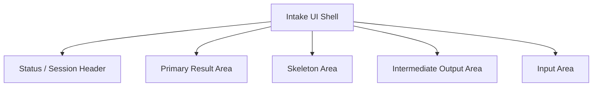
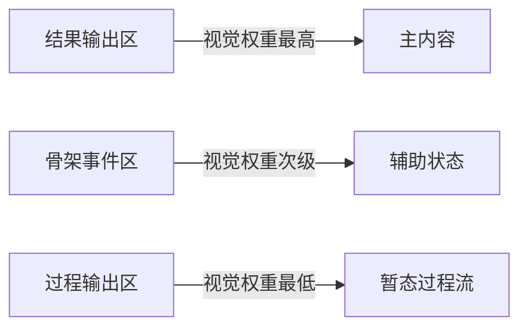

# Default Workflow Intake UI Theme Refinement PRD

## 文档信息

| 字段 | 内容 |
|------|------|
| 模块名 | `default-workflow-intake-ui-theme-refinement` |
| 本文范围 | `default-workflow` Intake Ink UI 的结果区、骨架区颜色语义与整体输出结构优化 |
| 文档路径 | `roleflow/clarifications/0.1.0/default-workflow-intake-ui-theme-refinement-prd.md` |
| 直接使用者 | AegisFlow 开发者、Planner、Builder |
| 信息来源 | 用户新增需求、`src/cli/app.ts`、`src/cli/ui-model.ts`、`roleflow/clarifications/0.1.0/default-workflow-intake-ink-ui-prd.md` |

## Background

当前 `default-workflow` 已经具备一版基于 `Ink + React` 的 Intake 终端 UI，主要结构包括：

- 顶部状态区
- `结果与事件` 区
- `骨架事件` 区
- `过程输出` 区
- 底部输入区

现有实现已经满足“暗红主调 + 分区展示”的最小要求，但用户新增反馈指出：

- 当前结果输出区域的颜色不好看
- 当前骨架输出区域的颜色不好看
- 如果能进一步优化整体输出结构更好
- 整体结构可以参考甚至接近 `codex cli`
- 但主题色不能切成默认蓝色或紫色，仍需保持暗红色主调

结合当前代码可见，现有问题主要不在“有没有颜色”，而在“颜色语义与内容层级不够准确”：

- `结果与事件` 区和 `骨架事件` 区都使用同一类暗红标题语义，层级区分不够明显
- 骨架区目前整体偏灰，但它和过程输出区的角色差异还不够清晰
- 结果区中的结果块仍主要是简单标题 + 正文，缺少“主结果卡片”的视觉主次
- 整体结构仍偏向“多个同权区块纵向堆叠”，与 `codex cli` 那种“主结果优先、辅助信息降权、过程流受控”的结构相比还有距离

因此本次需求不是简单换几个颜色值，而是对 Intake UI 的视觉层级、分区职责和终端结构做一次明确收敛。

## Goal

本 PRD 的目标是新增一份独立需求文档，明确 `default-workflow` Intake UI 的颜色语义和结构优化方向，使系统能够：

1. 让结果输出区具备更强的主内容视觉权重。
2. 让骨架事件区保留可见性，但视觉权重低于结果区。
3. 让整体输出结构更接近 `codex cli` 的“主内容优先、辅助信息次级、过程流受控”的体验。
4. 保持整体主题仍然是暗红色，而不是切换到默认冷色主题。
5. 为 Builder 提供一套明确的颜色规划和布局优化边界，而不是只做主观微调。

## In Scope

- `src/cli/app.ts` 中 Intake UI 的主题 token 规划
- 结果输出区的颜色语义与块级视觉结构
- 骨架事件区的颜色语义与视觉降权规则
- 各输出区域的层级关系与布局优化方向
- 参考 `codex cli` 的终端结构，但保留 AegisFlow 暗红主题

## Out of Scope

- 改动 Workflow 状态机
- 改动 Role 执行协议
- 改动 phase 工件格式
- 做像素级复刻 `codex cli`
- 多主题切换系统
- 终端动画、复杂过渡效果或图表化输出

## 已确认事实

- 当前 Intake UI 已基于 `Ink + React`。
- 当前主题 token 位于 `src/cli/app.ts` 中的 `THEME` 常量。
- 当前 `结果与事件`、`骨架事件`、`过程输出` 采用纵向分区布局。
- 当前结果块标题颜色通过 `resolveToneColor(...)` 决定，正文统一为浅色文本。
- 当前骨架区整体使用较弱灰色文本展示，但仍与其他区块采用近似的标题/边框结构。
- 用户明确要求结果区和骨架区颜色重新规划，并允许整体结构参考 `codex cli`。
- 用户同时明确要求主题主色仍保持暗红色。

## 与既有 PRD 的关系

- 本文是新增 PRD，不覆盖既有 `default-workflow-intake-ink-ui-prd.md`。
- `default-workflow-intake-ink-ui-prd.md` 中关于：
  - `Ink + React`
  - 暗红主调
  - 中间输出灰色受限区
  - 最终结果完整展示
  的要求继续成立。
- 本文新增的是“颜色更细的语义分层”和“整体输出结构进一步向 codex 风格收敛”的补充要求。

## 术语

### Result Area

- 指当前 Intake UI 中承载最终结论、总结性输出和关键结果的主内容区域。
- 它应是终端界面中视觉优先级最高的正文区域。

### Skeleton Area

- 指承载 `task_start`、`phase_start`、`role_start`、`phase_end` 等流程骨架事件的辅助区域。
- 它必须可见，但不能压过结果区。

### Codex-like Structure

- 指参考 `codex cli` 的终端内容组织方式。
- 在本需求中，它主要表示：
  - 主结果优先
  - 骨架与状态信息降权
  - 过程流和辅助区受控
  - 整体布局克制、清晰
- 它不表示像素级复刻或完全复制所有交互细节。

## 需求总览

## 视觉层级图

## Functional Requirements

### FR-1 结果输出区必须成为视觉主区

- `结果输出` 必须是 Intake UI 中最重要的内容区域。
- 结果区的标题、边框、正文承载方式必须明显强于骨架区。
- 结果区不应继续表现为“只是和其他区块并排的一个普通 panel”。
- 结果区应更接近“主结果卡片 / 主内容面板”的视觉定位。

### FR-2 骨架事件区必须保留，但必须降权

- 骨架事件区仍需保留。
- 骨架事件区的视觉权重必须低于结果区。
- 骨架区应更接近“状态日志 / 流程辅助信息”，而不是主内容面板。
- 骨架区不应继续使用与结果区近似的强调方式。

### FR-3 结果区和骨架区必须使用不同颜色语义

- 结果区和骨架区不能继续共享近似的标题强调语义。
- 结果区应使用暗红主题中的高权重颜色层级。
- 骨架区应使用更低饱和度、更偏灰褐或烟灰红的辅助层级。
- 两者的差异必须在终端中一眼可分，而不是只有细微色差。

### FR-4 主题仍必须保持暗红主调

- 整体主题主色仍必须是暗红色系。
- 结果区的强调色可以在暗红色系内细分为：
  - 深暗红边框
  - 稍亮的暗红标题
  - 辅助暖灰正文
- 骨架区可以弱化成灰褐、石板灰、烟灰红等低饱和辅助色，但不能脱离暗红主题体系。
- 不得整体切换成蓝色、青色、紫色主主题。

### FR-5 过程输出区必须继续低于骨架区

- `过程输出` 区仍然应是最低视觉优先级区域。
- 过程输出区应继续保持冷静的灰色/中性语义，用来表达暂态过程流。
- 骨架区虽然要降权，但仍应高于过程输出区。
- 结果区、骨架区、过程输出区三者必须形成稳定的三级层次。

### FR-6 结构上必须更接近 Codex 风格

- Intake UI 的整体结构可以参考 `codex cli` 的终端组织方式。
- 这种“参考”至少应体现为：
  - 顶部状态简洁，不喧宾夺主
  - 主结果区优先占据注意力
  - 骨架区更像辅助状态流，而不是第二个主面板
  - 过程输出区受控、克制
- 若需要在“完全模仿 codex 结构”和“保留当前 AegisFlow 结构”之间取舍，本期允许向 codex 风格明显靠拢。

### FR-7 结果区应支持更清晰的块级结构

- 结果区内部的 block 不应只有“标题一行 + 正文一段”的最低结构。
- 至少应能通过颜色、间距、边框或前缀语义体现：
  - 结果标题
  - 结果正文
  - 错误类结果
  - 系统消息类结果
- 结果块之间应有更明确的节奏和分隔，而不是所有块都长得一样。

### FR-8 骨架区应适合快速扫读

- 骨架区应强调“快速扫一眼即可知道流程走到哪一步”。
- 骨架区展示应更偏向简洁、压缩、低对比度。
- 若结构优化需要，骨架区可以从“完整 panel 列表”收敛为更轻量的事件列表或时间线式表达。

### FR-9 Builder 可以重排现有区块顺序

- 若为了更接近 codex 风格和提升结果优先级，Builder 可以调整当前区块顺序。
- 允许的优化包括但不限于：
  - 让结果区更靠上
  - 让骨架区更靠下或更收敛
  - 让状态栏更紧凑
  - 让输入区与主内容区关系更清晰
- 但必须保留：
  - 状态信息
  - 结果区
  - 骨架区
  - 过程输出区
  - 输入区

### FR-10 颜色规划必须以 token 方式落地

- 颜色优化不能只靠临时手改若干硬编码值完成。
- 必须形成清晰的主题 token 分层，至少覆盖：
  - 主强调色
  - 主强调亮色
  - 主正文色
  - 次级正文色
  - 骨架辅助色
  - 过程输出色
  - 错误色
  - 边框色
  - panel 背景语义
- 这样后续才能继续演进，而不是每个组件各自散落颜色。

## 建议色彩方向

以下是本 PRD 推荐的色彩语义方向，不要求 Builder 完全使用这些具体十六进制值，但必须保持同一层级关系：

- 结果区主强调：`#c24141` 到 `#dc2626`
- 结果区深边框：`#4c0519` 到 `#450a0a`
- 主正文：`#f5f5f4`
- 次正文：`#d6d3d1`
- 骨架辅助色：`#a8a29e`、`#78716c`、`#8b6b61`
- 过程输出色：`#94a3b8`、`#9ca3af`
- 错误强调：`#f87171`
- Panel 背景：深褐黑、炭黑、酒红黑方向，而不是纯黑或纯蓝黑

## Constraints

- 仅覆盖 Intake UI 展示层
- 主色必须保持暗红主题
- 允许参考或明显靠近 `codex cli` 结构
- 不要求像素级复刻 `codex cli`
- 结果区、骨架区、过程输出区必须形成清晰层级
- 颜色必须通过统一 token 方式管理

## Acceptance

- 结果输出区和骨架事件区的颜色语义明显区分，不再显得像同一权重的两个 panel。
- 结果区成为最优先阅读区域，骨架区明显降权。
- 整体结构比当前更接近 `codex cli` 的主结果优先风格。
- 暗红主题仍然成立，没有退化成冷色或默认终端配色。
- 过程输出区仍保持最低层级，不会与骨架区或结果区混淆。
- 颜色规划在代码中体现为清晰 token，而不是零散硬编码。

## Risks

- 若只换颜色、不调整层级结构，结果区和骨架区仍会显得同权。
- 若过度模仿 `codex cli` 而忽略 AegisFlow 现有事件模型，可能导致区块职责混乱。
- 若骨架区降权过度，用户可能失去对流程进度的快速感知。
- 若暗红色使用过亮或过饱和，终端中会显得刺眼，反而影响长时间阅读。

## Open Questions

- 无

## Assumptions

- 用户对“完全模仿 codex 的输出结构也可以”的意思，是允许整体结构明显靠近 codex，而不是要求像素级复刻。
- 当前优先级最高的是结果区和骨架区的配色与层级问题，其他区域优化属于顺带收敛但不应偏离主目标。
