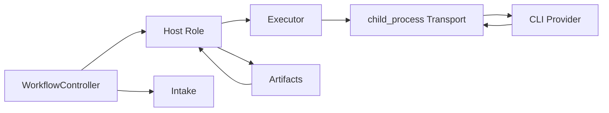
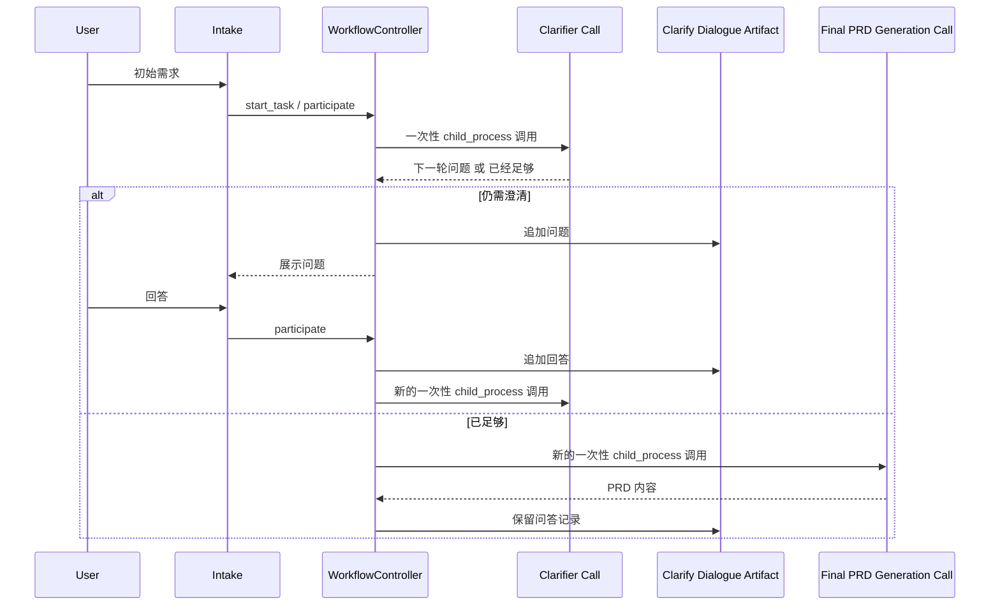

# Default Workflow Role Child Process Subcommand PRD

## 文档信息

| 字段    | 内容                                                                                                                                                                                                                                           |
| ----- | -------------------------------------------------------------------------------------------------------------------------------------------------------------------------------------------------------------------------------------------- |
| 模块名   | `default-workflow-role-child-process-subcommand`                                                                                                                                                                                             |
| 本文范围  | `default-workflow` 中 `Role` 层默认改用 `child_process` 子命令行、引入 CLI provider 抽象，并补充 `clarify` 阶段多轮问答工件机制                                                                                                                                           |
| 文档路径  | `roleflow/clarifications/0.1.0/default-workflow-role-child-process-subcommand-prd.md`                                                                                                                                                        |
| 直接使用者 | AegisFlow 开发者、Planner、Builder                                                                                                                                                                                                                |
| 信息来源  | 用户新增需求、`roleflow/clarifications/0.1.0/default-workflow-role-node-pty-subcommand-prd.md`、`roleflow/clarifications/0.1.0/default-workflow-role-codex-cli-prd.md`、`roleflow/clarifications/0.1.0/default-workflow-workflow-layer-prd.md`、用户澄清结论 |

## Background

当前仓库已经存在一套“`Role` 通过 `node-pty` 驱动持久化子命令行，再在终端里执行 `codex` CLI”的运行时方向。  
这套方向的核心前提是：

- `Role` 维持长期 PTY session
- 运行中输入可以继续追加到后续 turn
- `codex exec` / `codex exec resume` 共同组成单角色长期上下文

本次新增需求把默认执行模型改成了另一条路径：

- `Role` 层现在默认固定使用 `child_process`
- 原有 `node-pty` 代码不立即删除，但只作为保留实现整理到专门目录中
- 当前运行时不再引用 `node-pty`
- 所有角色对外部 CLI 的调用都改成一次性调用，而不是长期 session
- 流程中的“记忆”原则上不再依赖 CLI 进程上下文，而依赖工件
- `codex` 不能被写死在通用执行链路里，因为未来可能切换到 `claude code cli` 或 `gemini cli`

这意味着角色执行模型从“持久化 PTY 子终端 + CLI session 复用”，切换成“`child_process` 一次性子进程 + 工件驱动的上下文延续”。

同时，当前架构对 `hostRole` 的定义也被进一步收敛：

- 每个 phase 的主持人由 `workflow.phases[*].hostRole` 指定
- `hostRole` 是一个 `controller + agent` 角色
- `hostRole` 本身不直接承担生成工作，只负责围绕执行结果做简单判断
- `hostRole` 使用的所有大模型 / 工具能力在 `v0.1` 中都依赖统一 `Executor`
- `v0.1` 中不要求 `hostRole` 实现复杂判断；拿到一次 `Executor` 返回结果后，即可直接判断当前 phase 结束

同时，`clarify` 阶段被明确声明为本次改造中的特殊阶段：

- 用户先提交初始需求
- `clarifier` 基于“初始需求 + 已累积问答”发起下一轮问题
- 每一轮问题与回答都要持续写入一个专门记录澄清问答的工件文件
- 当 `clarifier` 自行判断“没有问题了”后，不直接沿用当前轮结果充当 PRD
- 必须由 `Workflow` 再启动一个新的 `child_process` 一次性调用，基于“最初需求 + 全部问答”正式生成 PRD

因此需要新增一份 PRD，把默认角色执行介质、CLI provider 抽象，以及 `clarify` 特殊交互机制统一收敛为明确需求。

## Goal

本 PRD 的目标是明确 `default-workflow` 中 `Role` 默认改用 `child_process` 子命令行后的架构边界，使系统能够：

1. 让角色默认通过 `child_process` 一次性执行外部 CLI。
2. 保留原有 `node-pty` 能力，但使其退出当前主执行链路。
3. 把“进程启动方式”和“具体 CLI 命令协议”分层，避免通用角色运行时写死 `codex`。
4. 让非 `clarify` 阶段的上下文延续主要依赖工件，而不是 CLI session。
5. 让 `clarify` 阶段支持多轮问答工件累积，并在问题结束后再单独生成 PRD。
6. 固定 `hostRole -> Executor -> CLI provider` 的执行边界，避免角色重新退化成“自己直接生成、自己直接做工具调用”的混合体。

## In Scope

- `Role` 层默认子命令行执行方式从 `node-pty` 切换为 `child_process`
- `node-pty` 旧实现的保留、整理与“不得继续引用”约束
- `Role` 层对 CLI 的 provider 抽象
- `hostRole` 作为 `controller + agent` 的执行边界
- `Executor` 作为 `hostRole` 的统一能力入口
- 非 `clarify` 阶段的一次性 CLI 调用语义
- “流程记忆依赖工件”的上下文延续约束
- `clarify` 阶段的多轮问答、问答工件、完成判定与最终 PRD 生成链路
- `.aegisflow/aegisproject.yaml` 中与角色子命令行执行有关的最小配置边界

## Out of Scope

- 立即删除 `node-pty` 相关代码
- 立即实现 `claude code cli` 或 `gemini cli` provider
- 改写 `default-workflow` 的 phase 顺序
- 重定义 `RoleResult` 的公共类型名
- GUI / TUI 设计
- 非 `default-workflow` 的执行后端

## 已确认事实

- `Role` 层当前可以保留两种子命令行能力语义：`child_process` 与 `node-pty`
- 当前默认执行路径可以直接写死为 `child_process`
- 旧 `node-pty` 代码暂时不删除，但要整合到专门目录中
- 整理后的 `node-pty` 代码当前不能再被任何主执行链路引用
- 角色层对 AI CLI 的调用必须改成一次性调用，例如 `codex exec "..."` 这类 one-shot 形式
- 每个 phase 的主持人由 `hostRole` 指定
- `hostRole` 是 `controller + agent` 角色，本身不直接承担生成工作
- `hostRole` 在 `v0.1` 中使用的所有工具能力都依赖统一 `Executor`
- `v0.1` 中只要 `Executor` 成功返回结果，就可以直接视为当前 phase 结束
- 角色层不能把 `codex` 写死为唯一后端，因为未来可能改成 `claude code cli` 或 `gemini cli`
- 因此需要把“CLI provider 协议”和“子进程 transport”分开
- 流程中的所有记忆原则上依赖工件，而不是进程内 session
- 原则上每个 phase 只产生一个工件
- `clarify` 阶段是明确例外，允许产生多个工件
- `clarify` 阶段中，用户先给出初始需求
- `clarifier` 根据初始需求发起澄清问题
- 每一轮问题和回答都要记录到一个专门用于澄清问答的工件文件中
- `clarifier` 是否“没有问题了”由 AI 自行判断
- 当 `clarifier` 判断问题已经问完后，必须由 `Workflow` 启动新的 `child_process` 调用，根据“最初需求 + 全部问答”生成 PRD 文件

## 与既有 PRD 的关系

- 本文是新增 PRD，不删除既有文档
- `default-workflow-role-node-pty-subcommand-prd.md` 仍保留为历史需求文档
- 若既有 `node-pty` 文档与本文对“默认运行路径”的描述发生冲突，应以本文为当前实现约束
- `default-workflow-role-codex-cli-prd.md` 中“角色走 CLI 而不是直连模型 API”的原则继续成立
- 但 CLI 协议的通用抽象边界，应以本文新增的 provider 分层约束为准

## 术语

### CLI Transport

- 指角色运行时如何启动一个外部子命令行进程
- 本期默认 transport 固定为 `child_process`
- `node-pty` 仅作为保留实现存在，不属于当前默认 transport

### CLI Provider

- 指某一个具体 CLI 的命令协议适配层
- provider 负责决定具体可执行命令、参数格式、prompt 注入方式、输出回读方式
- 当前可以先内置 `codex` provider
- 但通用角色执行链路不得把 `codex` 协议硬编码到 transport 层

### Executor

- 指 `hostRole` 调用外部大模型 / 工具能力的统一执行入口
- `Executor` 向下选择具体 transport 与 provider
- `hostRole` 在 `v0.1` 中不应绕过 `Executor` 直接读写文件、直接查询或直接调用具体 CLI

### Host Role

- 指每个 phase 的主持人角色，由 `hostRole` 配置项指定
- `Host Role` 是 `controller + agent`
- `Host Role` 自身只负责简单判断，例如工件是否允许落盘、当前 phase 是否结束
- 具体生成、读写文件、查询、外部 CLI 调用等动作由 `Executor` 负责

### One-Shot Role Invocation

- 指一次角色执行只启动一次新的外部 CLI 子进程
- 本次调用结束后，该子进程生命周期随之结束
- 后续继续执行时，必须重新启动新的子进程

### Clarify Dialogue Artifact

- 指 `clarify` 阶段专门用于记录“问题 / 回答”往返历史的工件文件
- 该工件文件需要跨多轮澄清持续累积
- 它是最终 PRD 生成时的核心输入之一

## 需求总览

## Clarify 特殊流程图

## Functional Requirements

### FR-1 `Role` 默认子命令行 transport 必须固定为 `child_process`

- `default-workflow` 中角色层当前默认的子命令行执行方式必须是 `child_process`。
- 本期不要求把 transport 做成运行时可切换配置。
- 当前主执行链路不得继续默认走 `node-pty`。
- 角色执行不得退化为项目内部直接调用模型 SDK / API。

### FR-2 `node-pty` 实现必须保留，但必须退出主执行链路

- 原有基于 `node-pty` 的实现暂时不能删除。
- 该实现必须整理到 `src/default-workflow/role/` 下的专门目录中，作为保留能力存在。
- 整理后的 `node-pty` 代码当前不得被默认执行链路引用。
- 本期实现目标是“保留但不引用”，而不是“删除”。

### FR-3 角色执行链路必须拆分为 transport 与 provider 两层

- transport 负责启动子进程、收集 stdout/stderr、等待退出、处理 timeout。
- provider 负责具体 CLI 协议，包括：
  - 执行命令名
  - 参数拼接
  - prompt 注入方式
  - 输出文件 / 输出文本回读方式
  - provider 级结果解析约定
- transport 不得直接写死 `codex exec`、`codex exec resume` 等 provider 级协议。
- provider 与 transport 的职责必须显式分层，避免未来接入 `claude code cli`、`gemini cli` 时重写整条角色执行链。

### FR-3A `hostRole` 必须通过统一 `Executor` 访问 transport / provider

- 每个 phase 的 `hostRole` 都必须通过统一 `Executor` 访问底层 transport 与 provider。
- `hostRole` 本身不得直接拼装具体 CLI 命令，也不得绕过 `Executor` 直接执行文件读写、查询或其他工具动作。
- `Executor` 必须成为 `hostRole` 在 `v0.1` 中访问外部大模型 / 工具能力的唯一入口。

### FR-4 当前实现可以先内置 `codex` provider，但通用角色运行时不得写死 `codex`

- 本期可以继续由 `codex` 作为默认 provider。
- 当前 provider 允许产生类似 `codex exec "..."` 的 one-shot 调用。
- 但 `Role` 层通用运行时、`Workflow` 层和 transport 层不得把 `codex` 视为唯一 CLI。
- 若未来切换到 `claude code cli` 或 `gemini cli`，应只替换或新增 provider，而不要求重写 transport 和 phase 编排。

### FR-5 非 `clarify` 阶段的角色调用必须是一轮一进程的 one-shot 语义

- 对于 `explore`、`plan`、`build`、`review`、`test-design`、`unit-test`、`test` 等阶段，角色调用必须是一轮一进程。
- 单次角色执行完成后，该次 CLI 子进程必须结束。
- 后续阶段或后续继续执行时，必须重新启动新的子进程。
- 当前执行链路不再依赖长期 CLI session、resume session、thread id 或类似持久进程上下文。

### FR-5A `hostRole` 在 `v0.1` 中只做简单判断

- `hostRole` 本身不直接承担生成工作，只负责围绕 `Executor` 结果做简单判断。
- `hostRole` 至少需要能够表达：
  - 当前工件是否允许落盘
  - 当前 phase 是否结束
- `v0.1` 中允许把“`Executor` 成功返回结果”直接等价为“工件允许落盘，phase 结束”。

### FR-6 流程上下文延续原则上必须依赖工件，而不是 CLI 进程记忆

- `default-workflow` 中流程上下文的延续原则上必须依赖工件系统，而不是底层 CLI 子进程的记忆。
- 角色下一次执行时，应基于当前输入与可见工件重建所需上下文。
- 不应再把“上一次 CLI 还活着”视为上下文成立前提。
- 对后续 phase 而言，工件应作为主要记忆介质。

### FR-7 除 `clarify` 外，每个 phase 原则上只产生一个主工件

- `clarify` 之外的 phase，原则上只产生一个主工件。
- 该原则用于降低工件数量膨胀，并强化“每一阶段有一个明确结果物”的工作流心智模型。
- 若后续有阶段需要多工件，应作为新增需求单独定义。

### FR-8 `clarify` 阶段必须作为多轮问答特例处理

- `clarify` 阶段不受“每个 phase 一个工件”的原则限制。
- `clarify` 必须允许产生多个工件。
- 至少需要包含：
  - 一个持续累积的澄清问答工件
  - 一个最终 PRD 工件
- 这两个工件都应通过现有 `ArtifactManager` 体系落到 `clarify` 阶段对应工件目录中。

### FR-9 `clarify` 阶段必须保留“最初需求”作为稳定输入源

- 用户最初提交的需求必须在 `clarify` 阶段被单独保留。
- 后续每轮追加回答时，不得把“最初需求”语义覆盖掉。
- 当最终生成 PRD 时，输入基准必须是：
  - 最初需求
  - 澄清问答工件中的全部历史
- 不允许仅以“最后一轮用户回答”代替最初需求。

### FR-10 `clarifier` 的多轮提问必须通过多次 one-shot 调用完成

- `clarifier` 在 `clarify` 阶段的每一轮提问，都必须通过一次新的 `child_process` 调用完成。
- 每次调用时，`clarifier` 必须看到：
  - 最初需求
  - 当前已累积的问答工件
- 本轮结果至少应能表达两种状态之一：
  - 仍需继续提问
  - 已经没有问题，可以进入 PRD 生成
- 本期由 `clarifier` 自行判断是否继续提问，不要求用户额外确认“是否开始生成 PRD”。

### FR-11 每一轮 `clarify` 问答都必须持续写入同一个专门工件文件

- `clarify` 阶段必须存在一个专门记录问答历史的工件文件。
- 每一轮澄清问题与用户回答都必须按时间顺序追加到这个工件文件中。
- 该工件文件必须能够独立反映完整的澄清过程，而不是只保留最后一轮。
- 最终 PRD 生成时必须读取这份工件，而不是依赖内存中的临时对话状态。

### FR-12 当 `clarifier` 判断问答结束后，必须由 `Workflow` 发起新的 one-shot 调用生成 PRD

- 当 `clarifier` 判断已经没有问题后，最终 PRD 不能直接复用“上一轮澄清回复”。
- `Workflow` 必须显式启动一次新的 `child_process` 调用，用于正式生成 PRD。
- 这次 PRD 生成调用的输入必须包括：
  - 最初需求
  - 专门的澄清问答工件
- PRD 生成完成后，结果必须作为 `clarify` 阶段的最终 PRD 工件保存。

### FR-13 `.aegisflow/aegisproject.yaml` 中的角色执行配置必须按 transport / provider 语义收敛

- `.aegisflow/aegisproject.yaml` 中与角色执行有关的配置，不应继续只表达“某个固定 CLI 类型”。
- 配置语义至少需要能区分：
  - transport
  - provider
  - command
  - cwd
  - timeout
  - env passthrough
- 当前默认 transport 可以固定为 `child_process`，但配置与运行时代码不应把 `codex` 与 transport 绑死为同一个概念。

### FR-14 旧 `node-pty` 目录的保留不应影响当前代码可读性

- 原 `node-pty` 代码在迁移后应被视为保留实现，而不是继续与当前主代码混写在同一个执行入口里。
- 当前活跃执行代码与保留实现必须在目录和引用关系上清晰分离。
- 阅读当前主链路代码时，不应再需要先理解 `node-pty` 分支，才能理解默认执行路径。

## Constraints

- 仅覆盖 `v0.1`
- 仅覆盖 `default-workflow`
- 当前默认 transport 直接固定为 `child_process`
- `node-pty` 代码保留但不删除
- `node-pty` 代码保留但当前不引用
- 非 `clarify` 阶段按“一次调用一个子进程 + 一个主工件”原则运行
- `clarify` 阶段允许多个工件
- `clarifier` 的完成判定由 AI 自行做出

## Acceptance

- 存在一份独立 PRD，明确角色默认执行路径已从 `node-pty` 切换为 `child_process`
- 文档明确规定 `node-pty` 代码当前只保留、不删除、不引用
- 文档明确规定 transport 与 provider 必须分层，且通用运行时不得写死 `codex`
- 文档明确规定角色调用已改成 one-shot CLI 语义
- 文档明确规定流程记忆原则上依赖工件，而不是 CLI session
- 文档明确规定除 `clarify` 外，每个 phase 原则上只产生一个主工件
- 文档明确规定 `clarify` 阶段允许多个工件
- 文档明确规定 `clarify` 的问答历史必须持续写入同一个专门工件文件
- 文档明确规定最终 PRD 必须由 `Workflow` 再启动一次新的 `child_process` 调用生成

## Risks

- 如果 transport 与 provider 分层不清晰，代码很容易只是把当前 `codex` 参数换个地方放，后续仍无法平滑切换到其他 CLI
- 如果非 `clarify` 阶段完全失去工件驱动上下文，one-shot 调用可能退化成“每一轮都在重新猜历史”
- 如果 `clarifier` 的结束判定过早，最终 PRD 可能缺失关键约束
- 如果 `clarify` 问答工件没有稳定累积，最终 PRD 生成会丢失多轮澄清信息

## Open Questions

- 无

## Assumptions

- 当前阶段允许先内置一个 `codex` provider，并在后续需求中继续扩展 `claude code cli`、`gemini cli` 等 provider
