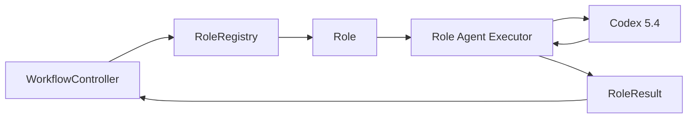
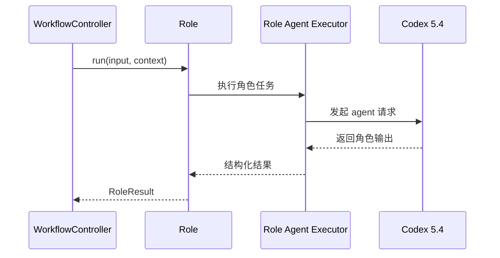

# Default Workflow Role Codex Agent PRD

## 文档信息

| 字段 | 内容 |
|------|------|
| 模块名 | `default-workflow-role-codex-agent` |
| 本文范围 | `default-workflow` 角色运行时的 Codex Agent 执行约束 |
| 文档路径 | `roleflow/clarifications/0.1.0/default-workflow-role-codex-agent-prd.md` |
| 直接使用者 | AegisFlow 开发者、Planner、Builder |
| 信息来源 | 用户新增需求、`roleflow/clarifications/0.1.0/default-workflow-role-layer-prd.md`、用户提供的示例语义 |

## Background

当前 `Role` 层 PRD 已经定义了“角色必须是 Agent”的公共约束，但尚未单独固定“角色 Agent 到底通过哪类运行时执行”的实现级需求。

用户新增要求如下：

- 所有角色都通过特定的 AI Agent 运行，而不是直接调用通用大模型
- `v0.1` 的角色统一先使用 `codex 5.4`
- 用户提供的示例代码只作为运行语义参考，不应原样写入 PRD

这是一条新增需求，不应回写或改写原有 `project.md`、既有 role-layer PRD 与既有 plan 的原始需求定义。

## Goal

本 PRD 的目标是新增一份独立需求文档，明确 `default-workflow` 角色运行时应满足的 Codex Agent 约束，使系统能够：

1. 让所有 `v0.1` 角色通过统一的角色 Agent 执行器运行。
2. 明确 `v0.1` 角色 Agent 的模型统一为 `codex 5.4`。
3. 固定角色 Agent 的共享配置入口和最小环境变量约束。
4. 保持该需求作为新增文档存在，而不是覆盖原有 role-layer 公共需求文档。

## In Scope

- `default-workflow` 角色运行时的 Agent 执行方式
- `v0.1` 角色统一使用 `codex 5.4`
- 角色 Agent 的共享配置入口
- 角色 Agent 执行器与 `Role.run(...)` 的关系
- 角色 Agent 最小环境变量约束

## Out of Scope

- 修改 `project.md` 原始架构定义
- 覆盖或重写既有 role-layer PRD
- Intake 层模型选型
- 非 `v0.1` 角色的模型策略
- 示例代码原文收录

## 已确认事实

- 该需求是新增需求，不应直接改写原有文档
- 所有角色都使用特定的 AI Agent 运行
- `v0.1` 角色统一先使用 `codex 5.4`
- 用户给出的代码示例只作为运行语义参考，不作为 PRD 正文内容

## 需求总览

## 执行关系图

## Functional Requirements

### FR-1 所有角色必须通过统一的角色 Agent 执行器运行

- `default-workflow` 中的所有角色都必须通过统一的角色 Agent 执行器运行。
- 角色执行器属于角色运行链路的一部分，而不是可选分支。
- 角色运行不得退化为直接把 prompt 发给通用大模型聊天接口。

### FR-2 `v0.1` 角色模型固定为 `codex 5.4`

- `v0.1` 范围内的角色 Agent 模型必须统一为 `codex 5.4`。
- 本期不在角色之间区分不同模型。
- 若后续版本需要支持多模型，必须作为后续新增需求处理。

### FR-3 角色 Agent 配置必须集中管理

- 角色 Agent 的模型名、服务地址、鉴权信息必须通过共享配置入口统一注入。
- 角色不得各自独立决定模型或独立拼装底层请求。
- 共享配置入口至少应覆盖：
  - `OPENAI_API_KEY`
  - `AEGISFLOW_ROLE_CODEX_BASE_URL`
  - `AEGISFLOW_ROLE_CODEX_MODEL`

### FR-4 角色执行器与 `Role.run(...)` 的边界必须清晰

- `Workflow` 仍通过 `Role.run(input, context)` 调用角色。
- 角色内部再委托统一的角色 Agent 执行器完成 Agent 请求。
- `RoleResult` 仍然是 `Workflow` 消费的公共返回对象，本需求不改变 `RoleResult` 的既有公共定义。

### FR-5 示例代码只提供语义参考，不进入 PRD 正文

- 用户提供的示例代码只用于说明“通过特定 Agent 客户端调用 Codex 模型”的目标语义。
- PRD 中不得直接粘贴该示例代码。
- PRD 只抽取可验证的需求约束，不固化示例代码中的实现细节。

## Constraints

- 仅覆盖 `v0.1`
- 所有角色统一通过角色 Agent 执行器运行
- `v0.1` 统一使用 `codex 5.4`
- 该需求必须作为新增文档存在
- 不修改原有 `project.md`
- 不将用户示例代码原文写入 PRD

## Acceptance

- 存在一份独立的角色 Codex Agent 需求文档
- 文档明确“所有角色通过统一角色 Agent 执行器运行”
- 文档明确“`v0.1` 统一使用 `codex 5.4`”
- 文档明确角色 Agent 的最小共享配置入口
- 文档明确该需求不覆盖原有 `project.md` 与既有 role-layer PRD
- 文档未直接收录用户提供的示例代码

## Risks

- 若角色执行器与既有 role-layer 初始化链路边界不清晰，后续实现时容易出现双套执行链路
- 若 `codex 5.4` 的配置入口没有集中管理，角色实现可能再次分叉
- 若后续有人把本需求回写进原始架构文档，文档层级会再次混淆

## Open Questions

- 无

## Assumptions

- 无
