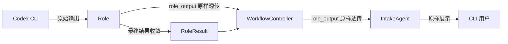
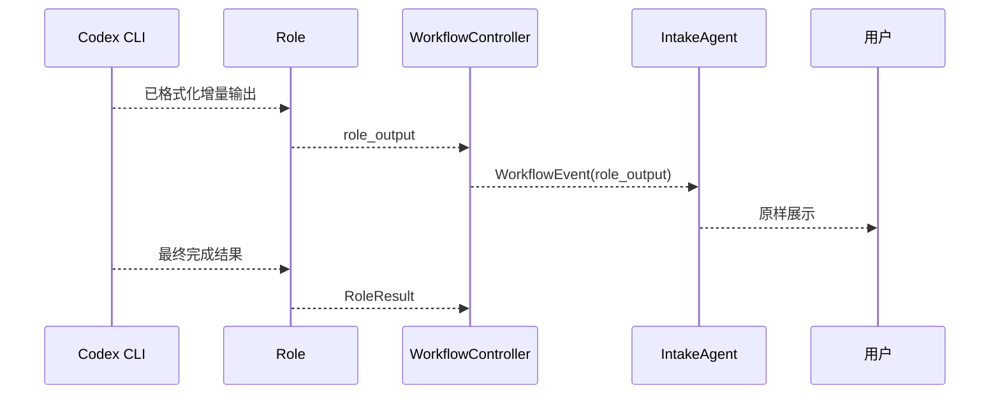

# Default Workflow Role Codex CLI Output Passthrough PRD

## 文档信息

| 字段 | 内容 |
|------|------|
| 模块名 | `default-workflow-role-codex-cli-output-passthrough` |
| 本文范围 | `default-workflow` 中 Codex CLI 角色输出到 `Intake` 的原样透传约束 |
| 文档路径 | `roleflow/clarifications/0.1.0/default-workflow-role-codex-cli-output-passthrough-prd.md` |
| 直接使用者 | AegisFlow 开发者、Planner、Builder |
| 信息来源 | 用户新增需求、`roleflow/clarifications/0.1.0/default-workflow-role-codex-cli-prd.md`、`roleflow/clarifications/0.1.0/default-workflow-cli-streaming-output-prd.md`、用户澄清结论 |

## Background

当前系统已经有两类相关需求文档：

- `default-workflow-role-codex-cli-prd.md`：约束角色通过 Codex CLI 运行
- `default-workflow-cli-streaming-output-prd.md`：约束 CLI 输出要支持流式展示

但这两份文档此前都没有单独固定一个更强的新约束：

- 当 `Role` 层通过 Codex CLI 运行时，其输出到 `Intake` 的内容和格式都必须原样透传
- `Intake` 不应对这部分内容做抽取、修改、重排或二次排版

这是一条新增需求，应以新增 PRD 的方式并存，而不是回写、改写或覆盖既有需求文档。

## Goal

本 PRD 的目标是明确 `default-workflow` 中 Codex CLI 角色输出到 `Intake` 的展示边界，使系统能够：

1. 将 Codex CLI 已生成的内容与格式原样展示给用户。
2. 保证 `Workflow` 与 `Intake` 只承担转发职责，而不重新加工角色输出。
3. 避免展示层破坏 Codex CLI 自带的结构、换行、列表和代码块边界。
4. 让该需求作为独立新增文档存在，而不是污染既有流式输出 PRD 或角色 CLI PRD。

## In Scope

- Codex CLI 角色输出到 `Intake` 的展示语义
- `Workflow -> Intake` 对 Codex CLI `role_output` 的转发边界
- “原样透传”对内容、格式和顺序的约束
- 与最终 `RoleResult` 的职责边界

## Out of Scope

- `RoleResult` 结构定义
- `Workflow` 状态机
- Intake 对非角色输出事件的展示美化策略
- Codex CLI 内部输出格式如何生成
- 图形化 UI 或 TUI

## 已确认事实

- 这是新增需求，需要新增文档，而不是修改旧的需求文档
- `Role` 层通过 Codex CLI 输出到 `Intake` 的内容和格式都应原样透传
- `Intake` 看到的内容应是经过 Codex CLI 格式化后的内容
- `Workflow` 与 `Intake` 不应对这类输出做任何抽取、修改、重排或二次排版
- `RoleResult` 仍然保留，继续供 `Workflow` 作为最终结果消费

## 需求总览

## 边界时序图

## Functional Requirements

### FR-1 Codex CLI 的 `role_output` 必须原样透传

- 当 `role_output` 来源于 Codex CLI 时，`Workflow` 与 `Intake` 必须按原样透传其内容与格式。
- “原样透传”包括：
  - 文本内容不改写
  - 换行不改写
  - 段落边界不改写
  - 列表结构不改写
  - 代码块边界不改写
  - 输出顺序不改写

### FR-2 不得对 Codex CLI 输出做二次加工

- 对于来源于 Codex CLI 的 `role_output`，不得做以下处理：
  - 摘要抽取
  - 文案改写
  - 段落重排
  - 列表重写
  - 代码块重包裹
  - 空白字符归一化
  - 富文本再格式化
  - 基于展示目的的内容删减

### FR-3 Intake 对 Codex CLI 输出只负责正确显示

- `Intake` 对来源于 Codex CLI 的 `role_output`，职责仅限于正确显示。
- 这里的“正确显示”指：
  - 不把 `\n` 当成普通字符直接显示
  - 不打乱消息顺序
  - 不丢失已有格式边界
- 这里的“正确显示”不包含重新生成新的展示格式。

### FR-4 Workflow 对 Codex CLI 输出只负责转发

- `Workflow` 对来源于 Codex CLI 的 `role_output` 只负责转发给 `Intake`。
- `Workflow` 不应在事件封装过程中重新解释或重写其文本内容。
- 若事件对象需要附带元信息，元信息不得改变 `message` 本体。

### FR-5 原样透传与 `RoleResult` 必须并存

- Codex CLI 的流式可见输出与最终 `RoleResult` 是两层语义，二者必须并存。
- 原样透传的 `role_output` 用于用户实时可见反馈。
- `RoleResult` 继续作为 `Workflow` 的最终消费对象。
- 不应因为要求原样透传，就把 Codex CLI 的原始输出直接当作最终 `RoleResult` 使用。

### FR-6 本需求以新增 PRD 方式并存

- 本需求必须以新增 PRD 的方式存在。
- 不用本需求回写或覆盖既有：
  - `default-workflow-role-codex-cli-prd.md`
  - `default-workflow-cli-streaming-output-prd.md`
- 若后续需要把这些需求统一重构，应作为新的文档整理任务处理，而不是在当前需求下直接改写旧文档。

## Constraints

- 仅覆盖 `v0.1`
- 仅针对来源于 Codex CLI 的 `role_output`
- 不改写既有 PRD 的原始需求语义
- 不改变 `RoleResult` 的既有公共边界

## Acceptance

- 存在一份独立的新 PRD，用于描述 Codex CLI 输出原样透传需求
- 文档明确规定 Codex CLI 的 `role_output` 内容和格式必须原样透传到 `Intake`
- 文档明确规定 `Workflow` 与 `Intake` 不得对这类输出做抽取、修改、重排或二次排版
- 文档明确规定该需求与最终 `RoleResult` 并存，不替代 `RoleResult`
- 文档明确规定该需求以新增文档形式存在，而不是修改旧 PRD

## Risks

- 如果后续实现继续沿用展示层二次排版思路，会直接违反本需求
- 如果 `WorkflowEvent.message` 在封装时被重写，用户看到的将不再是 Codex CLI 的真实输出
- 如果实现把原始 `role_output` 与最终 `RoleResult` 混用，可能造成重复展示和职责混乱

## Open Questions

- 无

## Assumptions

- 无
