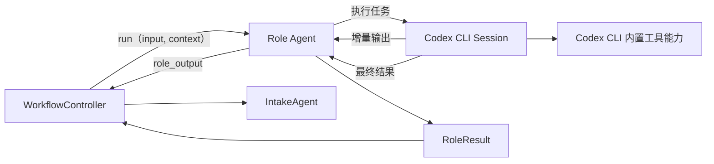
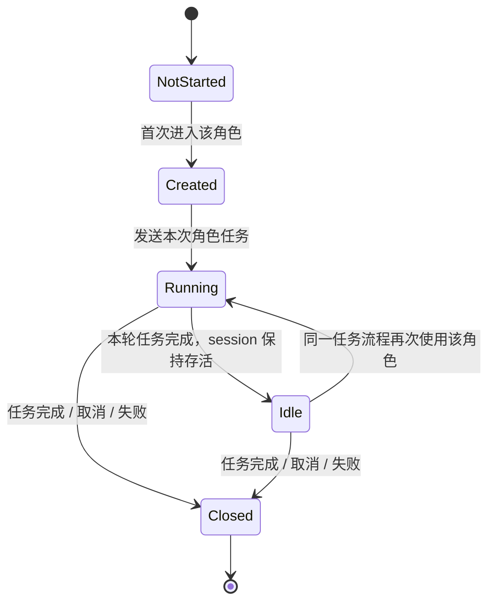
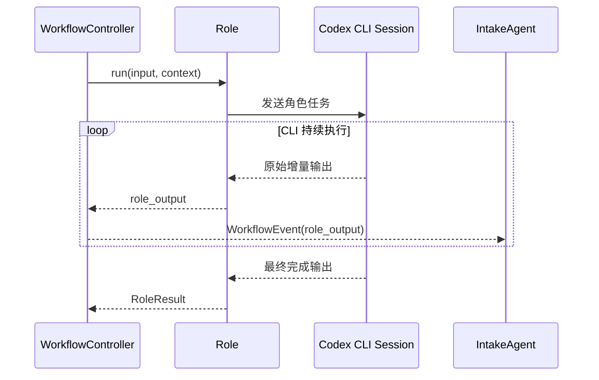
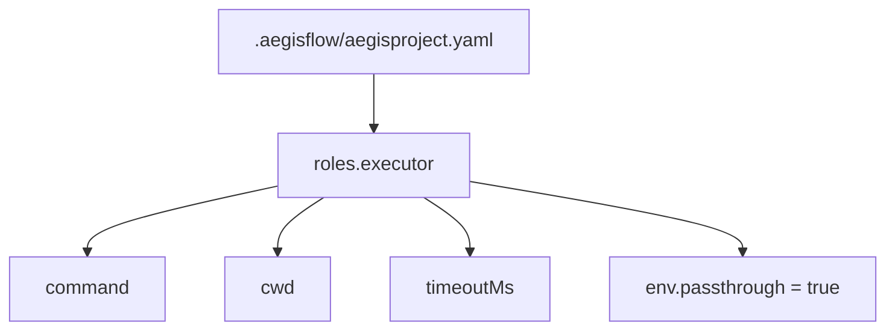

# Default Workflow Role Codex CLI PRD

## 文档信息

| 字段 | 内容 |
|------|------|
| 模块名 | `default-workflow-role-codex-cli` |
| 本文范围 | `default-workflow` 的 `Role` 层通过 Codex CLI 运行的执行约束 |
| 文档路径 | `roleflow/clarifications/0.1.0/default-workflow-role-codex-cli-prd.md` |
| 直接使用者 | AegisFlow 开发者、Planner、Builder |
| 信息来源 | 用户新增需求、`roleflow/context/project.md`、`roleflow/clarifications/0.1.0/default-workflow-role-layer-prd.md`、`roleflow/clarifications/0.1.0/default-workflow-cli-streaming-output-prd.md`、用户澄清结论 |

## Background

当前 `default-workflow` 已经有一份独立的 [`default-workflow-role-codex-agent-prd.md`](default-workflow-role-codex-agent-prd.md)，用于描述“角色通过 Codex Agent 运行”的约束。但那份文档聚焦的是角色执行由 Codex 承担，并没有把“执行介质必须是 Codex CLI，而不是直接走模型 SDK / API 调用”单独固定下来。

用户新增要求如下：

- 这是新增需求，需要与既有 `default-workflow-role-codex-agent-prd.md` 并存，不替换旧文档
- `Role` 层的每个 Agent 实际上都通过 `codex` CLI 运行，而不是直接调用 Codex 模型 API
- 采用 Codex CLI 的核心原因是复用其已有工具能力，避免在 AegisFlow 内部重复实现文件读写、代码搜索、Git 等通用工具
- 每个 `Role` 在一个任务流程内维持自己的长期 CLI session
- `Role` 执行时需要同时保留两层输出：
  - 面向用户的原始/增量 CLI 输出，持续展示到 `Intake`
  - 面向 `Workflow` 的最终 `RoleResult`
- `RoleResult` 对 `Workflow` 的公共契约保持不变
- 相关配置写入 `.aegisflow/aegisproject.yaml`

因此需要新增一份 PRD，把 `Role` 层的 CLI 化执行链路单独收敛为明确需求。

## Goal

本 PRD 的目标是明确 `default-workflow` 的 `Role` 层如何通过 Codex CLI 运行，使系统能够：

1. 让角色执行链路明确走 `codex` CLI，而不是项目自己直连底层模型接口。
2. 在单个任务流程中，为每个角色维持长期复用的 CLI session。
3. 让 CLI 的增量输出实时透传到 `Intake` 层，同时保留最终 `RoleResult` 给 `Workflow` 消费。
4. 把与 CLI 运行相关的最小配置固定到 `.aegisflow/aegisproject.yaml`。
5. 以“复用成熟 CLI 能力、避免重复造工具”为原则约束本期实现方向。

## In Scope

- `Role` 层通过 Codex CLI 运行的执行语义
- 单任务内、单角色级别的长期 CLI session 约束
- `Role -> Workflow -> Intake` 的 CLI 原始输出透传要求
- CLI 最终结果到 `RoleResult` 的边界
- `.aegisflow/aegisproject.yaml` 中与角色 CLI 执行有关的最小配置
- “复用 Codex CLI 自带工具能力”的设计原则

## Out of Scope

- Intake 层模型初始化与模型选型
- `Workflow` 层状态机细节
- `RoleResult` 类型结构重定义
- Codex CLI 内部工具如何实现
- 非 `default-workflow` 的执行后端
- 是否跨进程恢复同一个底层 CLI session 的实现细节

## 已确认事实

- 这是一份新增 PRD，需要与既有 `default-workflow-role-codex-agent-prd.md` 并存
- `Role` 层执行不应直接调用模型 API，而应直接调用 `codex` CLI
- 使用 Codex CLI 的原则是复用其现成工具能力，避免在 AegisFlow 中重复实现读写文件、搜索代码、Git 等通用工具
- 每个角色在一个任务流程中都维持自己的长期 CLI session
- `Role` 执行需要分成两层输出：
  - 原始/增量 CLI 输出，实时展示到 `Intake`
  - 最终 `RoleResult`，继续供 `Workflow` 消费
- `Workflow` 消费 `RoleResult` 的公共方式不变
- 配置写入 `.aegisflow/aegisproject.yaml`
- 流式输出在本需求中视为固定开启，不作为可选开关
- 环境变量按透传方式交给 Codex CLI

## 需求总览

## Session 生命周期图

## 输出双层关系图

## 配置关系图

## Functional Requirements

### FR-1 Role 执行必须通过 Codex CLI，而不是直接调用模型 API

- `default-workflow` 的角色执行链路必须通过 `codex` CLI 进程完成。
- 角色运行不得退化为项目内部直接调用模型 SDK、Responses API 或聊天接口。
- 本需求描述的是角色执行介质；至于角色使用哪个 Codex 模型，沿用其他既有文档约束，不在本文重复展开。

### FR-2 系统必须优先复用 Codex CLI 的现成工具能力

- 采用 Codex CLI 的首要原则是复用其已有能力，而不是在 AegisFlow 内部重复实现同类工具。
- 本期至少包括以下通用能力的复用导向：
  - 文件读取
  - 文件写入
  - 代码搜索
  - Git 相关操作
- 若某项能力已经可由 Codex CLI 稳定提供，AegisFlow 本期不应为了角色执行再额外实现一套等价工具链。

### FR-3 每个角色在单个任务流程中必须复用长期 CLI session

- 同一个任务流程内，每个角色都应拥有自己的长期 CLI session。
- 同一个角色在该任务流程内被再次调用时，应优先复用已有 session，而不是每次重新拉起全新的短生命周期进程。
- 不同角色之间的 session 相互独立，不共享上下文。
- 任务完成、取消或失败后，对应角色 session 应结束。

### FR-4 CLI 增量输出必须实时透传到 Intake

- 角色通过 Codex CLI 执行时产生的用户可见增量输出，必须持续透传到 `Workflow`，再由 `Workflow` 转发到 `Intake`。
- `Role` 不得直接写 CLI。
- 不允许只消费最终结果而吞掉执行中的 CLI 输出。
- 该要求与现有 CLI 流式输出 PRD 一致，在角色 CLI 场景下属于强约束。

### FR-5 最终 `RoleResult` 契约必须保持不变

- `Workflow` 继续通过 `RoleResult` 消费角色的最终结果。
- 新增 Codex CLI 执行后端，不得迫使 `Workflow` 改用 CLI 原始输出作为最终结果来源。
- CLI 的原始输出与最终 `RoleResult` 是两层不同语义：
  - 原始输出用于用户实时可见反馈
  - `RoleResult` 用于工作流编排、工件写入和后续阶段输入

### FR-6 Role 层必须承担 CLI 输出到 `RoleResult` 的收敛职责

- `Workflow` 只消费 `Role.run(...)` 返回的 `RoleResult`，不直接解析 Codex CLI 的最终文本。
- 角色内部必须负责把 CLI 最终结果收敛为符合既有契约的 `RoleResult`。
- 该收敛过程可以依赖角色自己的输出约定，但不能把解析责任外溢给 `Workflow`。

### FR-7 角色 CLI 执行配置必须进入 `.aegisflow/aegisproject.yaml`

- 与角色 CLI 执行有关的配置必须放在 `.aegisflow/aegisproject.yaml` 中，而不是散落在代码常量里。
- 最小必需配置至少包括：
  - CLI 命令
  - 工作目录
  - 超时时间
  - 环境变量透传策略
- 流式输出固定开启，不要求提供单独配置开关。

### FR-8 环境变量必须按透传语义提供给 Codex CLI

- 角色 CLI 执行时，需要把当前运行环境中的环境变量透传给 Codex CLI。
- 本期不要求在 AegisFlow 内为角色 CLI 单独设计复杂的环境变量映射层。
- 若后续需要做环境变量白名单、覆写或隔离，应作为新增需求单独定义。

### FR-9 新增 PRD 与既有 Codex Agent PRD 必须并存

- 本 PRD 是对角色执行介质的新增约束，不替换既有 `default-workflow-role-codex-agent-prd.md`。
- 若阅读者需要理解“为什么角色是 Codex Agent”，看既有 PRD。
- 若阅读者需要理解“角色 Agent 通过什么介质运行”，看本文。

## Constraints

- 仅覆盖 `v0.1`
- 只约束 `default-workflow` 的角色执行链路
- 不修改 `RoleResult` 对 `Workflow` 的公共契约
- 流式输出固定开启
- 环境变量按透传处理
- 不把 Codex CLI 的内部工具实现细节固化进 AegisFlow

## Acceptance

- 存在一份独立的角色 Codex CLI 需求文档，并与既有角色 Codex Agent 文档并存
- 文档明确规定角色执行走 `codex` CLI，而不是直接模型 API
- 文档明确规定单任务内、单角色长期 CLI session 的语义
- 文档明确规定 CLI 原始增量输出需要展示到 `Intake`
- 文档明确规定最终仍由 `RoleResult` 作为 `Workflow` 的消费对象
- 文档明确规定 `.aegisflow/aegisproject.yaml` 中的最小角色 CLI 配置边界
- 文档明确规定“优先复用 Codex CLI 工具能力、避免重复实现通用工具”这一原则

## Risks

- 如果长期 session 的生命周期边界不清晰，实现时容易退化回“一次调用一个短进程”
- 如果 CLI 原始输出和最终 `RoleResult` 的职责不清晰，可能导致重复展示或重复解析
- 如果项目侧又重新补一套文件/Git/搜索工具，AegisFlow 的实现复杂度和维护成本会明显上升

## Open Questions

- 无

## Assumptions

- 无
