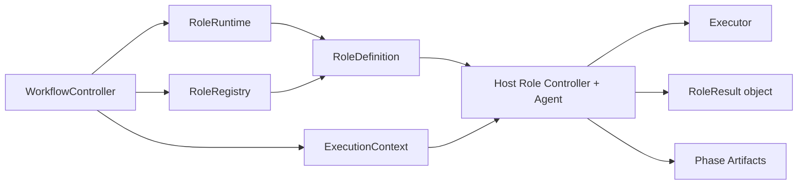
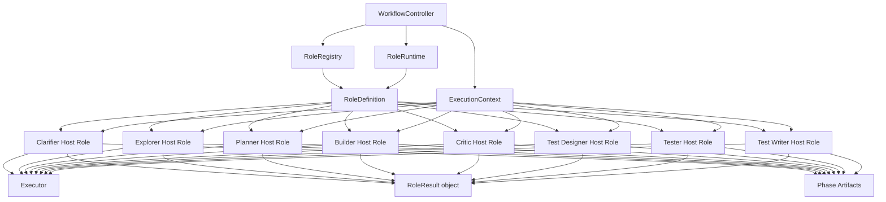
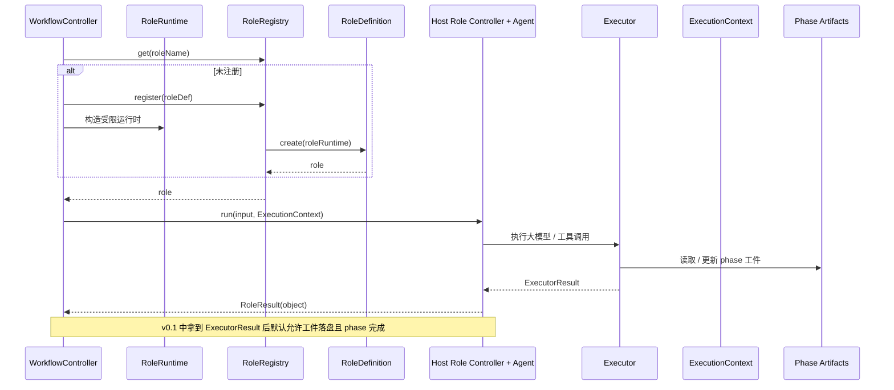
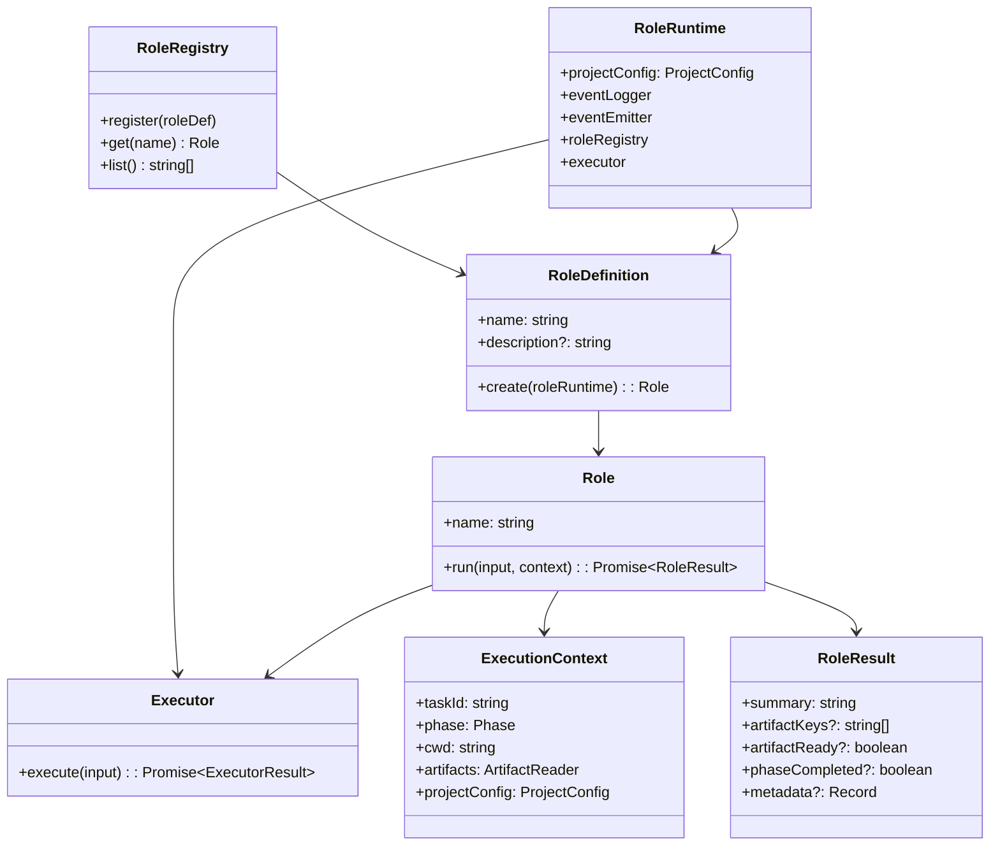

# Default Workflow Role 层 PRD

## 文档信息

| 字段 | 内容 |
|------|------|
| 模块名 | `default-workflow-role-layer` |
| 本文范围 | `default-workflow` 的 `Role` 层公共需求 |
| 文档路径 | `roleflow/clarifications/0.1.0/default-workflow-role-layer-prd.md` |
| 直接使用者 | AegisFlow 开发者、Planner、Builder |
| 信息来源 | `roleflow/context/project.md`、`roleflow/context/roles/`、用户澄清结论 |

## Background

AegisFlow 通过将需求澄清、探索、规划、实现、审查、测试设计、单测编写等工作拆分给不同专职角色，降低单个 Agent 上下文污染和越权执行的风险。

在该架构中，`Role` 层不是简单的函数集合，而是一组由 `WorkflowController` 驱动的 `Host Role Controller + Agent`。每个 phase 的主持人由 `workflow.phases[*].hostRole` 指定。`Workflow` 负责编排和状态推进，`Role` 负责调用 `Executor`、维护本 phase 工件、在必要时产生副作用，并返回对“工件是否可以落盘”“当前 phase 是否结束”的判断。`v0.1` 中该判断先退化为：拿到一次 `Executor` 结果后，直接视为当前 phase 可以结束。

## Goal

本 PRD 的目标是明确 `default-workflow` 中 `Role` 层的公共需求边界，使其能够：

1. 以 Agent 形式承接 `Workflow` 下发的阶段任务。
2. 通过统一的 `RoleRuntime / RoleRegistry / RoleDefinition / Role / ExecutionContext / RoleResult` 模型接入工作流。
3. 将各具体角色的职责边界与 `roleflow/context/roles/` 中的现有约束对齐。
4. 允许角色执行必要副作用，并维护自己对应 phase 的工件。
5. 在 `v0.1` 范围内为 `Clarifier`、`Explorer`、`Planner`、`Builder`、`Critic`、`Test Designer`、`Tester`、`Test Writer` 提供统一运行基础。

## In Scope

- `RoleRegistry`
- `RoleDefinition`
- `Role`
- `RoleRuntime`
- `Executor`
- `ExecutionContext`
- `RoleResult`
- `hostRole` 作为 phase 主持人的角色语义
- `Workflow -> RoleRegistry -> Role` 的公共调用关系
- 角色作为 Agent 的强约束
- 角色公共输入输出边界
- 角色副作用边界
- 角色维护工件与阶段判断的公共边界
- 当前 `v0.1` 角色集合与 `roleflow/context/roles/` 的职责映射

## Out of Scope

- `WorkflowController` 的状态机与 phase 编排细节
- `Intake` 层的用户交互与自然语言识别
- 每个角色内部 prompt、推理策略、工具调用细节
- 具体 artifact 模板内容
- `Archivist`、`Architect`、`Chat`、`Commit Writer`、`Weekly Reporter` 等当前本文范围外角色
- 代码级类设计、目录结构和具体文件实现

## 已确认事实

以下内容来自 `roleflow/context/project.md`，在本文中视为已确认事实：

- `Role` 层都是 `Host Role Controller + Agent`
- `Role` 层接受 `Workflow` 层指令执行任务
- `Role` 层可以产生副作用，例如修改代码、修改单测
- `Role` 层维护自己对应 phase 的工件
- `Role` 层返回执行任务结果，其中至少需要表达工件是否可以落盘、phase 是否可以结束
- `RoleRegistry` 用于管理所有角色，是一个角色工厂
- `Workflow` 使用角色时从 `RoleRegistry` 获取；如无则重新注册
- `RoleDefinition` 通过 `create(roleRuntime)` 创建角色实例
- `ProjectConfig` 当前包含 `targetProjectRolePromptPath`
- `ProjectConfig.workflowPhases[*].hostRole` 用于指定每个 phase 的主持人角色
- `Role` 至少包含：
  - `name`
  - `run(input: any, context: ExecutionContext): Promise<RoleResult>`
- `ExecutionContext` 至少包含：
  - `taskId`
  - `phase`
  - `cwd`
  - `artifacts`
  - `projectConfig`

## 用户补充约束

以下内容由用户澄清后明确追加：

- 本文只覆盖 `v0.1`
- `RoleRegistry`、`RoleDefinition`、`Role`、`ExecutionContext`、`RoleResult` 都要作为明确需求对象写入
- “角色是 Agent”是强约束，而不是可选实现方式
- 角色的 Agent 配置可以参考 `src/default-workflow/intake/model.ts` 中的 `initializeIntakeModel`
- 参考 `initializeIntakeModel` 时，需要去掉 `temperature` 设置
- 本期必须保留 `RoleResult` 这个类型名，但允许将其定义为结构化结果对象
- `RoleResult` 需要从当前“可写入 md 文件的 string”口径，收敛为结构化结果对象，以适配 `Workflow` 对角色返回结果的消费
- `targetProjectRolePromptPath` 需要恢复并进入本期 `Role` 层需求范围，参与角色 prompt 组装
- `RoleDefinition.create` 的入参以 `RoleRuntime` 为准，而不是完整 `Runtime`
- `ExecutionContext.artifacts` 以只读工件视图为准，而不是完整 `ArtifactManager`
- `targetProjectRolePromptPath` 的运行时值等价于 `roles.promptDir` 加载后的目录值
- 若配置了 `roles.overrides.*.extraInstructions`，则 override 文件优先于默认同名文件解析
- 角色可以有副作用，需要写成明确需求
- 每个 phase 的 `hostRole` 都是一个 `controller + agent` 角色
- `hostRole` 本身不直接承担生成工作，只做简单判断：工件是否可以落盘、phase 是否结束
- `hostRole` 使用的所有大模型 / 工具能力在 `v0.1` 中都依赖 `Executor`
- `v0.1` 中 `hostRole` 不需要复杂判断，只要 `Executor` 执行返回结果，就直接判断 phase 结束
- 验收需要同时覆盖：
  - `Workflow -> Role` 调用边界
  - `RoleRegistry` 注册/获取机制
  - `ExecutionContext` 输入边界
  - `RoleResult` 与工件职责边界

## 角色目录映射

当前 `roleflow/context/roles/` 中与本文直接相关的角色约束来源如下：

| 角色概念 | 当前实例层文件 | 用途 |
|------|------|------|
| `Clarifier` | `roleflow/context/roles/clarifier.md` | 需求澄清 / PRD |
| `Explorer` | `roleflow/context/roles/explorer.md` | 代码探索 / exploration |
| `Planner` | `roleflow/context/roles/planner.md` | 方案与 implementation plan |
| `Builder` | `roleflow/context/roles/builder.md` | 实现代码与交付说明 |
| `Critic` | `roleflow/context/roles/critic.md` | 当前仓库中的审查职责入口 |
| `Test Designer` | `roleflow/context/roles/test-designer.md` | 测试设计与验证清单 |
| `Tester` | `roleflow/context/roles/tester.md` | 测试执行 |
| `Test Writer` | `roleflow/context/roles/test-writer.md` | 单测编写 |

说明：

- `Critic` 在 `project.md` 中是概念角色；当前 `roleflow/context/roles/` 中与其对应的实例层文件为 `critic.md`
- 本文按现有仓库目录事实引用角色职责，不扩展 `archivist`、`architect` 等范围外角色

## 需求总览

## 整体关系图

## 运行时序图

## 对象模型图

## Functional Requirements

### FR-1 Role 层必须由 Host Role Controller + Agent 构成

- `Role` 层的角色必须以 `Host Role Controller + Agent` 形式存在。
- 每个 phase 的主持人必须由 `workflow.phases[*].hostRole` 指定。
- “角色是 Agent”属于强约束，不允许在本期将角色降级为普通无 Agent 能力的静态处理器来替代。
- 角色作为 Agent 时，仍必须服从 `Workflow` 编排，而不是自行决定工作流状态机。

### FR-2 RoleRegistry 作为角色工厂

- `RoleRegistry` 必须作为角色管理与获取入口存在。
- `RoleRegistry` 必须至少支持：
  - `register(roleDef)`
  - `get(name)`
  - `list()`
- `Workflow` 使用角色时，必须通过 `RoleRegistry` 获取，而不是绕过注册表直接实例化角色。

### FR-3 RoleDefinition 作为角色蓝图

- `RoleDefinition` 必须用于描述角色蓝图。
- `RoleDefinition` 必须至少包含：
  - `name`
  - `description?`
  - `create(roleRuntime): Role`
- `create(roleRuntime)` 必须作为角色实例化入口。

### FR-3A RoleRuntime 作为受限初始化运行时

- 本期必须引入 `RoleRuntime` 作为角色初始化时可见的受限运行时视图。
- `RoleRuntime` 必须替代完整 `Runtime` 成为 `RoleDefinition.create(...)` 的入参。
- `RoleRuntime` 的目标是为角色初始化提供必要共享依赖，同时避免把 `taskState`、`workflow` 等不应暴露给角色初始化阶段的对象泄漏到 Role 层。
- `RoleRuntime` 必须向角色提供统一的 `Executor`。

### FR-4 Role 统一执行接口

- 每个具体角色必须实现统一的 `Role` 接口。
- `Role` 必须至少包含：
  - `name`
  - `run(input, context): Promise<RoleResult>`
- `run` 必须作为角色执行入口，由 `Workflow` 调用。

### FR-4A Executor 作为 Role 的统一能力入口

- 本期必须存在统一的 `Executor`，作为 `Host Role` 访问大模型与工具能力的唯一入口。
- `hostRole` 使用的读写文件、查询、调用外部 Agent CLI 等能力，在 `v0.1` 中都必须依赖 `Executor`。
- `Role` 层不得绕过 `Executor` 另起一套独立的大模型或工具接入链路。

### FR-5 ExecutionContext 统一输入边界

- `Workflow` 在调用角色时，必须提供统一的 `ExecutionContext`。
- `ExecutionContext` 至少应包含：
  - `taskId`
  - `phase`
  - `cwd`
  - `artifacts`
  - `projectConfig`
- `ExecutionContext.artifacts` 必须是只读工件视图，而不是完整 `ArtifactManager`。
- 角色应通过 `ExecutionContext` 获取运行上下文，而不是直接依赖 `Workflow` 内部状态对象。

### FR-6 RoleResult 类型保留且本期为结构化结果对象

- 本期必须保留 `RoleResult` 这个类型名。
- 本期 `RoleResult` 必须统一定义为结构化结果对象，而不是 `string`。
- `RoleResult` 至少应包含：
  - `summary`
  - `artifactReady?`
  - `phaseCompleted?`
  - `metadata?`
- `RoleResult.artifactKeys` 若存在，必须用于标识当前角色已维护或更新过的工件，而不是承载 md 文本正文。
- `RoleResult.artifactReady` 必须用于表达当前工件是否允许落盘。
- `RoleResult.phaseCompleted` 必须用于表达当前 phase 是否可以结束。
- `v0.1` 中允许将“`Executor` 已返回结果”直接映射为 `artifactReady = true` 与 `phaseCompleted = true`。
- 角色返回结果必须能够被 `Workflow` 直接接收并用于后续状态推进、事件记录与结果消费。

### FR-7 工件职责边界

- 每个角色必须维护自己对应 phase 的工件。
- `hostRole` 可以决定当前工件是否允许落盘。
- 工件的具体读写、查询和更新动作，在 `v0.1` 中必须通过 `Executor` 完成。
- `Workflow` 不负责生成工件内容，但仍负责基于 `RoleResult` 推进状态与记录事件。

### FR-8 角色副作用边界

- 角色可以产生副作用，这属于明确需求，而不是例外情况。
- 允许的副作用包括但不限于：
  - `Builder` 修改代码
  - `Test Writer` 添加或修改单元测试
  - `Test Designer` 插入或删除调试打印语句
  - `Tester` 执行测试阶段任务并产出测试执行结果
- 这些副作用在 `v0.1` 中同样必须通过 `Executor` 发生。
- `hostRole` 本身不直接承担具体生成工作，只负责围绕 `Executor` 结果做简单判断。
- 角色的副作用必须服从各自职责边界，不能借副作用越权承担其他角色职责。

### FR-9 Workflow -> Role 调用边界

- `Workflow` 层负责调用角色，角色不负责编排 phase。
- 角色收到的输入应来自 `Workflow`，而不是直接来自用户。
- `Workflow` 调用的角色必须是当前 phase 的 `hostRole`。
- 角色执行完成后，应将结果返回给 `Workflow`，再由 `Workflow` 决定事件和状态推进。

### FR-10 Runtime 参与角色实例化

- 角色实例化必须允许使用运行时提供的共享依赖作为输入。
- `RoleDefinition.create(roleRuntime)` 必须能够基于当前 `RoleRuntime` 创建具体角色实例。
- 角色实例化过程中需要的共享依赖应通过 `RoleRuntime` 提供，而不是散落在 `Workflow` 调用链中。

### FR-10A targetProjectRolePromptPath 参与角色 prompt 组装

- `ProjectConfig.targetProjectRolePromptPath` 必须进入本期 `Role` 层需求范围。
- `ProjectConfig.targetProjectRolePromptPath` 的运行时值等价于 `roles.promptDir` 加载后的目录值。
- 角色 prompt 组装必须允许读取目标项目目录下的角色额外提示词。
- 角色 prompt 组装至少应包含两层来源：
  - 角色原型职责文档
  - `targetProjectRolePromptPath` 下同名角色补充提示词
- `targetProjectRolePromptPath` 下的角色提示词文件只按严格同名规则读取，例如 `planner.md`、`builder.md`、`critic.md`、`tester.md`。
- 若配置了 `roles.overrides.*.extraInstructions`，则 override 指向的文件必须优先于默认同名文件解析。
- 同名角色文件的组装方式必须是“追加”，而不是完全替换角色原型文档。
- 当目标项目下的同名角色文件与角色原型职责存在冲突时，应以目标项目下的角色职责为准。
- 当 `targetProjectRolePromptPath` 或其中某个角色文件缺失时，不应阻断角色初始化；系统应回退到角色原型职责文档。

### FR-11 角色 Agent 配置约束

- 本期角色的 Agent 配置可以参考 `src/default-workflow/intake/model.ts` 中的 `initializeIntakeModel`。
- 参考该配置时，必须去掉 `temperature` 设置。
- 角色 Agent 配置应保持统一初始化风格，避免每个角色独立发散出完全不同的基础接入方式。

### FR-12 当前 v0.1 角色集合

- 本期 `Role` 层公共机制必须至少支持以下角色接入：
  - `Clarifier`
  - `Explorer`
  - `Planner`
  - `Builder`
  - `Critic`
  - `Test Designer`
  - `Tester`
  - `Test Writer`
- 各角色的职责细节应与 `roleflow/context/roles/` 中对应实例层文件保持一致。

### FR-13 角色职责边界需对齐实例层文件

- `Clarifier` 的职责边界应对齐 `roleflow/context/roles/clarifier.md`
- `Explorer` 的职责边界应对齐 `roleflow/context/roles/explorer.md`
- `Planner` 的职责边界应对齐 `roleflow/context/roles/planner.md`
- `Builder` 的职责边界应对齐 `roleflow/context/roles/builder.md`
- `Critic` 的职责边界应对齐 `roleflow/context/roles/critic.md`
- `Test Designer` 的职责边界应对齐 `roleflow/context/roles/test-designer.md`
- `Tester` 的职责边界应对齐 `roleflow/context/roles/tester.md`
- `Test Writer` 的职责边界应对齐 `roleflow/context/roles/test-writer.md`
- 公共 `Role` 层机制不能覆盖或抹平各角色的职责差异，但必须为它们提供一致接入方式。

### FR-14 RoleRegistry 注册与获取行为清晰可验证

- 角色注册机制必须能够区分“角色蓝图定义”和“角色实例”。
- `RoleRegistry.get(name)` 返回的必须是可执行的 `Role`。
- `RoleRegistry.list()` 必须能够用于表达当前已注册角色集合。

### FR-15 Role 层不能替代 Workflow 或 Intake

- `Role` 层不能承担 `Workflow` 的状态推进职责。
- `Role` 层不能承担 `Intake` 的用户交互职责。
- `Role` 层不能自行决定任务是否进入下一 phase、等待审批或恢复执行。

## Constraints

- 仅覆盖 `v0.1`
- 角色必须是 Agent
- `RoleResult` 本期统一为结构化结果对象
- `RoleResult` 至少需要表达工件落盘判断与 phase 结束判断
- 每个角色维护自己对应 phase 的工件
- 角色可有副作用，但副作用不能越权
- 角色公共机制必须对齐 `roleflow/context/roles/` 的现有职责边界
- 角色 Agent 配置参考 `initializeIntakeModel`，但去掉 `temperature`
- `RoleDefinition.create` 本期以 `RoleRuntime` 为入参
- `ExecutionContext.artifacts` 本期以只读工件视图为准
- `hostRole` 使用的所有大模型 / 工具能力在 `v0.1` 中都依赖 `Executor`
- `targetProjectRolePromptPath` 必须参与角色 prompt 组装
- `targetProjectRolePromptPath` 的运行时值等价于 `roles.promptDir`，若存在 `roles.overrides.*.extraInstructions` 则 override 优先；默认同名文件采用严格同名读取、追加组装，冲突时项目侧优先
- 本文只描述需求，不展开具体代码实现

## Acceptance

- `Workflow -> RoleRegistry -> Role` 的公共调用边界清晰
- `RoleRegistry` 的注册、获取、列举机制清晰可验证
- `RoleDefinition`、`Role`、`ExecutionContext`、`RoleResult` 的公共接口边界清晰
- `RoleDefinition.create` 以 `RoleRuntime` 为入参，而不是完整 `Runtime`
- `RoleRuntime` 已包含统一 `Executor`，并作为角色能力入口
- `ExecutionContext` 的最小输入集合清晰且可稳定传递
- `ExecutionContext.artifacts` 是只读工件视图，而不是完整 `ArtifactManager`
- `RoleResult` 在公共层被明确定义为结构化结果对象，且与工件职责边界清晰
- `RoleResult` 能稳定表达工件落盘判断与 phase 结束判断
- 每个角色都维护自己对应 phase 的工件，且相关读写在 `v0.1` 中通过 `Executor` 完成
- 角色可以产生副作用，但不会因此越权承担 `Workflow` 或 `Intake` 职责
- 当前 `v0.1` 角色集合能够通过统一公共机制接入
- 各角色职责边界与 `roleflow/context/roles/` 对应实例文件保持一致
- 角色实例化能够通过 `RoleRuntime` 完成，且不会暴露 `taskState`、`workflow` 等对象
- 角色 Agent 配置约束能够统一落地，且不包含 `temperature` 设置
- `targetProjectRolePromptPath` 已进入角色 prompt 组装链路，缺失时存在明确 fallback
- `targetProjectRolePromptPath` 的运行时语义、override 优先规则、严格同名读取、追加组装和项目侧职责优先都已固定

## Risks

- `RoleResult` 从简单 `string` 收敛为结构化结果对象后，需要与 `Workflow` 消费边界保持同步，否则会引入跨层类型偏差
- 如果 `RoleRegistry` 的注册时机和实例缓存策略不清晰，可能导致角色重复创建或上下文不一致
- 如果公共 `Role` 层机制过度抽象，可能抹平 `Builder`、`Critic`、`Test Writer` 等角色之间本来不同的副作用边界
- 如果 `hostRole` 与 `Executor` 的职责边界不清晰，后续实现时容易再次回到“角色既生成又判断”的耦合模型
- 若 `Critic` 的原型层与项目侧文件命名后续再次漂移，可能造成角色职责映射歧义
- `RoleRuntime` 与完整 `Runtime` 的边界若不清晰，可能在实现时再次把 Workflow 内部态泄漏到 Role 初始化链路
- `targetProjectRolePromptPath` 虽已明确严格同名、追加组装和项目侧优先，但若目标项目侧内容质量不稳定，仍可能造成角色 prompt 偏移

## Open Questions

- 无

## Assumptions

- 无
