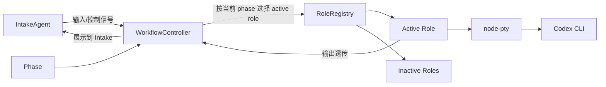
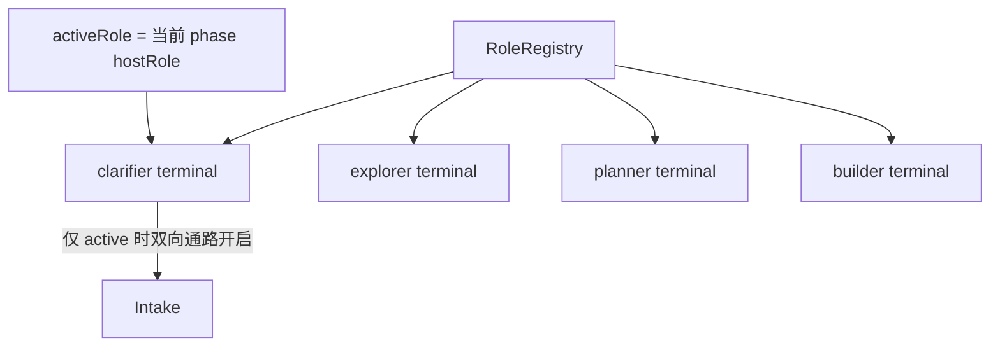
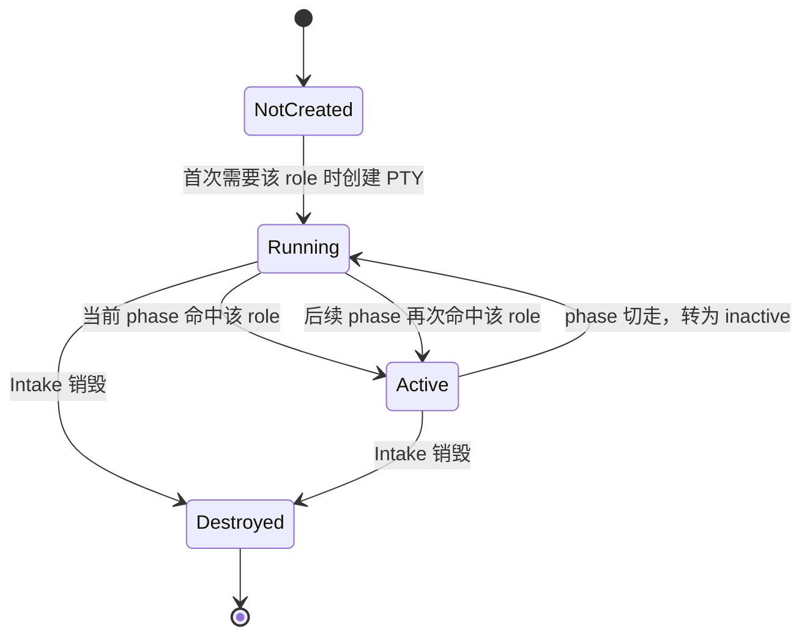
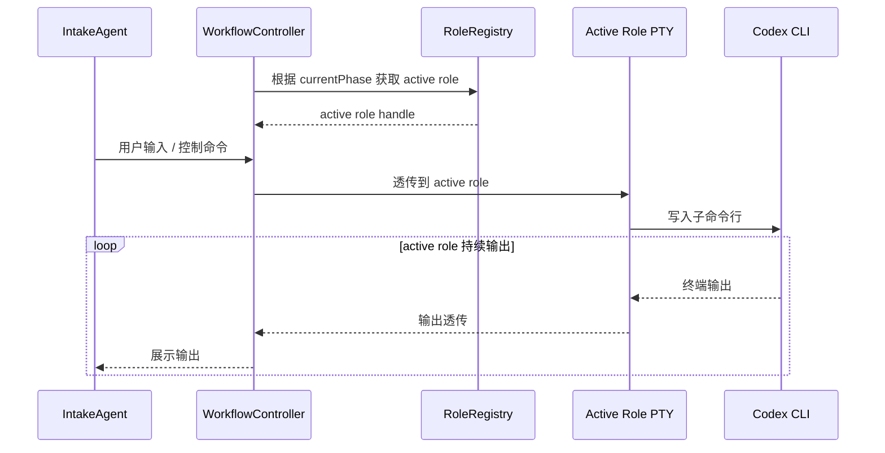
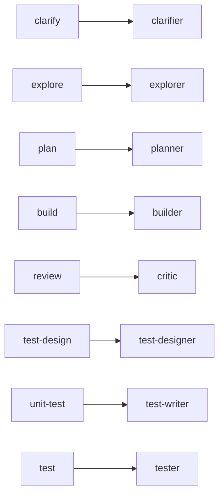

# Default Workflow Role Node PTY Subcommand PRD

## 文档信息

| 字段 | 内容 |
|------|------|
| 模块名 | `default-workflow-role-node-pty-subcommand` |
| 本文范围 | `default-workflow` 中 `Role` 作为 `node-pty` 子命令行运行的架构需求 |
| 文档路径 | `roleflow/clarifications/0.1.0/default-workflow-role-node-pty-subcommand-prd.md` |
| 直接使用者 | AegisFlow 开发者、Planner、Builder |
| 信息来源 | 用户新增架构需求、`roleflow/clarifications/0.1.0/default-workflow-role-layer-prd.md`、`roleflow/clarifications/0.1.0/default-workflow-workflow-layer-prd.md`、`roleflow/clarifications/0.1.0/default-workflow-role-codex-cli-prd.md`、用户澄清结论 |

## Background

在旧的角色运行时定义中，`Role` 更接近“直接调用大模型并给出提示词，然后返回特定输出”的执行单元。

本次需求引入一条新的架构定义：

- 每个 `Role` 本质上不是一次直接模型调用
- 每个 `Role` 本质上都是一个子命令行
- 子命令行通过 `node-pty` 启动
- 子命令行内部实际执行的是 `codex` CLI

这意味着 `Role` 层的运行时心智模型从“函数式调用模型接口”切换为“持久化子终端会话”。  
同时，`Workflow` 与 `Intake` 的边界也要随之收敛：

- `Workflow` 的意义只保留为安排 phase，以及依据当前 phase 决定哪个 role 处于活跃状态
- role 子命令行显示的内容需要展示到 `Intake`
- `Intake` 的操作也需要透传给 role 层

这是一份新增架构 PRD。它用于固定新的角色运行时模型，不直接重写既有旧 PRD 的原始正文。

## Goal

本 PRD 的目标是明确 `default-workflow` 中 `Role` 作为 `node-pty` 子命令行的架构边界，使系统能够：

1. 把每个 `Role` 固定为一个由 `node-pty` 驱动的 Codex CLI 子命令行会话。
2. 让 `RoleRegistry` 管理多个并存的 role 子命令行，而不是管理一次性模型调用对象。
3. 让 `Workflow` 只负责 phase 编排和 active role 决定，不承担角色内部执行逻辑。
4. 让 `Intake` 与当前 active role 之间形成双向透传通路。
5. 在 `Intake` 销毁时，统一销毁所有 role 子命令行。

## In Scope

- `Role` 作为 `node-pty` 子命令行的运行时定义
- `RoleRegistry` 作为子命令行注册表的职责
- active role 的定义、来源和切换规则
- `Workflow` 在 phase 与 active role 之间的映射职责
- `Intake -> active role` 的输入透传
- `active role -> Intake` 的输出透传
- `Intake` 销毁时 role 子命令行的统一销毁规则
- `v0.1` 下“每个 phase 只有一个 role”的约束

## Out of Scope

- Codex CLI 内部如何实现工具能力
- `RoleResult` 的结构调整
- 工件模板与 artifact 内容格式
- 非 `default-workflow` 的多 workflow 运行模型
- GUI / TUI 设计
- 跨进程恢复同一个底层 PTY 会话

## 已确认事实

- 这是一次架构修改
- 旧定义中，role 更偏向直接调用大模型
- 新定义中，每个 role 本质上都是一个子命令行
- 子命令行通过 `node-pty` 库启动
- 子命令行实际执行的是 Codex CLI
- `Workflow` 层的意义只有安排 phase
- 每个 phase 的子命令行显示内容都应该展示到 `Intake` 层
- `Intake` 层的操作也应该透传给 `Role` 层
- `RoleRegistry` 本质上管理的是多个子命令行
- 任务完成后但 `Intake` 还没销毁时，role 可以保留
- 当 `Intake` 销毁时，所有 role 子命令行都应该销毁
- 当多个 role 子命令行同时存在时，必须区分哪个 role 处于 active 状态
- 只有 active role 会把内容传输到 `Intake`
- 只有 active role 可以接收 `Intake` 的命令
- `v0.1` 中每个 phase 只有一个 role
- 在 `v0.1` 中，当前 phase 对应的那个 role 就是当前 active role
- `RoleRegistry` 决定当前存在多少个 role，phase 决定哪个 role active

## 术语

### Role Subcommand

- 指一个由 `node-pty` 启动的子命令行会话
- 该子命令行内部运行 Codex CLI
- 在本期语义下，`Role` 的运行时实体就是这种子命令行会话

### Active Role

- 指当前允许与 `Intake` 建立双向通路的 role 子命令行
- 一个时刻只允许一个 active role
- active role 的来源由当前 phase 决定，而不是由 `RoleRegistry` 自主决定

## 需求总览

## 多 Role / 单 Active 图

## 生命周期图

## 双向透传时序图

## Phase 决定 Active Role 图

## Functional Requirements

### FR-1 每个 Role 必须是 `node-pty` 启动的子命令行

- `default-workflow` 中每个 `Role` 的运行时实体必须是一个子命令行会话。
- 该子命令行必须通过 `node-pty` 启动。
- 该子命令行内部执行对象必须是 Codex CLI。
- 角色执行不得退化为项目内部直接调用大模型 SDK / API。

### FR-2 RoleRegistry 必须管理子命令行会话，而不是一次性模型调用对象

- `RoleRegistry` 管理的核心对象必须是 role 子命令行会话。
- `RoleRegistry` 必须允许多个 role 子命令行同时存在。
- `RoleRegistry` 的职责是管理“当前有哪些 role 已被创建并留存”，而不是决定 phase。
- `RoleRegistry` 不负责自主决定哪个 role active。

### FR-3 Workflow 的核心职责必须收敛为 phase 编排与 active role 决定

- `Workflow` 的意义必须收敛为安排 phase。
- `Workflow` 必须根据当前 phase 决定哪个 role 为 active role。
- `Workflow` 不应承担 role 内部执行逻辑。
- `Workflow` 需要基于当前 phase 与 `hostRole` 的映射关系，从 `RoleRegistry` 中定位 active role。

### FR-4 `v0.1` 中每个 phase 只能有一个 active role

- 在 `v0.1` 中，每个 phase 只有一个 role。
- 因此在 `v0.1` 中，每个 phase 只能存在一个 active role。
- 当前 phase 的 `hostRole` 就是当前 active role。
- 本期不支持一个 phase 同时激活多个 role。

### FR-5 只有 active role 可以向 Intake 输出

- 当多个 role 子命令行同时存在时，只有 active role 的输出可以传输到 `Intake`。
- inactive role 的输出不应直接进入 `Intake`。
- `Workflow` 与 `RoleRegistry` 必须保证输出路由只对 active role 打开。

### FR-6 只有 active role 可以接收 Intake 输入

- `Intake` 发出的面向角色执行的输入或命令，只能透传给当前 active role。
- inactive role 不能直接接收 `Intake` 输入。
- active role 的输入路由必须由当前 phase 决定。

### FR-7 Intake 与 active role 必须形成双向透传链路

- `Intake -> Workflow -> active role` 的输入链路必须存在。
- `active role -> Workflow -> Intake` 的输出链路必须存在。
- `Workflow` 在该链路中的职责是路由和 phase 关联，而不是重写 role 的执行逻辑。

### FR-8 Role 子命令行必须具备留存语义

- role 子命令行一旦创建，不应默认在 phase 结束后立即销毁。
- 只要 `Intake` 仍存活，`RoleRegistry` 可以继续持有多个已创建的 role 子命令行。
- 任务完成后但 `Intake` 尚未销毁时，role 子命令行仍允许继续保留。
- 这意味着 role 是可留存的会话实体，而不是一次性短调用。

### FR-9 Intake 销毁时必须销毁全部 role 子命令行

- 当 `Intake` 销毁时，所有已存在的 role 子命令行都必须销毁。
- `RoleRegistry` 必须提供统一销毁全部 role 子命令行的能力。
- 不允许在 `Intake` 已销毁后继续残留 role 子命令行。

### FR-10 phase 负责 active role，RoleRegistry 负责存在性

- `RoleRegistry` 负责“有哪些 role 当前存在”。
- phase 负责“当前哪个 role active”。
- 这两个概念必须在架构上明确分离。
- 不允许把“已注册 / 已存在”和“当前 active”混为一个概念。

### FR-11 本期不重写既有 `RoleResult` 语义

- 本 PRD 关注 role 运行时架构从“模型调用”切换到“子命令行会话”。
- 本期不在本文中重写既有 `RoleResult` 的公共语义。
- 若后续需要让 `RoleResult` 进一步适配 PTY 架构，应作为单独需求处理。

### FR-12 本期不在本文中扩展多 role 协同 phase

- 虽然 `RoleRegistry` 可以同时持有多个 role 子命令行，但 `v0.1` phase 编排仍按单 host role 执行。
- 本期不支持一个 phase 内多个 role 协同、并行主持或抢占 active 状态。
- 若后续引入多 role phase，需要新增需求文档定义 active role 的切换策略。

## Constraints

- 仅覆盖 `v0.1`
- role 运行时必须使用 `node-pty`
- role 子命令行实际执行 Codex CLI
- 一个时刻只允许一个 active role
- active role 必须由当前 phase 决定
- `Intake` 销毁时必须销毁全部 role 子命令行
- 不在本次文档中重写既有 `RoleResult` 公共边界

## Acceptance

- 存在一份独立 PRD，明确 role 运行时改为 `node-pty` 子命令行架构
- 文档明确规定每个 role 本质上是一个子命令行，而不是直接模型调用
- 文档明确规定子命令行通过 `node-pty` 启动，内部运行 Codex CLI
- 文档明确规定 `RoleRegistry` 管理多个 role 子命令行的存在与留存
- 文档明确规定任务完成后但 `Intake` 未销毁时，role 子命令行可以继续保留
- 文档明确规定 `Workflow` 只负责 phase 编排和 active role 决定
- 文档明确规定只有 active role 能输出到 `Intake`
- 文档明确规定只有 active role 能接收 `Intake` 输入
- 文档明确规定 `v0.1` 每个 phase 只有一个 active role
- 文档明确规定 `Intake` 销毁时会销毁所有 role 子命令行

## Risks

- 如果 active role 与 phase 的边界不清晰，实现时容易把输出路由和注册表职责混在一起
- 如果 role 子命令行在 phase 结束后被错误销毁，会破坏“留存会话”的架构目标
- 如果 inactive role 仍可接收输入或对外输出，会导致 `Intake` 看到串流污染
- 如果 `node-pty` 只被当作一次性启动器，而不是会话载体，架构会再次退化为短调用模型

## Open Questions

- 无

## Assumptions

- 无
