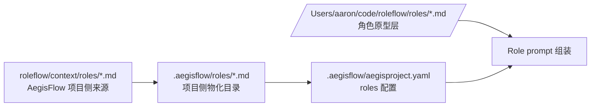
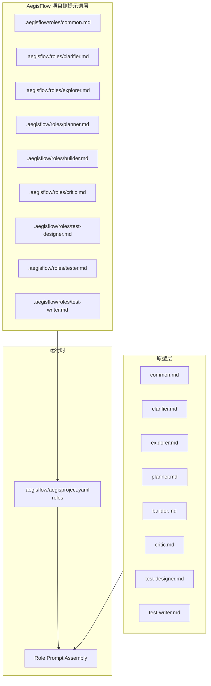

# Default Workflow 角色提示词装载 PRD

## 文档信息

| 字段 | 内容 |
|------|------|
| 模块名 | `default-workflow-role-prompt-bootstrap` |
| 本文范围 | `default-workflow` 的角色原型与 AegisFlow 项目侧角色提示词装载 |
| 文档路径 | `roleflow/clarifications/0.1.0/default-workflow-role-prompt-bootstrap-prd.md` |
| 直接使用者 | AegisFlow 开发者、Planner、Builder |
| 信息来源 | `roleflow/context/project.md`、`/Users/aaron/code/roleflow/roles/`、`roleflow/context/roles/`、用户澄清结论 |

## Background

当前 `Role` 层公共机制已经约束了 `RoleRuntime / RoleRegistry / RoleResult / targetProjectRolePromptPath` 等对象，但 AegisFlow 作为目标项目，本期还缺少一套明确的“角色原型层 + 项目侧角色提示词层”落地规则。

用户已明确要求：

- `/Users/aaron/code/roleflow/roles/*.md` 作为跨项目复用的角色原型
- `roleflow/context/roles/*.md` 作为 AegisFlow 项目特有角色提示词来源
- AegisFlow 项目特有角色提示词需要物化到 `.aegisflow` 目录
- 需要在 `.aegisflow/aegisproject.yaml` 中固定 `roles` 提示词目录与可选 override 规则

因此，本 PRD 只解决“角色职责文档从哪里来、如何放到项目目录、如何在配置中表达”的问题，不扩展新的角色能力。

## Goal

本 PRD 的目标是明确 `default-workflow` 在 AegisFlow 项目中的角色提示词装载方式，使系统能够：

1. 把外部 `roleflow/roles` 目录作为角色原型层。
2. 把当前仓库 `roleflow/context/roles` 目录作为 AegisFlow 项目侧角色提示词来源。
3. 将项目侧角色提示词落到 `.aegisflow/roles/` 下。
4. 通过 `.aegisflow/aegisproject.yaml` 的 `roles` 配置把项目侧提示词目录和必要 override 固定下来。
5. 保持 `default-workflow-role-layer-prd.md` 中既有的“原型 + 项目侧追加 + 项目侧优先”语义不变。

## In Scope

- 角色原型目录来源
- AegisFlow 项目侧角色提示词来源
- `.aegisflow/roles/` 目录约定
- `.aegisflow/aegisproject.yaml` 的 `roles` 配置
- `critic` 项目侧同名文件与可选 override 映射
- 当前已有角色文档的物化与默认装载语义

## Out of Scope

- 新增角色类型
- 改写角色职责内容
- YAML 解析器实现细节
- `Role` 层 agent 推理策略
- `tester` 原型补全文档

## 已确认事实

- `/Users/aaron/code/roleflow/roles/*.md` 是角色原型来源
- `roleflow/context/roles/*.md` 是 AegisFlow 项目特有角色提示词来源
- AegisFlow 项目特有角色提示词需要放入 `.aegisflow` 目录
- `.aegisflow/aegisproject.yaml` 需要作为项目配置文件存在
- `roles.promptDir` 的运行时值会进入 `ProjectConfig.targetProjectRolePromptPath`
- `roles.overrides.*.extraInstructions` 优先于 `promptDir` 下默认同名文件
- 项目侧角色提示词与原型按“追加”组装，冲突时项目侧优先

## 需求总览

## 分层关系图

## 文件落地图

```mermaid
flowchart TD
    SRC1[roleflow/context/roles/clarifier.md] --> DST1[.aegisflow/roles/clarifier.md]
    SRC2[roleflow/context/roles/explorer.md] --> DST2[.aegisflow/roles/explorer.md]
    SRC3[roleflow/context/roles/planner.md] --> DST3[.aegisflow/roles/planner.md]
    SRC4[roleflow/context/roles/builder.md] --> DST4[.aegisflow/roles/builder.md]
    SRC5[roleflow/context/roles/critic.md] --> DST5[.aegisflow/roles/critic.md]
    SRC6[roleflow/context/roles/test-designer.md] --> DST6[.aegisflow/roles/test-designer.md]
    SRC7[roleflow/context/roles/tester.md] --> DST7[.aegisflow/roles/tester.md]
    SRC8[roleflow/context/roles/test-writer.md] --> DST8[.aegisflow/roles/test-writer.md]
    SRC9[roleflow/context/roles/common.md] --> DST9[.aegisflow/roles/common.md]
```

## Functional Requirements

### FR-1 角色原型来源固定

- `default-workflow` 的角色原型必须来自 `/Users/aaron/code/roleflow/roles/`。
- 原型层用于承载跨项目稳定的角色职责、边界和输出约束。
- 本期不得再将 `roleflow/context/roles/` 视为角色原型层。

### FR-2 AegisFlow 项目侧角色提示词来源固定

- AegisFlow 项目侧角色提示词必须来自当前仓库的 `roleflow/context/roles/`。
- 该目录中的角色文档用于表达 AegisFlow 项目的路径、命名规范、输出要求和项目特殊约束。
- 本期不要求改写这些文档内容，只要求明确其层级语义。

### FR-3 项目侧角色提示词必须物化到 `.aegisflow/roles/`

- `roleflow/context/roles/` 下现有的 md 文件必须作为项目侧默认角色提示词物化到 `.aegisflow/roles/`。
- `.aegisflow/roles/` 是 AegisFlow 项目实际对外暴露的项目级角色提示词目录。
- 本期至少应覆盖当前已存在的角色 md 文件与 `common.md`、`index.md`。

### FR-4 必须创建 `.aegisflow/aegisproject.yaml`

- `.aegisflow/aegisproject.yaml` 必须存在。
- `.aegisflow/aegisproject.yaml` 必须包含 `roles` 配置段。
- `roles.promptDir` 必须指向 `.aegisflow/roles`。

### FR-5 `critic` 默认按同名文件读取，override 仅作为可选扩展

- 项目侧 `critic` 文件默认按 `.aegisflow/roles/critic.md` 读取。
- 若未来需要对 `critic` 使用非同名文件，可通过 `roles.overrides.critic.extraInstructions` 显式覆盖。
- 其余已有角色文件按严格同名规则加载。

### FR-6 角色 prompt 组装语义保持不变

- 角色 prompt 组装仍应遵守“原型层在前，项目侧提示词追加在后”的规则。
- 当项目侧提示词与原型冲突时，应以项目侧提示词为准。
- 当项目侧某角色文件缺失时，应允许回退到原型层，不视为阻塞。

### FR-7 不得随意扩展角色集合或功能点

- 本期只处理当前已有角色职责文档与配置落位。
- 本期不得新增新的角色流程、角色类型或额外业务能力。

## Constraints

- 仅覆盖 `v0.1`
- 原型层目录固定为 `/Users/aaron/code/roleflow/roles/`
- AegisFlow 项目侧提示词目录固定为 `.aegisflow/roles/`
- 项目侧提示词来源固定为 `roleflow/context/roles/`
- `.aegisflow/aegisproject.yaml` 必须落在 `.aegisflow/`
- `critic` 默认按同名文件处理，override 仅作可选扩展

## Acceptance

- `.aegisflow/aegisproject.yaml` 已存在
- `.aegisflow/aegisproject.yaml` 的 `roles.promptDir` 已配置为 `.aegisflow/roles`
- 项目侧 `critic` 已通过 `.aegisflow/roles/critic.md` 默认同名路径装载
- `.aegisflow/roles/` 已存在并包含来自 `roleflow/context/roles/` 的项目侧默认角色提示词文件
- 文档层已明确 `/Users/aaron/code/roleflow/roles/` 是角色原型层，而 `roleflow/context/roles/` 是 AegisFlow 项目侧提示词来源
- 当前角色 prompt 装载语义仍满足“原型 + 项目侧追加 + 项目侧优先”

## Risks

- 若 `.aegisflow/roles/` 中的物化文件与 `roleflow/context/roles/` 长期不同步，项目侧提示词可能漂移
- 若未来再次改动 `critic` 文件名而未同步索引与配置，仍可能出现 prompt 漂移
- 当前 `tester` 只有最小职责说明，虽然不阻塞本期装载，但其项目侧提示词仍然较薄

## Open Questions

- 无

## Assumptions

- 无
