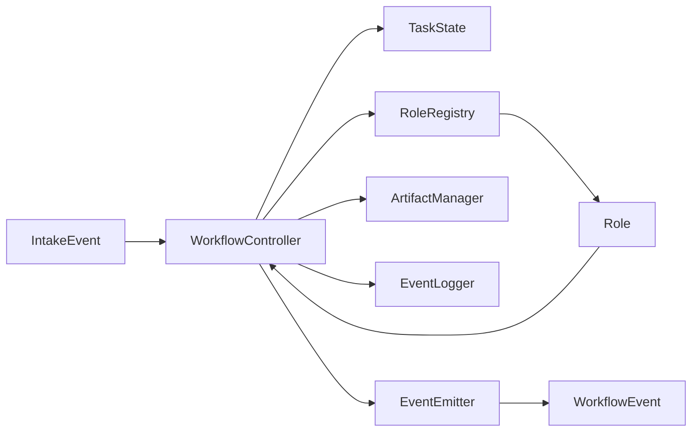
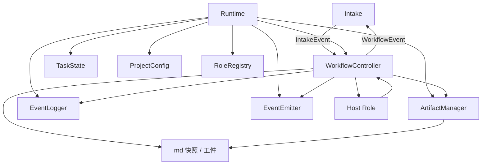
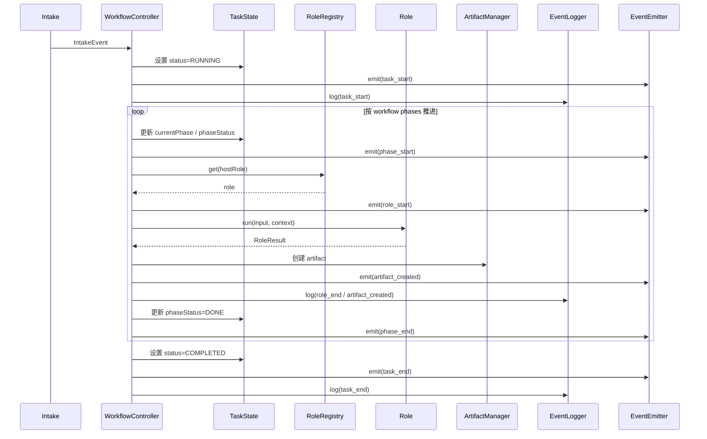
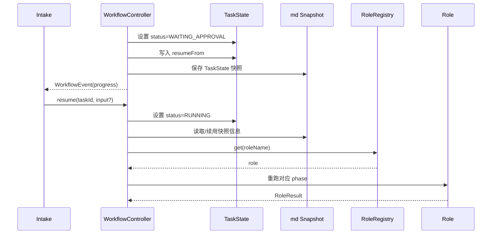
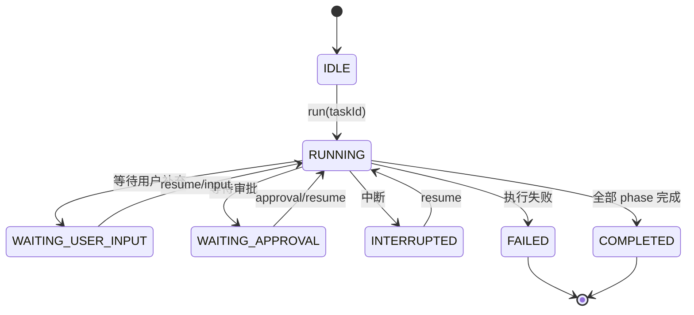
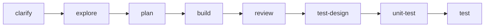

# Default Workflow Workflow 层 PRD

## 文档信息

| 字段 | 内容 |
|------|------|
| 模块名 | `default-workflow-workflow-layer` |
| 本文范围 | `default-workflow` 的 `Workflow` 层 |
| 文档路径 | `roleflow/clarifications/0.1.0/default-workflow-workflow-layer-prd.md` |
| 直接使用者 | AegisFlow 开发者、Planner、Builder |
| 信息来源 | `roleflow/context/project.md`、用户澄清结论 |

## Background

AegisFlow 通过 `Clarify`、`Explore`、`Plan`、`Build`、`Review`、`Test Design` 等阶段，把真实软件开发任务组织成一条可控、可恢复、可审阅的工作流。

在该架构中，`Workflow` 层是整个 `default-workflow` 的编排核心。它不负责与用户直接对话，也不负责具体角色内部推理，而是负责接收 `Intake` 层输入、驱动 `TaskState` 状态机、调用 `Role`、写入工件、广播事件、记录日志，并在中断与恢复场景下保持任务过程可继续。

## Goal

本 PRD 的目标是明确 `default-workflow` 中 `Workflow` 层的需求边界，使其能够：

1. 作为 `default-workflow` 的核心编排对象驱动任务执行。
2. 作为 `Runtime.TaskState` 的唯一合法修改者维护状态机。
3. 接收 `IntakeEvent`，并将任务要求透传给对应 `Role`。
4. 在阶段推进过程中写工件、写日志、发 `WorkflowEvent`。
5. 支持中断、等待审批、恢复执行和任务结束等关键状态切换。
6. 在 `v0.1` 范围内稳定组织 `clarify` 到 `test` 的主流程。

## In Scope

- `WorkflowController` 作为核心编排对象的需求描述
- `TaskState`、`TaskStatus`、`Phase`、`PhaseStatus` 作为状态机需求对象的描述
- `Runtime`、`ProjectConfig`、`ArtifactManager`、`EventEmitter`、`EventLogger`、`RoleRegistry` 作为 `Workflow` 直接依赖对象的描述
- `IntakeEvent` 的接收与 `WorkflowEvent` 的发送
- `run`、`resume`、`runPhase`、`runRole` 的职责边界
- 工件写入、日志记录、角色调用、快照持久化、中断恢复、等待审批

## Out of Scope

- `Intake` 层的自然语言识别与 CLI 展示细节
- `Clarifier`、`Explorer`、`Planner`、`Builder`、`Critic`、`Test Designer`、`Test Writer` 的角色内部实现
- 各阶段产出工件的具体模板内容
- `Archive`、`Architect` 等 `v0.1` 范围外能力
- 代码级类设计、方法实现、目录拆分和具体持久化格式实现细节

## 已确认事实

以下内容来自 `roleflow/context/project.md`，在本文中视为已确认事实：

- `WorkflowController` 是编排与流水线推进的核心对象
- `WorkflowController` 不是 Agent
- `WorkflowController` 驱动 `TaskState` 状态机，负责 `phase` 流转和中断恢复
- `WorkflowController` 是 `Runtime.TaskState` 的唯一合法修改者
- `WorkflowController` 会保存 `TaskState` 的快照到 md 文件
- `WorkflowController` 接收 `Intake` 层指令
- `WorkflowController` 会将 `Intake` 层用户要求透传给 `Role` 层具体 Agent
- `WorkflowController` 接收 `Role` 层返回内容，并调用 `ArtifactManager` 写工件
- `WorkflowController` 写 `EventLogger` 日志
- `WorkflowController` 更新 `TaskStatus`
- `WorkflowController` 从 `Intake` 层接受 `IntakeEvent`，并向 `Intake` 层发送 `WorkflowEvent`
- `WorkflowController` 直接调用 `Role`
- `Runtime` 仅存在于内存中，但部分内容如 `TaskState` 快照会被保存到 md 中
- `Runtime` 初始化时包含：`TaskState`、`WorkflowController`、`ProjectConfig`、`EventEmitter`、`EventLogger`、`ArtifactManager`、`RoleRegistry`
- `Runtime` 在任务恢复时必须重新创建
- `ProjectConfig.workflowPhases` 是 `Workflow` 的流程配置输入，`v0.1` 可以先写死
- `TaskState` 包含 `taskId`、`title`、`currentPhase`、`phaseStatus`、`status`、`resumeFrom?`、`updatedAt`
- `TaskStatus` 包含：`IDLE`、`RUNNING`、`WAITING_USER_INPUT`、`WAITING_APPROVAL`、`INTERRUPTED`、`FAILED`、`COMPLETED`
- `Phase` 包含：`clarify`、`explore`、`plan`、`build`、`review`、`test-design`、`unit-test`、`test`
- `PhaseStatus` 包含：`pending`、`running`、`done`
- `WorkflowController` 当前接口包含：`run(taskId)`、`resume(taskId, input?)`、`runPhase(phase)`、`runRole(roleName, input)`
- `WorkflowEventType` 包含：`task_start`、`task_end`、`phase_start`、`phase_end`、`role_start`、`role_end`、`artifact_created`、`progress`、`error`

## 用户补充约束

以下内容由用户澄清后明确追加：

- 本文只覆盖 `v0.1`
- 审批机制作为明确需求存在，但不固化到某一个特定 phase
- 恢复机制作为明确需求存在
- 本文需要将 `TaskState`、`Phase / PhaseStatus / TaskStatus`、`Runtime`、`ProjectConfig`、`ArtifactManager`、`EventEmitter`、`EventLogger`、`RoleRegistry` 全部作为明确需求对象
- 快照持久化到 md 文件、恢复时重建 `Runtime` 需要写成明确需求，而不只是背景说明
- 验收重点优先关注状态机与 phase 流转，其他能力尽量满足

## 需求总览

## 整体关系图

## User Flow

### 主流程时序

### 审批与恢复流程

### 状态机图

### Phase 流转图

## Functional Requirements

### FR-1 WorkflowController 作为核心编排对象

- `WorkflowController` 必须作为 `default-workflow` 的核心编排对象存在。
- `WorkflowController` 不能作为 Agent 参与用户对话或角色内部推理。
- `WorkflowController` 必须负责驱动整个任务的 phase 流转。

### FR-2 WorkflowController 是 TaskState 唯一合法修改者

- `WorkflowController` 必须是 `Runtime.TaskState` 的唯一合法修改者。
- `Intake` 层和 `Role` 层不应直接改写 `TaskState`。
- `WorkflowController` 必须负责更新 `TaskState.currentPhase`、`TaskState.phaseStatus`、`TaskState.status`、`TaskState.resumeFrom`、`TaskState.updatedAt`。

### FR-3 TaskState 作为 Workflow 主状态机

- `TaskState` 必须作为 `Workflow` 层的主状态机载体。
- `TaskState` 必须至少包含以下字段：
  - `taskId`
  - `title`
  - `currentPhase`
  - `phaseStatus`
  - `status`
  - `resumeFrom?`
  - `updatedAt`
- `resumeFrom` 必须用于表达恢复执行所需的最小定位信息，至少包括：
  - `phase`
  - `roleName`
  - `currentStep?`

### FR-4 TaskStatus 与 PhaseStatus 约束

- `Workflow` 层必须支持以下 `TaskStatus`：
  - `idle`
  - `running`
  - `waiting_user_input`
  - `waiting_approval`
  - `interrupted`
  - `failed`
  - `completed`
- `Workflow` 层必须支持以下 `PhaseStatus`：
  - `pending`
  - `running`
  - `done`
- `Workflow` 层必须维护 `TaskStatus` 与 `PhaseStatus` 的一致性，不允许出现当前任务已 `completed` 但当前 phase 仍处于 `running` 的冲突状态。

### FR-5 Phase 流程范围

- 本期 `Workflow` 层必须覆盖以下 `Phase`：
  - `clarify`
  - `explore`
  - `plan`
  - `build`
  - `review`
  - `test-design`
  - `unit-test`
  - `test`
- 本文仅覆盖 `v0.1` 范围，不扩展 `Archive`、`Architect` 等后续能力。

### FR-6 接收 IntakeEvent

- `WorkflowController` 必须从 `Intake` 层接收 `IntakeEvent`。
- `WorkflowController` 接收到 `Intake` 层指令后，必须按任务状态和当前 phase 决定后续流转，而不是由 `Intake` 直接推进 phase。
- `Workflow` 层必须能够承接 `Intake` 侧的启动、补充输入、中断、恢复等动作。

### FR-7 发送 WorkflowEvent

- `WorkflowController` 必须向 `Intake` 层发送 `WorkflowEvent`。
- 本期至少支持以下 `WorkflowEventType`：
  - `task_start`
  - `task_end`
  - `phase_start`
  - `phase_end`
  - `role_start`
  - `role_end`
  - `artifact_created`
  - `progress`
  - `error`
- `WorkflowEvent` 必须可用于表达任务启动、阶段推进、角色执行、工件生成、进度反馈和错误信息。

### FR-8 调用 RoleRegistry 与 Role

- `WorkflowController` 必须通过 `RoleRegistry` 获取对应 `Role`。
- `WorkflowController` 必须直接调用 `Role.run(input, context)`。
- `WorkflowController` 不能绕过 `RoleRegistry` 直接承担角色职责。
- `WorkflowController` 必须将来自 `Intake` 的任务要求透传给对应 `Role`。

### FR-9 写工件

- `WorkflowController` 必须接收 `Role` 返回结果，并调用 `ArtifactManager` 写工件。
- 工件写入必须属于 `Workflow` 的职责边界，而不是 `Role` 自行写入。
- 工件创建后，`Workflow` 层必须产生对应的 `artifact_created` 事件。

### FR-10 写日志

- `WorkflowController` 必须在任务执行过程中写 `EventLogger` 日志。
- 至少应覆盖任务开始、阶段开始、角色执行、工件生成、错误和任务结束等关键节点。

### FR-11 快照持久化

- `WorkflowController` 必须将 `TaskState` 快照持久化到 md 文件。
- 快照持久化必须发生在足以支持任务恢复的关键节点，而不是仅保存在内存中。
- 快照内容至少需要支持恢复时重新定位任务、phase 和 role。

### FR-12 中断与恢复

- `Workflow` 层必须支持中断后的恢复执行。
- 恢复执行时，必须依赖重新创建的 `Runtime`，不能复用旧内存实例。
- `WorkflowController.resume(taskId, input?)` 必须作为恢复入口。
- 恢复时必须依据快照或等价持久化信息继续执行，而不是丢失上下文重新开始整个任务。

### FR-13 等待审批

- `Workflow` 层必须支持进入 `waiting_approval` 状态。
- 审批机制必须作为工作流的通用能力存在，但本文不将其固定绑定到某个特定 phase。
- 进入等待审批时，`Workflow` 层必须保留足以恢复执行的状态信息。

### FR-14 等待用户输入

- `Workflow` 层必须支持进入 `waiting_user_input` 状态。
- 当任务依赖补充输入继续执行时，`Workflow` 层必须暂停继续推进后续 phase。
- 在收到恢复所需输入后，`Workflow` 层必须允许继续执行。

### FR-15 run / resume / runPhase / runRole 边界

- `run(taskId)` 必须用于启动任务主流程。
- `resume(taskId, input?)` 必须用于恢复未完成任务。
- `runPhase(phase)` 必须用于驱动单个 phase 的执行。
- `runRole(roleName, input)` 必须用于驱动单个 role 的执行。
- 这四个入口需要共同覆盖“启动任务、推进 phase、执行 role、恢复任务”的完整职责闭环。

### FR-16 Runtime 与 ProjectConfig 作为明确依赖对象

- `Workflow` 层必须运行在 `Runtime` 提供的对象集合上。
- `Runtime` 至少需要向 `Workflow` 提供：
  - `taskState`
  - `projectConfig`
  - `eventEmitter`
  - `eventLogger`
  - `artifactManager`
  - `roleRegistry`
- `ProjectConfig.workflowPhases` 必须作为 `Workflow` 流程编排输入的一部分。

### FR-17 EventEmitter 作为事件广播通道

- `Workflow` 层必须通过 `EventEmitter` 广播 `WorkflowEvent`。
- `Workflow` 不应将 CLI 展示逻辑直接写入自身，而应通过事件传递给 `Intake`。

### FR-18 错误收敛

- 当阶段执行失败、角色运行失败或工件写入失败时，`Workflow` 层必须能够进入失败处理路径。
- 失败时必须更新 `TaskStatus`、记录日志，并发出错误事件。

## Constraints

- 仅覆盖 `v0.1` 范围
- `WorkflowController` 不是 Agent
- `WorkflowController` 是 `TaskState` 唯一合法修改者
- 审批机制作为通用能力存在，但不绑定到某个固定 phase
- 恢复机制必须依赖 `Runtime` 重建
- 快照需要落到 md 文件
- 本文只描述需求边界，不定义具体类图、文件结构和代码实现

## Acceptance

- `WorkflowController` 能作为 `default-workflow` 的核心对象驱动主流程
- `TaskState`、`TaskStatus`、`Phase`、`PhaseStatus` 能形成自洽的状态机和 phase 流转
- `Workflow` 层能接收 `IntakeEvent` 并发送 `WorkflowEvent`
- `Workflow` 层能通过 `RoleRegistry` 获取 `Role` 并执行 `run`
- `Workflow` 层能接收 `Role` 返回内容并写入工件
- `Workflow` 层能在关键节点记录日志
- `Workflow` 层能将 `TaskState` 快照持久化到 md 文件
- `Workflow` 层支持进入 `waiting_approval` 和 `waiting_user_input`
- `Workflow` 层支持中断、恢复，并在恢复时依赖重建后的 `Runtime`
- `Workflow` 层在 `v0.1` 范围内可组织 `clarify` 到 `test` 的 phase 流程

## Risks

- 如果 `ProjectConfig.workflowPhases` 与实际角色注册关系不一致，`Workflow` 层会出现 phase 与 role 无法对齐的问题
- 如果快照持久化时机不稳定，恢复执行可能出现状态丢失或恢复点错误
- 如果 `waiting_user_input`、`waiting_approval`、`interrupted` 的边界处理不清晰，状态机会产生分叉歧义
- 如果 `ArtifactManager`、`EventLogger`、`EventEmitter` 的职责边界混乱，`Workflow` 层容易越界承担展示或存储细节

## Open Questions

- 无

## Assumptions

- 无

