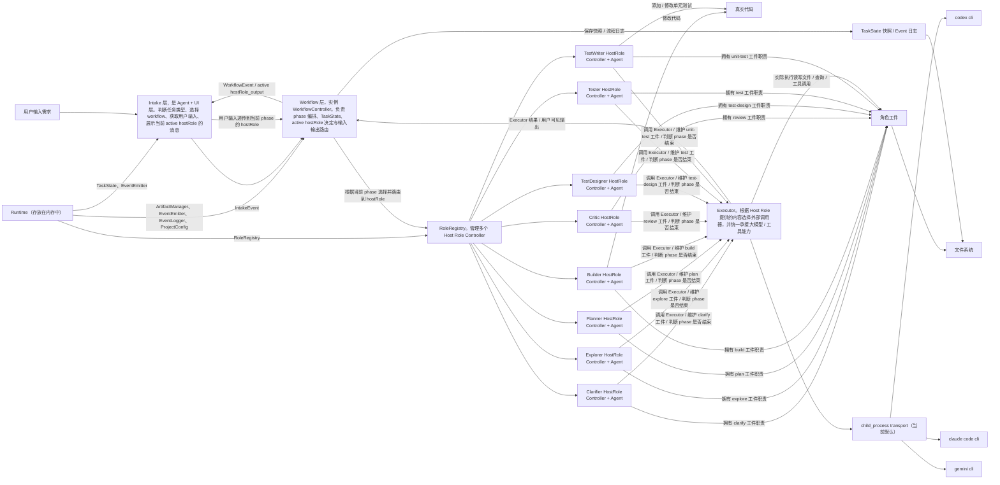
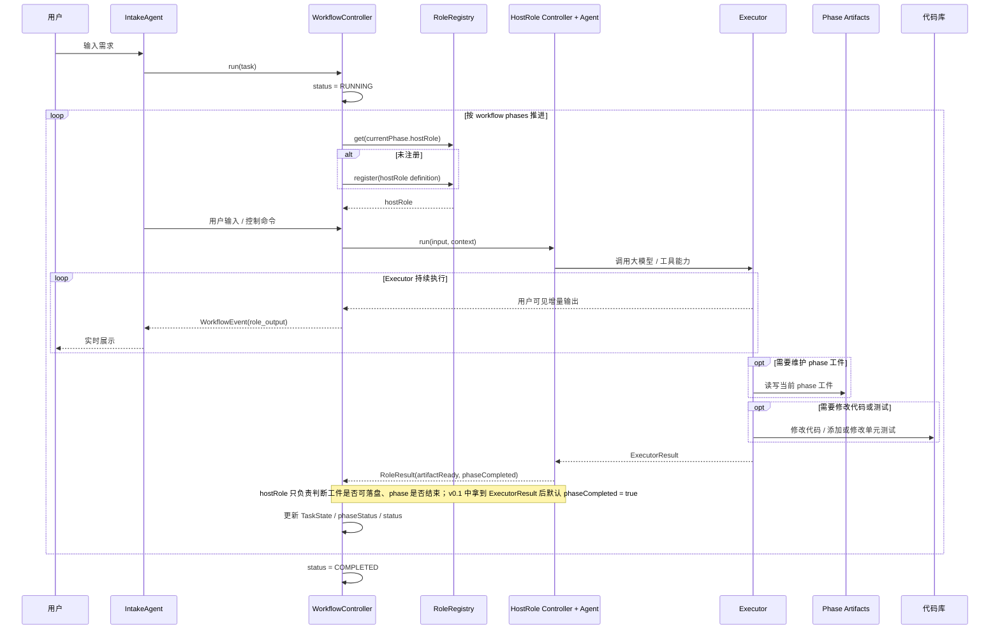

# AegisFlow
AegisFlow 是一个面向真实软件开发工作的 Agentic Dev Workflow System。  
它的目标不是单纯生成代码，而是把需求澄清、代码探索、计划拆解、实现、审查、测试建议等环节组织成一条可控的开发流程。  
AegisFlow 优先服务于 brownfield 项目，即已有代码库、已有架构、已有历史包袱的真实工程场景。  
## 1. 项目目标（Project Purpose）

AegisFlow 的目标是构建一个可长期使用的 AI 开发助理系统，用于辅助日常真实开发工作，而不是只做一次性 demo。

它希望解决的核心问题包括：

- 需求描述不清晰，直接进入编码容易返工
- 陌生项目和历史代码阅读成本高
- AI 虽然能生成代码，但缺少足够上下文时容易乱改
- 开发速度提升后，review、自测、回归验证仍然是瓶颈
- 多轮 AI 对话中的上下文容易污染，信息难以稳定传递
- 工程实践中缺少一套可复用、可沉淀的 AI 开发工作流

AegisFlow 通过将开发过程拆解为多个阶段和多个专职角色，使 AI 在每个阶段只处理明确、受约束的任务，并通过工件在阶段之间传递信息，从而提升开发的稳定性、可控性和复用性。

## 2. v0.1版本支持内容（Scope）

支持的工作流（暂定）：
- Feature Change：已有功能点的规则修改、页面适配、联动逻辑调整
- Bugfix：已有问题修复、边界情况修复、回归问题修复
- Small New Feature：较小的新功能点开发

v0.1 不追求：
- 过于复杂的系统
- 全自动提交代码
- 全自动完成所有测试
- 通用支持任意项目
- 一开始就具备复杂 UI 后台
- 替代人工架构判断

## 3.阶段划分与核心角色（Workflow Overview and Core Roles）


AegisFlow 将开发流程拆解为若干阶段：

1. **Clarify**
   - 接收需求
   - 判断任务类型
   - 澄清缺失信息
   - 输出结构化任务描述

2. **Explore**
   - 读取项目上下文、相关代码和知识资料
   - 分析入口、调用链、依赖和影响面
   - 生成 exploration 工件

3. **Plan**
   - 基于 exploration 和项目规范生成 feature spec
   - 产出 implementation plan
   - 明确 acceptance、touch scope、open questions

4. **Build**
   - 根据 plan 实现代码改动
   - 输出改动摘要和 rationale
   - 只在允许的范围内修改代码

5. **Critic**
   - 对实现结果进行 review
   - 检查 spec 与实现的一致性
   - 输出 must-fix / optional issues

6. **Test Design**
   - 生成自测 checklist
   - 生成回归测试建议
   - 标记高风险路径

7. **Archive**（后续增强）
   - 同步和归档工件
   - 更新文档和索引
   - 保持知识库与实际实现一致

8. **Architect**（后续增强）
   - 规划从0到1的项目
   - 专注于架构、types、config的定义
   - 保证基础骨架可控


AegisFlow 当前包含以下核心角色：

- **Clarifier**：澄清需求，生成结构化任务输入
- **Explorer**：理解代码、资料和上下文，输出 exploration
- **Planner**：生成 spec 和 implementation plan
- **Builder**：执行代码改动
- **Critic**：执行审查和风险识别
- **Test Designer**：生成测试点和回归建议
- **Tester**：执行测试阶段任务并输出测试执行结果
- **Test Writer**：编写或修改单元测试及相关测试辅助代码
- **Archivist**（后续）：维护知识和文档一致性
- **Architect**（后续）：架构师，针对从0到1的项目

这些角色不是聊天人格，而是开发流程中的专职执行单元。


## 4. 设计原则（Design Principles）

### 4.1 Artifact-driven
AegisFlow 强调通过工件而不是聊天上下文来传递信息。  
每个阶段的输出都应尽量固定格式、可保存、可审核、可复用。

### 4.2 Human-in-the-loop
AegisFlow 不追求“完全自动化”，而强调关键节点的人工确认。  
在 spec、实现、review 等关键环节保留人工审批能力。
关键的工件需要有json和md两份，md便于人阅读，json是固定格式化的输入和输出

### 4.3 Brownfield-first
AegisFlow 优先适配已有项目、已有历史代码、已有复杂架构的现实开发环境。

### 4.4 Controlled Scope
AegisFlow 要尽量减少 AI 越界修改的风险，因此要求在 planning 阶段明确 touch scope，并在 build 阶段严格遵守。

### 4.5 Readability + Structure
系统内部会优先维护结构化输出，便于 agent 之间传递；  
同时也会生成适合人工审阅的 markdown 工件，方便开发者理解和确认。

### 4.6 Reuse Mature Agent CLI Capabilities
AegisFlow 在角色执行层优先复用成熟 Agent CLI 已有的工具能力，而不是在系统内部重复实现同类能力。  
这类能力至少包括文件读写、代码搜索、Git 等通用工程操作。  
这样做的目标是降低 AegisFlow 本身的工具开发成本，把系统复杂度集中在 workflow 编排、状态管理和工件沉淀上。
## 5.项目架构
架构图：



主流程时序图：


## 6.主要对象

#### Runtime
 - Runtime 对象仅存在于内存中。部分内容比如 taskState 的快照会被保存到md中
- Runtime 对象初始化时应该初始化如下实例： TaskState 、WorkflowController 、 ProjectConfig 、 EventEmitter 、 EventLogger 、 ArtifactManager 、 RoleRegistry 、 Executor
 - Runtime 对象在Intake刚开始就需要初始化，需要的资料包括：目标项目目录、workflow具体流程编排、工件保存目录
 - Runtime 对象在任务恢复时必须重新创建，


```typescript
interface Runtime {
   taskState: TaskState;
   workflow: WorkflowController;
   projectConfig: ProjectConfig;
   eventEmitter: EventEmitter; // todos
   eventLogger: EventLogger; // todos
   artifactManager: ArtifactManager; // 管理工件索引、路径与只读视图
   roleRegistry: RoleRegistry; // todos
   executor: Executor; // todos
}

// 传给 RoleDefinition 的受限运行时视图，用于避免把 Workflow 内部状态机直接暴露给角色
interface RoleRuntime {
   projectConfig: ProjectConfig;
   eventEmitter: EventEmitter; // todos
   eventLogger: EventLogger; // todos
   roleRegistry: RoleRegistry; // todos
   executor: Executor; // Host Role 使用的统一执行器
}

// 这是本项目的主要状态机
interface TaskState {
  taskId: string; // 任务ID，比如‘task_20260323_001-[title]’
  title: string; // 任务标题，英文，使用“_”相连，比如“create_base_code”
  currentPhase: Phase;
  phaseStatus: PhaseStatus;
  status: TaskStatus;
  resumeFrom?: { // 如果是从中断中恢复的，需要此字段
     phase: Phase;
     roleName: string;
     currentStep?: string; // 执行到的步骤的大致描述
  };
  updatedAt: number; // timestamp
}

export enum TaskStatus {
  IDLE = "idle",
  RUNNING = "running",
  WAITING_USER_INPUT = "waiting_user_input",
  WAITING_APPROVAL = "waiting_approval",
  INTERRUPTED = "interrupted",
  FAILED = "failed",
  COMPLETED = "completed",
}

export enum Phase {
   CLARIFY = 'clarify',
   EXPLORE = 'explore',
   PLAN = 'plan',
   BUILD = 'build',
   REVIEW = 'review',
   TEST_DESIGN = 'test-design',
   UNIT_TEST = 'unit-test',
   TEST = 'test',
}

export enum PhaseStatus {
   PENDING = 'pending',
   RUNNING = 'running',
   DONE = 'done',
}

// 主要是从 .aegisflow/aegisproject.yaml 中读取的内容
interface ProjectConfig {
   cwd: string; // 目标项目地址
   artifactPath: string; // 输出artifact的根目录
   targetProjectRolePromptPath: string; // 目标项目角色提示词目录加载后的内存值，等价于 roles.promptDir；默认按严格同名文件读取 planner.md、builder.md、critic.md 等。若 roles.overrides.*.extraInstructions 已配置，则优先使用 override 指向的文件；与角色原型文档按追加方式组装，冲突时项目侧职责优先，缺失时回退到角色原型文档
   workflows: WorkflowConfig[]; // 从 aegisproject.yaml 读取的全部可选 workflow；Intake 需要基于 description 推荐
   selectedWorkflow: WorkflowConfig; // 当前任务最终确认使用的 workflow
   workflowPhases: PhaseConfig[]; // 等价于 selectedWorkflow.phases，hostRole 是每个 phase 的主持人
}

interface WorkflowConfig {
   name: string;
   description: string; // 供 Intake 判断和推荐 workflow 使用
   phases: PhaseConfig[];
}

interface PhaseConfig {
   name: Phase;
   hostRole: string;
   needApproval: boolean;
   artifactInputPhases?: Phase[]; // 当前 phase 需要读取哪些阶段的工件；未配置时默认只读取上一阶段
}

// 用于管理所有 Host Role Controller。registry 负责“有哪些 role 当前存在”，active hostRole 由 workflow 根据 phase.hostRole 决定
interface RoleRegistry {
   register: (roleDef: RoleDefinition) => void;
   get: (name: string) => Role;
   list(): string[];
   activate: (name: string) => void;
   getActive(): Role | undefined;
   destroyAll(): Promise<void>;
}

// 角色蓝图，也就是角色职责
interface RoleDefinition {
  name: string;
  description?: string;
  create: (runtime: RoleRuntime) => Role;
}

// 统一执行器。Host Role 的所有大模型调用、读写文件、查询等工具能力在 v0.1 都依赖 Executor
interface Executor {
  execute: (input: ExecutorRequest) => Promise<ExecutorResult>;
}

interface ExecutorRequest {
  roleName: string;
  phase: Phase;
  prompt: string;
  cwd: string;
}

interface ExecutorResult {
  summary: string;
  artifactKeys?: string[];
  metadata?: Record<string, any>;
}

// 具体的、实例化的角色。它既是 controller，也是一个只负责简单判断的 agent
interface Role {
   name: string;
   run(input: string, context: ExecutionContext): Promise<RoleResult>;
}

// Host Role 返回的结构化结果
interface RoleResult {
  summary: string;
  artifactKeys?: string[]; // 当前 role 维护或更新过的工件标识
  artifactReady?: boolean; // 工件是否允许落盘
  phaseCompleted?: boolean; // 当前 phase 是否可以结束
  metadata?: Record<string, any>;
}

// 提供给 Role 层的只读工件视图，避免角色直接接触 ArtifactManager
interface ArtifactReader {
  get(key: string): Promise<string | undefined>;
  list(phase?: Phase): Promise<string[]>;
}

// 角色运行时的上下文，主要是只读视图和必要的记录
interface ExecutionContext {
  taskId: string;
  phase: Phase;
  cwd: string;
  artifacts: ArtifactReader;
  projectConfig: ProjectConfig;
}
```

#### Intake层
Intake本身是一个Agent，所以对象应该叫 IntakeAgent？
 - 是一个UI层 + 轻决策层
 - 第一次跟用户沟通，主要目的是补齐runtime初始化需要的资料，唯一需要做决策的内容是从 `.aegisflow/aegisproject.yaml` 里声明的多个 workflow 中推荐并确认具体的 workflow。
 - workflow 不能由代码写死，必须从项目下 `aegisproject.yaml` 中读取
 - 如果 `aegisproject.yaml` 中的 workflow 配置不合规范，Intake 需要明确报错，并要求用户先修正 `aegisproject.yaml`
 - Intake 需要根据每个 workflow 的 `description` 与用户需求语义，判断并推荐更合适的 workflow
 - 没有具体的命令，只要用户描述了内容，就要根据用户描述的内容猜测用户想干什么，并询问用户“是不是想要XXX”
 - intake目前提供的能力
	 - 创建任务，并描述
	 - 开始任务
	 - 取消任务
	 - 中断任务（支持control + C中断任务）
	 - 继续未完成的任务
	 - 对任务的内容进行补充
 - 负责跟用户沟通，将用户的需求规范化传给workflow
 - 接收 workflow 层转发的 active hostRole 消息，实时展示到 CLI 上
 - 用户输入默认透传给当前 active hostRole
 - 对展示到 CLI 的文本做基础排版，至少支持换行、段落、列表和代码块边界
 - 初始化Runtime对象
 - Intake 销毁时需要触发全部 role 子命令行销毁
 - 给 workflow 发送 IntakeEvent，接收 workflow 的 WorkflowEvent

```typescript
// todos：需要转换成枚举类型
type IntakeEventType =
  | "init_task"
  | "start_task"
  | "cancel_task"
  | "interrupt_task"
  | "resume_task"
  | "participate"

// intake 层向 Workflow 层发送通知，使用 IntakeEvent
// todos metadata
type IntakeEvent = {
  type: IntakeEventType;
  taskId: string;
  message: string; // 应该只作为log记录用
  timestamp: number;
  metadata?: { // 应该只作为log记录用
    phase?: string;
    role?: string;
    artifactPath?: string;
  };
}
```

#### Workflow层
对象应该叫 WorkflowController ，编排与流水线推进，是整个系统的核心，
 - 驱动 TaskState 状态机（phase 流转 + 中断恢复）
 - 不是Agent。
 - 唯一的 Runtime.TaskState 的合法修改者，并保存 TaskState 的快照到md文件里，保证进程被打断的时候，下一次启动可以直接继续上一次的任务
 - 接收 intake 层的指令。准确地说，是接收 TaskStatus 变更的指令，并将 intake 层的用户要求透传给当前 phase 的 hostRole。
 - 接收 hostRole 返回的阶段结果，更新 TaskState、记录日志并决定是否进入下一 phase
 - 根据当前 phase 决定哪个 hostRole 处于 active 状态
 - 在角色执行过程中，承担 active hostRole 用户可见增量输出到 Intake 的统一转发职责
 - 写 EventLogger 日志
 - 更新 TaskStatus 状态
 - 从 intake 层接受 IntakeEvent，给 intake 层发送 WorkflowEvent
 - 不负责 role 内部执行逻辑，也不负责生成工件内容，只负责 phase 编排、active hostRole 切换和输入输出路由

```typescript

interface WorkflowController {
   run(taskId: string): Promise<void>;
   resume(taskId: string, input?: any): Promise<void>; // input是额外的用户补充内容?
   runPhase(phase: PhaseConfig): Promise<void>;
   setActiveRole(roleName: string): void;
   routeInputToActiveRole(input: string): Promise<void>;
   runRole(roleName: string, input: string): Promise<RoleResult>; // roleName 来源于当前 phase.hostRole
}

// todos: WorkflowEventType 应该转变为枚举
type WorkflowEventType =
  | "task_start"
  | "task_end"
  | "phase_start"
  | "phase_end"
  | "role_start"
  | "role_end"
  | "role_output"
  | "artifact_created"
  | "progress"
  | "error"

type WorkflowEvent = {
  type: WorkflowEventType
  taskId: string
  message: string // 对于 role_output / progress 等展示型事件，允许携带多行用户可见文本
  timestamp: number
  metadata?: {
    phase?: string
    role?: string
    artifactPath?: string
    outputKind?: "status" | "role_output" | "summary"
  }
}

type EventListener = (event: WorkflowEvent | IntakeEvent) => void
interface EventEmitter {
  emit(event: WorkflowEvent): void
  subscribe(listener: EventListener): () => void
}

interface EventLogger {
  log(event: LogEvent): void
}

// LogEvent 很自由，用于记录发生的一切
type LogEvent = {
  type: string;
  taskId?: string;
  message: string;
  timestamp: number;
  level?: "debug" | "info" | "warn" | "error"; // todos: 应当改成enum
  metadata?: Record<string, any>
}
```

#### Role层
 - 都是 controller + agent 角色
 - 每个 phase 都有一个主持人，由 `hostRole` 指定；`clarify` 对应 `clarifier`，`plan` 对应 `planner`，以此类推
 - hostRole 本身不负责具体生成工作，只负责做简单判断：当前工件是否可以落盘、当前 phase 是否结束
 - v0.1 中 hostRole 不需要实现复杂判断，只要 `Executor` 执行完成并返回结果，就直接视为当前 phase 可以结束
 - hostRole 使用的所有工具能力在 v0.1 都依赖 `Executor`，包括读写文件、查询、调用外部 Agent CLI
 - 每个 role 维护自己对应 phase 的工件
 - role 允许副作用，比如修改代码、修改单测；这些副作用同样通过 `Executor` 发生
 - 多个 role 可以同时存在，但只有 active hostRole 能向 Intake 输出，也只有 active hostRole 能接收 Intake 输入
 - 执行过程中可以产生用户可见的增量输出，但不能直接写 CLI，必须通过 Workflow 转发
 - 任务完成后但 Intake 未销毁时，role 运行时可以继续保留
 - phase 间工件输入默认按“上一阶段 -> 下一阶段”传递，但 workflow 配置可以通过 `artifactInputPhases` 显式声明“当前 phase 需要读取哪些阶段的工件”
 - `artifactInputPhases` 未配置时，默认只暴露上一阶段工件；已配置时，应按配置的 phase 列表组合暴露对应阶段的最终工件


## 7.配置文件示例
.aegisflow/aegisproject.yaml 文件示例：
```yaml
project:
  name: "project-name"
  description: "描述你的项目"

paths:
  cwd: "/Users/aaron/code/projectpath"
  artifactDir: ".aegisflow/artifacts"
  snapshotDir: ".aegisflow/state"
  logDir: ".aegisflow/logs"
  requirementDocs: "docs/requirements" # 项目需求文档目录
  knowledgeBase: ".aegisflow/knowledge" # 项目知识库路径（加载方式以后再定）

codeStyle:
  # eslintConfig: ".eslintrc.json"
  # prettierConfig: ".prettierrc"
  archOverview: "docs/architecture.md"       # 项目架构说明
  unitTestRules: "docs/unit_test_rules.md"   # 单测规范
  codeReviewGuide: "docs/code_review.md"     # review注意事项

workflows:
  - name: "default-delivery-workflow"
    description: "适用于已有功能修改、Bugfix 和小型新功能开发，需要走 clarify、explore、plan、build、review、test-design、unit-test、test 的完整交付流程。"
    phases:
      - name: "clarify"
        hostRole: "clarifier"
        needApproval: false

      - name: "explore"
        hostRole: "explorer"
        needApproval: false
        artifactInputPhases: ["clarify"] # 显式写法；不写时默认也是上一阶段 clarify

      - name: "plan"
        hostRole: "planner"
        needApproval: true
        artifactInputPhases: ["clarify", "explore"] # plan 同时消费 clarify 与 explore 的工件

      - name: "build"
        hostRole: "builder"
        needApproval: false
        artifactInputPhases: ["clarify", "plan"] # build 需要需求澄清结果和最终计划

      - name: "review"
        hostRole: "critic"
        needApproval: true
        artifactInputPhases: ["clarify", "plan", "build"]

      - name: "test-design"
        hostRole: "test-designer"
        needApproval: false
        artifactInputPhases: ["clarify", "plan", "build", "review"]

      - name: "unit-test"
        hostRole: "test-writer"
        needApproval: false
        artifactInputPhases: ["clarify", "plan", "build", "review", "test-design"]

      - name: "test"
        hostRole: "tester"
        needApproval: false
        artifactInputPhases: ["clarify", "plan", "build", "review", "test-design", "unit-test"]

  - name: "analysis-only-workflow"
    description: "适用于先做需求澄清、代码探索和方案规划，不立即改代码的场景，例如陌生项目调研、方案预研、影响面分析。"
    phases:
      - name: "clarify"
        hostRole: "clarifier"
        needApproval: false

      - name: "explore"
        hostRole: "explorer"
        needApproval: false

      - name: "plan"
        hostRole: "planner"
        needApproval: true

  - name: "fast-build-workflow"
    description: "适用于澄清范围很小、可以直接基于计划进入实现的场景。某些 phase 不一定依赖 clarify 工件，而是只依赖 plan 工件。"
    phases:
      - name: "plan"
        hostRole: "planner"
        needApproval: true

      - name: "build"
        hostRole: "builder"
        needApproval: false
        artifactInputPhases: ["plan"] # 这个 workflow 中 build 只消费 plan 工件，不强依赖 clarify

roles:
  prototypeDir: "/Users/aaron/code/roleflow/roles" # 角色原型目录
  promptDir: ".aegisflow/roles" # AegisFlow 项目级角色提示词目录
  executor:
    type: "codex-cli"
    command: "codex"
    cwd: "/Users/aaron/code/projectpath"
    timeoutMs: 300000
    env:
      passthrough: true
  # overrides:
  #   critic:
  #     extraInstructions: ".aegisflow/roles/custom-critic.md"

artifacts:
  structure: "by-phase" # by-phase / flat
  format: "md"

  types:
    clarify: "clarification.md"
    explore: "exploration.md"
    plan: "plan.md"
    review: "review.md"
    test: "test.md"

runtime:
  maxRetries: 2
  timeoutMs: 300000
  interrupt:
    allowUserInput: true
    allowAbort: true

logging:
  level: "info" # debug / info / warn / error
  saveToFile: true
```

补充说明：

- `artifactInputPhases` 表示“当前 phase 需要读取哪些阶段的工件”。
- 字段值使用 phase 名数组，例如 `["clarify", "plan"]`。
- 未配置 `artifactInputPhases` 时，默认行为保持不变：当前 phase 只读取上一阶段工件。
- 已配置 `artifactInputPhases` 时，当前 phase 应读取这些 phase 的最终工件，而不是只读取紧邻上一阶段。
- 该字段是 workflow 级配置，因此同一个 `build` phase 在不同 workflow 中可以依赖不同的上游工件集合。
