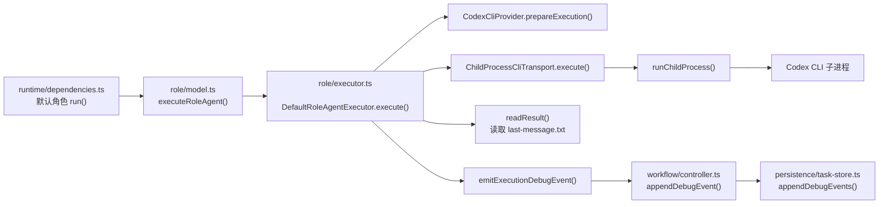
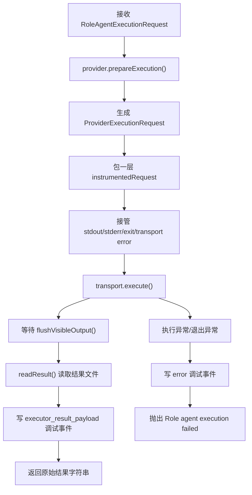
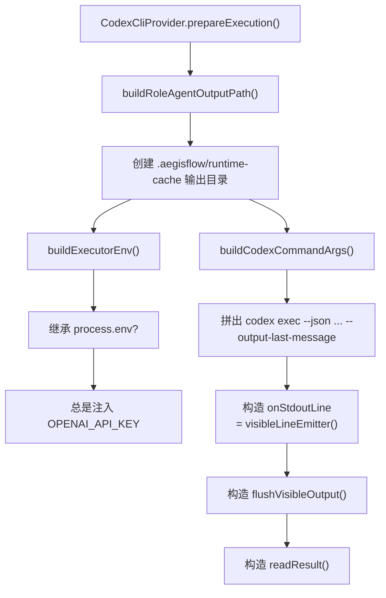
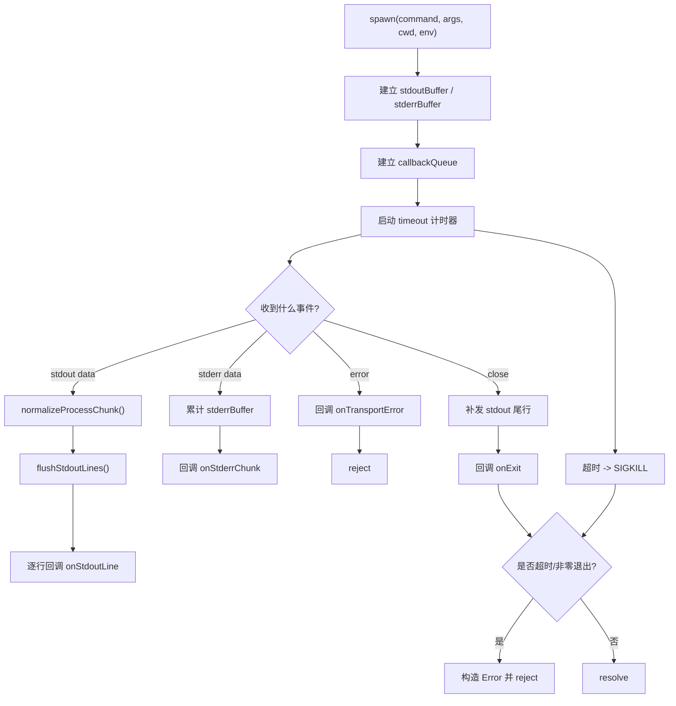
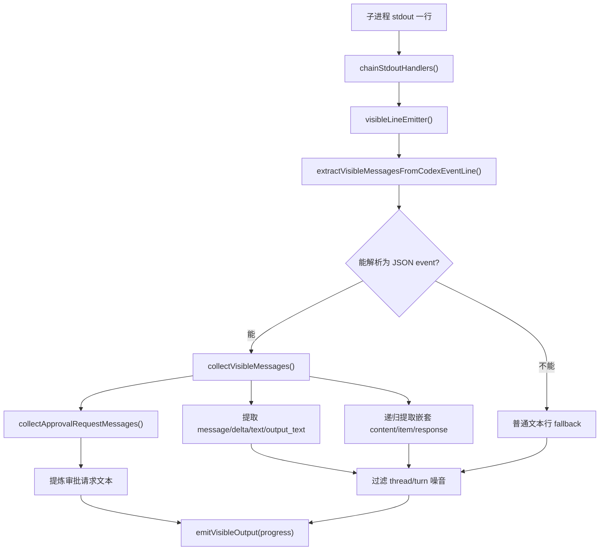
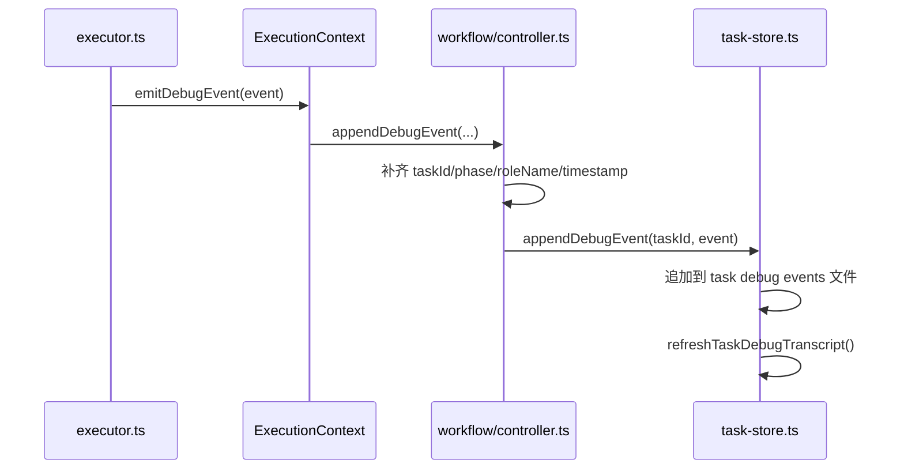
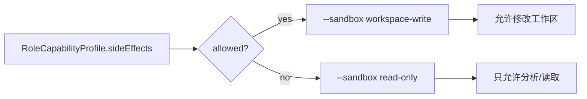
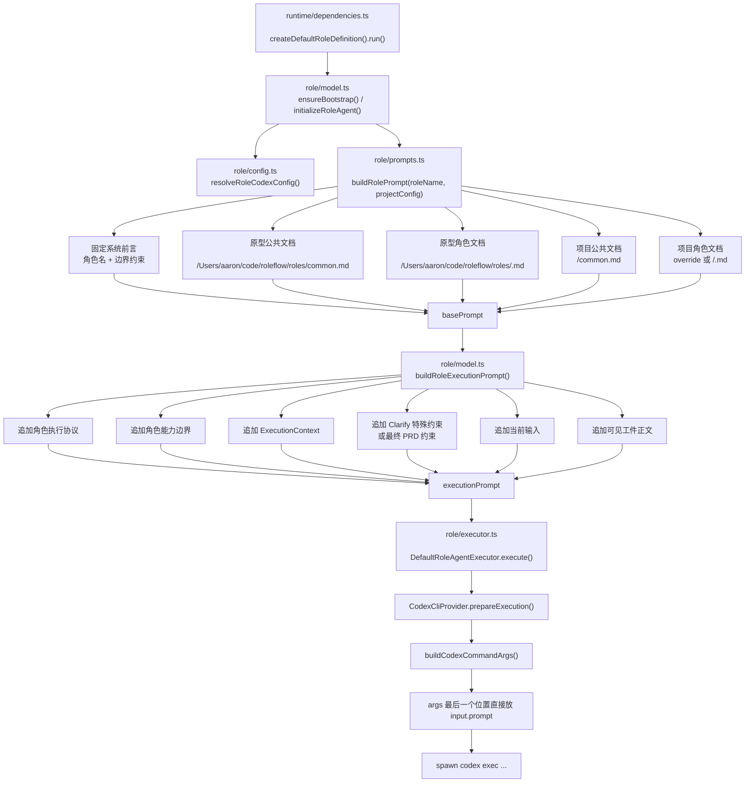
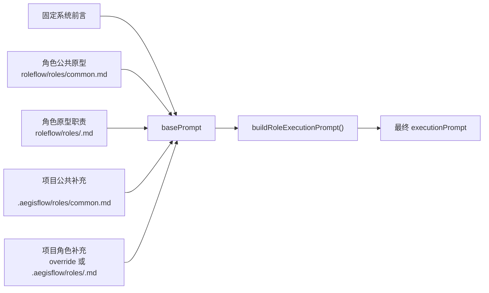
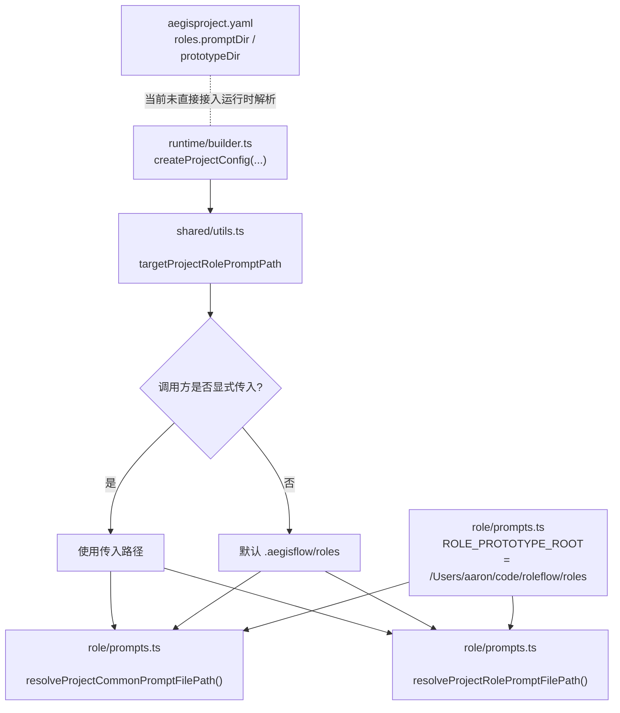

# 探索报告 [L1]：`src/default-workflow/role/executor.ts`
探索日期: 2026-04-06 | 关键词: role executor, codex cli, child_process, debug event

## Entry Points
| 触发动作 | 文件路径 |
|---------|---------|
| 角色首次执行时初始化统一执行器 | `src/default-workflow/role/model.ts` |
| 默认角色 `run()` 调用统一执行链路 | `src/default-workflow/runtime/dependencies.ts` |
| 角色执行器接口、传输层、provider、stdout/stderr 处理 | `src/default-workflow/role/executor.ts` |
| 角色执行配置来源 | `src/default-workflow/role/config.ts` |
| 执行期调试事件类型与 `ExecutionContext` 扩展点 | `src/default-workflow/shared/types.ts` |
| 调试事件落盘入口 | `src/default-workflow/workflow/controller.ts` |
| 调试事件持久化与 transcript 刷新 | `src/default-workflow/persistence/task-store.ts` |
| 行为回归测试 | `src/default-workflow/testing/role.test.ts` |

## Module Responsibility
| 文件路径 | 职责 |
|---------|------|
| `src/default-workflow/role/executor.ts` | 把“角色 prompt + 执行上下文”转换成一次可执行的 CLI 请求，并统一承接传输、可见输出提取、调试事件、结果回读与错误包装 |
| `src/default-workflow/role/model.ts` | 负责装配 `executor + prompt + config`，并在真正运行时调用 `executor.execute()` |
| `src/default-workflow/runtime/dependencies.ts` | 为各默认角色提供 `run()`，把角色执行统一路由到 `executeRoleAgent()` |
| `src/default-workflow/role/config.ts` | 解析 Codex 执行配置与环境变量来源，决定 `model/baseUrl/apiKey/executionMode` |
| `src/default-workflow/shared/types.ts` | 定义 `RoleAgentExecutionRequest` 依赖的 `ExecutionContext`、`RoleCapabilityProfile`、`TaskDebugEvent` 边界 |
| `src/default-workflow/workflow/controller.ts` | 把 `ExecutionContext.emitDebugEvent` 绑定到 workflow 侧的 `appendDebugEvent()` |
| `src/default-workflow/persistence/task-store.ts` | 将 debug event 追加到任务级文件，并刷新可读 transcript |
| `src/default-workflow/testing/role.test.ts` | 验证 stdout/stderr/exit/result payload 调试事件、异步 hook 等执行器契约 |

## Dependency Graph
`src/default-workflow/runtime/dependencies.ts` → `src/default-workflow/role/model.ts` → `src/default-workflow/role/executor.ts`

`src/default-workflow/role/executor.ts` → `src/default-workflow/role/config.ts`

`src/default-workflow/role/executor.ts` → `src/default-workflow/shared/types.ts`

`src/default-workflow/role/executor.ts` → `src/default-workflow/workflow/controller.ts` → `src/default-workflow/persistence/task-store.ts`

`src/default-workflow/testing/role.test.ts` → `src/default-workflow/role/executor.ts`

## Main Flow
1. `src/default-workflow/runtime/dependencies.ts` 中默认角色的 `run()` 不自己执行命令，而是先调用 `src/default-workflow/role/model.ts:executeRoleAgent()`；`src/default-workflow/role/model.ts` 再把 `roleName`、拼好的 `prompt`、`ExecutionContext`、`RoleCapabilityProfile` 和 `RoleCodexConfig` 一起交给 `src/default-workflow/role/executor.ts`。
2. `src/default-workflow/role/executor.ts:DefaultRoleAgentExecutor.execute()` 进入后，第一步不是直接起进程，而是先调用 provider 的 `prepareExecution()`。在默认生产路径里，这个 provider 是 `src/default-workflow/role/executor.ts:CodexCliProvider`。
3. `src/default-workflow/role/executor.ts:CodexCliProvider.prepareExecution()` 会先生成一个 runtime-cache 下的输出文件路径，然后基于 `projectConfig.roleExecutor` 和 `RoleCodexConfig` 组装一次完整的 CLI 请求，包括 `command`、`args`、`cwd`、`env`、`timeoutMs`、stdout 可见输出处理器，以及最后的 `readResult()`。这一步的核心目的，是把“角色执行”收敛成一个统一的 `ProviderExecutionRequest`。
4. 命令参数在 `src/default-workflow/role/executor.ts:buildCodexCommandArgs()` 中被固定成 `codex exec --json --full-auto ... --output-last-message <outputPath> <prompt>` 这一类 one-shot 调用。这里最关键的分支是 sandbox 权限：`executionProfile.sideEffects === "allowed"` 时才给 `workspace-write`，否则使用 `read-only`。也就是说，这个文件在真正落命令前，已经把角色能力边界翻译成了 CLI 权限边界。
5. 环境变量在 `src/default-workflow/role/executor.ts:buildExecutorEnv()` 中整理。若项目配置允许 `passthrough`，就继承宿主 `process.env`；无论是否继承，都会显式注入当前执行所需的 `OPENAI_API_KEY`。这说明 `executor.ts` 自己不负责“找配置”，而负责“把上游给定配置变成执行环境”。
6. 当 provider 把请求组装完后，`src/default-workflow/role/executor.ts:DefaultRoleAgentExecutor.execute()` 会再包一层 `instrumentedRequest`。这一层不是改变命令本身，而是统一接管四类运行期信号：stdout、stderr、进程退出、transport error。stdout 会同时走两条链路：一条交给 provider 内部的 `visibleLineEmitter()` 提炼用户可见进度；另一条通过 `emitExecutionDebugEvent()` 记成 `executor_stdout` 调试事件。stderr、exit 和 transport error 也都在这里变成标准化的 task debug event。
7. 真正拉起外部命令的是 `src/default-workflow/role/executor.ts:ChildProcessCliTransport.execute()`。如果宿主注入了 `runProcess`，就走注入实现；否则进入 `src/default-workflow/role/executor.ts:runChildProcess()`。这个函数是文件里的执行核心：它用 `child_process.spawn()` 起子进程，用 `stdoutBuffer/stderrBuffer` 累积输出，用 `callbackQueue` 串行化异步回调，用 `setTimeout()` 触发超时 kill，并在 close 阶段统一收尾、补发尾行 stdout、上报 `onExit`，最后根据超时、signal、exit code 判断成功或失败。
8. `src/default-workflow/role/executor.ts:runChildProcess()` 返回后，不代表所有用户可见输出都已经刷完，所以 `DefaultRoleAgentExecutor.execute()` 还会显式等待 `flushVisibleOutput()`。等 UI 输出链也收敛后，才调用 `readResult()` 读取 `--output-last-message` 写出的最终文件内容，并把这份原始 payload 额外记成 `executor_result_payload` 调试事件。最终返回给上游 `src/default-workflow/role/model.ts` 的，并不是 stdout 拼出来的文本，而是结果文件中的完整字符串。
9. 若任一阶段失败，无论是 provider 组装、transport 执行、子进程超时、非零退出，还是 `readResult()` 失败，`src/default-workflow/role/executor.ts:DefaultRoleAgentExecutor.execute()` 都会统一记录一条 `source=executor` 的 `error` 调试事件，并抛出 `Role agent execution failed: ...`。因此这个文件对外暴露的是稳定错误边界，对内保留的是更细的 raw error 元数据。
10. 调试事件不会停留在 executor 内存里。`src/default-workflow/role/executor.ts:emitExecutionDebugEvent()` 只是调用 `ExecutionContext.emitDebugEvent`；真正补齐 `taskId/phase/roleName` 并写盘的是 `src/default-workflow/workflow/controller.ts`，最终由 `src/default-workflow/persistence/task-store.ts` 追加到任务级 debug events 文件并刷新 transcript。所以这个文件虽然不直接写工件，但它负责把执行现场完整送进任务调试材料。

## Mermaid 图解
### 1. 整体位置图

### 2. `DefaultRoleAgentExecutor.execute()` 主流程

### 3. Provider 组装阶段

### 4. `runChildProcess()` 事件收敛

### 5. stdout 如何变成“用户可见输出”

### 6. 调试事件落盘链路

### 7. 权限决策图

### 8. Prompt 从哪里开始拼接，怎么传到 `codex exec`

### 9. Prompt 来源优先级图

### 10. Prompt 路径实际来源图

## Call Chain
`src/default-workflow/runtime/dependencies.ts:createDefaultRoleDefinition().run()` → `src/default-workflow/role/model.ts:executeRoleAgent()` → `src/default-workflow/role/executor.ts:RoleAgentExecutor.execute()`

`src/default-workflow/role/model.ts:initializeRoleAgent()` → `src/default-workflow/role/executor.ts:createRoleAgentExecutor()` → `src/default-workflow/role/executor.ts:DefaultRoleAgentExecutor`

`src/default-workflow/role/executor.ts:DefaultRoleAgentExecutor.execute()` → `src/default-workflow/role/executor.ts:CliProvider.prepareExecution()` → `src/default-workflow/role/executor.ts:CliTransport.execute()`

`src/default-workflow/role/executor.ts:CodexCliProvider.prepareExecution()` → `src/default-workflow/role/executor.ts:buildRoleAgentOutputPath()` / `buildCodexCommandArgs()` / `buildExecutorEnv()`

`src/default-workflow/role/executor.ts:ChildProcessCliTransport.execute()` → `src/default-workflow/role/executor.ts:runChildProcess()`

`src/default-workflow/role/executor.ts:runChildProcess()` → `onStdoutLine/onStderrChunk/onExit/onTransportError`

`src/default-workflow/role/executor.ts:emitExecutionDebugEvent()` → `src/default-workflow/workflow/controller.ts:appendDebugEvent()` → `src/default-workflow/persistence/task-store.ts:appendDebugEvents()`

`src/default-workflow/role/executor.ts:CodexCliProvider.readResult()` → `src/default-workflow/role/model.ts:parseRoleResultPayload()`

## State Changes
| 变量 | 读取 | 写入 |
|-----|------|------|
| `executionSequence` | `src/default-workflow/role/executor.ts:buildRoleAgentOutputPath()` | `src/default-workflow/role/executor.ts:buildRoleAgentOutputPath()` |
| `pendingVisibleOutput` | `src/default-workflow/role/executor.ts:CodexCliProvider.prepareExecution()` 内 `flushVisibleOutput()`、`visibleLineEmitter()` | `src/default-workflow/role/executor.ts:CodexCliProvider.prepareExecution()` |
| `stdoutBuffer` | `src/default-workflow/role/executor.ts:runChildProcess()` close 分支、stdout 分支 | `src/default-workflow/role/executor.ts:runChildProcess()` stdout 分支、close 分支 |
| `stderrBuffer` | `src/default-workflow/role/executor.ts:runChildProcess()` close 分支 | `src/default-workflow/role/executor.ts:runChildProcess()` stderr 分支 |
| `timeoutReached` | `src/default-workflow/role/executor.ts:runChildProcess()` close 分支、exit 调试事件 | `src/default-workflow/role/executor.ts:runChildProcess()` timer 分支 |
| `settled` | `src/default-workflow/role/executor.ts:runChildProcess()` 各事件分支 | `src/default-workflow/role/executor.ts:runChildProcess()` `settleResolve/settleReject` |
| `callbackQueue` | `src/default-workflow/role/executor.ts:runChildProcess():enqueueCallback()` | `src/default-workflow/role/executor.ts:runChildProcess():enqueueCallback()` |
| `outputPath` | `src/default-workflow/role/executor.ts:CodexCliProvider.readResult()` | `src/default-workflow/role/executor.ts:CodexCliProvider.prepareExecution()` |
| `OPENAI_API_KEY` | `src/default-workflow/role/executor.ts:buildSpawnEnv()` 通过 `env` 读取 | `src/default-workflow/role/executor.ts:buildExecutorEnv()` |
| `TaskDebugEvent` 记录 | `src/default-workflow/persistence/task-store.ts:appendDebugEvents()`、`refreshTaskDebugTranscript()` | `src/default-workflow/role/executor.ts:emitExecutionDebugEvent()` → `src/default-workflow/workflow/controller.ts:appendDebugEvent()` |

## Key Conditions
- `src/default-workflow/role/executor.ts`：若 `DefaultRoleAgentExecutor` 构造时传入自定义 `transport/provider`，默认 `ChildProcessCliTransport + CodexCliProvider` 会被替换；因此该文件既是生产默认实现，也是测试注入点。
- `src/default-workflow/role/executor.ts`：`buildCodexCommandArgs()` 根据 `executionProfile.sideEffects` 在 `read-only` 与 `workspace-write` 间切换 sandbox；角色能力画像会直接影响外部 CLI 权限。
- `src/default-workflow/role/executor.ts`：`CodexCliProvider.prepareExecution()` 会先创建输出目录，再要求 CLI 通过 `--output-last-message` 把最终结果写入文件；执行器本身不从 stdout 直接拼最终结果。
- `src/default-workflow/role/executor.ts`：stdout 只用于“可见进度”和 debug 观察。`extractVisibleMessagesFromCodexEventLine()` 优先按 JSON event 提取文本，解析失败时才退回普通文本行。
- `src/default-workflow/role/executor.ts`：`shouldSuppressJsonEvent()` 与 `shouldSuppressPlainStdoutLine()` 会过滤 thread/turn 生命周期噪音和部分日志行，因此并非所有 stdout 都会透传给用户。
- `src/default-workflow/role/executor.ts`：若 stdout JSON 中包含 `sandbox_permissions=require_escalated` 的工具调用参数，`collectApprovalRequestMessages()` 会额外生成审批提示文本，说明、命令、路径与前缀规则都从事件体递归提取。
- `src/default-workflow/role/executor.ts`：`runChildProcess()` 用 `callbackQueue` 串行化 stdout/stderr/close/error 回调，避免异步 hook 乱序覆盖；`src/default-workflow/testing/role.test.ts` 也专门验证了这一点。
- `src/default-workflow/role/executor.ts`：子进程超时会设置 `timeoutReached=true` 并发送 `SIGKILL`；close 后若超时、退出码非 0、或 signal 非空，都会被视为失败并抛错。
- `src/default-workflow/role/executor.ts`：任何 transport/provider/读取结果阶段的异常都会被包成 `Role agent execution failed: ...`；对应 debug 事件类型为 `error`，来源为 `executor`。
- `src/default-workflow/role/config.ts`：执行器最终使用的 `model/baseUrl/apiKey` 不在 `executor.ts` 内解析，而由配置层提前确定；`executor.ts` 只消费 `RoleCodexConfig`。
- `src/default-workflow/role/model.ts`：真正开始拼 prompt 的起点是 `initializeRoleAgent()` 调用 `buildRolePrompt()`，不是 `executor.ts`。`executor.ts` 接收到的已经是拼好的 `executionPrompt`。
- `src/default-workflow/role/prompts.ts`：prompt 分两层拼接。第一层是 `basePrompt`，由固定系统前言、角色原型公共文档、角色原型职责文档、项目公共补充、项目角色补充组成；第二层是 `buildRoleExecutionPrompt()` 再追加执行协议、ExecutionContext、当前输入、可见工件等运行时内容。
- `src/default-workflow/role/executor.ts`：最终 prompt 不是通过 stdin 传给 Codex，而是在 `buildCodexCommandArgs()` 中直接作为命令参数数组最后一项传入 `codex exec`。
- `src/default-workflow/runtime/builder.ts` / `src/default-workflow/shared/utils.ts`：项目侧 prompt 目录当前实际来自 `createProjectConfig()` 的 `targetProjectRolePromptPath`；若调用方不显式传入，就默认落到 `.aegisflow/roles`。
- `src/default-workflow/runtime/project-config.ts`【未确认是否后续版本会接入】当前只明确解析 `workflows` 和 `roles.executor`，报告内所见代码路径里没有把 `aegisproject.yaml` 的 `roles.promptDir` / `prototypeDir` 直接接入运行时 prompt 解析链路。
- `src/default-workflow/workflow/controller.ts`：`emitDebugEvent` 不直接写文件，而是先补齐当前 `taskId/phase/roleName/timestamp`，再交给 artifact manager。
- `src/default-workflow/persistence/task-store.ts`：debug event 每次追加后都会刷新 transcript，因此 `executor.ts` 产生的原始 stdout/stderr/result payload 会进入任务级调试材料，而不是只存在内存中。

结论：`src/default-workflow/role/executor.ts` 不是 prompt 的起点，而是 prompt 落执行的桥。prompt 的真正起点在 `src/default-workflow/role/prompts.ts` 与 `src/default-workflow/role/model.ts`：先拼 `basePrompt`，再拼 `executionPrompt`，最后由 `src/default-workflow/role/executor.ts:buildCodexCommandArgs()` 把完整 prompt 作为命令参数直接传给 `codex exec`。`executor.ts` 自己主要负责把这份已完成的 prompt 变成一次受控的 CLI 执行，并回收输出、调试信息和最终结果。
