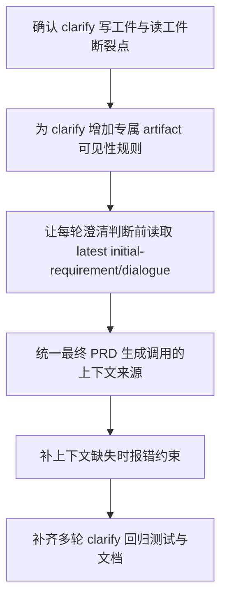

# Implementation Plan (implementationPlan)

## 概述 (summary)

- 本次实现聚焦 `default-workflow` 的 `clarify` 上下文重建，目标是让 `clarify` 阶段每一次 one-shot 角色调用都显式看到 `clarify/initial-requirement` 与 `clarify/clarify-dialogue`，而不是继续依赖已经不存在的进程记忆。
- 实现建议拆成 6 步：确认 clarify 工件写入与读取断裂点、补 `clarify` 专属 artifact 可见性规则、让每轮澄清判断前都重建最新工件视图、统一最终 PRD 生成的上下文来源、补齐缺失工件时的错误收敛、补回归测试与文档。
- 最关键的风险点是只修最终 PRD 生成调用而不修前面的多轮澄清判断；那样 `clarify` 工件虽然存在，但追问过程仍然持续丢上下文。
- 最需要注意的是这次改造必须停留在 `clarify` phase 的特例工件可见性，不要误伤普通 phase 已有的 `artifactInputPhases` / 上一阶段工件规则。
- 当前没有产品层未确认问题，但规范输入存在缺口：`roleflow/context/standards/common-mistakes.md` 缺失，`roleflow/context/standards/coding-standards.md` 为空；当前仓库里也尚无专门覆盖 clarify reinjection 的实施文档。

---

## 输入依据 (inputBasis)

- PRD：`roleflow/clarifications/0.1.0/default-workflow-clarify-dialogue-artifact-reinjection-prd.md`
- 项目上下文：`roleflow/context/project.md`
- 计划模板：`roleflow/templates/plan/implementationPlan.md`
- 相关历史计划：`roleflow/implementation/0.1.0/default-workflow-role-child-process-subcommand.md`
- 相关历史计划：`roleflow/implementation/0.1.0/default-workflow-phase-artifact-input-phases.md`
- 相关历史计划：`roleflow/implementation/0.1.0/default-workflow-task-debug-transcript.md`
- 当前实现参考：`src/default-workflow/workflow/controller.ts`
- 当前类型定义：`src/default-workflow/shared/types.ts`
- 当前测试参考：`src/default-workflow/testing/runtime.test.ts`

缺失信息：

- `roleflow/context/standards/common-mistakes.md` 当前不存在，无法作为实现约束输入。
- `roleflow/context/standards/coding-standards.md` 当前为空，未提供可执行编码规范。
- 当前没有与本 PRD 对应的独立 exploration 工件；本计划只能基于 PRD、项目文档和现有代码状态生成。

---

## 实现目标 (implementationGoals)

- 修改 `clarify` 阶段的执行上下文构建逻辑，确保每一次 `clarifier` one-shot 调用前都能读取到 `clarify/initial-requirement` 和 `clarify/clarify-dialogue`。
- 保持 `clarify` 阶段已有的工件落盘行为不变，本次重点是把这些工件重新注入执行上下文，而不是重写工件内容格式。
- 修改 `createExecutionArtifactReader()` 或等价可见性解析逻辑，使 `clarify` 成为普通 phase 工件规则之外的显式例外。
- 保证首轮澄清判断、后续追问判断、用户回答后的继续判断，以及最终 PRD 生成前的最后一次判断轮，都使用同一套工件上下文来源。
- 保证最终 PRD 生成调用与前面的澄清判断调用共享相同的上下文来源，不再出现“前面一套、最终生成一套”的分裂路径。
- 新增缺失关键工件时的错误收敛语义，确保 `clarify` 调用读取不到应有工件时，会被视为上下文不完整，而不是被当成普通 one-shot 执行继续跑下去。
- 最终交付结果应达到：`clarifier` 在 `clarify` 阶段彻底转向工件驱动上下文延续，不再隐含依赖 CLI 进程记忆。

---

## 实现策略 (implementationStrategy)

- 采用“clarify 特例工件可见性 + 调用前上下文校验”的局部改造策略，不整体重写 artifact reader，也不影响非 `clarify` 阶段的既有 phase 输入规则。
- 优先在 `WorkflowController.resolveVisibleArtifactKeys(...)` / `resolveArtifactSourcePhases(...)` 这一层收敛 `clarify` 的可见工件集合，而不是去修改角色 prompt 试图弥补缺失上下文。
- `clarify` 的 artifact 可见性应显式包含本 phase 下的两个稳定工件：
  - `clarify/initial-requirement`
  - `clarify/clarify-dialogue`
- 首轮调用不走“特殊隐式路径”；即使 `clarify-dialogue` 此时为空，也应通过同一 artifact reader 机制读取，只是内容为空或初始内容，而不是完全绕开工件注入。
- 最终 PRD 生成调用继续复用 `runRole()` 和同一 execution context 构建链路，避免出现普通判断轮会读工件、最终 PRD 生成轮却换成只吃当前输入的特殊通道。
- 对关键工件缺失采用受控失败策略：缺少 `initial-requirement` 或在需要时拿不到最新 `clarify-dialogue` 时，应抛出上下文不完整错误，而不是静默回退到“仅靠当前输入”。
- 测试层优先覆盖：clarify 多轮追问时的工件 reinjection、用户回答后看到最新 dialogue、最终 PRD 生成也能看到同一套工件、以及缺失工件时报错。

---

## 实施流程图 (implementationFlowchart)

---

## 当前实现差异与收敛项 (currentGapsAndConvergence)

- 当前 `runClarifyPhase()` 已经会写入 `clarify/initial-requirement`、`clarify/clarify-dialogue` 和 `clarify/final-prd`，说明“工件不存在”不是问题核心。
- 当前 `createExecutionArtifactReader()` 仍通过 `resolveVisibleArtifactKeys()` 决定角色执行时能读到哪些工件，而 `resolveArtifactSourcePhases("clarify")` 直接返回空数组，导致 `clarify` 自己写出的工件对自己下一轮执行不可见。
- 当前普通 phase 的 artifact 可见性已经支持“上一阶段”或 `artifactInputPhases` 这类规则，但 `clarify` 是高交互特例，继续沿用普通规则会让多轮澄清失效。
- 当前最终 PRD 生成调用虽然走 `runRole(..., buildClarifyFinalPrdInput())`，但如果 execution context 依然看不到 `initial-requirement` / `clarify-dialogue`，那么它和前面的判断轮一样存在上下文断裂。
- 当前测试已经明确断言 `explore` 只看到 `clarify/final-prd`，看不到 `clarify/initial-requirement` 与 `clarify/clarify-dialogue`；这说明下一阶段不可见是对的，但 `clarify` 自身本轮/下一轮不可见是需要收敛的缺口。

---

## Clarify 可见性收敛项 (clarifyVisibilityConvergence)

- `clarify` 必须成为 artifact 可见性规则中的显式例外，而不是继续被 `resolveArtifactSourcePhases()` 视为“无上游 phase 因此无可见工件”。
- 在 `clarify` 阶段执行时，artifact reader 至少应稳定暴露：
  - `clarify/initial-requirement`
  - `clarify/clarify-dialogue`
- 这两个工件的暴露目标仅限 `clarify` 当前执行上下文，不意味着后续普通 phase 也应看到它们；后续 phase 仍可继续只读 `clarify/final-prd`。
- 若 `clarify-dialogue` 在首轮时还为空，也应通过统一机制可读，只是内容为空或初始占位，不应走额外隐藏路径。
- 每次用户回答被追加到 `clarify-dialogue` 后，下一次 one-shot 执行前看到的必须是最新落盘版本，而不是旧快照或上一轮读缓存。

---

## 最终 PRD 生成收敛项 (finalPrdGenerationConvergence)

- 最终 PRD 生成调用与前面的澄清判断调用必须继续共用同一 execution context 构建链路。
- `buildClarifyFinalPrdInput()` 可以继续只表达“当前是正式生成 PRD 的意图”，但不能替代工件上下文本身；真正的上下文仍应来自 artifact reader 中的 `initial-requirement` 与 `clarify-dialogue`。
- 若在最终 PRD 生成调用前缺失这两个关键工件之一，应视为 clarify 上下文构建失败，而不是继续让生成调用在不完整上下文中执行。

---

## 验收目标 (acceptanceTargets)

- `clarify` 阶段每一次 one-shot 调用前，`clarifier` 都能显式读取到 `clarify/initial-requirement` 与 `clarify/clarify-dialogue`。
- `clarifier` 不再依赖 CLI 进程记忆维持多轮澄清上下文，而是依赖工件注入。
- 首轮提问判断、后续追问判断、用户回答后的继续判断，以及进入最终 PRD 生成前的最后一次判断轮，都遵守同一套工件上下文来源。
- 最终 PRD 生成调用与前面的判断轮使用同一套工件上下文，不会退化成只吃最后一轮输入。
- `clarify` 阶段在工件可见性上成为普通 phase 的受控例外，但后续 phase 仍然只看到应暴露的 `clarify/final-prd`，不会错误扩散 `initial-requirement` / `clarify-dialogue`。
- 当关键澄清工件缺失导致上下文不完整时，系统会明确失败，而不是静默按普通 one-shot 调用继续执行。
- 自动化测试或等价校验至少覆盖：clarify 首轮、clarify 追问轮、用户回答后再判断、最终 PRD 生成轮，以及缺失工件的失败路径。

---

## Todolist (todoList)

- [ ] 盘点 `runClarifyPhase()`、`createExecutionArtifactReader()`、`resolveVisibleArtifactKeys()` 和 `resolveArtifactSourcePhases()` 之间当前的 clarify 上下文断裂点。
- [ ] 为 `clarify` 阶段设计专属 artifact 可见性规则，明确其执行时必须可见 `clarify/initial-requirement` 与 `clarify/clarify-dialogue`。
- [ ] 收敛 `createExecutionArtifactReader()` 或等价读取链路，使 `clarify` 能读取本 phase 下的上述工件，同时不影响普通 phase 的既有来源规则。
- [ ] 校对首轮调用路径，确保首轮澄清判断也通过同一 artifact reader 看到 `initial-requirement` 和当前 `clarify-dialogue`，而不是走隐式特判。
- [ ] 校对用户回答追加 `clarify-dialogue` 后的下一轮执行，确保新一轮 one-shot 调用前读到的是最新落盘版本。
- [ ] 校对最终 PRD 生成调用，确保它继续复用同一 execution context 构建链路，并显式读取 `initial-requirement` 与 `clarify-dialogue`。
- [ ] 为缺失 `initial-requirement` / `clarify-dialogue` 的 clarify 调用定义错误收敛语义，避免上下文不完整时静默继续执行。
- [ ] 更新或新增测试，覆盖 clarify 首轮可见性、追问轮 reinjection、回答后 latest dialogue 可见性、最终 PRD 生成上下文一致性、以及缺失工件报错。
- [ ] 校对与 `artifactInputPhases` 相关的现有 phase 工件规则，确保本次 clarify 特例不会误改普通 phase 的可见性设计。
- [ ] 更新相关文档与示例，至少同步 clarify 阶段每轮 one-shot 必须显式注入 `initial-requirement` 与 `clarify-dialogue` 的约束。
- [ ] 完成自检，确认本次改造没有让 `clarify` 重新依赖 CLI 进程记忆，也没有把本 phase 私有工件错误暴露给后续普通 phase。
