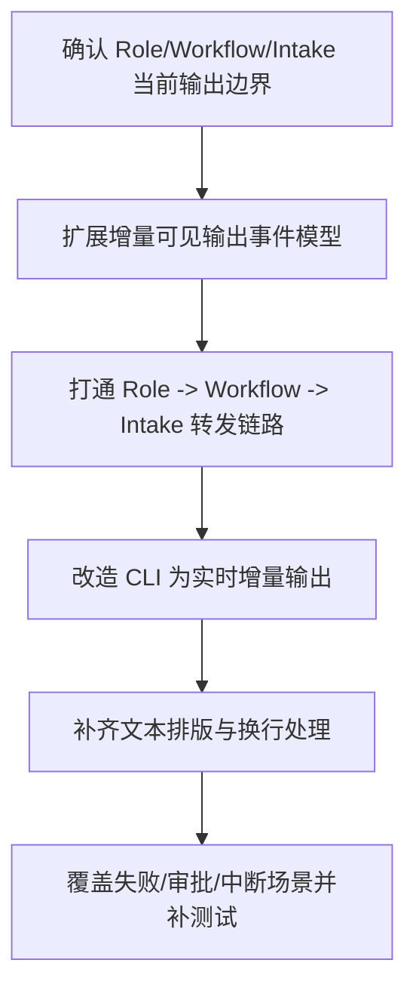

# Implementation Plan (implementationPlan)

## 概述 (summary)

- 本次实现聚焦 `default-workflow` 的 CLI 输出体验，目标是在不引入 TUI/GUI 的前提下，把当前“阶段结束后批量打印骨架事件”的输出方式收敛成“角色内容可透传、事件可增量转发、CLI 可基础排版”的流式反馈链路。
- 实现建议拆成 6 步：补齐事件模型、打通 `Role -> Workflow -> Intake` 可见内容转发、调整 CLI 为增量输出、补一个基础文本排版层、处理失败/审批/中断场景、补齐测试与验收。
- 当前最大的风险不是单点渲染问题，而是现有链路从 `Role.run(...)` 到 CLI 都按“最终结果一次性返回”设计；如果只改 CLI 打印而不改事件与执行边界，无法实现真正的流式反馈。
- 最需要注意的是“骨架事件”和“角色真实输出”必须同时存在；不能为了展示角色内容而丢掉 `phase_start` / `role_end` 这些结构性状态提示。
- 当前仍有一个实现缺口需要显式处理：现有 `Role` 公共接口只返回最终 `RoleResult`，没有现成的增量输出通道，因此本次实现要么新增角色流式回调/事件机制，要么在统一执行器层补出增量桥接。

---

## 输入依据 (inputBasis)

- PRD：`roleflow/clarifications/0.1.0/default-workflow-cli-streaming-output-prd.md`
- 相关需求：`roleflow/clarifications/0.1.0/default-workflow-intake-layer-prd.md`
- 相关需求：`roleflow/clarifications/0.1.0/default-workflow-workflow-layer-prd.md`
- 项目上下文：`roleflow/context/project.md`
- 计划模板：`roleflow/templates/plan/implementationPlan.md`
- 当前实现参考：`src/cli/index.ts`
- 当前实现参考：`src/default-workflow/intake/agent.ts`
- 当前实现参考：`src/default-workflow/workflow/controller.ts`
- 当前实现参考：`src/default-workflow/role/model.ts`
- 当前类型定义：`src/default-workflow/shared/types.ts`
- 当前测试参考：`src/default-workflow/testing/agent.test.ts`
- 当前测试参考：`src/default-workflow/testing/runtime.test.ts`

缺失信息：

- 当前代码实现中的公共类型还没有完整落地 `project.md` 已确认的“角色增量可见输出”事件语义；现有 `shared/types.ts` 仍只有骨架事件与通用 `progress`。
- 当前仓库里没有独立的 CLI 文本格式化模块；换行、段落、列表和代码块如何统一排版，需要在实现中收敛成明确规则。

---

## 实现目标 (implementationGoals)

- 新增一条可验证的 `Role -> Workflow -> Intake -> CLI` 增量输出链路，使角色的用户可见内容不再只能等到最终 `RoleResult` 返回后才出现。
- 扩展 `Workflow` 的事件/消息表达，显式承载角色的用户可见增量内容、最终摘要与阶段骨架事件，避免 CLI 只能消费 `[WorkflowEvent:xxx]` 这种原始骨架串。
- 调整 `IntakeAgent` 的输出处理方式，使其不再依赖 `handleUserInput()` 完成后整批返回所有文本，而是能够持续接收并展示运行中事件。
- 新增基础文本排版层，至少统一处理换行、段落、列表、代码块边界和 `\n` 转实际换行的问题。
- 保持 `Workflow` 仍是 `Role -> Intake` 的中间协调层，`Role` 不直接写 CLI，`Intake` 也不直接调用 `Role`。
- 最终交付结果应达到：用户仅通过 CLI 就能持续看到任务当前在做什么、哪个角色正在输出什么、阶段是否结束，以及失败/等待审批/中断时的可读状态。

---

## 实现策略 (implementationStrategy)

- 采用“事件链路扩展 + CLI 渲染收敛”的局部改造策略，不重写 Intake/Workflow 主流程，而是在现有事件模型和输出循环上补齐增量消息能力。
- 把当前代码实现中的 `WorkflowEvent` 收敛到 `project.md` 已确认的流式语义，使其能够稳定承载骨架状态与角色可见内容，或新增与其配套的流式消息结构，但不让 `Intake` 越过 `Workflow` 直接拿角色输出。
- 在角色执行链路中补出用户可见内容回调/桥接层，让统一角色执行器在产生中间文本时就能交给 `Workflow` 立刻转发，而不是只在 `RoleResult` 阶段统一汇总。
- 将 `IntakeAgent` 从“监听事件后写入数组缓冲，等 Workflow 返回后一次性取出”收敛为“事件到达即转发给 CLI 输出层”，避免当前 `workflowOutputBuffer` 把流式信息重新变成批处理。
- 为 CLI 输出新增最小文本格式化模块，对消息顺序做保序处理，对段落与代码块做轻量排版，但不引入颜色主题、复杂光标控制或 TUI 依赖。
- 对失败、等待审批、中断场景沿用同一排版和消息通道，避免这些分支再次退化成原始对象串或未格式化日志文本。

---

## 实施流程图 (implementationFlowchart)

---

## 当前实现差异与收敛项 (currentGapsAndConvergence)

- 当前 `src/cli/index.ts` 只会在 `agent.handleUserInput(...)` 完成后调用一次 `printLines(...)`，这意味着 CLI 天然是批量输出，不具备真实流式刷新能力。
- 当前 `IntakeAgent` 虽然监听了 `workflow_event`，但处理方式仍是把格式化字符串写进 `workflowOutputBuffer`，待 `dispatchRuntimeEvent(...)` 返回后再整批吐出；这会把本可实时到达的事件重新压成“执行结束后统一显示”。
- 当前 `WorkflowController` 代码实现已发送 `phase_start`、`role_start`、`role_end`、`artifact_created`、`progress` 等骨架事件，但尚未把 `project.md` 已确认的 `role_output` 一类角色增量可见输出语义真正落到运行时事件链路中。
- 当前 `Role.run(...)` 的公共契约只返回最终 `RoleResult`，`executeRoleAgent(...)` 也是一次性等待模型返回并解析结果；这和 PRD 要求的“角色持续执行时持续展示中间内容”之间存在明确缺口。
- 当前 `IntakeAgent.formatWorkflowEvent(...)` 会把事件统一压成单行 `[WorkflowEvent:...] message=... metadata=...`，并直接使用 `JSON.stringify` 输出 metadata；这与 PRD 要求的换行、段落、列表和代码块可读性明显不一致。
- 当前测试主要验证骨架事件是否被打印、恢复链路是否可用，但还没有把“角色内容透传”“真实换行显示”“流式顺序保留”和“失败/审批/中断场景可读性”提升为明确验收。

---

## 验收目标 (acceptanceTargets)

- 任务运行过程中，CLI 能持续看到增量更新，而不是只在 `handleUserInput()` 对应的整轮执行结束后一次性打印全部输出。
- 角色的用户可见输出能够通过 `Workflow` 转发到 `Intake`，并最终展示在 CLI 中，而不是只有 `phase_start`、`role_end` 这类骨架事件可见。
- CLI 正确处理 `\n`，用户看到的是实际换行、段落、列表和代码块边界，而不是被压成单行长串。
- 输出顺序与上下文保持稳定，用户可以分辨当前处于哪个阶段、哪个角色正在输出、哪些内容是中间过程、哪些内容是最终结果。
- `task_start`、`phase_start`、`phase_end`、`role_start`、`role_end`、`artifact_created` 等骨架事件仍然保留，不因新增角色内容透传而消失。
- 在失败、中断、等待审批场景下，CLI 仍保持同一套可读输出规则，已产生的角色内容不会被覆盖或丢失。
- 至少存在一组自动化测试或可执行校验，证明流式输出、角色内容透传、换行/段落排版和顺序保留都已成立。

---

## Open Questions

- 现有 `Role.run(...)` 只返回最终 `RoleResult`，本次要采用“扩展角色执行器增量回调”还是“扩展 Workflow 事件桥接层”来承载角色流式内容，PRD 未固定具体实现形态。
- 流式增量内容与最终 `RoleResult.summary` / `artifacts` 之间的去重策略尚未明确；若处理不当，CLI 可能同时看到中间内容和最终摘要的重复输出。

---

## Todolist (todoList)

- [x] 盘点 `src/cli/index.ts`、`intake/agent.ts`、`workflow/controller.ts`、`role/model.ts` 的当前输出链路，锁定阻塞流式展示的关键边界。
- [x] 设计并收敛角色增量可见输出的事件模型，明确它与现有 `WorkflowEvent` 骨架事件的关系。
- [x] 在 `Role -> Workflow` 之间补出用户可见内容的增量转发机制，避免角色输出只能在最终 `RoleResult` 返回后出现。
- [x] 调整 `WorkflowController` 的事件发送逻辑，使骨架事件与角色内容都能统一、有序地广播给 `Intake`。
- [x] 改造 `IntakeAgent`，把当前基于 `workflowOutputBuffer` 的批量收集模式调整为实时接收和转发模式。
- [x] 调整 `src/cli/index.ts` 的输出循环，使 CLI 可以在任务执行过程中持续打印新增内容，而不是等待整轮调用结束。
- [x] 新增基础文本格式化模块或统一格式化函数，处理换行、段落、列表、代码块与 `\n` 转实际换行。
- [x] 补充失败、中断、等待审批场景下的输出策略，确保错误与状态信息也按统一规则排版且保持顺序。
- [x] 更新或新增测试，覆盖流式输出、角色内容透传、`\n` 正确显示、骨架事件保留、以及失败/审批/中断场景的可读性。
- [x] 完成自检，确认本次实现不引入新的 workflow / role，也不扩展到 GUI/TUI 范围。
