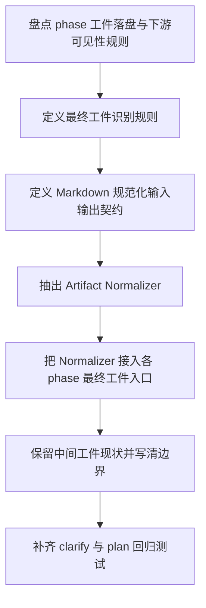

# Implementation Plan (implementationPlan)

## 概述 (summary)

- 本次实现聚焦 `default-workflow` 的最终工件落盘边界，目标是在保留 `RoleResult` 运行时结构化协议的前提下，把各 phase 的最终工件 `.md` 文件收敛为真正可读的 Markdown 文档。
- 实现建议拆成 6 步：定义规范化输入输出契约、抽出统一 Artifact Normalizer、识别并接入最终工件保存入口、接入 `clarify/final-prd` 与 `plan` 最终计划工件链路、收敛 prompt/契约表述、补齐 `clarify` 与 `plan` 回归测试。
- 最关键的风险点是“去 JSON 化”过程中既不能把原始包络直接写盘，也不能因规范化过度而丢失 `summary`、阻塞问题和对人类阅读有价值的 `metadata`。
- 最需要注意的是不能只在 `clarify` 上打补丁；`plan` 阶段当前也通过通用 `roleResult.artifacts` 落盘，因此必须让通用工件保存路径和 `clarify` 特殊路径共享同一套规范化策略。
- 当前仍有两个输入缺口需要显式记录：`roleflow/context/standards/common-mistakes.md` 在仓库中不存在，`roleflow/context/standards/coding-standards.md` 当前为空；此外，哪些 `metadata` 字段应进入正文尚无独立 schema，本计划会在实现内统一收敛规则。对于非最终中间工件是否也同步去 JSON 化，仍保持 PRD 的开放状态，但这不影响本期先把“各 phase 最终工件”规则落定。

---

## 输入依据 (inputBasis)

- PRD：`roleflow/clarifications/0.1.0/default-workflow-final-artifact-markdown-output-prd.md`
- 关联需求：`roleflow/clarifications/0.1.0/default-workflow-role-layer-prd.md`
- 角色职责：`roleflow/context/roles/planner.md`
- 计划模板：`roleflow/templates/plan/implementationPlan.md`
- 当前实现参考：`src/default-workflow/workflow/controller.ts`
- 当前实现参考：`src/default-workflow/persistence/task-store.ts`
- 当前实现参考：`src/default-workflow/role/model.ts`
- 当前类型定义：`src/default-workflow/shared/types.ts`
- 当前测试参考：`src/default-workflow/testing/runtime.test.ts`
- 现有 implementation 参考：`roleflow/implementation/0.1.0/default-workflow-role-layer.md`
- 现有 implementation 参考：`roleflow/implementation/0.1.0/default-workflow-workflow-layer.md`

缺失信息：

- `roleflow/context/standards/common-mistakes.md` 当前不存在，无法作为实现约束输入。
- `roleflow/context/standards/coding-standards.md` 当前为空，未提供可执行编码规范。
- 当前没有单独的“人类可读 metadata 白名单”规范；实现时需要在 Normalizer 内定义统一保留规则，避免不同 phase 各自拼接。
- 当前没有显式的“最终主工件”类型字段；本计划将把“最终工件”识别规则直接写成统一约束：凡是当前 `Workflow` 会在 phase 完成后作为该 phase 主输出暴露给下游 phase 的工件，即视为该 phase 的最终工件。按现有实现，`clarify` 的最终工件固定为 `final-prd`，其他 phase 当前默认收敛为该 phase 的首个主工件（即现有可见性规则选中的第一个工件）。

---

## 实现目标 (implementationGoals)

- 新增一套面向 `default-workflow` 最终工件的 Markdown 规范化能力，使落盘到 `.aegisflow/artifacts/tasks/<taskId>/artifacts/<phase>/*.md` 的最终工件始终是可读 Markdown。
- 修改 `WorkflowController` 的最终工件保存链路，让已确认范围内的最终工件在落盘前经过统一规范化，而不是直接把 `RoleResult.artifacts` 原样写盘。
- 保持 `RoleResult` 作为运行时结构化协议不变，继续服务于 `artifactReady`、`phaseCompleted`、`metadata` 等宿主判断，不把机器协议与人读正文混为一体。
- 保持 `FileArtifactManager.saveArtifact(...)` 的“原样写入”职责不变，把可读性收敛放在 `Workflow` 边界完成，而不是把持久化层变成隐式业务改写层。
- 收敛角色输出契约与提示词表述，使角色默认以“直接输出人类可读 Markdown 正文”为目标，Normalizer 只作为兜底而不是主路径依赖。
- 明确 `summary`、阻塞问题、待确认项和有助于理解的 `metadata` 的保留方式，统一转换为可读 Markdown 章节，而不是继续保留裸 JSON 键值展示；并把“信息确实被保留”纳入测试与验收，而不只是验证“正文不再是 JSON 包络”。
- 最终交付结果应达到：各 phase 的最终工件打开后均直接呈现可读文档正文；`clarify/final-prd.md` 与 `plan` 阶段最终计划工件作为最小回归样本必须首先覆盖。若模型输出包络 JSON 或 JSON 风格正文，系统会先解包/规范化再落盘。本期不要求把所有非最终中间工件一并纳入强制收敛目标。

---

## 实现策略 (implementationStrategy)

- 采用“Workflow 最终工件落盘边界收敛”的局部改造策略，在现有 `Role -> Workflow -> ArtifactManager` 链路上插入统一规范化层，不整体重构 `RoleResult`、`ArtifactManager` 或 phase 编排。
- 抽出独立的 Artifact Normalizer 纯函数或小模块，输入至少包含 `phase`、`roleName`、`artifactKey`、原始 artifact 字符串、`RoleResult.summary`、`RoleResult.metadata`，输出可直接落盘的 Markdown 文本。
- `clarify` 特殊 `final-prd` 保存路径与其他 phase 的“最终工件入口”复用同一个 Normalizer。实现上应先把“最终工件选择规则”固化，再让 Normalizer 只命中这些入口，避免 scope 漂移为“所有工件统一改写”。
- 规范化规则采用“优先保留正文、附加保留信息、失败则显式报错”的顺序：先识别真实正文，再附加摘要/补充信息章节；若仍无法得到可读正文，则进入失败路径，不允许把未经处理的 JSON 直接视为成功工件。
- 对已是可读 Markdown 的正文采取最小改写策略，避免为了统一格式而重写已有可读内容；只有在检测到完整 `RoleResult` JSON、JSON 字符串、JSON fenced block 或明显机器包络时才执行解包与结构化转换。
- 对 `artifactReady`、`phaseCompleted` 这类宿主判断字段保持“运行时优先”原则：默认不写入正文；仅当实现要表达“当前结论为阻塞/暂停”时，才把相关结论转译为人类可读摘要，而不是保留布尔键值。
- 同步收敛角色执行协议文案，使 `artifacts` 的语义从“可直接落盘为 md 的完整内容”进一步明确为“应优先返回最终面向人阅读的 Markdown 正文；若返回的是机器包络，Workflow 会视为兜底异常输入并规范化处理”。

---

## 实施流程图 (implementationFlowchart)

---

## 当前实现差异与收敛项 (currentGapsAndConvergence)

- 当前 `src/default-workflow/workflow/controller.ts` 在通用 phase 中会直接遍历 `roleResult.artifacts` 并原样传给 `artifactManager.saveArtifact(...)`，不存在任何显式的“最终工件”识别与人读友好化处理。
- 当前 `clarify` 最终 PRD 路径只做 `prdResult.artifacts[0]?.trim()` 后直接保存，仍然无法防止 `artifacts[0]` 自身是 JSON 或完整 `RoleResult` 包络字符串。
- 当前 `src/default-workflow/persistence/task-store.ts` 的 `FileArtifactManager.saveArtifact(...)` 明确按收到的 `artifact.content` 原样写盘，这与 PRD 的判断一致；因此规范化必须发生在它之前。
- 当前 `src/default-workflow/role/model.ts` 的角色执行协议仍强调输出结构化 JSON，且 `parseRoleResultPayload()` 在解析失败时会把 `rawContent.trim()` 同时作为 `summary` 和 `artifacts[0]` 返回，这会放大“原始 JSON/协议文本被当成 Markdown 落盘”的风险。
- 当前测试主要覆盖 `clarify` 最终 PRD 是否存在、`artifactReady/phaseCompleted` 的失败路径等，但尚未建立“`.md` 文件正文不能是 JSON 包络”的回归保护。
- 当前系统对 phase 工件统一使用 `.md` 扩展名；因此不能接受“协议是 JSON，所以 md 里写 JSON 也可以”的退化实现。
- 当前 `resolveVisibleArtifactKeys(...)` 已经隐含了一套 phase 主工件选择规则：`clarify` 只向下游暴露 `clarify/final-prd`，其他 phase 当前默认只向下游暴露上一 phase 排序后的第一个工件。这个现状说明“最终工件”并非不存在，但它还没有被写成独立、稳定、面向落盘的规则。
- 当前最大的实施边界风险是：若不先把“最终工件识别规则”写清，就会在“全量工件都规范化”和“只修两个样本”之间来回漂移，导致 FR-1/FR-2 无法被证明已经落地。

---

## 规范化与信息保留策略 (normalizationAndRetentionStrategy)

- Normalizer 需要优先判断输入是否已经是可读 Markdown。若正文首要结构已表现为标题、段落、列表、表格、代码块等 Markdown 文档形态，且不存在明显 `RoleResult` 包络键值主导首屏，则应尽量原样保留。
- 若输入是完整 `RoleResult` JSON 字符串，Normalizer 必须先解包，提取其中的 `artifacts[0]` 作为正文候选，再结合外层 `summary` 与 `metadata` 生成补充章节。
- 若输入是 JSON 对象、JSON 数组或 fenced `json` 内容，但不是完整 `RoleResult` 包络，Normalizer 应把其转换为可读 Markdown，而不是继续裸露 JSON。优先使用稳定章节名，例如 `## 文档摘要`、`## Blocking Questions`、`## 补充信息`、`## Artifact Envelope`。
- `summary` 默认作为可读附加信息保留；当正文本身已经明显包含摘要且重复度很高时，可避免重复插入，但不应无规则丢弃。
- `metadata` 只保留对人类理解文档有帮助的字段，例如阻塞问题、待确认项、补充说明、决策结论、风险说明。纯宿主控制字段、调试字段和执行链路字段应留在运行时或事件层，而不是进入最终正文。
- 对 `metadata.blockingQuestions`、`metadata.openQuestions`、`metadata.notes`、`metadata.decision` 等常见结构，应优先渲染成列表或小节，不保留原始 JSON 展示形态。
- 针对信息保留的验证标准不能只检查“看起来不像 JSON”。测试必须能证明：`summary`、`blockingQuestions`、`openQuestions/notes` 等对人有价值的信息，在规范化后仍以可读 Markdown 章节、列表或说明文字出现在最终工件中。
- 当 `plan` 阶段需要表达“当前不建议继续推进”时，这一信息必须落在摘要或阻塞章节里，而不是只停留在布尔字段或 JSON 元数据中。
- 规范化失败时，系统应显式报错并进入失败或受控中断路径，不允许把原始 JSON dump 当成“成功的 Markdown 工件”继续落盘。

---

## 角色与 Workflow 契约收敛项 (roleAndWorkflowContractConvergence)

- `RoleResult` 类型名和结构保持不变，`Workflow` 继续消费 `summary`、`artifacts`、`artifactReady`、`phaseCompleted`、`metadata`。
- `Role` 层仍然返回结构化 JSON 协议，但 role prompt 应把“最终面向用户的 artifact 正文优先为 Markdown”写成正向要求，减少对 Normalizer 兜底的依赖。
- `WorkflowController` 应成为“最终工件正文”和“运行时结构化包络”之间的明确边界，负责决定哪些信息写入最终工件、哪些信息只留在事件/状态层。
- `WorkflowController` 需要把“最终工件”定义成显式规则，而不是散落在命名习惯里。当前计划采用的统一规则是：某 phase 完成后，供后续 phase 继续消费的主工件，就是该 phase 的最终工件；`clarify` 固定为 `final-prd`，其他 phase 在现阶段默认取该 phase 的主输出工件，即当前可见性规则收敛出的首个工件。
- `ArtifactManager` 不承担解释 `RoleResult`、识别 JSON 包络或筛选 metadata 的职责，只负责持久化已经完成规范化的文本。
- `task-state.json`、`task-context.json`、事件日志等机器文件保持现状，不纳入本次 Markdown 可读性收敛范围。
- 对非最终的中间工件，本期默认保持现状；但各 phase 的最终工件必须全部纳入统一规则，不能只修 `clarify` 与 `plan` 两个样本。

---

## 验收目标 (acceptanceTargets)

- 各 phase 的最终工件识别规则在代码中有单独入口或独立 helper，可被直接定位和验证，而不是继续隐含在零散命名与排序逻辑中。
- 新生成的 `clarify/final-prd.md` 打开后，首屏直接呈现 PRD 标题、背景、目标、范围等 Markdown 正文，而不是 `summary/artifacts/metadata` 这类 JSON 包络键值。
- 新生成的 `plan` 阶段最终计划工件打开后，首屏直接呈现实现计划正文；若存在阻塞问题、待确认项或不建议推进结论，这些信息以 Markdown 章节或列表方式出现。
- 若系统当前支持更多 phase 的最终主工件，这些工件同样遵守“最终工件先规范化再落盘”的统一约束，而不是只对 `clarify` 与 `plan` 打补丁。
- 当角色返回完整 `RoleResult` JSON 字符串、JSON fenced block 或 JSON 风格 artifact 正文时，系统会在落盘前成功解包/转换；规范化失败时不会把原始 JSON 作为成功工件写入 `.md`。
- 当输入包含 `summary`、`metadata.blockingQuestions`、`metadata.openQuestions`、`metadata.notes` 或等价补充说明时，最终工件中必须存在这些信息的可读 Markdown 表达，不能只满足“去 JSON 化”而静默丢失内容。
- 针对 `plan` 阶段，若原始结果中含有阻塞问题或“不建议继续推进”的结论，最终工件必须能直接读到对应章节、列表或摘要说明，而不是只剩无阻塞的计划正文。
- `artifactReady` 与 `phaseCompleted` 仍可被 `WorkflowController` 正常消费，不因最终工件转为人读 Markdown 而破坏宿主判断语义。
- `FileArtifactManager.saveArtifact(...)` 仍保持原样写入职责，没有在持久化层偷偷引入协议解析或业务兜底。
- 至少存在覆盖 `clarify` 与 `plan` 的自动化测试或等价校验，不仅要防止 `.md` 文件再次回归为原始 JSON 包络，也要断言 `summary`、阻塞问题和补充说明等信息被保留为可读 Markdown。

---

## Open Questions

- `summary`、`artifactReady`、`phaseCompleted` 是否都需要进入最终工件正文，还是部分仅保留在事件/状态层；本计划当前倾向于“`summary` 默认保留，`artifactReady/phaseCompleted` 默认不入正文，除非需要表达阻塞/暂停结论”，但实现时仍需写成明确规则。
- 对于非最终的中间工件，是否也要统一执行“可读 Markdown，不得是 JSON dump”的约束；本计划当前仍按 PRD 保持开放，但不影响先把“各 phase 最终工件”的统一规则落地。

---

## Assumptions

- 当前用户主要关心的是最终工件的人类可读性，而不是所有中间工件的展示一致性。
- `clarify/final-prd` 与 `plan` 最终计划工件足以代表本期最小问题样本，但不是唯一实现范围；其他 phase 的最终工件应沿同一选择规则自动纳入。
- 若某些结构化字段只服务宿主判断、对人类阅读没有实际价值，允许不进入正文，但不得因此影响 `Workflow` 的既有状态消费。

---

## Todolist (todoList)

- [x] 盘点 `WorkflowController` 中 phase 工件落盘、下游可见性和命名逻辑，提炼出统一的“最终工件识别规则”。
- [x] 在 `Workflow` 层新增或收敛最终工件选择入口，明确 `clarify -> final-prd`，其余 phase 默认选择该 phase 的主输出工件（即当前规则下会暴露给下一 phase 的首个工件）。
- [x] 设计 Artifact Normalizer 的输入输出契约，明确其至少接收 `phase`、`roleName`、`artifactKey`、原始 artifact 内容、`summary` 与 `metadata`。
- [x] 实现对完整 `RoleResult` JSON 字符串的解包逻辑，确保能提取真实正文并保留人类可读的补充信息。
- [x] 实现对 JSON 对象、JSON 数组和 fenced `json` artifact 内容的 Markdown 结构化转换逻辑。
- [x] 定义并实现 `metadata` 信息保留白名单与渲染规则，重点覆盖阻塞问题、待确认项、补充说明和结论性字段。
- [x] 将各 phase 的最终工件保存入口接入 Normalizer，保证统一规则先选出“最终工件正文”，再决定是否规范化。
- [x] 重点校对 `clarify/final-prd` 与 `plan` 最终计划工件两类已知问题样本，确认它们在统一规则下不会被遗漏。
- [x] 在实现说明或代码注释中写清“Normalizer 作用于各 phase 最终工件入口，而非所有中间工件”，避免 Builder 误把其扩展到全部工件。
- [x] 收敛 `role/model.ts` 中的角色执行协议文案，强调 `artifacts` 应优先返回人类可读 Markdown 正文，Normalizer 仅作兜底。
- [x] 根据实现需要补充纯函数级测试，覆盖“已是可读 Markdown”“完整 RoleResult JSON”“JSON fenced block”“metadata 阻塞问题渲染”“summary/补充说明保留”“规范化失败”几类输入，并显式断言输出中存在对应 Markdown 章节或列表。
- [x] 更新 `runtime.test.ts` 或等价集成测试，至少覆盖 `clarify/final-prd.md` 与 `plan` 阶段工件不再落盘为原始 JSON 包络，并断言 `summary`、`blockingQuestions`、补充说明或结论性字段在最终工件中可直接阅读，同时校验统一的最终工件识别规则可被下游消费。
- [x] 完成自检，确认机器状态文件仍保持 JSON，最终工件规则已覆盖各 phase 主工件，而非只修两个样本。
