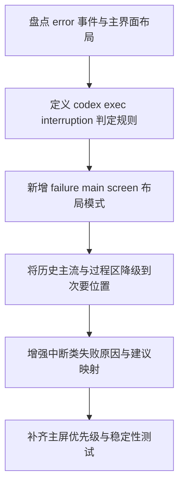

# Implementation Plan (implementationPlan)

## 概述 (summary)

- 本次实现聚焦 `default-workflow` Intake UI 在 `codex exec` 中断失败后的主屏展示优先级，目标不是再补一个更醒目的错误块，而是让最终失败信息页直接成为主输出区域的主内容。
- 实现建议拆成 6 步：盘点当前失败链路与主屏布局、定义 `codex exec interruption` 识别规则、增加 failure main screen 布局模式、收敛历史主输出与过程区的降级策略、增强中断类下一步建议、补齐主屏优先级防回退测试。
- 当前最大的风险不是采集不到失败原因，而是当前 `currentError` 虽已存在，主界面仍由时间流和 `task_end("任务执行失败。")` 维持阅读中心，用户依然可能先感知到通用失败口号。
- 最需要注意的是本次范围只覆盖 `codex exec` 中断类失败的主屏模式，不要求本期把所有失败类型都统一改造成同等级别的主屏失败页。
- 当前输入仍有规范缺口：`roleflow/context/standards/common-mistakes.md` 缺失，`roleflow/context/standards/coding-standards.md` 为空；同时仓库里尚无专门锁定 Intake 主屏优先级的组件级测试，这需要在计划里明确补上。

---

## 输入依据 (inputBasis)

- PRD：`roleflow/clarifications/0.1.0/default-workflow-intake-codex-exec-failure-main-screen-prd.md`
- 相关需求：`roleflow/clarifications/0.1.0/default-workflow-intake-error-explainability-prd.md`
- 相关需求：`roleflow/clarifications/0.1.0/default-workflow-intake-codex-style-output-stream-prd.md`
- 项目上下文：`roleflow/context/project.md`
- 计划模板：`roleflow/templates/plan/implementationPlan.md`
- 相关历史计划：`roleflow/implementation/0.1.0/default-workflow-intake-error-explainability.md`
- 相关历史计划：`roleflow/implementation/0.1.0/default-workflow-intake-codex-style-output-stream.md`
- 当前 Intake 主界面：`src/cli/app.ts`
- 当前输出布局派生：`src/cli/output-layout.ts`
- 当前视图模型：`src/cli/ui-model.ts`
- 当前错误视图模型：`src/default-workflow/intake/error-view.ts`
- 当前 Workflow 失败收敛：`src/default-workflow/workflow/controller.ts`
- 当前 `codex exec` 执行器：`src/default-workflow/role/executor.ts`
- 当前测试参考：`src/cli/output-layout.test.ts`
- 当前测试参考：`src/cli/ui-model.test.ts`
- 当前测试参考：`src/default-workflow/testing/role.test.ts`

缺失信息：

- `roleflow/context/standards/common-mistakes.md` 当前不存在，无法作为实现约束输入。
- `roleflow/context/standards/coding-standards.md` 当前为空，未提供可执行编码规范。
- 当前没有 `src/cli/app.ts` 对应的专门组件渲染测试来保护“主屏阅读中心”语义；本计划需要把这类测试补成显式交付项。

---

## 实现目标 (implementationGoals)

- 为 `codex exec` 中断失败新增明确的 `Failure Main Screen` 模式，使失败信息页进入主输出区域最高优先级位置，而不是仅作为顶部附加错误块存在。
- 让失败摘要、失败原因、失败位置、下一步建议成为用户第一眼看到的主内容，不再由 `任务执行失败。`、`阶段执行失败。` 等通用骨架消息占据主阅读中心。
- 保留历史主输出流与失败骨架消息，但将其降级为失败页之后的次级信息，而不是继续与失败页同权竞争。
- 保持失败后的过程区退出主阅读区；对于 `codex exec` 中断终态，不再继续以运行态过程区样式占据屏幕主要位置。
- 利用现有 `IntakeErrorView` 作为失败页数据基础，同时补一层显式的“是否属于 codex exec interruption”识别规则和更有针对性的中断类建议映射。
- 最终交付结果应达到：当 `codex exec` 因 transport、provider、timeout、额度、token、网络等问题中断时，用户打开失败后的主界面，第一屏先看到的是结构化失败信息页，而不是通用失败口号或历史时间流。

---

## 实现策略 (implementationStrategy)

- 采用“失败场景识别 + 主屏布局切换 + 次级内容降级”的局部改造策略，不重写 Workflow 状态机，也不要求执行器额外回传一整套新错误模型。
- 保留 `WorkflowController.failWithError(...) -> WorkflowEvent(error) -> currentError` 现有失败数据链路；本次重点是基于已存在的 `summary/reason/location/nextAction`，在 Intake 输出层新增主屏优先级切换。
- 先在错误视图或等价布局派生层增加 `isCodexExecInterruption` 判定规则，再由 `app.ts` / `output-layout.ts` 基于该判定决定是否进入 failure main screen 模式；不要把这类判定散落到多个组件里临时拼接。
- `codex exec` 中断识别规则必须显式写死在实现中，不能留给 Builder 临场猜测；本期可优先基于现有错误原因字符串和执行链路上下文做启发式判定，而不是要求 Workflow 新增 schema。
- failure main screen 应视为主输出区域的一种布局模式，而不是继续沿用“`ErrorPanel` 在上、`OutputPanel` 在下”的附加式结构；否则无法满足 PRD 对主阅读中心的要求。
- 历史主输出流在 failure main screen 模式下仍可保留，但只能落在失败页之后，且应以明显次级标题或间距隔开，避免与失败页争夺第一屏。
- 对中断类失败的下一步建议采用规则驱动增强：优先覆盖 transport/provider、timeout、网络、token/quota/额度、认证或配置修正后恢复等高频方向，不追求一次性穷举所有错误。
- 测试层重点保护“主屏优先级与稳定性”，而不是仅断言 `currentError` 已存在；否则会继续出现数据有了、主界面却仍只显得像普通失败日志的回归。

---

## 实施流程图 (implementationFlowchart)

---

## 当前实现差异与收敛项 (currentGapsAndConvergence)

- 当前 `src/default-workflow/workflow/controller.ts` 的 `failWithError(...)` 已先发 `error` 事件，再发 `task_end("任务执行失败。")`；因此失败原因并非采集不到，问题在于后续布局没有把它提升为主内容。
- 当前 `src/default-workflow/intake/error-view.ts` 已能生成 `summary/reason/location/nextAction`，说明失败页基础数据模型已经存在，不需要再发明一套平行错误结构。
- 当前 `src/cli/ui-model.ts` 在收到 `error` 事件后会设置 `currentError`，并且在后续 `task_end(status=failed)` 到来时仍会保留该错误对象；这意味着“失败终态稳定可见”的状态基础已经具备。
- 当前真正的缺口在 `src/cli/app.ts`：`ErrorPanel` 只是 `StatusBar` 下方的一个附加块，`OutputPanel` 仍独立承担主阅读区域，失败页没有进入主输出中心。
- 当前 `src/cli/output-layout.ts` 只派生 `main_stream` 与 `process` 两类区域，没有专门的 `failure_main_screen` 或等价优先布局；因此 `task_end`、`错误事件`、历史结果流仍会继续占据主流位置。
- 当前 `process` 区在 `taskStatus !== "running"` 时已经不再显示，这与 PRD 的失败后过程区退出主阅读区方向一致；本次重点不是再修过程区显隐，而是让失败页接管主区域。
- 当前 `createIntakeErrorViewFromWorkflowEvent(...)` 的 `nextAction` 规则对一般 phase/role 失败已有基础建议，但对 `codex exec` 中断类错误仍偏泛化，尚未显式覆盖 transport/provider、timeout、token/quota、网络等常见执行器中断语义。
- 当前没有专门验证“失败页是否成为主屏第一内容”的 UI/布局测试；现有测试主要覆盖错误对象存在性、错误文案格式化和执行器失败包装，无法阻止布局回退成“只有任务失败口号”的体验。

---

## 失败主屏触发规则 (failureMainScreenActivationRules)

- 只有在满足以下两个条件时，才进入本 PRD 约束的 `Failure Main Screen` 模式：
  - 任务已进入失败终态。
  - 当前失败可判定为 `codex exec interruption`。
- `codex exec interruption` 的识别规则必须在计划中写成显式实现决定，推荐优先使用现有 `currentError.reason` / `metadata.error` 的字符串特征与执行链路上下文联合判定，例如：
  - `Role agent execution failed:`
  - `executor timed out`
  - `executor exited with code`
  - `executor transport error`
  - `codex exited with code`
  - 与网络、token、quota、额度、provider、transport、authentication 相关的错误语义
- 若当前只能拿到包装后的错误字符串，也应按包装后的直接原因进入识别，不得因为缺少结构化字段就退回成普通失败显示。
- scope decision：本期不要求为了主屏失败模式去扩展 Workflow 事件 schema；优先在 Intake 侧基于既有错误原因与失败位置做稳定识别。
- 对非 `codex exec` 中断类失败，可继续沿用既有错误展示策略；本次不把全部失败类型都强行纳入相同的 failure main screen。

---

## 主屏布局收敛要求 (failureMainScreenLayoutRequirements)

- failure main screen 必须出现在主输出区域最高优先级位置，成为用户第一眼看到的主内容，而不是仅在主区域前方再加一个普通错误块。
- 失败页至少要稳定承载四类信息：
  - `失败摘要`
  - `失败原因`
  - `失败位置`
  - `下一步建议`
- 失败原因必须优先显示执行器中断的直接原因；`任务执行失败。`、`阶段执行失败。`、`Role agent execution failed.` 等通用口号可以保留，但只能作为摘要或上下文，不能成为主内容唯一正文。
- failure main screen 模式下，历史主输出流若继续显示，必须落在失败页之后，并通过标题、留白或弱化样式明确其为“历史输出/上下文”，不能继续与失败页同权混排。
- 当前顶部 `ErrorPanel` 若继续保留，只能作为失败主屏的一部分或其轻量头部，不能再和主区域失败页形成重复竞争；更推荐直接把其职责并入主区域失败页。
- 一旦进入失败终态，failure main screen 必须稳定保留，不能因为随后到来的 `task_end`、状态刷新或骨架更新被顶掉、清空或弱化。

---

## 中断类内容收敛要求 (interruptionContentRequirements)

- 失败原因优先展示直接执行器原因，而不是过度抽象后的工作流口号。
- 失败位置必须尽量保留 `phase` 与 `roleName`；若错误链路可稳定判断是执行器侧中断，也应在原因或位置中体现这一点。
- 下一步建议必须对中断类失败更具体，至少覆盖以下方向之一：
  - 检查网络或执行环境
  - 检查模型额度 / token 配额
  - 稍后重试
  - 修正 provider / transport / 认证配置后恢复或重新发起任务
- 对 timeout 类失败，应直接给出“检查超时配置、执行环境或稍后重试”方向，而不是笼统“重新发起任务”。
- 对 transport/provider 错误，应优先提示执行环境、命令可用性、认证或 provider 配置检查。
- 对 token/quota/额度类错误，应优先提示额度或配额检查，而不是继续落入通用 phase/role 建议。

---

## 历史输出与过程区降级要求 (secondaryContentRequirements)

- failure main screen 生效后，历史主输出流只能作为次要信息保留，不能继续处于第一屏中心位置。
- 若保留历史主输出流，应优先保留上下文价值较高的内容，例如失败前的关键系统消息、阶段上下文和结果流，而不是让 `task_end("任务执行失败。")` 这类口号成为最醒目的最新消息。
- 失败后的过程区默认不应继续以运行态过程区形式显示；当前实现已在非运行态隐藏 `process` 区，本次需要把这条行为写成显式防回退约束。
- 失败页与历史主流之间应有清楚的层级分隔，避免看起来像“一堆日志里插了一块错误说明”。

---

## 测试与防回退要求 (regressionProtectionRequirements)

- 至少需要一类布局测试或等价校验，显式断言：当 `codex exec` 中断类错误进入失败终态时，主屏第一内容是 failure main screen，而不是 `task_end` 或普通历史输出。
- 至少需要一类测试显式断言：failure main screen 中稳定可见 `summary/reason/location/nextAction` 四类信息，而不是只有摘要。
- 至少需要一类测试覆盖 transport/provider 错误、timeout 错误和执行器包装错误字符串，证明这些场景都会进入 `codex exec interruption` 主屏模式。
- 至少需要一类测试断言：失败终态下即使 `task_end("任务执行失败。")` 到来，failure main screen 仍保持可见且优先级不变。
- 至少需要一类测试断言：失败终态下过程区不再作为主区显示，避免运行态样式残留误导用户。
- 至少需要一类测试断言：非 `codex exec` 中断类失败不会被误识别成该主屏模式，确保本次范围不外扩为“所有失败都一律主屏接管”。
- 若当前缺少 `app.ts` 渲染测试基础，需至少在 `output-layout`、错误视图派生层或等价 presenter 层补一组能表达“主内容优先级”的测试，而不是只测字符串格式化。

---

## 验收目标 (acceptanceTargets)

- 当 `codex exec` 因 transport、provider、timeout、网络、token、额度等问题中断时，主屏第一眼显示的是结构化失败信息页，而不是仅“任务执行失败”。
- 失败信息页中可见失败摘要、失败原因、失败位置和下一步建议，且失败原因优先展示直接执行器中断原因。
- `task_end("任务执行失败。")`、`阶段执行失败。` 等通用骨架消息不会继续成为主内容中心。
- 失败后的历史主输出仍可保留，但已明显降级为失败页之后的次级内容。
- 失败后的过程区不会继续以运行态主区样式存在。
- failure main screen 在失败终态后稳定可见，不会被后续状态刷新或骨架消息顶掉。
- 自动化测试或等价校验能够识别“只剩通用失败口号、没有 failure main screen”的回归。

---

## Open Questions

- 无；本期已将“如何识别 `codex exec interruption`”收敛为 Intake 侧基于现有错误原因字符串和执行链路上下文的显式实现决定，不留给 Builder 在实现时临时选择。

---

## Assumptions

- 用户本次重点要求的是 `codex exec` 中断类失败必须成为主屏主内容，不要求本期把所有失败类型都统一改造成同样的主屏失败页。
- 当前 `IntakeErrorView` 的 `summary/reason/location/nextAction` 结构足以承载 failure main screen 的正文，不需要重新发明一套并行错误数据模型。
- 当前 `currentError` 在失败终态已具备稳定保留基础，因此主问题主要在布局与优先级，而不是错误状态会被清空。
- 当前 `process` 区在非运行态已默认隐藏，本次只需把这条行为固化为失败主屏模式下的明确约束。

---

## Todolist (todoList)

- [x] 盘点 `WorkflowController.failWithError(...)`、`createIntakeErrorViewFromWorkflowEvent(...)`、`app.ts`、`output-layout.ts` 中现有失败采集与主屏展示链路，明确当前主问题是优先级不足而非错误原因缺失。
- [x] 为 `codex exec interruption` 定义显式识别规则，优先基于现有错误原因字符串、执行链路上下文和失败位置字段，不扩展 Workflow schema。
- [x] 设计 failure main screen 的布局模式，使其进入主输出区域最高优先级位置，而不是继续作为顶部附加 `ErrorPanel`。
- [x] 保留历史主输出流但收敛其降级策略，明确失败页之后才允许展示历史消息，避免 `task_end` 与失败页争夺阅读中心。
- [x] 将失败终态下过程区退出主阅读区的行为写成明确实现要求，并补上对应防回退校验。
- [x] 为 transport/provider、timeout、网络、token/quota/额度等中断类原因补充更有针对性的下一步建议规则。
- [x] 收敛 `ErrorPanel` 与主区域失败页的职责边界，避免重复展示或继续出现“错误块在上、主内容仍是时间流”的附加式结构。
- [x] 更新或新增布局级测试 / presenter 级测试，覆盖 failure main screen 触发、四类信息完整展示、失败终态稳定可见、`task_end` 不再抢主内容、过程区退出主区，以及非中断类失败不误触发等场景。
- [x] 在 `error-view.ts` 中显式收敛 `codex exec interruption` 识别规则，并把 timeout / transport/provider / token-quota 等场景映射到更具体的下一步建议。
- [x] 在 `output-layout.ts` 与 `app.ts` 中落地 `failure_main_screen` 主布局模式，保证中断类失败进入主输出首位，历史主流降级到其后，顶部重复 `ErrorPanel` 不再抢占主屏。
- [x] 收紧 `codex exec interruption` 触发条件，要求命中明确的执行器链路标记，避免仅因 provider/token/auth/timeout 等宽泛关键词就误触发主屏失败页。
- [x] 完成自检，确认本次计划没有越权修改 Workflow 状态机、执行器协议或把范围扩展成“所有失败统一主屏化”。
