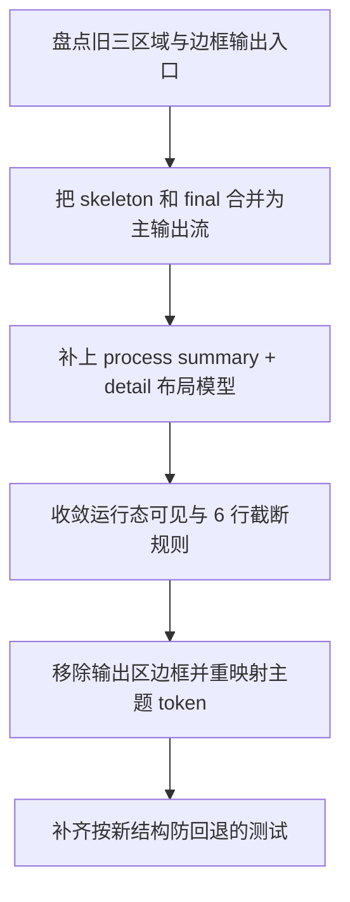

# Implementation Plan (implementationPlan)

## 概述 (summary)

- 本次实现聚焦 `default-workflow` Intake 输出区从“三区域 panel 分离”切换到更接近 `codex` 的“单主时间流 + 运行态轻量过程区”，目标是用一个主输出流承载骨架输出与结果输出，同时把过程输出收敛为仅在执行中出现的弱化辅助区。
- 实现建议拆成 6 步：盘点旧的三区域/边框实现、把主输出流改为统一时序合流、补上过程摘要与详细区模型、移除输出区边框依赖、收敛系统消息与骨架/结果色彩层级、补齐防回退测试。
- 当前最大的风险不是能力缺失，而是代码与测试已经共同强化了被新 PRD 明确覆盖的旧方向：`result/skeleton/intermediate` 固定分区、多个 `ContentSection` 边框容器、以及“过程输出在 idle 也可继续显示”的实现路径。
- 最需要注意的是本次范围只覆盖 Intake 的输出组织与相关主题 token，不扩展到 Workflow 状态机、Role 协议、工件格式，也不要求把整个 CLI 外壳都改成完全无边框。
- 当前输入仍有规范缺口：`roleflow/context/standards/common-mistakes.md` 缺失，`roleflow/context/standards/coding-standards.md` 为空；此外现有事件模型没有专门的 `process summary` 字段，本计划需要把摘要来源写成显式实现决定，避免 Builder 在实现时临时拍板。

---

## 输入依据 (inputBasis)

- PRD：`roleflow/clarifications/0.1.0/default-workflow-intake-codex-style-output-stream-prd.md`
- 相关需求：`roleflow/clarifications/0.1.0/default-workflow-intake-ink-ui-prd.md`
- 被覆盖的旧需求：`roleflow/clarifications/0.1.0/default-workflow-intake-output-structure-separation-prd.md`
- 被覆盖的旧需求：`roleflow/clarifications/0.1.0/default-workflow-intake-ui-theme-refinement-prd.md`
- 项目上下文：`roleflow/context/project.md`
- 计划模板：`roleflow/templates/plan/implementationPlan.md`
- 相关历史计划：`roleflow/implementation/0.1.0/default-workflow-intake-ink-ui.md`
- 相关历史计划：`roleflow/implementation/0.1.0/default-workflow-intake-output-structure-separation.md`
- 相关历史计划：`roleflow/implementation/0.1.0/default-workflow-role-codex-cli-output-passthrough.md`
- 当前 Intake UI 实现：`src/cli/app.ts`
- 当前输出布局实现：`src/cli/output-layout.ts`
- 当前视图模型：`src/cli/ui-model.ts`
- 当前主题 token：`src/cli/theme.ts`
- 当前测试参考：`src/cli/output-layout.test.ts`
- 当前测试参考：`src/cli/ui-model.test.ts`
- 当前测试参考：`src/cli/theme.test.ts`
- 当前 Workflow 事件类型：`src/default-workflow/shared/types.ts`
- 当前 Workflow 输出转发：`src/default-workflow/workflow/controller.ts`

缺失信息：

- `roleflow/context/standards/common-mistakes.md` 当前不存在，无法作为实现约束输入。
- `roleflow/context/standards/coding-standards.md` 当前为空，未提供可执行编码规范。
- 当前 `RoleVisibleOutput` / `WorkflowEvent` 没有独立的过程摘要字段，只有 `message + kind`；本计划默认不为此扩展协议，而是在 Intake 视图层补明确的摘要派生规则。

---

## 实现目标 (implementationGoals)

- 将 Intake 输出区从“结果区 / 骨架区 / 过程区”三个独立 panel，收敛为更接近 `codex cli` 的“Main Output Stream + Running Process Output”双层结构。
- 让 `finalBlocks` 与 `skeletonBlocks` 合并为单一主输出流，并严格基于共享排序字段按统一时序展示，而不是先分区再排序。
- 让 `过程输出` 具备稳定的“摘要 + 详细内容”双层语义，其中摘要在过程区可见时始终出现，详细内容最多展示 6 行并带明确省略语义。
- 让 `过程输出` 只在任务执行中显示；任务完成、失败、空闲或其他非运行状态时，默认不再展示过程区。
- 移除主输出流与过程输出区对边框 panel 的依赖，改由文本颜色、标签、留白和排版节奏建立层次。
- 调整系统消息正文颜色到卡其色暖调，并保留骨架输出低权重、结果输出高权重、错误输出强告警的暗红主题层级。
- 最终交付结果应达到：旧的三区域强分区方案在输出区内不再成立，新的 codex 风格主时间流和运行态过程区有明确代码边界与自动化防回退保护。

---

## 实现策略 (implementationStrategy)

- 采用“布局模型重构 + 输出渲染瘦身 + 主题映射收敛”的局部改造策略，保持 `WorkflowController`、`RoleVisibleOutput`、`CliViewModel` 的主协议边界不变，优先在 Intake 视图层完成结构切换。
- 保留 `CliViewModel` 现有的 `finalBlocks`、`skeletonBlocks`、`intermediateLines` 作为上游数据源，不回头重写 Workflow 事件协议；主输出流的融合应发生在 `output-layout` 或等价布局派生层，而不是把三类来源提前打平成一个公共存储。
- 将当前 `OutputRegionLayout = result | skeleton | intermediate` 的三区域布局模型，收敛为“主输出流布局 + 过程输出布局”的新结构，确保主阅读区只存在一个时间流入口。
- 过程摘要采用显式的 UI 派生规则：本期不新增 `WorkflowEvent` 字段，摘要优先根据 `taskStatus/currentPhase` 与最近一条 `progress` 过程文本生成；当没有可用 detail 行时，至少仍能稳定表达“当前阶段正在执行”。
- 过程详细区采用受限展示策略：仅消费 `intermediateLines` 的可见部分，最多展示 6 行，并用明确的 omission marker 表示还有更多内容未展示；该详细区不承担最终结果展示职责。
- 输出区去边框只约束 `Main Output Stream` 与 `Running Process Output`；`Status Header`、`Input Area`、错误说明等其他 CLI 壳层不作为本次强制无边框改造对象，除非为视觉一致性需要做最小配色微调。
- 测试层从“固定三区域存在”切换为“主流已合流、过程区仅运行态可见、输出区不依赖边框”的保护模型，避免旧测试继续把被覆盖的实现方向锁死。

---

## 实施流程图 (implementationFlowchart)

---

## 当前实现差异与收敛项 (currentGapsAndConvergence)

- 当前 `src/cli/output-layout.ts` 仍返回 `result`、`skeleton`、`intermediate` 三种独立 region，并按固定顺序输出；这与 PRD 要求的“骨架 + 结果合流为单主流”直接冲突。
- 当前 `src/cli/app.ts` 的 `OutputPanel` 仍包在标题为 `"输出"` 的 `ContentSection` 边框容器内，内部又继续渲染 `ResultRegion`、`SkeletonRegion`、`IntermediateRegion` 三个子区域；这正是 PRD 要替换掉的多 panel 结构。
- 当前 `ResultRegion` 与 `IntermediateRegion` 依然使用 `borderStyle: "round"` 和边框颜色作为主要层次手段，`ResultBlock` 甚至对单个结果块再套一层边框；这与 FR-7/FR-8 不一致。
- 当前 `IntermediateRegion` 只有 detail 行，没有独立摘要层；`buildOutputRegionLayout(...)` 只负责截断行数，尚未建立“摘要固定 + 详细最多 6 行”的双层语义。
- 当前 `OutputPanel` 会在非运行态传入 `MAX_VISIBLE_INTERMEDIATE_LINES_IDLE`，意味着过程输出在 idle/非运行态仍可能继续可见；这与 FR-6 的“只在执行中展示”不一致。
- 当前 `src/cli/theme.ts` 虽然已有 `THEME.result.system = "#caa472"`，但 `resolveResultToneStyle("system")` 仍把系统消息正文映射到 `THEME.text.secondary`，说明卡其色只落在标题/强调上，正文并未真正切换到 PRD 要求的暖色语义。
- 当前 `src/cli/output-layout.test.ts` 明确断言 `["result", "skeleton", "intermediate"]` 的固定区域顺序；这类测试需要改写，否则 Builder 即使实现了新结构也会被旧测试拉回。
- 当前 `src/cli/ui-model.ts` 的三路数据源本身并不构成阻碍：`UiBlock.order` 已提供共享时序，`intermediateLines` 也已独立存在；真正要收敛的是“如何派生布局”和“如何渲染输出”，而不是重新设计 Workflow 事件协议。

---

## 主输出流收敛要求 (mainOutputStreamRequirements)

- 主输出流必须成为用户阅读中心，承载所有 `finalBlocks` 与 `skeletonBlocks`，不再额外拆成独立的结果区和骨架区。
- 合流规则必须基于共享排序字段进行统一时序排序，推荐直接使用现有 `UiBlock.order` 作为唯一排序依据，不再先按 `kind` 分区后分别渲染。
- 主输出流中的每个 block 仍需保留其消息类型语义，但区分方式应为轻量文本语义，例如标题颜色、前缀标签、正文亮度和上下留白，而不是边框盒子。
- 系统消息、骨架消息、结果消息都属于主输出流成员；其中系统消息应继续作为主流消息显示，而不是被重新塞回过程区或另起系统 panel。
- 结果消息在主输出流中仍应保持最高阅读权重，骨架消息保持辅助权重，系统消息与骨架消息之间必须通过颜色拉开，不能再复用过近的正文色。

---

## 过程输出收敛要求 (processOutputRequirements)

- 过程输出必须收敛为单一轻量过程区，而不是第三个并列 panel；它的职责仅是展示运行中的临时过程信息，不承担结果展示职责。
- 过程区可见时必须同时具备两层：
  - `Process Summary`
  - `Process Detail`
- `Process Summary` 必须固定出现在 detail 之前，并且不计入 detail 的 6 行额度。
- `Process Detail` 最多展示 6 行；超出部分必须有明确 omission marker，不能仅通过静默裁切让用户无法判断是否丢失了更多过程内容。
- 在现有协议不变前提下，过程摘要来源采用显式 scope decision：
  - 优先基于 `currentPhase + taskStatus + 最近一条 progress 过程文本` 派生摘要。
  - 若当前没有可用过程文本，至少回退为阶段级运行摘要，而不是让过程区只剩空白标题。
- 过程区默认只在 `taskStatus === "running"` 时显示；即使 `intermediateLines` 中残留历史内容，在非运行态也不应继续渲染。
- 详细区建议展示“当前保留窗口内最近的 6 行”，并保持可见行自身的时间顺序；这比展示旧的前 6 行更符合运行态过程区的实时阅读预期。

---

## 无边框与主题收敛要求 (borderlessAndThemeRequirements)

- 输出区不应再复用当前 `ContentSection` 的 round border 方案作为主层次结构；主输出流与过程区应改用普通 `Box/Text` 组合和留白节奏表达层级。
- 主输出流中的单个 block 也不应继续使用边框卡片表达“结果更重要”；结果权重应转移到文本强调、颜色亮度和标题层次。
- 过程区同样不应使用独立 panel 边框；其弱化语义应主要由摘要色、detail 色、spinner/标签和与主流之间的留白来表达。
- 系统消息正文必须切到卡其色暖调，不再沿用 `text.secondary`；Builder 可以沿用 PRD 推荐区间 `#c2a76d` 到 `#caa472`，但必须确保它与骨架辅助色一眼可分。
- 骨架消息应继续保持低权重辅助色，但不能降到与过程 detail 混淆；过程 detail 仍应保持更低权重的中性色/冷灰色辅助语义。
- 输出区去边框不等于全局去边框；输入框、状态条、错误说明若当前仍依赖边框，可保持现状或做最小必要调整，但不能把这次改造扩大成整个 CLI 壳层重画。

---

## 测试与防回退要求 (regressionProtectionRequirements)

- `src/cli/output-layout.test.ts` 或等价布局测试必须从“固定三区域顺序”改为“主输出流已合流 + 过程区独立且仅运行态出现”的新预期。
- 至少需要一类测试显式断言：当 `skeletonBlocks` 与 `finalBlocks` 交错出现时，主输出流按统一时序输出，而不是先渲染全部结果再渲染全部骨架，或反之。
- 至少需要一类测试显式断言：`taskStatus !== "running"` 时，过程区默认不渲染，即使 `intermediateLines` 仍有缓存内容。
- 至少需要一类测试显式断言：过程摘要与过程 detail 同时存在时，摘要不会因 detail 更新和截断而消失，detail 也不会超过 6 行，并且存在明确 omission marker。
- 至少需要一类测试显式断言：输出区的布局模型或组件结构不再依赖 border 属性；防回退重点应放在“无边框输出结构”，而不是只验证颜色 token 改了。
- `src/cli/theme.test.ts` 或等价样式测试必须补充系统消息正文走卡其色映射，而不是继续落到 `text.secondary`。
- `src/cli/ui-model.test.ts` 需要补充或调整运行态过程摘要的派生边界，确保本期新增的 summary 规则是显式、可验证和可维护的，而不是隐藏在组件内部的临时字符串拼接。

---

## 验收目标 (acceptanceTargets)

- Intake 输出区在 UI 中不再出现“结果输出 / 骨架输出 / 过程输出”三个独立边框区域；主阅读区只保留一个合流后的主输出流，过程区仅作为运行态轻量辅助区存在。
- 主输出流能够按统一时序展示骨架消息、系统消息和结果消息，不再按旧方案分区优先级强行拆栏。
- 过程区在运行中可见，且始终先展示摘要，再展示最多 6 行 detail；超出时有明确省略语义。
- 任务结束后，默认不再展示过程区，最终阅读重心自然回到主输出流。
- 输出区层次主要依赖颜色、标签、留白和文本层级，而不是 `round border` 或 panel 边框。
- 系统消息正文已明显转为卡其色暖调，并与骨架消息颜色拉开；整体主题仍保持暗红体系。
- 自动化测试或等价校验能够识别“重新拆回三区域”“过程区在 idle 继续显示”“系统消息正文颜色回退”“输出区重新依赖边框”这类回归。

---

## Open Questions

- 无；对于当前协议缺少 `process summary` 独立字段这一点，本文已明确采用“Intake 视图层派生摘要”的实现决定，不把它留到 Builder 阶段临时裁定。

---

## Assumptions

- 用户确认本 PRD 在输出结构、边框策略、骨架/结果关系上覆盖旧的 `output-structure-separation` 与 `ui-theme-refinement` 冲突要求，Builder 不需要再兼容旧的三区域 panel 方案。
- 本次“去边框”只针对输出区本身，不要求同时移除输入区、状态区、错误说明等其他 CLI 壳层边框。
- 当前 `UiBlock.order` 在同一任务会话内可视为稳定且唯一的统一时序字段，足以支撑骨架与结果消息合流排序。
- 过程摘要允许在本期先由现有运行态上下文派生，不额外扩展 Workflow 事件协议或 Role 输出协议。

---

## Todolist (todoList)

- [x] 盘点 `src/cli/app.ts`、`src/cli/output-layout.ts`、`src/cli/theme.ts` 中所有继续强化旧三区域 panel 结构的入口，明确哪些属于本次必须替换的输出区实现。
- [x] 将当前 `OutputRegionLayout` 从 `result/skeleton/intermediate` 三类固定 region，收敛为“主输出流布局 + 过程输出布局”的新派生模型。
- [x] 基于 `UiBlock.order` 设计骨架输出与结果输出的统一合流规则，确保主输出流严格按共享时序展示，而不是继续按类型分区。
- [x] 为运行态过程区补充显式的 `Process Summary` 生成规则，并明确它只基于当前已有运行态上下文与最近过程文本派生，不扩展 Workflow 协议。
- [x] 为 `Process Detail` 落实最多 6 行的展示上限和 omission marker 规则，确保过程内容超长时不会挤占主阅读区。
- [x] 收敛过程区显隐规则，保证其仅在 `taskStatus === "running"` 时显示，非运行态默认隐藏。
- [x] 移除主输出流与过程区对 `ContentSection` / `borderStyle: "round"` / 输出块边框卡片的依赖，把层次表达转移到颜色、标签与留白。
- [x] 调整 `src/cli/theme.ts` 与相关映射函数，确保系统消息正文切到卡其色暖调，骨架/结果/过程三类文本仍保持清晰区分。
- [x] 更新 `src/cli/output-layout.test.ts`、`src/cli/theme.test.ts`、`src/cli/ui-model.test.ts` 等相关测试，把旧的固定三区域预期替换为新 PRD 对主流合流、运行态过程区、无边框输出和系统消息颜色的防回退保护。
- [x] 完成自检，确认本次计划没有越权修改 Workflow 状态机、Role 协议、工件格式，也没有把“输出区去边框”误扩展成整个 CLI 外壳的全面重绘。
