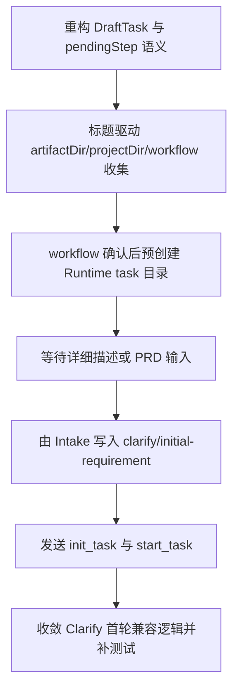

# Implementation Plan (implementationPlan)

## 概述 (summary)

- 本次实现聚焦 `default-workflow` 的 Intake 启动前置流程重排，目标是把当前“先收完整需求、再确认 workflow、随后立刻启动”的链路，改成“先收标题、再收目录与 workflow、提前创建 task、再收详细描述或 PRD、先写 `initial-requirement.md`、最后才启动”。
- 实现建议拆成 7 步：收敛 Draft 状态模型、调整 Intake 交互顺序与文案、让 workflow 推荐改为基于标题、补 Bootstrap Task Directory 创建入口、前移 `initial-requirement.md` 写入职责、收敛 Clarify 首轮行为、补齐回归测试与文档。
- 最关键的风险点是只改 Intake 提示词而不改 Runtime / Persisted Context / Clarify 写入职责；那样表面流程变化了，但 task 创建时机、上下文语义和后续消费路径仍然是旧模型。尤其是 bootstrap 后、`start_task` 前这段“已建 task 但未正式执行”的恢复语义，必须用测试锁住。
- 最需要注意的是职责边界：Intake 负责“标题、目录、workflow、bootstrap task、initial requirement 记录”，Clarify 负责“基于既有 initial requirement 做追问与生成 final PRD”，不能继续由 Clarify 首轮补写初始化工件。
- 当前没有产品层未确认问题；但规范输入存在缺口：`roleflow/context/standards/common-mistakes.md` 缺失，`roleflow/context/standards/coding-standards.md` 为空，因此本计划只能基于 PRD、项目文档和现有代码状态收敛实现方向。

---

## 输入依据 (inputBasis)

- PRD：`roleflow/clarifications/0.1.0/default-workflow-intake-initial-requirement-bootstrap-prd.md`
- 项目上下文：`roleflow/context/project.md`
- 角色规范：`roleflow/context/roles/planner.md`
- 公共规范：`roleflow/context/roles/common.md`
- 计划模板：`roleflow/templates/plan/implementationPlan.md`
- 相关历史计划：`roleflow/implementation/0.1.0/default-workflow-intake-layer.md`
- 相关历史计划：`roleflow/implementation/0.1.0/default-workflow-intake-project-workflows.md`
- 相关历史计划：`roleflow/implementation/0.1.0/default-workflow-clarify-dialogue-artifact-reinjection.md`
- 当前 Intake 实现：`src/default-workflow/intake/agent.ts`
- 当前 Runtime 构建：`src/default-workflow/runtime/builder.ts`
- 当前任务与配置类型：`src/default-workflow/shared/types.ts`
- 当前共享工具：`src/default-workflow/shared/utils.ts`
- 当前 task 落盘实现：`src/default-workflow/persistence/task-store.ts`
- 当前 Clarify 执行链路：`src/default-workflow/workflow/controller.ts`
- 当前测试参考：`src/default-workflow/testing/agent.test.ts`
- 当前测试参考：`src/default-workflow/testing/runtime.test.ts`

缺失信息：

- `roleflow/context/standards/common-mistakes.md` 当前不存在，无法作为实现约束输入。
- `roleflow/context/standards/coding-standards.md` 当前为空，未提供可执行编码规范。
- 当前仓库中没有与“bootstrap task + intake prewrite initial-requirement”完全对齐的独立 exploration 工件；本计划只能直接基于 PRD 和代码现状生成。

---

## 实现目标 (implementationGoals)

- 修改 `IntakeAgent` 的新任务启动语义，把首轮输入从 `description` 草稿改成 `requirementTitle`，并在标题阶段显式提示“不需要详细描述”。
- 保持 Intake 仍负责收集 `artifactDir`、`projectDir` 和 workflow 选择，但把 workflow 推荐输入从“完整需求描述”切换为“需求标题”。
- 在 workflow 确认完成后、正式发送 `init_task` / `start_task` 前，新增 Bootstrap Task Directory 创建能力，让 `tasks/<taskId>/` 先落盘。
- 在 task 目录已存在的前提下，新增第二轮 `initial requirement input` 收集步骤，要求用户显式提供“详细描述或者 PRD”，并等待这一轮输入。
- 把 `tasks/<taskId>/artifacts/clarify/initial-requirement.md` 的创建责任从 `WorkflowController.runClarifyPhase(...)` 前移到 Intake 启动链路。
- 收敛 Runtime / Persisted Context / Task Title 的输入语义，使“标题”和“初始需求输入”能同时存在，而不是继续只保留单个 `description` 字段。
- 保持后续 `clarify` / `explore` / `plan` / `build` 等 phase 的总体职责不变；本次只调整启动顺序、前置工件写入与 Clarify 首轮兼容逻辑。
- 最终交付结果应达到：用户先给标题，系统完成目录和 workflow 确认后先创建 task，再等待详细描述或 PRD，并在写好 `initial-requirement.md` 后才正式启动 workflow。

---

## 实现策略 (implementationStrategy)

- 采用“Intake 状态机重排 + Runtime 预创建能力补齐 + Clarify 首轮收口”的局部改造策略，不整体重写 default workflow。
- 在 `DraftTask` 中拆出“标题”和“初始需求输入”两套字段，并围绕它们重新定义 `pendingStep` 流转，而不是继续让 `collect_description` 复用首轮输入。
- 为 Runtime 构建补一层“bootstrap only”能力，使系统可以先生成 `taskId`、初始化 task 目录和持久化上下文，再进入正式执行。
- 任务标题、taskId slug、`task-context.json`、`latestInput` 等持久化语义要从“基于 description”收敛为“基于 requirement title + initial requirement input”的双字段模型，避免后续恢复链路继续误用旧值；但实现上应优先采用最小增量字段扩展或兼容映射，避免把本次工作膨胀成 Runtime 持久化模型的大重构。
- `initial-requirement.md` 的写入应通过统一 artifact manager / named artifact 保存链路完成，避免 Intake 自行拼路径写文件造成落盘规则分叉。
- Clarify 首轮逻辑改为“若工件已存在则直接消费；若缺失则报错”，不再在首轮通过用户输入兜底补写 `initial-requirement.md`。
- 对 PRD 路径场景坚持“只记录路径，不内联正文”的最小策略；识别可以先按字符串输入语义保留，不在本次引入 PRD 文件解析能力。
- 测试优先覆盖状态流转、bootstrap task 创建时机、bootstrap 后未 `start_task` 的恢复语义、标题驱动 workflow 推荐、二段式输入、initial requirement 预写入、以及 Clarify 不覆盖既有工件。

---

## 实施流程图 (implementationFlowchart)

---

## 当前实现差异与收敛项 (currentGapsAndConvergence)

- 当前 `src/default-workflow/intake/agent.ts` 的 `startDraftTask(initialDescriptionHint)` 会把首轮输入保存为 `initialDescriptionHint`，随后通过 `collectDescription(...)` 收敛成 `description`；这与“首轮仅标题”直接冲突。
- 当前 `collectArtifactDir(...)` 在工件目录准备好后会立即进入 `collect_description` 或 `promptForProjectDirOrRecommendWorkflow(...)`，说明现有状态机仍以“收完整需求”为主轴，而不是“两段式输入”。
- 当前 `recommendWorkflowForDraft(...)` 之前依赖 `this.draft.description`，而 `selectWorkflowFromUserInput(...)` 选定 workflow 后会直接调用 `initializeRuntimeAndStartTask(...)`；这与“先创建 task，再等详细描述 / PRD，再启动”冲突。
- 当前 `buildRuntimeForNewTask(...)` 会在同一次调用里创建 `taskId`、初始化 task 目录、保存 context/state，并默认把 `description` 作为 task title 和 `latestInput`；这意味着 Runtime 输入契约本身也需要拆分。
- 当前 `PersistedTaskContext` 只有 `description` 和 `latestInput` 两个相关字段，没有表达 `requirementTitle` 与 `initialRequirementInput` 的结构化语义，恢复链路容易继续把标题误当正文。
- 当前 `WorkflowController.runClarifyPhase(...)` 在缺少 `clarify/initial-requirement` 且有输入时，会调用 `buildInitialRequirementArtifact(input)` 进行补写；这与“Intake 预写入、Clarify 不覆盖”冲突。
- 当前 `createTaskTitle(description, fallback)` 仍以完整描述生成 slug；在新流程下，它应改为优先使用 requirement title，避免 taskId 生成被第二轮输入影响。
- 当前 `task-context.json`、`workflow-events.jsonl` 和恢复逻辑默认假设 Runtime 创建时已经有完整需求；新流程需要允许“已创建 task 但尚未 start_task”的中间态存在。
- 当前恢复逻辑对“task 已落盘但 workflow 尚未正式执行”的状态没有单独约束；这部分如果只靠实现推断而没有测试，会很容易在后续重构中回退。

---

## 数据与状态模型收敛项 (stateAndDataModelConvergence)

- `DraftTask` 建议至少区分：
  - `requirementTitle`
  - `initialRequirementInput`
  - `initialRequirementInputKind`
  - `artifactInput`
  - `artifactDir`
  - `projectDir`
  - `workflowCatalog`
  - `selectedWorkflow`
  - `bootstrapTaskId`
  - `bootstrapRuntime`
- `pendingStep` 建议从当前的 `collect_description` 收敛为更明确的两段：
  - `collect_requirement_title`
  - `collect_initial_requirement`
- `BuildNewRuntimeInput` 或等价输入结构建议区分：
  - `requirementTitle`
  - `initialRequirementInput`
  - `startMode` 或等价标志
- `PersistedTaskContext` 建议补充或替换为显式字段，而不是只保留模糊的 `description`：
  - `requirementTitle`
  - `initialRequirementInput`
  - `initialRequirementInputKind`
- `createTaskTitle(...)` 的输入应改为 requirement title，而不是第二轮详细描述。
- `latestInput` 的更新语义需要重新校准：
  - bootstrap 前可为空
  - intake 第二轮写入后可记录为 `initialRequirementInput`
  - workflow 运行后再继续沿用现有更新规则

---

## Intake 与 Clarify 职责边界 (intakeClarifyBoundary)

- Intake 负责：
  - 收集 requirement title
  - 收集 artifactDir / projectDir
  - 基于 title 推荐并确认 workflow
  - 创建 bootstrap task 目录
  - 收集详细描述或 PRD
  - 写入 `clarify/initial-requirement.md`
  - 在写入成功后触发 `init_task` / `start_task`
- Clarify 负责：
  - 读取既有 `clarify/initial-requirement.md`
  - 维护 `clarify/clarify-dialogue.md`
  - 追问缺失信息
  - 生成 `clarify/final-prd.md`
- Clarify 不再负责：
  - 根据首轮用户输入兜底创建 `initial-requirement.md`
  - 用当前输入覆盖 Intake 已记录的 PRD 路径或详细描述

---

## 兼容性与风险收敛项 (compatibilityAndRiskConvergence)

- 若只在 Intake 层新增“标题提示”，但 Runtime 仍要求 `description` 才能初始化，就会导致 task 目录仍无法前置创建。
- 若 bootstrap task 目录创建后没有同步保存足够的 `task-context.json` / `task-state.json`，恢复链路可能无法识别这个“尚未正式启动”的任务。
- 若 bootstrap 态与正式运行态没有清晰区分，恢复链路可能错误触发 `resume_task`、跳过 `initial requirement` 收集，或把任务误判为可直接进入 phase 恢复。
- 若 `init_task` 与 `start_task` 之间继续默认立刻连发，就必须先保证 `initial-requirement.md` 在这两个事件之前已经落盘成功。
- 若 Clarify 仍保留“无工件时以输入补写”的旧逻辑，就会在 PRD 路径场景里覆盖 Intake 预写入结果。
- 若 PRD 路径识别策略过度复杂，容易把本期范围膨胀成“自动解析 PRD 正文”；本次应坚持只保留输入类型差异，不增加正文读取。
- 若 taskId 仍由第二轮输入决定，用户在把 PRD 放到已创建 task 目录后，后续 taskId 变化会直接破坏该流程；因此 taskId 必须在 workflow 确认后就稳定下来。
- 若 `PersistedTaskContext` / Runtime 输入语义的收敛直接扩散到所有恢复、日志、事件、角色上下文结构，本次改造会迅速失控；实现上应优先局部兼容，先满足启动前置链路所需的最小字段。

---

## 验收目标 (acceptanceTargets)

- 新任务启动第一问变为 requirement title，且文案明确“不需要详细描述”。
- workflow 推荐基于标题而不是完整需求正文。
- 工件目录与项目目录仍在 workflow 推荐前完成收集。
- workflow 确认后，系统会在正式执行前先创建 `tasks/<taskId>/` 目录。
- 用户可以在 task 目录已存在的情况下补充详细描述，或把 PRD 放进去后提供路径。
- Intake 会等待这轮 `initial requirement input`，不会自动跳过。
- `tasks/<taskId>/artifacts/clarify/initial-requirement.md` 在 `start_task` 前由 Intake 写入成功。
- 若输入是详细描述，`initial-requirement.md` 记录文本；若输入是 PRD 路径，`initial-requirement.md` 只记录路径。
- Clarify 首轮会消费既有 `initial-requirement.md`，不会覆盖这份由 Intake 预写入的工件。
- 恢复链路和 task context 能正确表达“已 bootstrap 但尚未正式执行”和“已记录 initial requirement 后开始执行”这两种状态。
- 自动化测试会显式锁住 bootstrap 后、`start_task` 前的恢复语义，避免后续实现把这段中间态退化成未创建任务或已启动任务。

---

## Todolist (todoList)

- [x] 盘点 `IntakeAgent` 当前新任务启动链路，把首轮输入、`collect_description`、workflow 推荐、Runtime 初始化、`init_task/start_task` 连发这几处旧语义逐一标出来。
- [x] 重构 `DraftTask` 与 `pendingStep`，拆出 `requirementTitle` 和 `initialRequirementInput` 两段输入，不再复用 `initialDescriptionHint/description`。
- [x] 调整 Intake 文案与状态流转，让第一问明确要求“标题，不需要详细描述”，第二问在 bootstrap task 创建后明确要求“详细描述或者 PRD”。
- [x] 修改 workflow 推荐逻辑，使其只基于 requirement title 和项目 workflow catalog 做推荐、确认与改选。
- [x] 为 Runtime / ArtifactManager 补充 bootstrap task 初始化入口，支持在 workflow 确认后先生成稳定 `taskId` 并创建 `tasks/<taskId>/` 目录。
- [x] 收敛 `createTaskTitle(...)`、`BuildNewRuntimeInput`、`PersistedTaskContext` 及相关持久化语义，使 task title、task context、latestInput 不再只绑定 `description`。
- [x] 设计 bootstrap 态的最小持久化表达，优先以增量字段或兼容映射完成 `PersistedTaskContext` / Runtime 输入收敛，避免把本次改造扩散成大范围模型重写。
- [x] 在 Intake 中新增 `initial-requirement.md` 预写入步骤，并复用统一 artifact 保存机制写入 `tasks/<taskId>/artifacts/clarify/initial-requirement.md`。
- [x] 调整 `initializeRuntimeAndStartTask(...)` 或等价入口，确保只有 `initial-requirement.md` 落盘成功后才发送 `init_task` 与 `start_task`。
- [x] 修改 `WorkflowController.runClarifyPhase(...)` 的首轮兼容逻辑：已有 `initial-requirement.md` 时直接消费，缺失时明确报错，不再用当前输入补写。
- [x] 校对 bootstrap 后到正式启动前的 `task-state.json` / `task-context.json` / 恢复索引写入行为，明确这类任务在恢复链路中的期望行为，不允许被误判为损坏、未创建或已正式运行。
- [x] 更新或新增测试，至少覆盖标题驱动推荐、workflow 确认后创建 task、bootstrap 后未 `start_task` 的恢复路径、二段式输入等待、PRD 路径只记录路径、`start_task` 发生在工件写入之后、Clarify 不覆盖预写入工件。
- [x] 完成自检，确认本次改造没有把 PRD 路径场景膨胀成正文解析能力，也没有让 taskId 在 bootstrap 后再次变化。
