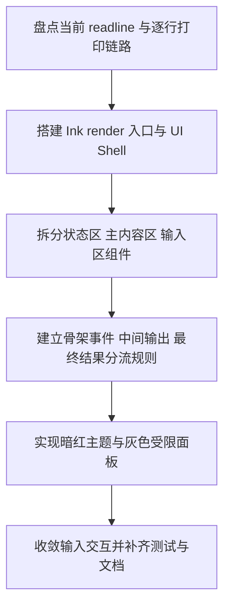

# Implementation Plan (implementationPlan)

## 概述 (summary)

- 本次实现聚焦 `default-workflow` 的 `Intake` 终端展示层升级，目标是把当前 `readline + 逐行字符串打印` 的 CLI 输出，收敛成 `Ink + React` 驱动的结构化终端 UI，并明确区分中间过程输出与最终结果展示。
- 实现建议拆成 6 步：盘点当前 CLI 输出链路、搭建 Ink 渲染入口、设计状态区/主内容区/输入区三段布局、建立事件分流规则、实现暗红主题与灰色中间输出面板、补齐输入兼容与测试文档。
- 最关键的风险点是输入交互与渲染层迁移：如果直接把现有 `readline` 逻辑硬塞进 Ink，会导致输入体验退化、布局闪烁或输出区域失控。
- 最需要注意的是 `role_output` 与骨架事件的视觉职责必须重新定义；当前实现把大部分可见文本都当成同一种字符串渲染，这与 PRD 要求的“中间输出灰色受限区 + 最终结果完整展示”明显不一致。
- 当前没有产品层未确认问题，但规范输入存在缺口：`roleflow/context/standards/common-mistakes.md` 缺失，`roleflow/context/standards/coding-standards.md` 为空；同时仓库里尚无既有 Ink UI 实现可复用。

---

## 输入依据 (inputBasis)

- PRD：`roleflow/clarifications/0.1.0/default-workflow-intake-ink-ui-prd.md`
- 项目上下文：`roleflow/context/project.md`
- 计划模板：`roleflow/templates/plan/implementationPlan.md`
- 相关历史计划：`roleflow/implementation/0.1.0/default-workflow-intake-layer.md`
- 当前 CLI 入口：`src/cli/index.ts`
- 当前 CLI 输出工具：`src/cli/output.ts`
- 当前 Intake Agent：`src/default-workflow/intake/agent.ts`
- 当前 Intake 展示格式化：`src/default-workflow/intake/output.ts`
- 当前测试参考：`src/default-workflow/testing/agent.test.ts`
- 当前测试参考：`src/cli/output.test.ts`
- 当前工程依赖：`package.json`

缺失信息：

- `roleflow/context/standards/common-mistakes.md` 当前不存在，无法作为实现约束输入。
- `roleflow/context/standards/coding-standards.md` 当前为空，未提供可执行编码规范。
- 当前没有与本 PRD 对应的独立 exploration 工件；本计划只能基于 PRD、项目文档和现有代码状态生成。
- PRD 没有要求必须引入额外的 Ink 输入组件库；因此本计划默认优先使用仓库现有 `ink + react` 能力与自定义最小输入组件，不额外依赖第三方终端输入包。

---

## 实现目标 (implementationGoals)

- 将当前 CLI 根入口从“`readline` 负责输入、`writeCliLine()` 负责逐行打印”的模式，迁移为以 `Ink + React` 为主的终端渲染入口。
- 新增稳定的 `Intake UI Shell`，至少包含顶部状态区、主内容区和底部输入提示区，并让这些区域成为固定布局，而不是临时拼接字符串。
- 新增中间输出面板与最终结果区的内容分流机制，确保 `codex exec` 的过程流进入灰色受限区域，最终结论进入主结果区域完整展示。
- 保留现有 `IntakeAgent -> Workflow -> WorkflowEvent` 的事件链路，不在本次 UI 改造中重写 `WorkflowController` 状态机或角色执行协议。
- 收敛 `WorkflowEvent`、`role_output` 与本地交互消息在 UI 中的映射规则，明确哪些内容属于骨架事件、哪些属于过程输出、哪些属于最终结果。
- 保持现有 CLI 作为任务入口层的基本可用性不变，用户仍能正常输入需求、补充信息、取消任务、中断任务和恢复任务。
- 最终交付结果应达到：CLI 启动后即进入一个暗红主调、结构稳定、可持续迭代的 Ink UI，且 `codex exec` 过程输出与最终结果在视觉上明确分层。

---

## 实现策略 (implementationStrategy)

- 采用“渲染入口替换 + 事件模型适配 + 布局组件化”的局部改造策略，不推翻现有 `IntakeAgent` 的任务逻辑，而是把展示与输入承接层从 `readline/stdout` 迁移到 Ink。
- 将当前 CLI 入口拆成两层：上层负责 `Ink.render()` 与终端生命周期，下层继续复用 `IntakeAgent` 作为业务控制器，避免把任务逻辑塞进 React 组件树。
- 以组件化方式实现 UI Shell，推荐至少拆成：`StatusBar`、`ContentPane`、`IntermediateOutputPanel`、`FinalResultBlock`、`InputPrompt`，防止布局规则继续混在字符串 formatter 中。
- 当前 `formatWorkflowEventForCli()` 的职责需要收缩：它不能继续直接决定最终打印文本，而应演进为“事件语义归一化”或“ViewModel 组装”的输入层，供 Ink 组件消费。
- 输入侧采用兼容式迁移：优先用 Ink 自身输入能力和受控输入状态承接普通输入与快捷操作，避免继续维持 `readline` 与 Ink 同时抢占 stdin 的双入口模型。
- 中间输出与最终结果的分流优先基于已有 `WorkflowEvent.type`、`role_output` 和 `metadata.outputKind` 等可见语义实现；若上游语义仍不稳定，本期需补一套保守默认规则，但不能继续把所有文本混排到同一区域。
- 主题层以暗红为主调，灰色为过程流辅助色，强调“结果优先、过程降权、骨架事件辅助”的视觉层级，不追求复杂动画。
- 受限区域策略采用“固定或上限高度 + 仅保留最新若干条中间输出”的方式控制过程流面板，防止其挤占整个终端。
- 测试层以“视图模型正确性 + 输入不退化 + 事件分流稳定性”为主，而不是依赖大量快照测试去锁死具体终端字符布局。

---

## 实施流程图 (implementationFlowchart)

---

## 当前实现差异与收敛项 (currentGapsAndConvergence)

- 当前 `package.json` 已包含 `ink` 与 `react` 依赖，但 `src/cli/index.ts` 仍使用 `readline.createInterface()` 处理输入，并通过 `writeCliLine()` 直接向 stdout 逐行打印，说明渲染基座尚未切换。
- 当前 `src/default-workflow/intake/output.ts` 仍以 `formatWorkflowEventForCli()` 返回字符串数组作为最终展示协议，这与 PRD 要求的结构化 UI 分区不一致。
- 当前 `formatRoleOutputForCli()` 明确把 `role_output` 原样视为“最终展示正文”，并跳过标题、类型说明和 `TaskState` 摘要；这与“中间输出灰色受限区域”和“最终结果完整展示”的双区模型存在直接冲突。
- 当前 CLI 没有顶部状态条、固定主内容区和底部输入区的稳定布局，所有信息都在同一输出流里追加。
- 当前 `WorkflowEvent` 已经具备 `type`、`message`、`taskState` 和部分 `metadata`，这为 UI 分流提供了最小语义基础，因此本次重点是消费与映射，而不是先去改 Workflow 协议。
- 当前 `IntakeAgent` 已经具备输入归一化、运行中透传、中断和恢复能力；本次 UI 改造应保留这些业务行为，只替换输入承接和输出渲染方式。
- 当前 `src/cli/output.test.ts` 与部分 agent 测试仍围绕“字符串打印”和 `formatWorkflowEventForCli()` 断言组织，本次需要同步收敛测试边界。

---

## 展示分流与布局收敛项 (uiMappingAndLayoutConvergence)

- 顶部状态区应优先消费 `taskState.currentPhase`、`taskState.status`、任务标题或产品名，不应再通过零散事件文本临时拼装。
- 主内容区应至少拆成两类内容容器：
  - `FinalResultBlock`：承载最终结论、role 最终摘要、任务关键结果
  - `IntermediateOutputPanel`：承载过程流、暂态输出、受限滚动区内容
- 骨架事件如 `task_start`、`phase_start`、`phase_end`、`role_start`、`role_end`、`artifact_created` 应保留可见，但视觉权重应低于最终结果，高于普通中间噪声。
- `role_output` 不能继续全部按同一种正文处理；至少要按 `metadata.outputKind`、事件来源和默认规则分成“过程输出”与“结果输出”两类。
- 若上游暂未稳定标记 `outputKind`，本期默认规则建议为：
  - `outputKind = progress` 进入 `IntermediateOutputPanel`
  - `outputKind = result | summary | artifact` 进入 `FinalResultBlock`
  - 未标记时优先按保守规则视为过程输出，避免中间流误占最终结果区
- 灰色中间输出区推荐固定高度或最大高度，并采用保留最近若干条的策略；最终结果区不应因过程流过长而被裁掉。
- 底部输入提示区需要始终可见，并显示当前可输入状态；在运行中、中断后、等待补充时可以补充上下文提示，但不能丢失基本输入能力。

---

## 验收目标 (acceptanceTargets)

- CLI 根入口已由 `Ink + React` 驱动，而不是继续以 `readline + stdout` 逐行打印作为主要展示方案。
- 终端界面具备稳定的顶部状态区、主内容区和底部输入提示区，且布局不会因输出增长而退化成普通日志流。
- 主色调表现为暗红色，关键标题、激活状态或分隔标识具有统一的暗红语义，而不是默认蓝色或无主题色。
- `codex exec` 的中间输出进入灰色受限区域，超长时优先保留最新内容，不会无限制扩张。
- 最终结果能够在独立区域完整展示，不会被折叠进灰色中间输出面板，也不会只保留最后几行。
- 骨架事件仍可见，但视觉权重低于最终结果，高于中间过程流。
- 用户仍能正常输入需求、补充说明、取消、恢复和中断，不会因引入 Ink UI 而明显退化。
- 事件分流规则在代码中是显式的，不再依赖“所有输出都打印出来再由用户自己分辨”。
- 至少存在一组自动化测试或可执行验证，覆盖 UI 分流规则、输入不中断、过程输出受限展示和最终结果完整展示。

---

## Todolist (todoList)

- [x] 盘点 `src/cli/index.ts`、`src/cli/output.ts`、`src/default-workflow/intake/output.ts` 中所有依赖 `readline` 和逐行打印的展示路径，明确需要替换的入口与保留的业务逻辑边界。
- [x] 设计新的 Ink CLI 启动入口，明确 `render()`、应用生命周期、异常退出和 `IntakeAgent.dispose()` 的衔接方式。
- [x] 搭建最小 `Intake UI Shell` 组件骨架，至少包含顶部状态区、主内容区和底部输入提示区。
- [x] 设计顶部状态区的数据映射，确保产品名/会话标题、当前阶段和任务状态可以稳定显示。
- [x] 将当前字符串格式化链路收敛为 UI 可消费的事件视图模型，而不是继续直接返回最终打印字符串。
- [x] 为主内容区定义内容分类模型，明确骨架事件、中间过程输出和最终结果三类数据的存储与渲染边界。
- [x] 建立 `WorkflowEvent` 和 `role_output` 的分流规则，优先消费已有 `type` 与 `metadata.outputKind`，并补上未标记时的保守默认策略。
- [x] 实现 `IntermediateOutputPanel`，保证其使用灰色语义、受限高度和“优先保留最新内容”的策略。
- [x] 实现 `FinalResultBlock`，保证最终结果、总结性输出和最终结论可完整展示，不被过程流区域裁切。
- [x] 实现骨架事件列表或辅助展示区，保留 `task_start`、`phase_start`、`role_start`、`role_end` 等事件可见性，但控制视觉权重。
- [x] 定义并落地暗红主题 token，至少覆盖标题强调、激活状态、分隔标识和中间输出灰度语义。
- [x] 收敛输入交互实现，避免 `readline` 与 Ink 同时争用 stdin，保证普通输入、运行中补充输入和中断控制仍然可用。
- [x] 校对 `IntakeAgent` 与 UI 层的边界，确保业务控制继续留在 agent，React 组件只负责状态展示和输入承接。
- [x] 更新或替换现有 `output` 相关测试，覆盖事件分流规则、灰色受限区域策略、最终结果完整展示和输入不退化。
- [x] 补充 CLI 手动验收清单，至少覆盖启动、运行中输出、最终结果展示、中断恢复和超长中间输出场景。
- [x] 更新相关文档与示例，至少同步 `Intake` 展示层已迁移到 `Ink + React`、不再以纯字符串打印为主，以及新的 UI 分层规则。
- [x] 完成自检，确认本次改造没有越权修改 `WorkflowController` 状态机、没有把输入体验做退化，也没有让中间输出重新淹没最终结果区。
