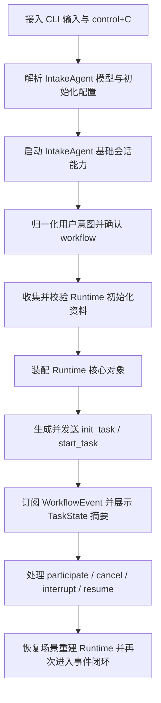

# Implementation Plan (implementationPlan)

## 概述 (summary)

- 本次实现聚焦 `default-workflow` 的 `Intake` 层，先搭起 CLI 入口、轻决策、`Runtime` 初始化和事件桥接的最小闭环，再补齐任务生命周期动作。
- 实现建议拆成 6 步：CLI 输入接入、`IntakeAgent` 模型选择与初始化、意图识别与确认、`Runtime` 初始化、`IntakeEvent`/`WorkflowEvent` 桥接、任务中断恢复与补充输入。
- 最关键的风险点是 `participate` 与 `resume_task` 的语义分流，以及“何时算资料足够可以初始化 `Runtime`”的判断标准。
- 最需要注意的是 `Intake` 只能做入口交互和轻决策，不能越权承担 `WorkflowController` 的状态编排职责；同时 `IntakeAgent` 的模型选择不能散落在 CLI 入口逻辑里。
- 当前不存在产品层未确认问题，但规范输入存在缺口：`roleflow/context/standards/common-mistakes.md` 缺失，`roleflow/context/standards/coding-standards.md` 为空。

---

## 输入依据 (inputBasis)

- PRD：`roleflow/clarifications/0.1.0/default-workflow-intake-layer-prd.md`
- 项目上下文：`roleflow/context/project.md`
- 计划模板：`roleflow/templates/plan/implementationPlan.md`
- 用户补充约束：实现完成后必须交付一个可直接测试和验收的 `Intake` 层成品；当前模型接入约束为使用 `import { ChatOpenAI } from "@langchain/openai"`，并采用 `model = gpt5.4`、`base_url = https://co.yes.vg/v1`、`apiKey = process.env.OPENAI_API_KEY`
- 用户补充约束：实现后的文档对应产物必须可运行；若 `Runtime` 某些初始化能力暂时无法完成，可以用注释说明和受控占位实现过渡，但不能让 CLI 入口不可启动；`IntakeAgent` 超出本期范围的请求统一回复“敬请期待”

缺失信息：

- `roleflow/context/standards/common-mistakes.md` 当前不存在，无法作为实现约束输入。
- `roleflow/context/standards/coding-standards.md` 当前为空，未提供可执行编码规范。
- 当前仓库尚无 `roleflow/implementation/` 下的历史计划文档，缺少既有写法参考。
- `IntakeAgent` 的模型配置来源、覆盖优先级和缺省值在当前 PRD 与项目上下文中仍未明确；目前仅确认默认接入方式为 `ChatOpenAI`，默认可用配置为 `model = gpt5.4`、`base_url = https://co.yes.vg/v1`、`apiKey = process.env.OPENAI_API_KEY`。

---

## 实现目标 (implementationGoals)

- 新增 `default-workflow` 的 CLI 入口执行单元 `IntakeAgent`，负责接收自然语言输入、追问缺失资料、向用户确认识别出的需求类型与选定 `workflow`。
- 新增 `IntakeAgent` 的初始化入口，明确其在任务开始前所需的最小启动上下文，并保证 CLI 交互可在 `Runtime` 完整装配前启动。
- 新增 `IntakeAgent` 的模型选择与配置解析逻辑，当前默认通过 `ChatOpenAI` 初始化，并按 `model = gpt5.4`、`base_url = https://co.yes.vg/v1`、`apiKey = process.env.OPENAI_API_KEY` 处理，同时明确配置读取来源、默认回退规则、缺失配置时的阻断或降级策略。
- 新增 `Intake` 侧的初始化资料收集与校验逻辑，至少覆盖目标项目目录、`workflow` 流程编排、工件保存目录，并在资料不完整时阻止正式启动。
- 新增 `Runtime` 构建入口，由 `Intake` 负责创建 `TaskState`、`WorkflowController`、`ProjectConfig`、`EventEmitter`、`EventLogger`、`ArtifactManager`、`RoleRegistry`。
- 新增 `IntakeEvent` 生产与分发能力，支持 `init_task`、`start_task`、`cancel_task`、`interrupt_task`、`resume_task`、`participate`。
- 新增 `WorkflowEvent` 订阅与 CLI 展示能力，完整展示当前事件信息，并附带 `TaskState` 摘要中的 `currentPhase`、`status`，以及存在时显示的 `resumeFrom`。
- 新增任务生命周期控制逻辑，覆盖创建、启动、补充内容、取消、`control + C` 中断、恢复未完成任务。
- 新增范围守卫逻辑，确保 `IntakeAgent` 只能处理本期定义内的入口交互；当用户提出超范围能力、越权编排诉求或当前版本未支持动作时，统一回复“敬请期待”。
- 保持 `WorkflowController` 作为 `TaskState` 唯一合法修改者不变；`Intake` 只负责采集、规范化、展示和转发，不直接编排 phase 或改写状态机。
- 最终交付结果应达到：CLI 用户可以仅通过自然语言与 `IntakeAgent` 完成任务进入、任务中断恢复和补充输入，并与 `WorkflowController` 形成稳定事件闭环。
- 最终交付物必须包含一个可直接运行的 `Intake` 验收成品，使用户可以按固定步骤完成手动验收，而不是只交付若干底层模块。
- 即使 `Runtime` 的部分依赖对象在本期只能先保留占位实现，交付物仍必须保持 CLI 可启动、模型可初始化、基础 Intake 交互可执行。
- 最终交付物必须提供明确且可执行的 CLI 启动方式；本期验收启动命令固定为先执行 `pnpm build`，再执行 `node dist/cli/index.js`。

---

## 实现策略 (implementationStrategy)

- 采用“CLI 适配层 + Intake 轻决策层 + Runtime 装配层 + 事件桥接层”的分层方式实现，避免把输入解析、状态展示、对象初始化和事件分发混在一个入口文件中。
- 将 `IntakeAgent` 的“自身初始化”与 “`Runtime` 初始化”拆成两个阶段处理：前者只解决基于 `ChatOpenAI` 的模型实例、prompt、基础会话能力和最小上下文；后者只在资料补齐并选定 `workflow` 后装配任务运行依赖。
- 如果 `Runtime` 的某些子对象在当前阶段尚未具备完整实现，应采用“可运行优先”的受控占位策略：保留清晰注释、显式标记未完成边界、避免伪造完整能力，同时保证 CLI 入口、模型初始化和基础任务流转仍能运行。
- 以会话态的 `Intake` 交互状态驱动实现，建议显式区分“待补齐初始化资料”“待确认 workflow”“可启动任务”“任务运行中”“任务已中断待恢复”几类入口状态，但不在 `Intake` 中重建 `WorkflowController` 的 phase 状态机。
- `IntakeAgent` 模型选择应通过配置解析完成，而不是硬编码在交互流程中；当前默认落地方式使用 `@langchain/openai` 的 `ChatOpenAI`，并采用 `gpt5.4`、`https://co.yes.vg/v1` 和 `process.env.OPENAI_API_KEY`。如果后续存在项目级 prompt 覆盖或角色扩展提示词，`Intake` 初始化阶段只负责装配这些输入，不提前扩展到其他角色的运行时创建。
- 用户输入先做意图归一化，再映射为 `init_task` / `start_task` / `participate` / `resume_task` / `interrupt_task` / `cancel_task`，其中只有明确表达“继续执行”“继续完成任务”等继续运行意图时才进入 `resume_task`，其他补充说明默认进入 `participate`。
- 对本期范围外请求、非入口层职责请求或当前实现未覆盖的动作，`IntakeAgent` 不做扩展承诺、不自行降级为其他角色，统一输出“敬请期待”。
- `Runtime` 初始化采用显式装配流程：先基于项目路径和工件目录形成 `ProjectConfig`，再创建事件与日志组件，最后创建 `WorkflowController`、`TaskState` 与 `RoleRegistry`，确保依赖顺序清晰。
- 恢复路径单独实现，不复用旧内存实例；恢复时重新装配 `Runtime`，再基于已持久化的任务信息触发 `resume_task`。
- CLI 展示层不做过滤型渲染，当前阶段直接展示全部 `WorkflowEvent` 可用信息；只在展示层补充统一格式和 `TaskState` 摘要，不改变事件语义，其中 `resumeFrom` 仅在存在时展示。
- 交付方式以“可运行 CLI 入口 + 明确验收步骤”为准，确保在本期完成后可以直接执行验收，而不需要人工拼装多个内部模块。
- CLI 启动路径应尽量单一且直接，本期以 `dist/cli/index.js` 作为唯一验收入口；Builder 需要保证执行 `pnpm build` 后，`node dist/cli/index.js` 即可进入 `Intake`。
- 实现范围保持局部改造，不扩展 `Archive`、`Architect` 等后续能力，不引入图形界面，不提前抽象 v0.1 范围外的工作流注册机制。

---

## 实施流程图 (implementationFlowchart)

---

## Runtime 初始化要求 (runtimeInitializationRequirements)

- `Runtime` 初始化只允许发生在两个时机：首次任务启动前，或恢复未完成任务前。除此之外，`IntakeAgent` 不应重复创建新的 `Runtime` 实例。
- 首次初始化前必须至少拿到三类输入：目标项目目录、`workflow` 流程编排、工件保存目录。任一项缺失时，不允许进入正式启动，只能继续追问。
- 恢复初始化前必须重新获取或重建运行所需资料，并重新创建完整 `Runtime`；禁止直接复用上一次运行中的内存实例。
- 初始化目标产物必须始终是一个结构完整的 `Runtime` 对象，至少包含：`taskState`、`workflow`、`projectConfig`、`eventEmitter`、`eventLogger`、`artifactManager`、`roleRegistry`。
- `projectConfig` 必须先于其他运行对象完成解析，因为目标项目目录、工件路径和 `workflow` 配置是后续对象装配的前置输入。
- `eventEmitter` 与 `eventLogger` 必须在 `workflow` 创建前可用，保证后续 `IntakeEvent` / `WorkflowEvent` 和初始化过程本身都能被记录与分发。
- `artifactManager` 必须在 `workflow` 创建前完成装配，因为后续 phase 执行和任务恢复都依赖工件路径。
- `roleRegistry` 必须在 `workflow` 创建前完成装配，因为 `WorkflowController` 需要依赖它获取角色。
- `taskState` 必须在 `workflow` 创建前准备完成，并具备当前任务最小必要信息；首次启动时至少要有 `taskId`、`status`、时间戳等基础字段，恢复时还必须能表达恢复来源。
- `workflow` 必须作为最后装配的核心对象之一创建，并接收已完成初始化的 `projectConfig`、`eventEmitter`、`eventLogger`、`artifactManager`、`roleRegistry`、`taskState`。
- 初始化过程中，`IntakeAgent` 负责采集资料、校验前置条件和触发装配，但不负责越权修改 `TaskState` 编排规则；`TaskState` 的合法状态推进仍属于 `WorkflowController`。
- 初始化校验至少需要覆盖：目标项目目录存在且可访问、`workflow` 配置非空且可识别、工件保存目录可解析。校验失败时，CLI 必须明确提示缺失项或错误项。
- 初始化成功后，CLI 必须能够明确告知用户当前 `Runtime` 已可用于任务创建和启动；初始化失败时，CLI 必须停留在 `Intake` 追问或阻断状态，不能假装进入运行中。
- 如果 `eventLogger`、`artifactManager`、`roleRegistry` 等对象本期只能先提供占位实现，占位对象也必须进入 `Runtime` 结构，并通过注释或显式提示说明当前能力边界，不能直接缺字段。
- 占位实现只允许用于保证 CLI 可运行和链路可打通，不允许伪装成完整能力；一旦用户操作触达未完成能力，系统必须明确提示当前未完成，而不是静默成功。

---

## 验收目标 (acceptanceTargets)

- 在项目根目录执行 `pnpm build` 后，不需要额外拼接内部脚本或手动改代码，直接执行 `node dist/cli/index.js` 即可启动 `Intake` CLI。
- 启动时 `IntakeAgent` 能基于 `@langchain/openai` 的 `ChatOpenAI` 完成模型初始化，且默认配置为 `model = gpt5.4`、`base_url = https://co.yes.vg/v1`、`apiKey = process.env.OPENAI_API_KEY`。
- 当 `OPENAI_API_KEY` 缺失、模型初始化失败或其他启动前置条件不满足时，CLI 需要给出明确错误或阻断提示，不能静默失败。
- CLI 启动后，用户可以直接输入自然语言需求，`IntakeAgent` 会先进行意图识别与确认，而不是要求固定命令格式。
- 当 `Runtime` 初始化资料不足时，`IntakeAgent` 会继续追问，直到补齐目标项目目录、`workflow` 流程编排、工件保存目录等最小前提。
- 当资料补齐后，`IntakeAgent` 会明确告知识别出的需求类型和选定的 `workflow`，然后进入任务创建与启动链路。
- `Runtime` 初始化时会按明确顺序完成装配：先解析 `projectConfig`，再准备事件与日志对象、工件与角色对象、`taskState`，最后创建 `workflow` 并组装 `Runtime`。
- 初始化成功后，`Runtime` 中会具备 `taskState`、`workflow`、`projectConfig`、`eventEmitter`、`eventLogger`、`artifactManager`、`roleRegistry` 七类对象；如果其中某些对象为占位实现，CLI 会明确说明能力边界。
- 当目标项目目录不存在、`workflow` 配置缺失、工件目录不可解析等前置条件不满足时，CLI 会停留在追问或阻断状态，并明确指出失败原因，而不是继续启动任务。
- 系统能发送 `init_task`、`start_task`、`participate`、`cancel_task`、`interrupt_task`、`resume_task` 等 `IntakeEvent`，并在 CLI 展示接收到的 `WorkflowEvent`。
- CLI 展示的 `TaskState` 摘要至少包含 `currentPhase` 和 `status`；只有 `resumeFrom` 存在时才显示 `resumeFrom`。
- 用户输入普通补充说明时，系统优先按 `participate` 处理；只有明确表达“继续执行”“继续完成任务”等继续运行意图时，才触发 `resume_task`。
- 用户在任务运行中触发 `control + C` 时，系统会按中断流程处理，并能在后续恢复时重新创建 `Runtime`，而不是复用旧内存实例。
- 如果 `Runtime` 某些依赖对象在本期仍未完成，CLI 仍然可以启动并完成基础 Intake 交互；未完成部分必须有清晰注释或显式占位说明，不能伪装为完整能力。
- 当用户提出超出 `Intake` 本期职责边界的请求时，`IntakeAgent` 统一回复“敬请期待”，不擅自扩展职责、不越权编排 workflow。
- 最终交付物必须包含一个可以直接手动验收的 CLI 成品，以及与上述目标对应的验收步骤或检查清单。

---

## Todolist (todoList)

- [x] 确认 `default-workflow` 的 CLI 入口文件、`IntakeAgent` 所在模块边界和可复用的命令行交互基础设施。
- [x] 确认 `IntakeAgent` 的模型配置来源、读取优先级和缺省策略，当前默认值使用 `ChatOpenAI` + `model = gpt5.4` + `base_url = https://co.yes.vg/v1` + `apiKey = process.env.OPENAI_API_KEY`。
- [x] 定义 `IntakeAgent` 的初始化边界，区分“Agent 自身启动所需上下文”与“任务 `Runtime` 装配所需资料”。
- [x] 定义 `Intake` 侧用户输入归一化规则，覆盖任务描述、补充说明、继续执行、取消任务和 `control + C` 中断。
- [x] 定义 `workflow` 选择与确认文案规则，确保 `Intake` 只做需求类型识别与 workflow 轻决策。
- [x] 实现 `IntakeAgent` 初始化流程，至少完成 `ChatOpenAI` 实例化、基础 prompt 装配和会话启动前校验。
- [x] 实现 `Runtime` 初始化资料收集与缺失项追问逻辑，至少校验目标项目目录、`workflow` 流程编排、工件保存目录。
- [x] 实现 `Runtime` 装配入口，按依赖顺序创建 `ProjectConfig`、`EventEmitter`、`EventLogger`、`ArtifactManager`、`RoleRegistry`、`TaskState`、`WorkflowController`。
- [x] 定义 `Runtime` 初始化前置校验规则，至少覆盖目录存在性、`workflow` 可识别性、工件路径可解析性，以及失败时的 CLI 阻断提示。
- [x] 明确 `Runtime` 初始化成功后的最小完成态，保证 `taskState`、`workflow`、`projectConfig`、`eventEmitter`、`eventLogger`、`artifactManager`、`roleRegistry` 全部进入运行时对象。
- [x] 对暂时无法完成的 `Runtime` 初始化对象增加受控占位与注释说明，保证 CLI 入口和基础任务链路仍可运行。
- [x] 实现 `taskId` 生成与任务创建逻辑，支持在满足条件时连续发送 `init_task` 与 `start_task`。
- [x] 实现 `IntakeEvent` 构造与发送逻辑，统一填充 `type`、`taskId`、`message`、`timestamp`、`metadata`。
- [x] 实现 `WorkflowEvent` 订阅和 CLI 展示逻辑，附带展示 `currentPhase`、`status`，并在 `resumeFrom` 存在时展示该摘要。
- [x] 实现 `participate` 与 `resume_task` 的分流判断，优先保证非明确继续语义的输入进入 `participate`。
- [x] 实现任务取消与中断逻辑，确保普通取消走 `cancel_task`，`control + C` 映射为 `interrupt_task`。
- [x] 实现范围守卫和兜底回复逻辑，确保超范围请求统一返回“敬请期待”。
- [x] 实现恢复未完成任务流程，前置依赖是可重新装配 `Runtime`，并验证不会复用旧内存实例。
- [x] 提供一个可直接运行的 CLI 验收入口，保证 `Intake` 层可以作为独立成品被启动和操作。
- [x] 固定并实现 CLI 启动方式，保证执行 `pnpm build` 后可通过 `node dist/cli/index.js` 直接启动 `Intake`。
- [x] 补充最小验证用例或手动验证清单，覆盖首次启动、`ChatOpenAI` 初始化、资料不足追问、事件展示、补充输入、中断、恢复、超范围请求回复“敬请期待”。
- [x] 完成自检，确认 `Intake` 未直接改写 `TaskState`、未承担 phase 编排，并复核命名与 `project.md` 一致。
