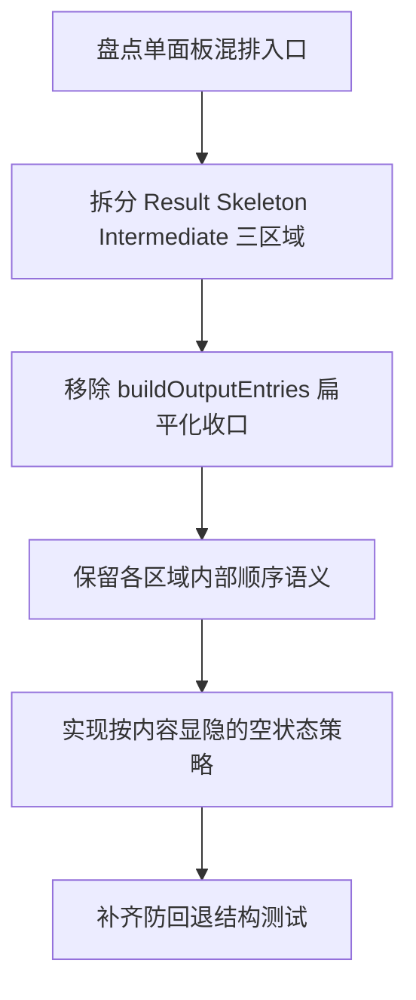

# Implementation Plan (implementationPlan)

## 概述 (summary)

- 本次实现聚焦 `default-workflow` Intake UI 输出结构的防回退收敛，目标是在已存在的暗红主题 token 基础上，恢复并固定“结果区 > 骨架区 > 过程输出区”的三区域独立结构，禁止再退回单一混排输出面板。
- 实现建议拆成 6 步：盘点当前 `OutputPanel` 混排路径、拆分三区域组件结构、移除跨区域统一排序、保留各区域内部顺序语义、补齐空状态与外层壳层规则、增加防回退测试。
- 最关键的风险点是当前代码和测试已经共同强化了“统一输出面板 + 混排排序”的实现路径；如果只改 token 或局部样式，不拆结构，这个回归会持续存在。
- 最需要注意的是本次需求不要求重写 `CliViewModel` 的事件来源协议；重点是禁止把 `finalBlocks`、`skeletonBlocks`、`intermediateLines` 在渲染层重新扁平化成同一列表。
- 当前没有产品层未确认问题，但规范输入存在缺口：`roleflow/context/standards/common-mistakes.md` 缺失，`roleflow/context/standards/coding-standards.md` 为空；同时现有 `ui-model.test.ts` 中“跨流顺序保护”本身已与新 PRD 冲突，需要显式收敛。

---

## 输入依据 (inputBasis)

- PRD：`roleflow/clarifications/0.1.0/default-workflow-intake-output-structure-separation-prd.md`
- 相关需求：`roleflow/clarifications/0.1.0/default-workflow-intake-ui-theme-refinement-prd.md`
- 相关需求：`roleflow/clarifications/0.1.0/default-workflow-intake-ink-ui-prd.md`
- 项目上下文：`roleflow/context/project.md`
- 计划模板：`roleflow/templates/plan/implementationPlan.md`
- 相关历史计划：`roleflow/implementation/0.1.0/default-workflow-intake-ink-ui.md`
- 相关历史计划：`roleflow/implementation/0.1.0/default-workflow-intake-ui-theme-refinement.md`
- 当前 UI 实现：`src/cli/app.ts`
- 当前主题 token：`src/cli/theme.ts`
- 当前视图模型：`src/cli/ui-model.ts`
- 当前视图模型测试：`src/cli/ui-model.test.ts`
- 当前主题测试：`src/cli/theme.test.ts`
- 当前 Intake 展示归一化：`src/default-workflow/intake/output.ts`
- 当前工程依赖：`package.json`

缺失信息：

- `roleflow/context/standards/common-mistakes.md` 当前不存在，无法作为实现约束输入。
- `roleflow/context/standards/coding-standards.md` 当前为空，未提供可执行编码规范。
- 当前没有单独的组件级结构测试文件直接锁定 `OutputPanel` 的三区域职责；本计划需要把这类保护作为新增测试目标。

---

## 实现目标 (implementationGoals)

- 修改 `src/cli/app.ts` 的输出层组织方式，使结果区、骨架区、过程输出区重新成为独立的组件结构，而不是继续落在单一 `ContentSection(title: "输出")` 下的统一列表。
- 移除 `buildOutputEntries(...)` 这类把 `finalBlocks`、`skeletonBlocks`、`intermediateLines` 扁平化再统一渲染的输出收口逻辑，避免渲染层重新混排三区域内容。
- 保持结果区为主阅读区域，确保一旦存在 `finalBlocks`，它们由独立主区域承载，而不是靠 `[结果输出]` 文字前缀混在其他内容之间。
- 保持骨架区继续可见，但把它限制在独立辅助容器中，不再与结果区共享同一输出列表和跨类型排序逻辑。
- 保持过程输出区继续独立、受限且最低优先级，不再通过 `[过程输出]` 标签拼接到统一面板末尾。
- 保持 `CliViewModel` 的三路数据分流语义不变，即继续使用 `finalBlocks`、`skeletonBlocks`、`intermediateLines` 作为不同区域的数据来源，而不是在本次结构修复中回头改事件协议。
- 最终交付结果应达到：组件结构、区域排序、空状态和测试保护共同保证三区域独立存在，后续主题 refinement 也不能再通过“单面板混排”方式实现。

---

## 实现策略 (implementationStrategy)

- 采用“渲染层结构拆分 + 测试约束重写”的局部改造策略，不重写 `IntakeAgent`、`WorkflowEvent` 或 `CliViewModel` 来源协议，只替换最终输出层的组合方式。
- 将当前单一 `OutputPanel` 收敛为“外层输出壳层 + 内部独立三区域”的结构；允许保留外层容器，但内部必须明确分成结果区、骨架区、过程输出区三个子容器。
- 先恢复结构分离，再让主题 token 各自映射到独立区域；避免出现 token 已分层但结构仍混排的假优化。
- 对 `UiBlock.order` 的使用边界做显式收缩：它可以继续表达各自区域内部新增顺序，但不能再驱动跨区域的统一排序。
- 空状态采用“按内容显隐区域”的方式处理：区域能力必须存在，但没有内容时可以不渲染该区域，不强制展示空骨架区或空过程区。
- 测试层要从“跨流 order 混排可被保留”切换为“三区域不可混排”的保护模型，至少覆盖结构存在性、区域顺序稳定性和禁止单面板汇总三项风险。

---

## 实施流程图 (implementationFlowchart)

---

## 当前实现差异与收敛项 (currentGapsAndConvergence)

- 当前 `src/cli/theme.ts` 已有 `result/skeleton/intermediate` 三组独立 token，但 `src/cli/app.ts` 并没有让它们映射到独立结构区域；这正是 PRD 指出的“token 存在但结构未分离”问题。
- 当前 `src/cli/app.ts` 的 `OutputPanel` 只渲染一个标题为 `"输出"` 的 `ContentSection`，其内部通过 `buildOutputEntries(...)` 统一生成所有可见输出行。
- 当前 `buildOutputEntries(...)` 会把 `finalBlocks` 与 `skeletonBlocks` 合并后按 `block.order` 排序，再把 `intermediateLines` 也拼进同一输出面板；这与 PRD 明确禁止的 `Single Mixed Output Panel` 完全一致。
- 当前统一列表通过 `[结果输出]`、`[骨架输出]`、`[过程输出]` 标签区分来源，但这只是一种文本标签混排，不是结构分离。
- 当前 `src/cli/ui-model.test.ts` 中的 `preserves cross-stream order between skeleton and final blocks` 测试显式保护了跨区域混排语义，这与 PRD 的 FR-6 相冲突，必须被重写或删除。
- 当前 `CliViewModel` 仍然已经天然分成 `finalBlocks`、`skeletonBlocks`、`intermediateLines` 三类，因此本次实现的重点应放在渲染组合和测试边界，而不是回头合并数据结构。

---

## 结构分离要求 (regionSeparationRequirements)

- 输出层必须至少保留三个逻辑区域：
  - Result Region
  - Skeleton Region
  - Intermediate Region
- 这三个区域必须在组件结构上可直接辨认，不允许只在一个数组里标记 `kind` 后统一 map 渲染。
- 结果区必须固定处于输出层级最高处；骨架区次之；过程输出区最低。该一级排序不能被 `block.order` 的跨类型排序打乱。
- 骨架区和过程输出区可以按内容为空时不显示，但当它们存在内容时，必须以独立容器出现，而不是合并回结果流。
- 若保留统一外层标题或壳层，内部仍必须是三区域容器，而不是一个共享 children 列表。

---

## 顺序与空状态要求 (orderingAndEmptyStateRequirements)

- `finalBlocks` 的顺序可以继续保留其内部追加顺序，但只在结果区内部生效。
- `skeletonBlocks` 的顺序可以继续保留其内部追加顺序，但只在骨架区内部生效。
- `intermediateLines` 的顺序和截断策略可以继续独立维持，但只在过程输出区内部生效。
- 不允许再用一个统一的 `orderedBlocks` 把不同区域的内容按时间先后重新洗牌。
- 当只有结果块时，可以只渲染结果区。
- 当只有骨架事件时，可以只渲染骨架区，但其样式仍必须保持辅助区语义，不能伪装成结果区。
- 当只有过程输出时，可以只渲染过程输出区。
- 当完全无输出内容时，可以显示整体空状态，但不能因此删掉三区域组件职责。

---

## 测试与防回退要求 (regressionProtectionRequirements)

- 自动化测试必须能识别“单一输出面板混排三区域内容”的回归，而不只是验证 token 是否存在。
- 至少需要有一类测试显式断言：当 `finalBlocks`、`skeletonBlocks`、`intermediateLines` 同时存在时，渲染层仍输出三个独立区域，而不是一个混合 children 列表。
- 需要移除或改写当前鼓励跨流混排的测试预期，尤其是依赖 `finalBlocks` 与 `skeletonBlocks` 全局时间顺序的断言。
- 需要新增或补充结构级测试，证明 reviewer 能从代码入口直接定位结果区、骨架区、过程输出区的独立构建逻辑。
- 需要增加一类回归校验，证明 `result/skeleton/intermediate` token 被各自区域真实消费，而不是只存在于 `theme.ts` 中。

---

## 验收目标 (acceptanceTargets)

- 当 `finalBlocks`、`skeletonBlocks`、`intermediateLines` 同时存在时，终端输出层可明确辨认出三个独立区域，而不是单一 `"输出"` 面板中的混合标签列表。
- 结果区始终处于最高结构优先级，骨架区次之，过程输出区最低，且这一顺序不受跨区域时间排序打乱。
- 骨架区和过程输出区即使样式被压缩，也不会消失到结果区内部或与结果区共享同一 children 列表。
- 代码 review 时，可以直接定位负责构建结果区、骨架区、过程输出区的独立逻辑，而不是只能看到一个 `buildOutputEntries()` 式的扁平收口函数。
- 自动化测试或等价校验可以在未来 merge 后识别出“结果块与骨架块重新混排”“过程输出重新并入单一列表”“token 存在但未映射到独立结构”这类回归。

---

## Open Questions

- 无。

---

## Assumptions

- 用户接受为了恢复主结果优先结构而调整当前 `OutputPanel` 组织方式。
- 当前最重要的问题是结构回退，而不是继续增加更多色板细节或重新设计全部终端排版。

---

## Todolist (todoList)

- [ ] 盘点 `src/cli/app.ts` 中当前单面板混排入口，明确 `OutputPanel`、`buildOutputEntries(...)`、`LabeledBlock` 在三区域混排中的职责。
- [ ] 将当前输出层从单一 `ContentSection(title: "输出")` 收敛为“外层壳层 + 结果区 / 骨架区 / 过程输出区”三个独立子区域。
- [ ] 为结果区补回独立构建逻辑，确保 `finalBlocks` 不再通过 `[结果输出]` 标签混入统一列表。
- [ ] 为骨架区补回独立构建逻辑，确保 `skeletonBlocks` 只在骨架辅助区内渲染，不再进入结果流。
- [ ] 为过程输出区补回独立构建逻辑，确保 `intermediateLines` 只在最低优先级区域内渲染，不再拼接到统一输出面板末尾。
- [ ] 删除或重构 `buildOutputEntries(...)` 这类跨区域扁平收口函数，避免后续 merge 再次以统一数组形式合并三区域。
- [ ] 收敛 `UiBlock.order` 的使用边界，只保留各自区域内部顺序语义，不再驱动跨区域排序。
- [ ] 设计并实现按内容显隐的空状态策略，保证无内容时可隐藏区域，但三区域结构能力仍保留。
- [ ] 更新 `src/cli/ui-model.test.ts`，移除或改写鼓励跨流混排的断言，补上三区域分离和固定区域优先级的测试。
- [ ] 新增或补充结构级测试/等价校验，覆盖“token 已存在但结构未分离”这一回归场景。
- [ ] 完成自检，确认本次改造只影响 Intake 输出层组织方式，没有越权改动 Workflow 状态机、CliViewModel 事件来源协议或非 Intake 页面。
