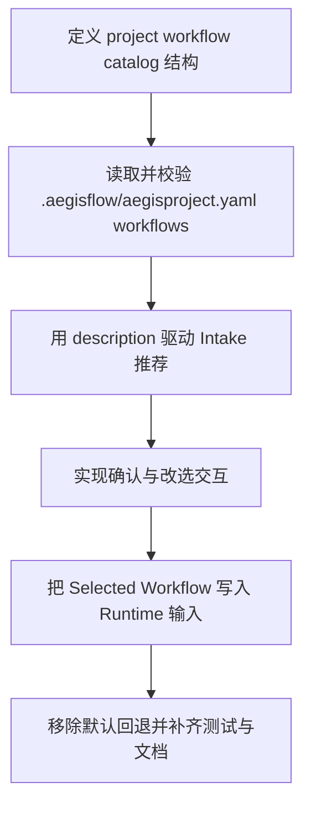

# Implementation Plan (implementationPlan)

## 概述 (summary)

- 本次实现聚焦 `default-workflow` 的 `Intake` workflow 选择链路收敛，目标是把当前“代码内置 workflow 判断 + 默认 phase 编排”改成“从项目下 `.aegisflow/aegisproject.yaml` 读取 `workflows` 列表、校验、推荐、确认、再写入 Runtime”。
- 实现建议拆成 6 步：定义项目侧 workflow catalog 结构、补充 `aegisproject.yaml` 解析与校验、替换 Intake 的默认 workflow 推荐来源、实现确认与改选交互、把 Selected Workflow 写入 Runtime 输入、补齐非法配置阻断与测试文档。
- 最关键的风险点是隐藏默认值路径：如果实现后仍保留 `createDefaultWorkflowPhases()` 或单个默认 workflow 的静默回退，就会直接违反 PRD 的“项目配置驱动”约束。
- 最需要注意的是职责边界：`Intake` 只负责读取 catalog、推荐和确认 workflow，不负责定义 workflow 内部 phase 语义；真正的 phase 编排仍由 Selected Workflow 的 `phases` 输入交给 Runtime / Workflow 消费。
- 当前没有产品层未确认问题，但规范输入存在缺口：`roleflow/context/standards/common-mistakes.md` 缺失，`roleflow/context/standards/coding-standards.md` 为空；并且当前仓库中的 `.aegisflow/aegisproject.yaml` 仍是单个 `workflow:`，与新 PRD 不一致。

---

## 输入依据 (inputBasis)

- PRD：`roleflow/clarifications/0.1.0/default-workflow-intake-project-workflows-prd.md`
- 项目上下文：`roleflow/context/project.md`
- 计划模板：`roleflow/templates/plan/implementationPlan.md`
- 相关历史计划：`roleflow/implementation/0.1.0/default-workflow-intake-layer.md`
- 相关历史计划：`roleflow/implementation/0.1.0/default-workflow-workflow-layer.md`
- 当前 Intake 实现：`src/default-workflow/intake/agent.ts`
- 当前意图与推荐逻辑：`src/default-workflow/intake/intent.ts`
- 当前 Runtime 装配：`src/default-workflow/runtime/builder.ts`
- 当前默认值工具：`src/default-workflow/shared/utils.ts`
- 当前常量：`src/default-workflow/shared/constants.ts`
- 当前类型定义：`src/default-workflow/shared/types.ts`
- 当前项目配置：`.aegisflow/aegisproject.yaml`
- 当前测试参考：`src/default-workflow/testing/agent.test.ts`
- 当前测试参考：`src/default-workflow/testing/runtime.test.ts`

缺失信息：

- `roleflow/context/standards/common-mistakes.md` 当前不存在，无法作为实现约束输入。
- `roleflow/context/standards/coding-standards.md` 当前为空，未提供可执行编码规范。
- 当前没有与本 PRD 对应的独立 exploration 工件；本计划只能基于 PRD、项目文档和现有代码状态生成。

---

## 实现目标 (implementationGoals)

- 新增项目侧 workflow catalog 的最小配置读取能力，让 `Intake` 能从项目下 `.aegisflow/aegisproject.yaml` 读取多个 workflow，而不是继续依赖代码常量或默认 workflow。
- 新增 workflow catalog 的结构校验逻辑，至少覆盖 `workflows` 非空、每个 workflow 具备 `name`、非空 `description`、合法 `phases`，并在非法时明确阻断。
- 修改 `IntakeAgent` 的 workflow 推荐逻辑，使其基于“用户需求 + workflow.description”做推荐，而不是继续只根据 `WorkflowTaskType` 和内置文案做判断。
- 修改确认与改选交互，使推荐结果在用户确认前只是 `Recommended Workflow`，用户可以接受或改选当前 catalog 中其他合法 workflow。
- 修改 Runtime 初始化输入来源，让用户最终选中的 workflow 成为 `ProjectConfig.workflow` 与 `workflowPhases` 的事实来源，而不是继续回退到 `createDefaultWorkflowPhases()`。
- 保持 `WorkflowController` 的内部 phase 编排实现不在本次重写；本次只负责把合法的 Selected Workflow 作为编排输入传入。
- 最终交付结果应达到：workflow 推荐来源唯一来自项目配置，非法配置会明确报错并阻断，用户确认后的 workflow 会成为当前任务的真实编排输入。

---

## 实现策略 (implementationStrategy)

- 采用“配置模型收敛 + Intake 推荐替换 + Runtime 输入对齐”的局部改造策略，不整体重写 Intake，而是替换 workflow 来源与确认链路。
- 在现有 `.aegisflow/aegisproject.yaml` 解析链路上新增 workflow catalog 读取能力，但将其与 roles.executor 解析职责分开，避免继续把项目配置读取写成零散的键值扫描。
- 为项目侧 workflow 增加一层显式的数据模型，至少区分：
  - `ProjectWorkflowCatalog`
  - `ProjectWorkflowDefinition`
  - `SelectedWorkflow`
- `IntakeAgent` 在进入 workflow 推荐前必须先读取并校验 catalog；若 catalog 非法，则直接提示用户修正 `.aegisflow/aegisproject.yaml`，不再进入默认 workflow 猜测、确认或任务启动。
- 推荐逻辑应从“预测任务类型 -> 映射内置 workflow”收敛为“理解用户需求 -> 对比各 workflow.description -> 给出推荐与理由”；如需继续复用任务类型推断，也只能作为辅助信号，而不是最终来源。
- 确认链路采取两段式处理：先展示推荐 workflow 与推荐理由，再允许用户确认或改选 catalog 中其他合法 workflow，避免把推荐结果直接当成最终选择。
- Runtime 输入层保持兼容：`buildRuntimeForNewTask()` 仍接收结构化 workflow 选择与 phases，但这些数据必须来自 Selected Workflow，而不是继续由 Intake 本地默认值生成。
- 对非法配置坚持“显式失败而非静默降级”策略，不允许缺失 `description` 时继续按名称匹配，不允许 `workflows` 缺失时回退到 `DEFAULT_WORKFLOW_PHASES`。
- 测试层优先覆盖 catalog 解析、校验报错、推荐/改选交互、Selected Workflow 写入 Runtime、以及非法配置下不启动任务等关键路径。

---

## 实施流程图 (implementationFlowchart)

---

## 当前实现差异与收敛项 (currentGapsAndConvergence)

- 当前 `src/default-workflow/intake/agent.ts` 在 `startDraftTask()` 中直接调用 `inferWorkflowTaskType()` 和 `createWorkflowSelection()`，说明 workflow 推荐来源仍是代码内置判断，而不是项目配置。
- 当前 `selectWorkflowFromUserInput()` 仍通过用户输入映射到固定的 `Feature Change / Bugfix / Small New Feature` 三类内置类型，并配套 `createDefaultWorkflowPhases()`，这与“workflow 不能由代码写死”直接冲突。
- 当前 `src/default-workflow/shared/constants.ts` 仍保留 `SUPPORTED_WORKFLOW_TYPES`、`DEFAULT_WORKFLOW_PHASES`、`DEFAULT_WORKFLOW_PROFILE_ID/LABEL` 等默认 workflow 相关常量；这些常量可以保留辅助语义，但不能继续主导项目侧 workflow 选择。
- 当前 `src/default-workflow/shared/types.ts` 中的 `WorkflowSelection` 结构仍偏向“单个系统内置 workflow + taskType + label”，尚未表达项目侧 workflow 的 `name`、`description` 和 catalog 来源语义。
- 当前 `src/default-workflow/runtime/builder.ts` 会消费外部传入的 `workflow` 与 `workflowPhases`，但它们目前由 Intake 默认生成，而不是从 `.aegisflow/aegisproject.yaml` 中选定的 workflow 定义产生。
- 当前 `.aegisflow/aegisproject.yaml` 仍使用单个 `workflow:` 节点，不符合本 PRD 要求的 `workflows` 复数列表结构；这既是实现输入缺口，也是必须同步更新的配置示例。
- 当前 Runtime 校验只会检查 `workflow` / `workflowPhases` 是否存在，不会校验其是否来自项目 catalog，也不会在项目配置非法时主动阻断 Intake 前置流程。
- 当前测试主要验证默认 workflow 猜测、确认和启动链路，尚未覆盖“从项目配置读取多个 workflow、description 推荐、非法配置阻断、不允许静默回退”这些新约束。

---

## 配置与推荐收敛项 (catalogAndRecommendationConvergence)

- 项目配置推荐形态应收敛为 `workflows` 列表，而不是继续扩展单个 `workflow:` 节点。
- 每个 workflow 的最小外部契约应至少包含：
  - `name`
  - `description`
  - `phases`
- `phases[*]` 的最小外部契约应至少包含：
  - `name`
  - `hostRole`
  - `needApproval`
- `Intake` 推荐逻辑必须显式消费 `description`，并向用户展示“推荐 workflow 名称 + 推荐理由”；不能只展示名字。
- 改选交互只能从“当前 catalog 中的其他合法 workflow”里选择，不能允许用户输入任意未配置 workflow 名称。
- 若 `.aegisflow/aegisproject.yaml` 中不存在 `workflows`、为空、缺失 `description` 或 phase 结构非法，系统必须在任务启动前就阻断，并明确提示需要修正的是项目配置文件。

---

## 验收目标 (acceptanceTargets)

- `Intake` 会从项目下 `.aegisflow/aegisproject.yaml` 读取 `workflows` 列表，而不是继续依赖代码默认 workflow 集合作为唯一来源。
- 项目配置能够表达多个 workflow，且每个 workflow 都带有非空 `description` 和合法 `phases`。
- `Intake` 会基于用户需求与 workflow `description` 做推荐，而不是继续只根据内置任务类型名称做映射。
- 推荐结果会向用户展示推荐 workflow 名称和推荐理由，并允许用户确认或改选。
- 用户改选时，只能从项目配置中其他合法 workflow 里选择，不会回退到代码默认 workflow。
- 用户确认后的 Selected Workflow 会成为 Runtime 的实际输入，其 `phases` 会进入当前任务的 `workflowPhases`。
- workflow 配置非法时，系统会明确报错并要求用户修正 `.aegisflow/aegisproject.yaml`，不会静默忽略、不会自动降级、不会继续启动任务。
- 自动化测试或可执行验证至少覆盖：配置读取、结构校验、推荐与改选、Selected Workflow 写入 Runtime、以及非法配置阻断启动。

---

## Todolist (todoList)

- [x] 盘点 `IntakeAgent`、`shared/utils`、`shared/constants`、`runtime/builder` 中所有仍默认依赖内置 workflow 选择与默认 phase 编排的实现点。
- [x] 设计项目侧 workflow catalog 的最小类型与内存结构，至少覆盖 `workflows` 列表、workflow `name/description/phases` 以及 phase 最小字段。
- [x] 为 `.aegisflow/aegisproject.yaml` 新增 workflow catalog 读取入口，并与现有 roles.executor 配置解析职责分离。
- [x] 实现 workflow catalog 结构校验，至少覆盖 `workflows` 存在性、非空列表、`description` 非空、`phases` 合法，以及 phase 必填字段。
- [x] 为非法 workflow 配置定义统一错误语义，确保错误明确指向需要用户修正 `.aegisflow/aegisproject.yaml`，而不是泛化成普通系统错误。
- [x] 修改 `IntakeAgent` 的 workflow 推荐流程，改为基于“用户需求 + workflow.description”生成 `Recommended Workflow`，不再直接使用内置默认 workflow 作为推荐来源。
- [x] 修改推荐结果展示文案，明确输出推荐 workflow 名称和推荐理由，而不是只展示任务类型判断。
- [x] 修改确认链路，使推荐结果在用户确认前不是最终选择，并支持用户从当前 catalog 的其他合法 workflow 中改选。
- [x] 为改选交互设计输入约束，明确如何列出可选 workflow、如何识别用户选择、以及非法选择时的提示语义。
- [x] 收敛 `WorkflowSelection` 或等价运行时结构，使其能表达项目侧 Selected Workflow，而不再只表达系统内置 taskType 标签。
- [x] 修改 Runtime 初始化输入组装逻辑，确保 `buildRuntimeForNewTask()` 接收的 `workflow` 与 `workflowPhases` 来自 Selected Workflow，而不是 `createDefaultWorkflowPhases()`。
- [x] 移除或封堵 workflow 选择链路中的静默默认回退，确保配置非法、缺失 `description` 或 catalog 不存在时不会继续启动任务。
- [x] 同步更新 `.aegisflow/aegisproject.yaml` 示例与相关文档，收敛到 `workflows` 复数结构，不再延续单个 `workflow:` 示例。
- [x] 更新或新增测试，覆盖 catalog 读取、非法配置阻断、description 推荐、确认/改选、Selected Workflow 写入 Runtime、以及无默认回退路径。
- [x] 完成自检，确认本次改造没有把 workflow 内部 phase 语义重新写死到 Intake，也没有保留隐藏的默认 workflow 降级路径。
