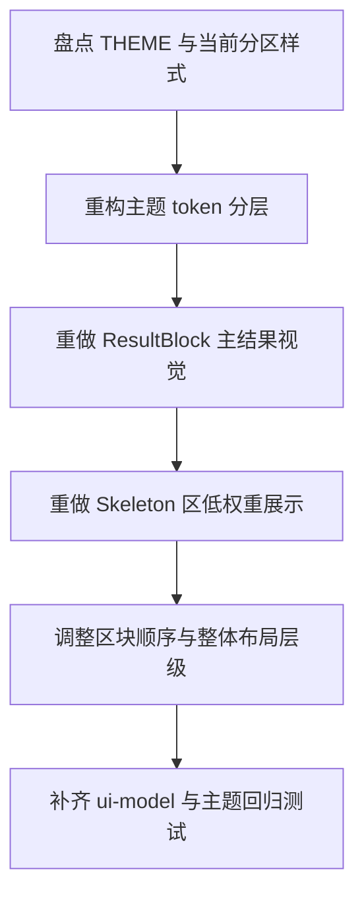

# Implementation Plan (implementationPlan)

## 概述 (summary)

- 本次实现聚焦 `default-workflow` Intake Ink UI 的主题细化与结构收敛，目标是在保持暗红主调的前提下，把结果区提升为主视觉区、把骨架区降权为辅助状态流，并让整体布局更接近 `codex cli` 的“主结果优先”体验。
- 实现建议拆成 6 步：盘点当前主题 token 与分区职责、重构 UI token 分层、收敛结果区块级结构、收敛骨架区为低权重辅助流、调整整体区块顺序和层级、补齐视图模型与主题回归测试。
- 最关键的风险点是只换颜色不改层级结构；如果结果区和骨架区仍保持近似 panel 形态与同权边框，颜色再换也难以达到 PRD 想要的“主结果优先”效果。
- 最需要注意的是参考 `codex cli` 的边界：本期可以明显靠拢其主内容优先的组织方式，但不能让 AegisFlow 现有的状态、骨架事件和过程输出职责发生混淆。
- 当前不存在产品层未确认问题，但规范输入存在缺口：`roleflow/context/standards/common-mistakes.md` 缺失，`roleflow/context/standards/coding-standards.md` 为空；同时当前测试主要锁定分流语义，尚未对主题 token 层级和结构降权做出明确保护。

---

## 输入依据 (inputBasis)

- PRD：`roleflow/clarifications/0.1.0/default-workflow-intake-ui-theme-refinement-prd.md`
- 相关需求：`roleflow/clarifications/0.1.0/default-workflow-intake-ink-ui-prd.md`
- 项目上下文：`roleflow/context/project.md`
- 计划模板：`roleflow/templates/plan/implementationPlan.md`
- 相关历史计划：`roleflow/implementation/0.1.0/default-workflow-intake-ink-ui.md`
- 当前 UI 壳层：`src/cli/app.ts`
- 当前视图模型：`src/cli/ui-model.ts`
- 当前 CLI 展示归一化：`src/default-workflow/intake/output.ts`
- 当前测试参考：`src/cli/ui-model.test.ts`
- 当前工程依赖：`package.json`

缺失信息：

- `roleflow/context/standards/common-mistakes.md` 当前不存在，无法作为实现约束输入。
- `roleflow/context/standards/coding-standards.md` 当前为空，未提供可执行编码规范。
- 当前没有专门的主题设计稿或色板文件；本计划只能基于 PRD 给出的推荐色彩层级和现有 Ink 组件结构进行收敛。

---

## 实现目标 (implementationGoals)

- 重构 `src/cli/app.ts` 中的 `THEME` 常量，使其从单层粗粒度颜色对象收敛为可表达结果区、骨架区、过程输出区、错误态和边框层级的主题 token 集合。
- 调整 Intake UI 主布局，使结果区不再只是与骨架区同权的普通 panel，而是更接近主结果卡片 / 主内容面板的视觉定位。
- 调整骨架事件区的展示结构和配色，使其更接近“低对比度、可快速扫读的辅助状态流”，而不是第二个主内容面板。
- 保持过程输出区仍为最低视觉层级，并使其与骨架区之间形成稳定可辨别的三级层次：结果区 > 骨架区 > 过程输出区。
- 收敛结果区内部 block 结构，使结果标题、结果正文、错误类结果、系统消息类结果在颜色、边距、边框或前缀语义上可明显区分，不再全部沿用同一种块样式。
- 保持 `CliViewModel` 的核心业务语义不变，不在本次主题 refinement 中改写 Workflow 状态机、Role 协议或事件来源，只收敛 UI 映射和主题表达。
- 最终交付结果应达到：结果区与骨架区一眼可区分、整体暗红主题成立、结构明显向 `codex cli` 的主结果优先风格靠拢，且主题 token 和结构规则在代码中可直接定位。

---

## 实现策略 (implementationStrategy)

- 采用“主题 token 重构 + 分区结构降权/提权 + 视图组件轻量重排”的局部改造策略，不推翻现有 Ink Shell 和 `CliViewModel` 分流语义，而是在其上重新定义视觉层级。
- 先收敛主题 token，再收敛 `ResultBlock`、`SkeletonBlock`、`IntermediateOutputPanel` 的组件样式，最后再调整区块顺序和整体布局，避免一边改结构一边硬编码颜色导致返工。
- 将 token 分成至少三层：结果主区 token、辅助骨架 token、过程输出 token，并补上通用正文/次正文/边框/错误 token，避免继续让不同组件各自拼色值。
- 对结果区采取“更强容器感”的设计方向，例如更明显的标题色、边框层次、分段节奏和正文留白，但避免终端中过亮或过饱和的大面积纯红。
- 对骨架区采取“低对比、易扫读”的设计方向，优先考虑轻量事件列表或弱边框辅助面板，而不是继续与结果区共享厚重标题和相同面板语义。
- 对整体结构采用“主结果优先、辅助状态次级、过程流受控”的排序策略；若需要，可以把结果区上移、骨架区下移或收缩为更轻的列表区，使布局更接近 `codex cli`。
- 保留 `role_output -> finalBlocks/intermediateLines` 与普通 `WorkflowEvent -> skeletonBlocks` 的基本分流模型；本期重点不是改数据分类，而是改这些分类在 UI 中的视觉权重与组织方式。
- 测试层优先锁定 token 分层、块级语义、骨架降权和结构映射规则，而不是做大量终端字符级快照。

---

## 实施流程图 (implementationFlowchart)

---

## 当前实现差异与收敛项 (currentGapsAndConvergence)

- 当前 `src/cli/app.ts` 中的 `THEME` 只有 `accent/accentSoft/text/muted/subdued/intermediate/error/border/panel` 这一层粗粒度 token，尚不足以表达结果区、骨架区、过程输出区的独立语义。
- 当前结果区和骨架区都通过 `ContentSection` 走近似的 panel 结构，只是内容不同；这正是 PRD 指出的“两个区域看起来像同权 panel”的根因之一。
- 当前 `ResultBlock` 仍主要表现为“标题一行 + 正文一段”，仅通过 `resolveToneColor(...)` 在标题色上做轻量区别，不足以形成主结果卡片感。
- 当前 `SkeletonBlock` 只是在同类 panel 里用较弱文字展示事件，虽然颜色更淡，但结构上仍与结果区过于接近。
- 当前 `IntermediateOutputPanel` 已有受限展示雏形，但结果区、骨架区、过程输出区之间还没有稳定的三级视觉层级。
- 当前 `CliViewModel` 已区分 `finalBlocks`、`skeletonBlocks`、`intermediateLines`，因此本期不需要重写业务分流模型；重点是消费这些模型的 UI 结构和主题语义。
- 当前 `src/cli/ui-model.test.ts` 主要验证内容分流，不验证视觉等级或 token 语义；主题 refinement 后需要把这类保护补到组件映射或 view model 约束里。

---

## 主题与层级要求 (themeAndHierarchyRequirements)

- 主题 token 至少应覆盖：
  - 主强调色
  - 主强调亮色
  - 主正文色
  - 次正文色
  - 骨架辅助色
  - 过程输出色
  - 错误色
  - 边框色
  - 结果区背景 / 面板语义
  - 骨架区背景 / 面板语义
- 结果区必须使用暗红主题中的高权重层级，至少形成“深暗红边框 / 更亮标题 / 暖灰正文”的主区组合，而不是只改标题字色。
- 骨架区必须使用更低饱和度、更偏灰褐或烟灰红的辅助层级，且不能继续与结果区共享同类强调标题色。
- 过程输出区继续使用最冷静、最低权重的中性灰色语义，确保三者形成稳定顺序：结果区 > 骨架区 > 过程输出区。
- 错误结果不应复用普通结果色，而应有明确的错误强调色和对应正文承载方式。

---

## 结构与映射要求 (layoutAndMappingRequirements)

- `StatusBar` 应继续紧凑，保留任务、阶段、状态信息，但不能在视觉上压过结果区。
- 结果区应尽量靠上，并成为阅读起点；空状态时可以弱化提示，但一旦存在结果块，应明显抢占主注意力。
- 骨架区可以继续保留独立区域，但其形态应更接近“辅助事件列表 / 轻量时间线”，而不是第二个大面板。
- 过程输出区应继续受控，且位置与尺寸要保证它不会在终端中夺走结果区的主要空间。
- 若需要更接近 `codex cli` 风格，允许将骨架区收缩为更短的区域、将结果区放在骨架区之前、或减少标题装饰，让整体更克制。
- `UiBlock.tone` 或等价映射层应显式支持区分：
  - 主结果
  - 系统消息
  - 错误结果
  - 骨架辅助信息
  不能继续只依赖 `accent/muted/result/error` 这类过粗的显示意图。
- 结果块之间需要更清晰的节奏，例如标题和正文的留白分层、块间距、边框差异或前缀语义，而不是所有 block 都长得一样。

---

## 验收目标 (acceptanceTargets)

- 结果输出区和骨架事件区在颜色语义与结构承载上明显区分，不再表现为两个同权 panel。
- 结果区成为最优先阅读区域，至少在位置、边框/标题权重、正文承载方式三者中的两项上明显强于骨架区。
- 骨架区仍然可见，但其视觉权重低于结果区且高于过程输出区，能支持“扫一眼知道流程到哪一步”的快速阅读。
- 整体主题仍保持暗红主调，没有退化成蓝色、紫色或无主题默认终端配色。
- 结构上明显向 `codex cli` 的“主结果优先、辅助信息降权、过程流受控”风格靠拢，而不是继续维持纯纵向同权堆叠。
- 颜色规划在代码中以清晰 token 分层落地，而不是继续在组件里零散硬编码若干色值。
- 自动化测试或等价校验至少覆盖：结果区与骨架区映射差异、主题 token 层级、过程输出最低层级，以及错误结果的独立语义。

---

## Open Questions

- 无。

---

## Assumptions

- 用户允许整体结构明显靠近 `codex cli`，其重点是“主结果优先”的层级体验，而不是像素级复刻终端布局。
- 当前优先级最高的是结果区和骨架区的颜色语义与结构层级；其他区域只做顺带收敛，不应偏离主目标。

---

## Todolist (todoList)

- [x] 盘点 `src/cli/app.ts` 中所有直接消费 `THEME` 的组件，明确哪些属于结果主区、骨架辅助区、过程输出区和状态/输入区。
- [x] 重构 `THEME` 为分层 token 结构，至少补齐结果区、骨架区、过程输出区、错误态、正文层级和边框/背景语义。
- [x] 调整 `ContentSection`、`ResultBlock`、`SkeletonBlock`、`IntermediateOutputPanel` 的职责边界，避免结果区和骨架区继续共享近似的 panel 表达。
- [x] 为结果区设计更强的主结果卡片样式，明确标题、正文、错误类结果和系统消息类结果的块级差异。
- [x] 为骨架区设计更低权重的展示样式，优先向轻量事件列表或弱面板收敛，保证可扫读但不喧宾夺主。
- [x] 校对过程输出区的颜色、边框和空状态语义，确保其始终低于骨架区，不与主结果混淆。
- [x] 评估并调整区块顺序与高度分配，让结果区更靠上、骨架区更收敛，整体更接近 `codex cli` 的主内容优先结构。
- [x] 收敛 `UiBlock.tone` 或等价映射语义，避免继续只用过粗的 tone 枚举表达多类视觉层级。
- [x] 根据实现需要补充组件级或视图模型级测试，覆盖结果区主视觉、骨架区降权、错误结果独立语义和过程输出最低层级。
- [x] 更新或补充手动验收清单，至少覆盖有结果块、仅骨架事件、长过程输出、错误结果和空状态五类终端场景。
- [x] 完成自检，确认本次改造只影响 Intake UI 展示层，没有越权改动 Workflow 状态机、Role 协议或 phase 工件格式。
