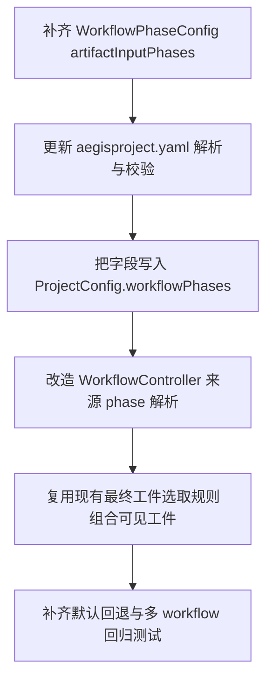

# Implementation Plan (implementationPlan)

## 概述 (summary)

- 本次实现聚焦 `default-workflow` 的 phase 工件输入来源配置能力，目标是把当前默认的“上一阶段工件传给下一阶段”收敛为可配置的 workflow phase 语义，同时保持未配置时的兼容回退行为。
- 实现建议拆成 6 步：补齐 `WorkflowPhaseConfig` 类型、补齐 `.aegisflow/aegisproject.yaml` 解析与校验、把字段传入 Runtime / ProjectConfig、改造 `WorkflowController` 的 phase 工件可见性解析、保留“最终工件选取规则”不变、补齐不同 workflow 下的回归测试。
- 最关键的风险点是把“读取哪些阶段的工件”误做成“读取哪些具体 artifact key”；本期必须停留在 phase 级来源声明，不能过早扩展到文件级路由。
- 最需要注意的是兼容性边界：显式配置后必须完全优先于默认上一阶段逻辑，但未配置时又必须保持当前行为不变，不能因为引入新字段破坏现有 workflow。
- 当前存在一个显式未定项：字段名是否最终固定为 `artifactInputPhases`。`project.md` 已按这个名字更新，本计划默认沿用该命名推进，除非实现阶段发现必须统一收敛到其他现有命名风格。

---

## 输入依据 (inputBasis)

- PRD：`roleflow/clarifications/0.1.0/default-workflow-phase-artifact-input-phases-prd.md`
- 项目上下文：`roleflow/context/project.md`
- 计划模板：`roleflow/templates/plan/implementationPlan.md`
- 相关历史计划：`roleflow/implementation/0.1.0/default-workflow-workflow-layer.md`
- 相关历史计划：`roleflow/implementation/0.1.0/default-workflow-intake-project-workflows.md`
- 相关历史计划：`roleflow/implementation/0.1.0/default-workflow-final-artifact-markdown-output.md`
- 当前实现参考：`src/default-workflow/workflow/controller.ts`
- 当前实现参考：`src/default-workflow/runtime/project-config.ts`
- 当前实现参考：`src/default-workflow/runtime/builder.ts`
- 当前实现参考：`src/default-workflow/shared/types.ts`
- 当前实现参考：`src/default-workflow/shared/utils.ts`
- 当前测试参考：`src/default-workflow/testing/runtime.test.ts`
- 当前测试参考：`src/default-workflow/testing/agent.test.ts`

缺失信息：

- `roleflow/context/standards/common-mistakes.md` 当前不存在，无法作为实现约束输入。
- `roleflow/context/standards/coding-standards.md` 当前为空，未提供可执行编码规范。
- 当前没有独立 exploration 文档专门解释 phase 工件可见性设计；本计划只能基于 PRD、`project.md` 和现有控制器实现收敛。

---

## 实现目标 (implementationGoals)

- 扩展 `WorkflowPhaseConfig` 及相关项目配置模型，使其支持 `artifactInputPhases?: Phase[]` 这类 phase 级工件输入来源声明。
- 修改 `.aegisflow/aegisproject.yaml` 的解析与校验链路，使项目 workflow 配置可以稳定读取、校验并保留 `artifactInputPhases`，而不是在解析阶段被忽略。
- 修改 `ProjectConfig.workflowPhases` 的运行时传递链路，确保 Runtime、持久化上下文和恢复流程都能拿到该字段，而不是只在 `project.md` 示例里存在。
- 修改 `WorkflowController` 的 phase 工件可见性解析逻辑，使当前 phase 在执行时读取“配置指定的来源阶段工件”；未配置时才回退到“只读取上一阶段工件”。
- 保持“每个来源 phase 具体选哪份最终工件”的内部规则不变，本期只新增 phase 来源集合能力，不重写最终工件选取算法，也不进入 artifact key 级依赖配置。
- 保持不同 workflow 的同名 phase 可有不同的工件输入来源，不把 `build`、`review`、`test-design` 等 phase 的依赖关系写死到全局常量或控制器分支里。
- 最终交付结果应达到：文档、配置解析、Runtime 传递和 `WorkflowController` 的 artifact reader 语义一致，且至少能稳定表达 `build <- [clarify, plan]` 与 `build <- [plan]` 两种 workflow 级差异。

---

## 实现策略 (implementationStrategy)

- 采用“配置模型收敛 + 读取链路替换 + 默认行为兼容”的局部改造策略，不整体重写 ArtifactManager 或 phase 工件命名规则，只替换 phase 输入来源的决策逻辑。
- 先补类型和配置解析，再调整 `WorkflowController.resolveVisibleArtifactKeys(...)`，避免先改读取逻辑导致运行时拿不到字段。
- 将 `artifactInputPhases` 定义为 workflow phase 配置字段，而不是全局 phase 元数据；这样同名 phase 的依赖关系天然可以随 workflow 变化。
- 对显式配置和默认行为采用二段式解析：先判断当前 phase 是否配置了 `artifactInputPhases`；若有则严格按配置取来源 phase 列表，若无才回退到上一阶段。
- 对“来源 phase 列表 -> 可见 artifact keys”的映射复用现有最终工件选取规则，保证本期变化只发生在“读哪些 phase”，不发生在“每个 phase 选哪份 artifact”。
- 校验层保持最小必要约束：字段若存在，必须是 phase 名数组、阶段名合法、引用的 phase 在当前 workflow 中有定义；但不要求本期支持循环依赖分析之外的更复杂 artifact 路由语义。
- 测试层优先覆盖三类路径：未配置默认上一阶段、显式多来源覆盖默认行为、不同 workflow 下同名 phase 的来源差异。

---

## 实施流程图 (implementationFlowchart)

---

## 当前实现差异与收敛项 (currentGapsAndConvergence)

- 当前 `roleflow/context/project.md` 已经把 `artifactInputPhases` 写进 `PhaseConfig` 和 `.aegisflow/aegisproject.yaml` 示例，但代码侧 `src/default-workflow/shared/types.ts` 的 `WorkflowPhaseConfig` 仍未包含该字段，文档与实现存在明显脱节。
- 当前 `src/default-workflow/runtime/project-config.ts` 解析 workflow phase 时只接收 `name`、`hostRole`、`needApproval`、`pauseForInput`，并不会解析或校验 `artifactInputPhases`。
- 当前 `src/default-workflow/shared/utils.ts` 的 `createProjectConfig(...)` 虽会复制 `workflowPhases`，但由于类型里没有该字段，运行时不会稳定持有 phase 工件来源配置。
- 当前 `src/default-workflow/workflow/controller.ts` 的 `resolveVisibleArtifactKeys(...)` 仍是硬编码回退逻辑：`clarify` 看自身，其他 phase 默认看上一阶段，不支持 workflow 级显式来源集合。
- 当前控制器已经有“上一阶段最终主工件”的隐式选取规则，因此本期不需要重新设计 artifact key 级路由；真正缺的是“读取哪些 phase”的显式来源配置。
- 当前 `project.md` 已经先行展示了 `build` 读取 `clarify + plan`、`build` 只读 `plan` 等样例，这意味着文档侧语义已经明确，Builder 不应再把该能力理解成未来需求。

---

## 配置与读取收敛项 (artifactInputPhaseResolutionRequirements)

- `WorkflowPhaseConfig` 的外部契约需要至少包含：`name`、`hostRole`、`needApproval`、`artifactInputPhases?`。
- `artifactInputPhases` 的语义必须固定为“当前 phase 需要读取哪些阶段的工件”，字段值是 phase 名数组，而不是单个字符串、artifact key 数组或文件路径数组。
- 若字段未配置，默认行为保持现状：当前 phase 只读取上一阶段工件。
- 若字段显式配置，读取行为必须完全按配置执行，不再混入“上一阶段自动补充”之类隐式规则。
- 若字段显式配置为空数组，是否允许当前 phase 不读取任何上游工件，需要在实现时按现有 YAML/类型风格做一次明确选择；本计划倾向允许空数组表达“该阶段不依赖上游工件”，但若当前配置系统不便表达，可在实现时先限制为非空数组并显式报错。
- 来源 phase 名必须与当前 workflow 中实际存在的 phase 名一致；若引用未定义 phase，配置校验必须失败。
- 读取多个来源 phase 时，系统应组合这些 phase 的最终工件视图；组合顺序应稳定且可预测，优先沿用 workflow phase 顺序，而不是按字符串字典序重新打散。
- 本期不改变“每个来源 phase 具体暴露哪一份最终工件”的既有规则；`artifactInputPhases` 只决定来源 phase 集合，不决定具体 artifact key。

---

## Workflow 可见性要求 (workflowArtifactVisibilityRequirements)

- `WorkflowController` 应把“当前 phase 可见哪些来源 phase”从当前的 `getPreviousPhaseConfig(...)` 单一路径，收敛为“读取当前 phaseConfig.artifactInputPhases 或默认上一阶段”的显式解析流程。
- `clarify` 作为起始 phase，不应因为默认回退逻辑而读取不存在的上游 phase；未配置时其可见工件仍应按现有起始行为为空或仅限本 phase 内受控工件。
- 对 `explore`、`plan`、`build`、`review`、`test-design`、`unit-test`、`test` 等 phase，来源集合应由当前 workflow 中对应 phase 的配置决定，而不是由全局 phase 顺序写死。
- 当同一个 `build` phase 在不同 workflow 中分别配置为 `["clarify", "plan"]` 与 `["plan"]` 时，`ExecutionContext.artifacts.list()` 的可见结果必须随 workflow 切换而变化。
- 对来源 phase 的最终工件选取，仍沿用现有 `resolveFinalArtifactDefinition(...)` 或等价逻辑，避免本次实现同时引入“来源集合配置”和“最终工件定义重构”两个变量。

---

## 验收目标 (acceptanceTargets)

- `WorkflowPhaseConfig`、项目配置解析器和 Runtime 输入链路都已支持 `artifactInputPhases`，不再只有 `project.md` 文档示例具备该字段。
- `.aegisflow/aegisproject.yaml` 中可以合法表达 `build` 同时读取 `clarify + plan`，也可以合法表达 `build` 只读取 `plan`。
- 当 phase 未配置 `artifactInputPhases` 时，系统行为保持现状：当前 phase 只读取上一阶段工件。
- 当 phase 显式配置 `artifactInputPhases` 时，系统会按配置读取对应来源阶段工件，不再隐式退回上一阶段默认逻辑。
- 同名 phase 在不同 workflow 中可以读取不同的上游阶段工件集合，控制器中不存在把 `build`、`review` 等 phase 依赖写死为全局唯一规则的实现。
- phase 工件来源能力仍然停留在“阶段级来源集合”层面，没有被扩展成 artifact key / 文件路径级配置。
- 自动化测试或等价校验至少覆盖：字段解析与校验、默认回退、显式多来源、显式单个非上一阶段来源、以及不同 workflow 下同名 phase 的来源差异。

---

## Open Questions

- 字段名是否最终固定为 `artifactInputPhases`，还是需要根据现有命名风格进一步统一；当前计划默认沿用 `project.md` 和 PRD 中已使用的 `artifactInputPhases`。
- 显式空数组 `artifactInputPhases: []` 是否应被允许并解释为“该 phase 不读取任何上游工件”；当前计划倾向允许，但实现时需结合现有配置解析复杂度定稿。

---

## Assumptions

- 当前用户要解决的是“阶段级工件来源配置”，不是“具体文件级工件路由配置”。
- 现有系统内部对每个 phase 最终工件的选取规则可以沿用，本次只补 phase 来源声明能力。
- `project.md` 中已经更新的 `artifactInputPhases` 示例应视为目标外部契约，而不是可选参考写法。

---

## Todolist (todoList)

- [x] 盘点 `WorkflowPhaseConfig`、`ProjectWorkflowDefinition`、`ProjectConfig.workflowPhases` 相关类型，补齐 `artifactInputPhases?: Phase[]` 的公共契约。
- [x] 更新 `.aegisflow/aegisproject.yaml` 解析器，使其能够读取 phase 配置中的 `artifactInputPhases` 数组，而不是在解析阶段忽略该字段。
- [x] 为 `artifactInputPhases` 增加配置校验，至少覆盖数组类型、phase 名合法性、引用 phase 存在性，以及显式配置优先于默认回退的语义边界。
- [x] 更新 `createProjectConfig(...)` 与 Runtime 装配链路，确保 `artifactInputPhases` 会随 `workflowPhases` 一起进入 `ProjectConfig`、持久化上下文和恢复流程。
- [x] 重构 `WorkflowController` 的 phase 工件来源解析逻辑，把“上一阶段”收敛为默认回退规则，而不是唯一来源规则。
- [x] 为当前 phase 新增“来源 phase 列表 -> 可见 artifact keys”解析函数，优先按 `artifactInputPhases` 取值组合多个来源 phase。
- [x] 复用现有最终工件选取规则，只修改来源 phase 集合，不在本次同时重构 artifact key 级选取策略。
- [x] 校对 `clarify` 起始 phase、`explore` 默认上一阶段、`build <- [clarify, plan]`、`build <- [plan]` 这些关键路径，确保默认和显式配置都符合 PRD。
- [x] 根据实现需要补充或更新测试，覆盖未配置默认上一阶段、显式多来源、显式单个非上一阶段来源、不同 workflow 下同名 phase 依赖差异，以及非法 phase 引用报错。
- [x] 同步校对 `project.md`、解析器示例和运行时类型命名，避免出现文档字段叫 `artifactInputPhases`、代码里又引入第二套命名的情况。
- [x] 完成自检，确认本次改造没有把 phase 工件来源能力错误扩展成 artifact key 级路由，也没有破坏现有未配置场景的兼容行为。
