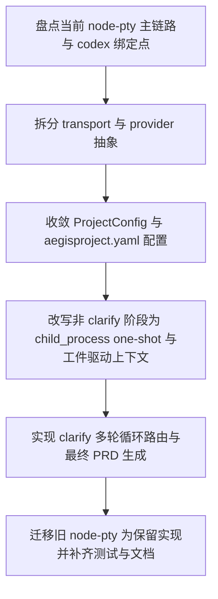

# Implementation Plan (implementationPlan)

## 概述 (summary)

- 本次实现聚焦 `default-workflow` 的角色执行链路收敛，目标是把当前以 `node-pty` 持久会话为主的默认路径，切换成 `child_process` one-shot 调用，并补上 transport / provider 分层与 `clarify` 多轮问答工件闭环。
- 实现建议拆成 6 步：盘点当前 `node-pty` 主链路与 `codex` 绑定点、重构 `Executor` 为 transport/provider 两层、收敛项目配置结构、改写非 `clarify` 阶段的 one-shot 与工件驱动上下文语义、补齐 `clarify` 多轮循环与最终 PRD 生成、迁移旧实现并更新测试与文档。
- 最关键的风险点是“表面改成一次性调用，但运行时结构仍默认围绕 `codex + sessionId + PTY` 组织”，那样后续切换 CLI provider 时仍会再次返工。
- 最需要注意的是 `clarify` 不能被当成普通单阶段单工件处理；`clarifier` 负责给出“继续提问 / 问答结束”的结构化判断，`Workflow` 只负责按该结果循环路由或触发最终 PRD 生成。
- 当前没有产品层未确认问题，但规范输入存在缺口：`roleflow/context/standards/common-mistakes.md` 缺失，`roleflow/context/standards/coding-standards.md` 为空；同时当前仓库尚无独立 exploration 工件可作为本计划输入。

---

## 输入依据 (inputBasis)

- PRD：`roleflow/clarifications/0.1.0/default-workflow-role-child-process-subcommand-prd.md`
- 项目上下文：`roleflow/context/project.md`
- 计划模板：`roleflow/templates/plan/implementationPlan.md`
- 相关历史计划：`roleflow/implementation/0.1.0/default-workflow-role-node-pty-subcommand.md`
- 相关历史计划：`roleflow/implementation/0.1.0/default-workflow-role-codex-cli.md`
- 当前执行器实现：`src/default-workflow/role/executor.ts`
- 当前类型定义：`src/default-workflow/shared/types.ts`
- 当前运行时装配：`src/default-workflow/runtime/builder.ts`
- 当前配置默认值：`src/default-workflow/shared/utils.ts`
- 当前工作流控制器：`src/default-workflow/workflow/controller.ts`
- 当前项目配置：`.aegisflow/aegisproject.yaml`
- 当前测试参考：`src/default-workflow/testing/role.test.ts`
- 当前测试参考：`src/default-workflow/testing/runtime.test.ts`

缺失信息：

- `roleflow/context/standards/common-mistakes.md` 当前不存在，无法作为实现约束输入。
- `roleflow/context/standards/coding-standards.md` 当前为空，未提供可执行编码规范。
- 当前没有与本 PRD 对应的独立 exploration 工件；本计划只能基于 PRD、项目文档和现有代码状态生成。

---

## 实现目标 (implementationGoals)

- 将 `default-workflow` 的默认角色执行路径从“`node-pty` 持久化终端 + session 复用”切换为“`child_process` 一次调用一进程”的默认语义。
- 保留现有 `node-pty` 能力代码，但将其迁入明确的保留目录或保留实现边界，使当前主执行链路不再引用它。
- 将当前 `Executor` / `roleExecutor` 相关结构从“只表达 `codex-cli`”收敛为“transport + provider + command + cwd + timeout + env passthrough”两层语义。
- 保持 `hostRole -> Executor -> CLI provider` 的职责边界，避免 `hostRole` 重新直接拼命令或直接承担文件读写/工具调用。
- 将非 `clarify` 阶段统一为 one-shot 调用模型，明确上下文延续主要依赖工件而不是 CLI 进程记忆、session id 或 resume 线程。
- 为 `clarify` 阶段新增稳定的多轮问答工件机制，并在问答结束后由 `Workflow` 再发起一次新的 one-shot 调用正式生成 PRD 工件。
- 保持 `Workflow` 的 phase 编排、`RoleResult` 公共类型名和现有 artifact manager 主体职责不被无谓推翻，本次以局部架构收敛为主，而不是整体重写 `default-workflow`。
- 最终交付结果应达到：默认角色运行时清晰基于 `child_process` one-shot 执行，transport/provider 分层成立，`clarify` 具备多轮问答与最终 PRD 双工件闭环，旧 `node-pty` 仅作为不被主链路引用的保留实现存在。

---

## 实现策略 (implementationStrategy)

- 采用“先收敛运行时分层，再调整流程语义”的局部改造策略，优先修正默认执行介质和配置结构，再处理 `clarify` 的特殊流程。
- 在现有 `role/executor.ts` 基础上拆出两层抽象：transport 只负责启动/等待/超时/收集输出，provider 只负责 CLI 协议、参数拼接、prompt 注入和结果解析。
- 当前可继续内置 `codex` provider，但要把它从通用执行链路中抽离出来，避免 `shared/types`、`runtime/builder`、`workflow/controller` 把 provider 类型硬编码成唯一后端。
- 对现有 `node-pty` 代码采用“迁移为 retained implementation”的方式处理，不删除历史能力，但禁止其继续作为默认路径被 `Executor` 或 `Workflow` 主链路引用。
- 非 `clarify` 阶段优先沿用现有 `runPhase -> runRole -> artifact save` 闭环，只把角色调用语义改成 one-shot，并把上下文重建显式收敛到工件读取、上游工件摘要和 prompt 组装上，不能再假设有可复用 session 记忆。
- `clarify` 阶段采用显式特例实现，而不是把多轮循环硬塞进通用 phase 主链路；推荐新增 `runClarifyPhase()`，由 `runPhaseInternal()` 在 `clarify` 时分派，避免把普通 phase 的一次调用模型污染成隐式循环。
- `clarifier` 是否继续提问的判断仍由角色执行结果给出；`WorkflowController` 只负责读取结构化状态、追加问答工件、决定是否再次发起 one-shot 调用或转入最终 PRD 生成调用。
- `hostRole` 的简单判断语义通过 `RoleResult` 返回路径显式落地：至少能表达“工件可落盘”与“phase 已结束/需继续”，`v0.1` 默认可用“执行成功即允许落盘”，但该语义不能只停留在文档描述里。
- 配置层采取兼容式收敛：优先让 `.aegisflow/aegisproject.yaml` 和 `ProjectConfig` 能明确表达 transport/provider 语义，再由 builder 做归一化，避免把旧配置散落在代码默认值里。
- 测试层采用“主链路回归 + 新能力断言”策略，优先覆盖 transport/provider 分层、默认不再引用 `node-pty`、非 `clarify` one-shot 调用、以及 `clarify` 问答工件与最终 PRD 生成闭环。

---

## 实施流程图 (implementationFlowchart)

---

## Clarify 特殊执行设计 (clarifyExecutionDesign)

- `clarify` 不复用通用“一次 `runRole` 即结束当前 phase”的实现；推荐新增 `runClarifyPhase()`，由 `runPhaseInternal()` 对 `clarify` 做显式分派。
- `runClarifyPhase()` 内部采用受控循环：每一轮都基于“最初需求 + 当前问答工件”重新组装 prompt，触发一次新的 `child_process` one-shot 调用。
- “最初需求”推荐保存为 `clarify` 阶段的独立工件，例如 `initial-requirement.md`，而不是混入问答工件头部、`TaskState` 或临时 metadata；这样既满足 FR-9 的“单独保留”，也能避免后续问答追加时覆盖原始语义。
- 问答历史推荐保存为单独的 `clarify-dialogue.md`，按时间顺序追加 `Question / Answer` 轮次；最终 PRD 另存为独立工件，形成 `initial requirement + dialogue + final prd` 三类稳定输入/输出物。
- `clarifier` 返回结果必须是结构化的，至少表达：
  - `decision = "ask_next_question" | "ready_for_prd"`
  - `question?`
  - `artifacts?`
  - `metadata?`
- 当 `decision = "ask_next_question"` 时，`Workflow` 只负责把问题追加到问答工件、切到等待用户回答，并在用户参与后再次进入 `runClarifyPhase()`。
- 当 `decision = "ready_for_prd"` 时，`Workflow` 不直接把本轮输出当 PRD，而是发起一次新的 PRD 生成 one-shot 调用，并将结果保存为最终 PRD 工件。
- `clarify` 中断恢复时，不依赖 CLI 进程状态；恢复入口只读取 `initial-requirement.md`、`clarify-dialogue.md` 和 `TaskState.resumeFrom` 后重新进入 `runClarifyPhase()`。`resumeFrom.currentStep` 推荐记录为 `clarify_waiting_user_answer`、`clarify_ready_for_prd` 等稳定步骤名，而不是记录易漂移的轮次编号。
- 该设计保持职责清晰：`clarifier` 负责判断是否继续提问，`Workflow` 负责 phase 内循环、用户输入路由和工件落盘。

---

## 角色结果与判断语义 (roleResultAndHostRoleSemantics)

- `project.md` 中的 `RoleResult` 已定义 `artifactReady?` 与 `phaseCompleted?`，本次不建议再新增另一套平行字段；实现重点应是把这两个既有语义真正接入当前代码返回路径与 `Workflow` 消费逻辑。
- 对普通 phase，`hostRole` 的最低语义至少包括：
  - `artifactReady`
  - `phaseCompleted`
- `v0.1` 可以把“Executor 成功返回”默认映射为 `artifactReady = true`、`phaseCompleted = true`，但这个映射应在返回路径或适配层中显式实现。
- 对 `clarify` phase，除上述语义外，还需要额外通过 `metadata` 表达 `clarifier` 的结构化路由结论，供 `Workflow` 决定继续追问还是发起最终 PRD 生成，避免误解为需要重定义 `RoleResult` 主类型。

---

## 当前实现差异与收敛项 (currentGapsAndConvergence)

- 当前 `src/default-workflow/role/executor.ts` 的主实现仍是 `CodexCliRoleAgentExecutor + createPersistentCodexCliSession()`，默认通过 `node-pty` 维持长期 shell 与多轮输入队列，这与本 PRD 要求的默认 `child_process` one-shot 路径直接冲突。
- 当前 `sendInput()` 语义仍建立在“同一个角色 PTY 会话可持续接收后续输入”之上；本 PRD 下这类长期 session 只能作为保留能力存在，不能继续是默认记忆机制。
- 当前 `ProjectConfig.roleExecutor` 与 `RoleExecutorConfig` 仍固定为 `type: "codex-cli"`，`createRoleExecutorConfig()` 也直接回填 `command/cwd/timeoutMs/env`，尚未表达 transport/provider 两层概念。
- 当前 `runtime/builder.ts` 解析 `.aegisflow/aegisproject.yaml` 时也只读取 `roles.executor` 下的 `type/command/cwd/timeoutMs/env.passthrough`，没有 transport/provider 分层入口。
- 当前 `WorkflowController` 的 `runPhaseInternal()` 把所有 phase 都当作“执行一次 role -> 返回 artifacts -> 统一落盘”的同构流程；它没有 `clarify` 多轮循环、结构化继续/结束判断、最终单独生成 PRD 的特殊分支。
- `project.md` 中的 `RoleResult` 已定义 `artifactReady` 与 `phaseCompleted`，但当前 `src/default-workflow/shared/types.ts` 与 `WorkflowController` 代码路径还没有把这两个既有语义真正接入消费链路；同时 `clarify` 所需的结构化路由结论也尚未形成明确的 `metadata` 契约。
- 当前代码已经具备按 phase 保存多个 artifact 的能力，这意味着 `clarify` 的“双工件”并不一定要求重写 artifact manager，但需要新增稳定命名、追加写入与特殊时机控制。
- 当前 `.aegisflow/aegisproject.yaml` 已落地 `roles.executor` 配置，但语义仍与旧实现一致，计划中需要把它升级为面向 `child_process + provider` 的配置表达，而不是继续把执行方式等同于 `codex-cli`。
- 当前非 `clarify` 阶段的 prompt/context 重建逻辑没有被显式定义为“必须从工件读取上下文”，仍有继续依赖会话记忆心智模型的风险，需要单独收敛。

---

## 验收目标 (acceptanceTargets)

- 默认角色执行链路明确通过 `child_process` 发起 one-shot 调用，不再默认依赖 `node-pty` 持久会话。
- 运行时代码中 transport 与 provider 职责清晰分层；transport 不再直接拼接 `codex exec` 或 `codex exec resume` 协议。
- `ProjectConfig` 与 `.aegisflow/aegisproject.yaml` 至少能稳定表达 `transport`、`provider`、`command`、`cwd`、`timeout`、`env passthrough` 等配置语义。
- 当前主执行链路不再引用保留下来的 `node-pty` 代码；旧实现被明确整理到保留目录或保留模块边界中。
- 非 `clarify` 阶段的角色调用表现为“一次 phase 角色执行对应一次新的外部 CLI 子进程”，上下文延续依赖工件而不是 session 记忆。
- `hostRole` 继续只通过统一 `Executor` 访问底层执行能力，不会重新直接拼接 CLI 命令或绕过统一入口。
- `hostRole` 的最小判断语义已在返回路径中显式落地，至少能让 `Workflow` 判断“工件是否允许落盘”和“当前 phase 是否结束”。
- `clarify` 阶段存在一份持续累积的问答工件，能够完整记录多轮问题与回答历史。
- `clarifier` 的 one-shot 结果存在稳定的结构化约定，至少能表达“继续提问”与“进入最终 PRD 生成”两种状态。
- 当 `clarifier` 判断问答结束后，`Workflow` 会发起新的 one-shot 调用，根据“最初需求 + 全量问答工件”生成最终 PRD 工件，而不是直接复用上一轮回复。
- 自动化测试或可执行校验至少覆盖：默认 `child_process` 路径、transport/provider 分层、旧 `node-pty` 不再被主链路引用、非 `clarify` one-shot 调用、以及 `clarify` 双工件闭环。

---

## Open Questions

- 暂无。当前 PRD 对默认 transport、provider 分层、`hostRole` 边界和 `clarify` 特殊流程的约束已经足够明确，本次可直接进入实现规划。

---

## Todolist (todoList)

- [x] 盘点 `src/default-workflow/role/executor.ts` 中所有默认依赖 `node-pty`、长期 session、`sessionId` 或 follow-up input 队列的实现点，并标记哪些需要迁移为 retained implementation。
- [x] 设计并落地最小 `child_process` transport 抽象，明确启动命令、stdin/stdout/stderr 收集、超时处理和退出码错误包装边界。
- [x] 设计并落地最小 CLI provider 抽象，至少覆盖 `codex` provider 的命令拼接、prompt 注入、输出读取和 provider 级结果解析。
- [x] 调整 `RoleAgentExecutor`、`RoleExecutorConfig`、`ProjectConfig` 及相关装配接口，显式区分 transport 与 provider，避免继续把 `codex-cli` 当成唯一执行器类型。
- [x] 更新 `.aegisflow/aegisproject.yaml` 解析链路与默认值生成逻辑，使 builder 能读取并归一化 transport/provider 相关配置。
- [x] 将当前默认主执行链路切换到新的 `child_process` transport，并保证非 `clarify` 阶段的 `runRole` 语义变成 one-shot 调用。
- [x] 整理现有 `node-pty` 代码到明确的保留目录或保留模块边界，并移除当前主链路对其默认引用。
- [x] 为非 `clarify` 阶段定义显式的 artifact-driven context 组装规则，确保 prompt 只依赖当前输入与可见工件，而不是隐含依赖 CLI 进程记忆。
- [x] 收敛 `sendInput` 与运行中参与语义，明确在默认 one-shot 模型下哪些输入仍允许进入当前 phase，哪些需要回到工件驱动或恢复链路处理。
- [x] 为 `RoleResult` 或其 `metadata` 定义最小宿主判断契约，至少稳定表达 `artifactReady` 与 `phaseCompleted`。
- [x] 为 `clarify` 阶段落地独立的 `initial-requirement` 工件保存策略，保证“最初需求”与问答工件、最终 PRD 工件分离存储，且后续轮次不会覆盖原始语义。
- [x] 为 `clarify` 阶段新增专用问答工件文件，并实现每轮问题与回答的顺序追加写入。
- [x] 按本计划中的推荐方案落地 `clarifier` one-shot 结果的结构化约定，至少稳定表达“继续提问”与“进入最终 PRD 生成”两种状态，以及必要的问题内容字段。
- [x] 新增 `runClarifyPhase()` 或等价显式分支，使 `clarify` 的多轮 one-shot 循环不污染普通 phase 的执行模型。
- [x] 扩展 `WorkflowController`，使其只负责读取 `clarifier` 的结构化结论并做路由：继续追问、等待用户回答，或触发最终 PRD 生成。
- [x] 为 `clarify` 的中断恢复补齐状态约定与恢复实现，确保恢复只依赖 `initial-requirement`、问答工件和 `resumeFrom.currentStep`，而不是依赖半途 CLI 进程状态。
- [x] 实现 `clarify` 结束后的最终 PRD 生成调用，并将结果保存为 `clarify` 阶段最终 PRD 工件。
- [x] 校对 artifact 命名与保存策略，确保非 `clarify` 仍遵守单主工件原则，而 `clarify` 允许问答工件与最终 PRD 并存。
- [x] 添加或更新测试，覆盖 transport/provider 分层、默认 `child_process` 执行、旧 `node-pty` 不再被主链路引用、`clarify` 问答追加写入、以及最终 PRD 生成链路。
- [x] 更新相关文档与配置示例，至少同步角色执行模型描述、`.aegisflow/aegisproject.yaml` 的 transport/provider 配置表达，以及与旧 `node-pty` 默认路径相关的文档表述。
- [x] 完成自检，确认本次改造没有让 `hostRole` 越权承担 CLI 协议细节，也没有把 `clarify` 再次退化成普通单轮 phase。
