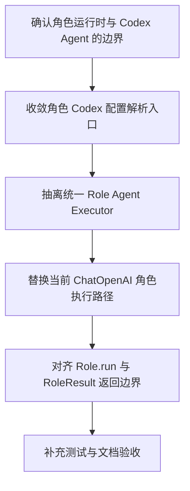

# Implementation Plan (implementationPlan)

## 概述 (summary)

- 本次实现聚焦 `default-workflow` 角色运行时的 Codex Agent 执行约束，目标是在不改写原有 `project.md` 和既有 role-layer 公共定义的前提下，把当前角色执行链路收敛成“统一角色执行器 + `codex 5.4` + 集中配置入口”。
- 实现建议拆成 6 步：补齐独立执行器抽象、收敛角色配置解析、替换当前 `ChatOpenAI` 角色执行路径、对齐 `Role.run(...)` 边界、补齐测试、完成文档与验收校对。
- 当前最大的风险是现有角色执行链路已经可运行，但底层仍是 `ChatOpenAI` 通用聊天接口；如果不显式替换为 Codex Agent 语义，很容易形成“双套执行链路并存”的过渡状态。
- 最需要注意的是本次新增需求只约束角色运行时，不应回写或覆盖既有 role-layer PRD / `project.md` 的原始公共边界；`Role.run(...)`、`RoleResult`、`RoleRuntime` 这些上层接口要保持不变。
- 当前仍有一项未被 PRD 固化的实现选择：仓库里尚无现成的 Codex 专用 SDK/客户端依赖，因此底层执行器采用“新增 SDK 适配”还是“新增内部适配层”需要在实现时显式定稿。

---

## 输入依据 (inputBasis)

- PRD：`roleflow/clarifications/0.1.0/default-workflow-role-codex-agent-prd.md`
- 相关公共需求：`roleflow/clarifications/0.1.0/default-workflow-role-layer-prd.md`
- 项目上下文：`roleflow/context/project.md`
- 计划模板：`roleflow/templates/plan/implementationPlan.md`
- 当前实现参考：`src/default-workflow/role/model.ts`
- 当前实现参考：`src/default-workflow/role/config.ts`
- 当前实现参考：`src/default-workflow/runtime/dependencies.ts`
- 当前实现参考：`src/default-workflow/testing/role.test.ts`
- 当前模型常量参考：`src/default-workflow/shared/constants.ts`
- 当前依赖参考：`package.json`

缺失信息：

- 当前仓库未看到现成的 Codex Agent 专用客户端或 SDK 依赖；现有角色执行器仍基于 `@langchain/openai` 的 `ChatOpenAI`。
- PRD 已固定“通过特定 AI Agent 运行”与“统一使用 `codex 5.4`”，但未固定底层客户端选型；该选择会影响依赖、初始化代码和测试替身实现。

---

## 实现目标 (implementationGoals)

- 新增一层明确的 `Role Agent Executor` 运行时抽象，使所有 `v0.1` 角色在 `Role.run(input, context)` 内部统一委托该执行器，而不是各角色直接拼装底层模型请求。
- 将当前角色模型配置从通用 `AEGISFLOW_ROLE_MODEL` / `AEGISFLOW_ROLE_BASE_URL` 口径收敛为 PRD 要求的 Codex 配置入口，至少稳定覆盖 `OPENAI_API_KEY`、`AEGISFLOW_ROLE_CODEX_BASE_URL`、`AEGISFLOW_ROLE_CODEX_MODEL`。
- 将 `v0.1` 角色默认模型显式固定为 `codex 5.4`，并避免角色间出现单独模型分叉。
- 替换当前角色运行时中“`ChatOpenAI` 直接 `invoke` executionPrompt”这一通用聊天接口路径，使其变成“统一角色执行器发起 Codex Agent 请求，再回填 `RoleResult`”。
- 保持 `Workflow -> Role.run(...) -> RoleResult` 的既有公共调用边界不变，不借本次需求改写 `RoleResult`、`ExecutionContext`、`RoleRuntime` 或 `project.md` 的原始定义。
- 最终交付结果应达到：角色层运行时能明确证明所有 `v0.1` 角色统一通过 Codex Agent 执行器工作，且共享配置入口、环境变量要求、测试覆盖与文档口径一致。

---

## 实现策略 (implementationStrategy)

- 采用“保留上层角色接口、替换底层执行实现”的局部改造策略，不改 `RoleRegistry` / `RoleDefinition` / `Role.run(...)` 的公共形态，只替换角色内部真实执行链路。
- 把当前 `initializeRoleAgent + executeRoleAgent` 组合收敛为“角色执行引导 + 统一 Codex Agent 执行器”两段式结构：前者负责 prompt 与配置准备，后者负责真实 Agent 调用和结果解析。
- 将角色配置解析从当前通用 role model 配置收敛为 Codex 专用配置解析，显式引入 `AEGISFLOW_ROLE_CODEX_BASE_URL` 与 `AEGISFLOW_ROLE_CODEX_MODEL`，并统一由 `OPENAI_API_KEY` 完成鉴权。
- 当前 `ChatOpenAI` 路径不再作为角色运行时正式执行分支；如为测试保留 stub/假执行路径，也应明确限制在测试或内部兼容层，不能继续作为生产运行语义的一部分。
- `RoleResult` 的结构化返回对象保持不变，角色执行器只负责把 Codex Agent 输出解析回既有公共结果格式，不能借机改写 role-layer 已确认的公共契约。
- 由于 PRD 明确要求该需求是“新增文档”而不是覆盖原有文档，本次实现只在新增计划和代码实现层落地，不回写 `project.md` 或既有 role-layer PRD 的原始需求语义。

---

## 实施流程图 (implementationFlowchart)

---

## 当前实现差异与收敛项 (currentGapsAndConvergence)

- 当前 `src/default-workflow/role/model.ts` 已存在统一角色执行入口，但底层仍直接实例化 `ChatOpenAI` 并调用 `llm.invoke(...)`；这与 PRD 的“所有角色通过特定 AI Agent 运行，而不是直接调用通用大模型聊天接口”存在直接偏差。
- 当前 `src/default-workflow/role/config.ts` 已有集中配置解析入口，但环境变量名仍是 `AEGISFLOW_ROLE_MODEL` / `AEGISFLOW_ROLE_BASE_URL`；本次实现需要显式收敛到 `AEGISFLOW_ROLE_CODEX_MODEL` / `AEGISFLOW_ROLE_CODEX_BASE_URL`。
- 当前 `src/default-workflow/shared/constants.ts` 中角色默认模型值仍写为 `gpt5.4`；本次实现需要把角色默认模型收敛到 PRD 明确要求的 `codex 5.4`。
- 当前 `src/default-workflow/runtime/dependencies.ts` 已确保所有默认角色都走统一的 `initializeRoleAgent` / `executeRoleAgent` 链路；这说明“统一执行器入口”已有基础，本次实现重点是替换底层执行语义，而不是重新设计角色注册机制。
- 当前测试已覆盖角色通过统一 agent pipeline 执行，但尚未把“统一使用 Codex Agent 执行器”和“Codex 专用环境变量入口”提升为明确断言。
- 当前仓库依赖中未看到现成的 Codex Agent 专用 SDK；因此本次实现需要把“底层客户端适配方式”作为显式实现选择，而不是默认沿用 `ChatOpenAI`。

---

## 验收目标 (acceptanceTargets)

- 角色运行时存在一条明确的统一 `Role Agent Executor` 执行链路，所有 `v0.1` 角色都通过这条链路工作。
- `v0.1` 角色默认模型已统一收敛为 `codex 5.4`，且不会在角色之间出现独立模型分叉。
- 角色 Agent 的共享配置入口已集中管理，至少稳定覆盖 `OPENAI_API_KEY`、`AEGISFLOW_ROLE_CODEX_BASE_URL`、`AEGISFLOW_ROLE_CODEX_MODEL`。
- `Workflow` 仍然通过 `Role.run(input, context)` 调用角色，角色内部再委托统一执行器；`RoleResult` 的公共结构保持不变。
- 当前角色运行时不再退化为“直接把 prompt 发给通用聊天接口”的执行方式。
- 该需求以新增实现计划与代码改造的方式落地，不覆盖原有 `project.md` 与既有 role-layer PRD 的原始定义。
- 至少存在一组自动化测试或可执行校验，能够证明角色统一经过 Codex Agent 执行器、Codex 配置入口生效、以及公共返回边界未被破坏。

---

## Open Questions

- 底层 Codex Agent 客户端的具体接入方式尚未在 PRD 中固定：是新增专用 SDK 依赖，还是在现有依赖基础上封装内部适配层，需要在实现前定稿。
- 当前 `AEGISFLOW_ROLE_EXECUTION_MODE=stub` 测试路径是否继续保留为内部测试开关，PRD 未直接说明；若保留，应明确它不是生产运行的正式执行分支。

---

## Todolist (todoList)

- [x] 确认 `default-workflow-role-codex-agent-prd.md` 与既有 role-layer PRD 的边界，锁定本次只改角色运行时执行链路、不改公共角色接口。
- [x] 盘点 `src/default-workflow/role/model.ts`、`role/config.ts`、`runtime/dependencies.ts` 中当前 `ChatOpenAI` 角色执行路径的入口与替换范围。
- [x] 设计并收敛统一的 `Role Agent Executor` 抽象，明确其与 `initializeRoleAgent`、`Role.run(...)`、`RoleResult` 的关系。
- [x] 收敛角色配置解析入口，补上 `AEGISFLOW_ROLE_CODEX_BASE_URL`、`AEGISFLOW_ROLE_CODEX_MODEL`，并统一使用 `OPENAI_API_KEY` 作为最小鉴权输入。
- [x] 将角色默认模型常量从当前值调整为 `codex 5.4`，并避免角色侧继续读取通用 `AEGISFLOW_ROLE_MODEL` 口径作为正式主路径。
- [x] 替换当前 `ChatOpenAI` 直接调用执行 prompt 的角色运行逻辑，使所有默认角色统一改走 Codex Agent 执行器。
- [x] 明确 stub/测试模式是否保留；若保留，限制其为内部测试能力，不让其成为生产运行链路的可选主分支。
- [x] 更新或新增测试，覆盖 Codex 专用配置入口、统一执行器调用、`Role.run(...)` 边界、`RoleResult` 兼容性以及“非通用聊天接口”约束。
- [x] 完成自检，确认本次实现作为新增需求落地，没有回写或改写 `project.md` 与既有 role-layer PRD 的原始定义。
