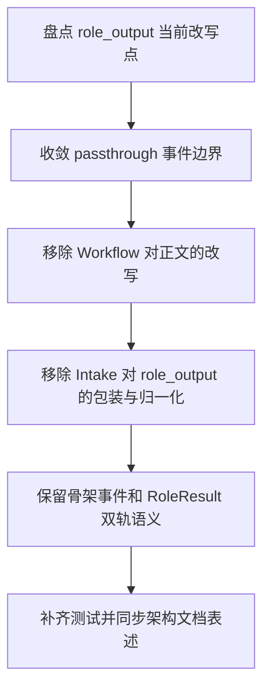

# Implementation Plan (implementationPlan)

## 概述 (summary)

- 本次实现聚焦 `default-workflow` 中 Codex CLI 角色输出到 `Intake` 的原样透传边界，目标是在已有 `role_output` 流式链路基础上，把“能看到输出”收敛为“看到的就是 Codex CLI 原始格式化结果”。
- 实现建议拆成 6 步：盘点当前 `role_output` 的改写点、收敛 passthrough 事件边界、调整 `Workflow` 转发逻辑、调整 `Intake` 展示逻辑、保留骨架事件与 `RoleResult` 双轨语义、补齐测试与文档对齐。
- 当前最大的风险不是链路不存在，而是链路已经存在但仍夹带 `trim`、换行归一化、标题包装、元信息拼接、TaskState 摘要附加等二次加工，这会让用户看到的内容不再是 Codex CLI 的真实输出。
- 最需要注意的是“原样透传”只约束来源于 Codex CLI 的 `role_output`；`task_start`、`phase_start`、`role_end` 等骨架事件仍可保留现有结构化展示，但不能借机再包装 `role_output` 本体。
- 当前仍有一个需要显式写出的收敛点：`project.md` 主流程图里仍写着“格式化后实时展示”，这与本 PRD 的“原样展示”要求不一致，本次实现需要把它视为架构文档收敛项。

---

## 输入依据 (inputBasis)

- PRD：`roleflow/clarifications/0.1.0/default-workflow-role-codex-cli-output-passthrough-prd.md`
- 相关需求：`roleflow/clarifications/0.1.0/default-workflow-role-codex-cli-prd.md`
- 相关需求：`roleflow/clarifications/0.1.0/default-workflow-cli-streaming-output-prd.md`
- 项目上下文：`roleflow/context/project.md`
- 计划模板：`roleflow/templates/plan/implementationPlan.md`
- 当前实现参考：`src/default-workflow/workflow/controller.ts`
- 当前实现参考：`src/default-workflow/intake/output.ts`
- 当前实现参考：`src/default-workflow/intake/agent.ts`
- 当前类型定义：`src/default-workflow/shared/types.ts`
- 当前测试参考：`src/default-workflow/testing/agent.test.ts`
- 当前测试参考：`src/default-workflow/testing/runtime.test.ts`

缺失信息：

- 当前 `project.md` 与既有 `default-workflow-cli-streaming-output.md` 仍保留“格式化展示”“基础文本排版”等旧表述，本次需要显式收敛为“仅骨架事件格式化，Codex CLI `role_output` 原样展示”。
- 当前运行时事件模型没有单独声明“某条 `role_output` 是否允许 passthrough”的显式字段；结合现有 `default-workflow` 实现，可先按“默认角色执行器产出的 `role_output` 即 Codex CLI 输出”收敛。

---

## 实现目标 (implementationGoals)

- 明确 `Role -> Workflow -> Intake -> CLI` 这条链路中，Codex CLI 产生的 `role_output.message` 是唯一展示正文，转发过程中不得再被 `trim`、摘要、改写、重排、换行归一化或代码块重包裹。
- 调整 `Workflow` 事件封装策略，使其在发送 `role_output` 时只附带不改写正文的元信息，并保持消息顺序稳定。
- 调整 `Intake` 输出策略，使其对 Codex CLI `role_output` 只做正确显示，不再附加标题、输出类型、TaskState 摘要或额外说明行。
- 保持 `task_start`、`phase_start`、`role_start`、`role_end`、`artifact_created`、`error` 等骨架事件仍可使用现有结构化展示方式，不把“原样透传”误扩展为“所有 WorkflowEvent 都不能格式化”。
- 保持最终 `RoleResult` 契约不变；Codex CLI 原始输出继续服务于实时可见反馈，`RoleResult` 继续服务于工作流编排和工件沉淀。
- 最终交付结果应达到：当角色通过 Codex CLI 输出列表、段落、代码块、空行或缩进内容时，CLI 用户看到的文本顺序和格式与 Codex CLI 原输出一致，同时系统原有骨架事件和最终 `RoleResult` 仍然成立。

---

## 实现策略 (implementationStrategy)

- 采用“缩窄展示层职责”的局部收敛策略，不重写现有流式链路，而是在 `Workflow` 封装与 `Intake` 渲染边界上去掉对 Codex CLI `role_output` 的二次加工。
- 把 `role_output.message` 收敛为展示真源，任何需要补充的上下文信息都通过独立骨架事件表达，而不是插入、包裹或重写 `message` 本体。
- 在 `WorkflowController` 中保留事件转发职责，但移除会改变正文的处理，例如对可见输出做 `trim()`、空白折叠或展示导向改写；如需跳过空消息，只能基于原始内容判定，不得改变非空消息正文。
- 在 `Intake` 输出层中保留对骨架事件的格式化函数，但为 Codex CLI `role_output` 增加明确的 passthrough 分支，直接输出 `message` 原文，不复用当前通用格式化模板。
- 将“正确显示 `\n`”收敛为上游直接传递真实换行字符，而不是由 `Intake` 对 `\\n` 做启发式修复；这样才能满足“原样透传”和“正确显示”同时成立。
- 对已有“基础文本排版”相关实现采取收缩适用范围的方式处理，只让它服务于非 `role_output` 事件，避免与本 PRD 正面冲突。

---

## 实施流程图 (implementationFlowchart)

---

## 当前实现差异与收敛项 (currentGapsAndConvergence)

- 当前 `src/default-workflow/workflow/controller.ts` 在 `emitVisibleOutput` 桥接中对 `output.message` 做了 `trim()`，这已经改变了前后空白与空行边界，不符合“内容与格式原样透传”。
- 当前 `src/default-workflow/intake/output.ts` 会为 `role_output` 增加标题、`outputKind` 说明行，并在尾部附加 `TaskState` 摘要；这些都属于展示层追加内容，不符合 PRD 对 `role_output` 只做正确显示的要求。
- 当前 `normalizeCliText()` 会执行 `\\n -> \n`、多空行折叠和整体 `trim()`；这类归一化逻辑对骨架事件或普通提示也许可接受，但不能继续作用于 Codex CLI 的 `role_output`。
- 当前 `src/default-workflow/testing/agent.test.ts` 仍把“渲染转义换行”和“存在 `>>> 角色输出｜...` 标题”当成正确行为断言；这些测试预期需要随着新 PRD 一起收敛。
- 当前 `roleflow/context/project.md` 主流程时序图把 `role_output` 写成“格式化后实时展示”，这与新 PRD 的“原样展示”冲突；本次需要显式将其视为文档收敛项，而不是默认继承旧表述。
- 当前 `default-workflow-cli-streaming-output.md` 计划中的“新增基础文本排版层”需要缩小适用范围，否则 Builder 容易误把该计划的格式化要求继续施加到 Codex CLI `role_output` 上。

---

## 验收目标 (acceptanceTargets)

- 当角色输出普通段落、列表、代码块、缩进或空行时，CLI 最终看到的 `role_output` 正文与 Codex CLI 发出的内容一致，不发生文本改写、顺序改写或格式边界改写。
- `Workflow` 在封装 `role_output` 时不会修改 `message` 本体；即使附带 `phase`、`roleName`、`outputKind` 等元信息，也不会把这些信息插入正文。
- `Intake` 对 Codex CLI `role_output` 不再追加标题、摘要、TaskState、输出类型说明或其他二次排版内容。
- `task_start`、`phase_start`、`role_start`、`role_end`、`artifact_created`、`error` 等非 `role_output` 事件仍然可以保持结构化展示，不因 passthrough 要求而丢失。
- 原样透传与最终 `RoleResult` 并存：用户运行时看到的是 Codex CLI 原始可见输出，`Workflow` 最终消费的仍是 `RoleResult`，二者职责不混淆。
- 至少存在一组自动化测试或可执行校验，覆盖前后空白保留、空行保留、列表/代码块边界保留、顺序保留、以及骨架事件未受影响。

---

## Open Questions

- 暂无；按当前 `default-workflow` 的实现边界，本次可直接把默认角色执行器发出的 `role_output` 视为 Codex CLI passthrough 对象，不需要额外等待需求澄清。

---

## Todolist (todoList)

- [ ] 盘点 `workflow/controller.ts`、`intake/output.ts`、`intake/agent.ts` 中所有会改写 `role_output.message` 的逻辑，包括 `trim`、换行归一化、标题包装、元信息拼接与 TaskState 摘要附加。
- [ ] 收敛 `role_output` 的 passthrough 边界，明确对 Codex CLI 可见输出采用“message 原文即展示正文”的实现约束。
- [ ] 调整 `WorkflowController` 的 `emitVisibleOutput -> role_output` 转发逻辑，移除会改变正文内容或格式的处理。
- [ ] 调整 `src/default-workflow/intake/output.ts`，让 Codex CLI `role_output` 走原样输出分支，非 `role_output` 事件继续走结构化展示分支。
- [ ] 校对 `IntakeAgent` 的输出转发方式，确保 passthrough 后的多行内容按原顺序实时输出，而不是再次被拆分、重组或包裹。
- [ ] 更新 `agent.test.ts`、`runtime.test.ts` 等测试，把“标题包装”“转义修复”“统一 trim”之类旧预期替换为“原文保留、顺序保留、边界保留”的新预期。
- [ ] 同步收敛 `roleflow/context/project.md` 与 `roleflow/implementation/0.1.0/default-workflow-cli-streaming-output.md` 中对 `role_output` 的表述，明确只有骨架事件允许格式化，Codex CLI `role_output` 必须原样展示。
- [ ] 完成自检，确认本次实现没有改变 `RoleResult` 公共契约，也没有把 passthrough 约束误扩展到所有 WorkflowEvent。
