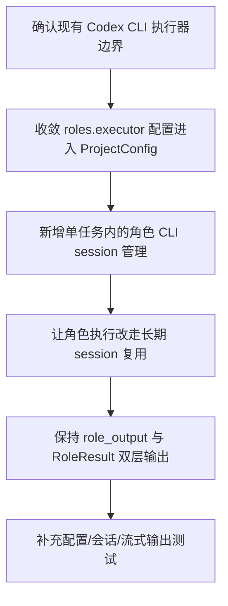

# Implementation Plan (implementationPlan)

## 概述 (summary)

- 本次实现聚焦 `default-workflow` 的 `Role` 层通过 Codex CLI 运行的执行介质约束，目标是在已有“Codex Agent + 流式可见输出”基础上，把执行后端正式收敛成 `codex` CLI，并补齐长期 session 与项目配置接入。
- 实现建议拆成 6 步：对齐当前执行器边界、补齐 `.aegisflow/aegisproject.yaml` 的 `roles.executor` 配置落地、抽出角色级 CLI session 管理、把现有 `codex exec` 短调用收敛到长期 session 模型、保持双层输出语义不变、补齐测试与验收。
- 当前最大的风险不是“完全没有 Codex CLI 能力”，而是代码已经部分进入 Codex CLI 路径，但仍是单次 `codex exec` 短进程执行；如果不显式收敛为角色级长期 session，很容易出现文档与实现脱节。
- 最需要注意的是两层输出必须继续分离：原始/增量 CLI 输出用于 `Intake` 实时展示，最终仍然由 `RoleResult` 供 `Workflow` 消费，不能把 CLI 原始文本直接上推给 `Workflow` 作为最终结果。
- 当前仍有一个需要显式写出的架构收敛点：`project.md` 和 PRD 已经把 `roles.executor` 写入 `.aegisflow/aegisproject.yaml`，但当前 `ProjectConfig` 与 runtime 装配链路尚未真正消费这组配置。

---

## 输入依据 (inputBasis)

- PRD：`roleflow/clarifications/0.1.0/default-workflow-role-codex-cli-prd.md`
- 相关需求：`roleflow/clarifications/0.1.0/default-workflow-role-codex-agent-prd.md`
- 相关需求：`roleflow/clarifications/0.1.0/default-workflow-cli-streaming-output-prd.md`
- 相关需求：`roleflow/clarifications/0.1.0/default-workflow-role-layer-prd.md`
- 项目上下文：`roleflow/context/project.md`
- 计划模板：`roleflow/templates/plan/implementationPlan.md`
- 当前实现参考：`src/default-workflow/role/executor.ts`
- 当前实现参考：`src/default-workflow/role/model.ts`
- 当前实现参考：`src/default-workflow/role/config.ts`
- 当前实现参考：`src/default-workflow/runtime/builder.ts`
- 当前实现参考：`src/default-workflow/shared/types.ts`
- 当前配置参考：`.aegisflow/aegisproject.yaml`
- 当前测试参考：`src/default-workflow/testing/role.test.ts`
- 当前测试参考：`src/default-workflow/testing/runtime.test.ts`

缺失信息：

- 当前公共配置类型中尚未看到 `roles.executor` 的正式运行时字段定义，说明 YAML 示例与运行时配置模型还没有完全收敛。
- 当前代码虽已通过 `codex exec` 运行角色任务，但尚未看到“单任务内、单角色长期 CLI session”对应的 session 管理器或缓存抽象。

---

## 实现目标 (implementationGoals)

- 明确并固定 `Role` 层的实际执行介质为 `codex` CLI，而不是项目内部直接调用模型 SDK / API；现有 Codex CLI 执行器要从“实现细节”提升为正式运行时主路径。
- 将 `.aegisflow/aegisproject.yaml` 中 `roles.executor` 的最小配置真正接入运行时，至少稳定覆盖 `type`、`command`、`cwd`、`timeoutMs`、`env.passthrough`。
- 新增角色级 CLI session 生命周期管理，使同一任务流程内的同一角色可复用长期 CLI session，而不是每次 `Role.run(...)` 都重新拉起新的短进程。
- 保持 CLI 原始/增量输出继续透传到 `Workflow -> Intake`，并保持最终仍由 `RoleResult` 作为 `Workflow` 的唯一公共消费对象。
- 保持“复用 Codex CLI 已有工具能力、避免在 AegisFlow 内重复实现文件/Git/搜索工具链”这一设计原则在代码结构中可见。
- 最终交付结果应达到：角色执行后端、会话生命周期、配置来源、增量输出透传和最终 `RoleResult` 收敛方式都与 PRD 和 `project.md` 保持一致。

---

## 实现策略 (implementationStrategy)

- 采用“在现有 Codex CLI 执行器基础上继续收敛”的局部演进策略，不推翻当前 role-layer / streaming-output 已落地的代码，而是把它们补全到 PRD 要求的执行介质语义。
- 把当前 `CodexCliRoleAgentExecutor` 从“单次 `codex exec` 任务执行器”升级为“CLI session 驱动的角色执行器”，并把 session 复用策略限制在“单任务内、单角色级别”。
- 将 `.aegisflow/aegisproject.yaml` 中 `roles.executor` 的配置从文档示例收敛为 `ProjectConfig` 与 runtime builder 的正式输入，避免继续把执行命令、工作目录、超时和环境策略散落在代码常量或隐式默认值里。
- 继续保留 `Role.run(...) -> RoleResult` 这一公共边界，CLI 原始输出只通过 `emitVisibleOutput` / `role_output` 流向 `Intake`，不让 `Workflow` 直接解析 CLI 最终文本。
- 环境变量按“整体透传”处理，不在本期额外设计复杂映射层；如确有兼容需要，只在执行器边界做最小补充，不在 Workflow/Role 公共类型里扩散。
- 对已有短进程 `codex exec` 兼容路径采用“过渡 fallback 或测试替身”处理，而不是继续让它与长期 session 路径并列成为正式主分支。

---

## 实施流程图 (implementationFlowchart)

---

## 当前实现差异与收敛项 (currentGapsAndConvergence)

- 当前 `src/default-workflow/role/executor.ts` 已经通过 `codex exec` 执行角色任务，并且会把原始增量输出经 `emitVisibleOutput` 透传出去；这说明“角色经 Codex CLI 运行”和“原始输出实时展示”已有基础，不需要从零设计。
- 当前执行器仍是“每次调用一次 `codex exec`”的短进程模型，尚未体现 PRD 要求的“单任务内、单角色长期 CLI session 复用”语义；这是本次实现最主要的缺口。
- 当前 `.aegisflow/aegisproject.yaml` 尚未包含 `roles.executor` 配置，而 `project.md` 示例已把这组配置写成架构约束；本次实现需要显式把“文档已定义、项目配置未落地”写成收敛项。
- 当前 `ProjectConfig`、`createProjectConfig()`、runtime builder 尚未消费 `roles.executor`；即使 `codex` CLI 已在代码里存在，也还没有通过项目配置驱动 command / cwd / timeout / env passthrough。
- 当前 `Role.run(...) -> RoleResult` 的公共边界和 `role_output` 流式输出链路都已经在代码中落地；本次实现应保持这些成果不回退，而不是再次把 CLI 原始输出和最终结果混在一起。
- 当前测试已覆盖 Codex CLI 执行、原始事件流透传、配置环境变量解析和错误包装，但尚未把“角色级长期 session 复用”和“`.aegisflow/aegisproject.yaml` 的 `roles.executor` 配置接入”提升为明确断言。

---

## 验收目标 (acceptanceTargets)

- 角色执行后端明确走 `codex` CLI，而不是项目内部直接模型 API；这一点在代码路径和测试中都可直接验证。
- 同一任务流程内，同一角色被再次调用时能够复用长期 CLI session，而不是每次重新创建新的短生命周期进程。
- 不同角色之间的 CLI session 相互独立，任务完成、取消或失败后对应角色 session 会结束。
- CLI 原始/增量输出仍能持续透传到 `Workflow -> Intake`，且不会因为引入长期 session 而丢失流式可见性。
- `Workflow` 继续只消费 `RoleResult`，不直接解析 Codex CLI 最终文本；CLI 原始输出与最终 `RoleResult` 的职责边界保持稳定。
- `.aegisflow/aegisproject.yaml` 中存在并启用最小 `roles.executor` 配置，且运行时会实际消费 `command`、`cwd`、`timeoutMs`、`env.passthrough`。
- 至少存在一组自动化测试或可执行校验，能够证明 Codex CLI 后端、角色级长期 session、配置接入和双层输出语义都已成立。

---

## Open Questions

- PRD 只要求“长期 CLI session”，但没有固定底层实现是 PTY、stdin 持续写入还是其他包装方式；这部分需要在实现前收敛为一种明确机制。
- 当前已有 `codex exec` 短进程路径是否作为长期 session 不可用时的 fallback 保留，PRD 没有明说；若保留，应在实现中明确它只是兼容路径，而不是正式主路径。

---

## Todolist (todoList)

- [x] 对齐 `default-workflow-role-codex-cli-prd.md` 与既有 `default-workflow-role-codex-agent.md`、`default-workflow-cli-streaming-output.md` 的边界，锁定本次只补执行介质与 session 语义。
- [x] 盘点 `src/default-workflow/role/executor.ts`、`role/model.ts`、`runtime/builder.ts`、`shared/types.ts` 中当前 Codex CLI 短进程执行链路的入口与缺口。
- [x] 将 `.aegisflow/aegisproject.yaml` 的 `roles.executor` 最小配置收敛进 `ProjectConfig`、配置解析与 runtime 装配流程。
- [x] 设计单任务内、单角色级别的 CLI session 管理抽象，明确创建、复用、空闲、关闭的生命周期边界。
- [x] 让默认角色执行链路从当前单次 `codex exec` 调用收敛到长期 session 复用模型，并保持不同角色之间 session 独立。
- [x] 保持 `emitVisibleOutput -> role_output -> Intake` 的增量输出链路稳定，确认长期 session 不会破坏现有流式展示。
- [x] 保持最终 `RoleResult` 收敛职责留在 `Role` 层，不把 Codex CLI 最终文本解析责任外溢给 `Workflow`。
- [x] 如需保留短进程 `codex exec` 路径，明确其 fallback / 测试用途，避免与正式长期 session 路径并列成为主分支。
- [x] 更新或新增测试，覆盖 `roles.executor` 配置接入、角色级长期 session 复用、任务结束时 session 关闭、增量输出透传与最终 `RoleResult` 兼容性。
- [x] 完成自检，确认本次实现符合“复用 Codex CLI 现成工具能力、避免在 AegisFlow 内重复实现通用工具链”的原则。
