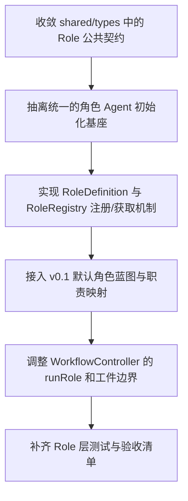

# Implementation Plan (implementationPlan)

## 概述 (summary)

- 本次实现聚焦 `default-workflow` 的 `Role` 层公共机制，目标是把当前以占位对象为主的角色调用链，收敛成一套以 `RoleRegistry / RoleDefinition / Role / ExecutionContext / RoleResult` 为核心的 Agent 运行基础。
- 实现建议拆成 6 步：收敛公共类型、抽离统一 Agent 初始化、实现 `RoleDefinition + RoleRegistry`、接入 `v0.1` 角色集合、调整 `Workflow -> Role` 边界、补齐测试与验收。
- 最关键的风险点是当前代码已经把 `RoleResult` 做成 richer 的结构化对象，并让 `WorkflowController` 直接消费；最新需求已经明确本期必须使用结构化 `RoleResult`，但其中 `artifacts` 需要进一步收敛为“工件内容数组 `string[]`”，这仍然属于一次必须显式写出的跨层类型收敛项。
- 最需要注意的是 `Role` 层必须是 Agent，但不能承担 `Workflow` 的 phase 编排、`TaskState` 状态推进和工件写入职责；角色允许有副作用，但副作用不能越权。
- 当前最需要显式记录的实现收敛项有四个：一是 `RoleResult` 采用结构化结果对象，且其中 `artifacts` 收敛为工件内容数组 `string[]`；二是恢复 `project.md` 中 `targetProjectRolePromptPath` 到角色初始化链路；三是把 `RoleDefinition.create` 的入参从完整 `Runtime` 收敛为受限的 `RoleRuntime`，避免把 `taskState` 和 `workflow` 泄漏给角色初始化阶段；四是把 `ExecutionContext.artifacts` 从可写的 `ArtifactManager` 收敛为只读工件视图，避免 Role 越权读写工件。

---

## 输入依据 (inputBasis)

- PRD：`roleflow/clarifications/0.1.0/default-workflow-role-layer-prd.md`
- 项目上下文：`roleflow/context/project.md`
- 计划模板：`roleflow/templates/plan/implementationPlan.md`
- 用户补充澄清：本次实现应保留并正式收敛当前代码中 `WorkflowController` 已使用的结构化 `RoleResult` 形态；现行 PRD 已明确 `RoleResult` 为结构化结果对象
- 用户补充澄清：`tester` 已纳入本期 role-layer 范围
- 用户补充澄清：`targetProjectRolePromptPath` 需要在本次实现中恢复并参与角色 prompt 组装；该字段是 `roles.promptDir` 加载后的内存值，若配置了 `roles.overrides.*.extraInstructions`，则 override 文件优先于默认同名文件解析
- 角色职责来源：`roleflow/context/roles/clarifier.md`、`roleflow/context/roles/explorer.md`、`roleflow/context/roles/planner.md`、`roleflow/context/roles/builder.md`、`roleflow/context/roles/critic.md`、`roleflow/context/roles/test-designer.md`、`roleflow/context/roles/test-writer.md`、`roleflow/context/roles/tester.md`、`roleflow/context/roles/index.md`
- 当前实现参考：`src/default-workflow/shared/types.ts`
- 当前实现参考：`src/default-workflow/runtime/dependencies.ts`
- 当前实现参考：`src/default-workflow/runtime/builder.ts`
- 当前实现参考：`src/default-workflow/workflow/controller.ts`
- 当前实现参考：`src/default-workflow/intake/model.ts`
- 当前实现参考：`src/default-workflow/intake/config.ts`
- 当前实现参考：`src/default-workflow/persistence/task-store.ts`

缺失信息：

- `roleflow/context/standards/common-mistakes.md` 当前不存在，无法作为角色实现约束输入。
- `roleflow/context/standards/coding-standards.md` 当前为空，未提供可执行编码规范。
- `tester` 当前只有一句最小职责说明；本次实现先按现有最小职责接入，不把更细角色定义缺口视为本期阻塞项。

---

## 实现目标 (implementationGoals)

- 新增并收敛 `Role` 层公共需求对象，使 `RoleDefinition`、`RoleRegistry`、`Role`、`ExecutionContext`、`RoleResult` 成为显式、可测试、可复用的运行时契约。
- 调整 `RoleRegistry`，使其从当前仅支持 `get/list` 的静态占位注册表，收敛为区分“角色蓝图定义”和“角色实例”的角色工厂，并至少支持 `register(roleDef)`、`get(name)`、`list()`。
- 新增 `RoleRuntime` 作为角色初始化的受限运行时视图，并将 `RoleDefinition.create` 收敛为基于 `RoleRuntime` 的唯一角色实例化入口，使角色共享依赖通过受限运行时注入，而不是直接暴露完整 `Runtime`、`WorkflowController` 或 `TaskState`。
- 新增统一的角色 Agent 初始化基座，参考 `src/default-workflow/intake/model.ts` 的 `ChatOpenAI` 接入方式与配置解析方式，但明确去掉 `temperature` 设置，并避免直接复用 Intake 专属 prompt。
- 收敛 `Role` 的统一执行接口，保证各角色至少通过 `run(input, context): Promise<RoleResult>` 由 `Workflow` 调用。
- 收敛 `ExecutionContext` 的最小输入边界，至少稳定提供 `taskId`、`phase`、`cwd`、`artifacts`、`projectConfig`，并显式移除当前代码中把 `taskState` / `latestInput` 混入公共上下文的偏差。
- 将 `ExecutionContext.artifacts` 收敛为只读工件视图而不是完整 `ArtifactManager`，使 Role 只能读取必要工件内容，不能自行决定工件写入、覆盖和落盘时机。
- 显式收敛 `RoleResult`：保留类型名 `RoleResult`，并基于最新需求将其正式定义为结构化结果对象，至少包含 `summary`、`artifacts`、`metadata?`，其中 `artifacts` 定义为工件内容数组 `string[]`。
- 新增 `v0.1` 角色蓝图接入能力，至少覆盖 `clarifier`、`explorer`、`planner`、`builder`、`critic`、`test-designer`、`tester`、`test-writer`，并保持它们与 `roleflow/context/roles/` 中实例层职责一致。
- 显式处理 `critic` 概念名与角色原型文件 `frontend-critic.md` 的映射，同时保持项目侧实例文件使用严格同名的 `critic.md`。
- 恢复 `ProjectConfig.targetProjectRolePromptPath` 到 Role 层初始化链路，使角色能够读取目标项目下的角色特定额外提示词；该字段在运行时表示 `roles.promptDir` 加载后的内存值，默认按严格同名文件读取；若配置了 `roles.overrides.*.extraInstructions`，则优先使用 override 指向的文件；同名文件采用“追加”方式合并，且目标项目下的角色职责约束优先于角色原型职责。
- 保持 `Role` 层不承担 `Workflow` 的状态推进、不承担 `Intake` 的用户交互、不直接写工件；工件落盘仍由 `Workflow` 协调 `ArtifactManager` 完成。
- 最终交付结果应达到：`Workflow -> RoleRegistry -> Role` 的调用边界稳定可测，角色可基于统一 Agent 初始化方式运行，`v0.1` 角色集合可通过公共机制接入，并且副作用与工件职责边界清晰。

---

## 实现策略 (implementationStrategy)

- 采用“公共契约优先”的局部重构策略，先统一 `shared/types` 中的角色接口，再调整 `runtime/dependencies` 与 `workflow/controller`，避免先补具体角色导致接口二次返工。
- 把当前 `StaticRoleRegistry` 的“直接存角色实例”方式改为“先注册 `RoleDefinition`，按需通过 `create(roleRuntime)` 懒创建 `Role` 实例，可选缓存实例”，显式体现蓝图与实例分层。
- 把角色 Agent 初始化从 Intake 初始化中抽出共享基座：复用 `resolveIntakeModelConfig()` 这一类配置读取逻辑和 `ChatOpenAI` 接入方式，但单独提供角色初始化函数，避免把 Intake prompt、`temperature: 0` 和角色初始化绑死在一起。
- `RoleRegistry` 的公共 `list()` 返回值收敛为角色名集合，用于满足 PRD / `project.md` 的公共约束；如果实现中仍需要 `description`、`placeholder` 等调试信息，应作为内部能力或独立 helper，而不是继续占用 `list()` 公共契约。
- `ExecutionContext` 按“最小公共契约”处理：只保留 PRD 明确要求的 `taskId`、`phase`、`cwd`、`artifacts`、`projectConfig`。当前实现中的 `taskState`、`latestInput` 如果在迁移期仍被少量代码依赖，只能停留在内部适配层，不能继续作为 Role 层公共接口字段。
- `ExecutionContext.artifacts` 按“只读工件视图”处理：`Workflow` 持有完整 `ArtifactManager`，Role 层只拿到受限的 `ArtifactReader`，或者直接通过 `input` 获得所需工件内容，不能直接调用工件写入能力。
- `RoleResult` 按“公共类型显式收敛到结构化结果对象”处理：本次实现保留结构化 `RoleResult`，但不再继续沿用当前代码中更丰富的 artifact 对象数组，而是把 `artifacts` 收敛为工件内容数组 `string[]`。这属于一次明确的类型结构调整，需要在实现与文档中同步写明。
- `RoleDefinition.create` 按“受限依赖注入”处理：`project.md` 与 PRD 已收敛为 `create(roleRuntime: RoleRuntime)`，本次实现需要严格对齐这一公共契约，只暴露角色初始化真正允许使用的共享依赖，避免角色在初始化阶段直接读取 `taskState` 或调用 `workflow.run()` / `workflow.resume()`。
- 各角色按“共享 Agent 基座 + 角色专属职责提示词”接入：公共基座负责统一模型初始化、公共系统提示、运行入口；角色实例文件负责补充职责边界，不允许公共层把各角色职责抹平为同一种执行器。
- `builder`、`tester`、`test-writer`、`test-designer` 等允许副作用的角色，要在角色层显式保留副作用能力入口；但即便角色进行了代码修改、测试执行或单测调整，也仍只通过 `RoleResult` 把结果交还 `Workflow`，不自行写工件、不自行发 `WorkflowEvent`。
- `critic` 角色名继续保持为 `critic`；项目侧实例文件使用 `critic.md`，角色原型仍映射到 `/Users/aaron/code/roleflow/roles/frontend-critic.md`，避免概念名和文件名再次漂移。
- `targetProjectRolePromptPath` 按“运行时目录归一化 + 严格同名追加 + 项目职责优先”处理：其运行时值等价于 `roles.promptDir` 加载后的目录；默认仅按严格同名角色文件读取，例如 `planner.md`、`builder.md`、`critic.md`、`tester.md`；若某角色配置了 `roles.overrides.*.extraInstructions`，则优先读取 override 指向的文件，而不是回落到默认同名文件解析；若目标项目中存在对应文件，则在角色原型文档基础上追加该文件内容，但解释优先级以目标项目中的角色职责约束为准；若文件缺失，则回退到角色原型文档，不把缺失视为启动失败。

---

## 实施流程图 (implementationFlowchart)

---

## 当前实现差异与收敛项 (currentGapsAndConvergence)

- 当前 `src/default-workflow/shared/types.ts` 中没有 `RoleDefinition`，`RoleRegistry` 也没有 `register()`；这与 PRD 和 `project.md` 的角色工厂定义不一致，本次实现需要显式补齐。
- 当前 `RoleRegistry.list()` 返回 `RoleDescriptor[]`，而 `project.md` 中的接口定义和 PRD 对象模型都把 `list()` 视为角色集合枚举接口；本次计划将其公共返回值收敛为 `string[]`，把描述性元数据移出这一公共接口。
- 当前 `RoleResult` 被定义为 `{ summary, artifacts, metadata }`，但其中 `artifacts` 仍承载 richer artifact object；本次实现需要把公共契约进一步收敛为 `summary: string`、`artifacts: string[]`、`metadata?`，其中 `artifacts` 明确表示工件内容，并同步调整 `WorkflowController` 的消费方式。
- `project.md` 当前已将 `RoleDefinition.create` 明确收敛为接收 `RoleRuntime`；本次实现需要保证代码、测试与运行时装配链路继续与这一约束保持一致，避免回退到完整 `Runtime` 注入。
- `project.md` 当前已将 `ExecutionContext.artifacts` 明确收敛为 `ArtifactReader`；本次实现需要保证公共接口与运行时装配保持这一只读边界，避免角色重新直接接触完整 `ArtifactManager`。
- 当前 `ExecutionContext` 除了工件能力边界过宽，还额外带入了 `taskState`、`latestInput`；本次实现需要恢复最小必需字段，并把这两个字段移出公共契约。
- 当前 `StaticRoleRegistry` 中的角色是普通占位对象，不满足“角色必须是 Agent”的强约束；本次实现必须把角色初始化改为统一 Agent 化接入。
- 当前 `runtime/dependencies.ts` 已将 `tester` 直接放入默认角色集合；最新 PRD 已补齐 `tester`，因此本次实现应把它从“兼容扩展项”提升为正式角色接入范围，但不要求本期补齐更细的 tester 角色定义文档。
- 当前 `workflow/controller.ts` 已把 `RoleResult` 结构、artifact 写入时机和事件内容绑定在一起；role-layer 落地时需要同步调整 `Workflow -> Role` 边界，否则 role-layer 的公共接口无法真正收敛。
- 当前 `intake/model.ts` 的初始化逻辑带有 Intake 专属 prompt 和 `temperature: 0`；role-layer 不能直接复用该函数，而应提炼统一配置读取方式并单独初始化角色模型。
- 当前代码中的 `ProjectConfig` 运行时装配与角色初始化链路还未完整恢复 `targetProjectRolePromptPath`；本次实现需要显式把它补回配置与角色 prompt 组装链路，并落实“`roles.promptDir` 内存归一化、override 优先、严格同名读取、追加组装、项目侧优先、缺失时回退到角色原型”的规则。

---

## Runtime 与角色初始化要求 (runtimeAndRoleInitializationRequirements)

- `RoleDefinition.create(roleRuntime)` 必须是角色实例化唯一入口；`Workflow` 和 `RoleRegistry` 不应直接拼装角色依赖。
- 角色初始化阶段接收的必须是受限的 `RoleRuntime`，而不是完整 `Runtime`；`taskState` 和 `workflow` 不应进入 `RoleRuntime`。
- `RoleRuntime` 至少要能提供 `projectConfig`、`eventLogger`、`eventEmitter`、`roleRegistry` 等共享依赖；完整 `ArtifactManager` 不应进入 `RoleRuntime`，避免角色初始化再次发明工件写入链路。
- 角色 Agent 的模型配置应统一来源于共享配置解析，而不是每个角色自行读取环境变量；默认接入方式继续使用 `import { ChatOpenAI } from "@langchain/openai"`。
- 角色 Agent 初始化时必须去掉 `temperature` 设置；如果后续要扩展到更多模型参数，也应在共享初始化入口集中处理，而不是下沉到单个角色。
- 角色 prompt 组装至少要包含公共系统约束和角色实例层职责约束；`critic` 需要显式绑定到 `frontend-critic.md`，不能因文件名差异丢失职责来源。
- 角色运行所需的阶段材料应优先通过 `run(input, context)` 中的 `input` 传入，而不是继续把 `latestInput`、`taskState` 一类 Workflow 内部态混入 `ExecutionContext`。
- 如果角色在执行阶段确实需要读取历史工件，只应通过 `ExecutionContext.artifacts` 提供的只读能力访问；该能力不应暴露任何写入、删除、重命名或落盘控制接口。
- 角色 prompt 组装必须支持 `ProjectConfig.targetProjectRolePromptPath`：该字段是 `roles.promptDir` 加载后的运行时目录值；默认只读取严格同名角色文件，例如 `planner.md`、`builder.md`、`critic.md`、`tester.md`，不读取其他非同名文档。
- 当某角色配置了 `roles.overrides.*.extraInstructions` 时，角色初始化应优先读取 override 指向的文件，而不是默认的同名文件解析结果。
- 当目标项目目录下存在同名角色文件或 override 文件时，系统应在角色原型文档基础上追加该文件内容，但角色职责解释与约束优先级以目标项目文件为准。
- 当目录缺失、目录不存在或某个同名角色文件不存在时，不应阻断角色初始化，系统应回退到角色原型文档，并在需要时记录告警。
- `RoleRegistry` 如果采用实例缓存，缓存粒度必须清晰：至少要保证同一 `Runtime` 下的同名角色不会被随意重复创建；如果不缓存，也要在文档中说明创建时机与代价。

---

## 角色职责映射与边界要求 (roleMappingAndBoundaries)

- `clarifier` 的职责边界对齐 `roleflow/context/roles/clarifier.md`，只处理需求澄清与结构化需求输出，不提前做技术方案。
- `explorer` 的职责边界对齐 `roleflow/context/roles/explorer.md`，只做上下文和代码探索，不直接给出实现方案或修改代码。
- `planner` 的职责边界对齐 `roleflow/context/roles/planner.md`，只做方案和 implementation plan，不编写实现代码。
- `builder` 的职责边界对齐 `roleflow/context/roles/builder.md`，允许修改代码，但不修改需求、不写 workflow 工件。
- `critic` 的职责边界对齐 `roleflow/context/roles/critic.md`，以问题识别和风险审查为主，不修改代码。
- `test-designer` 的职责边界对齐 `roleflow/context/roles/test-designer.md`，允许为测试目的插入和清理调试打印，但不改业务方案。
- `tester` 的职责边界对齐 `roleflow/context/roles/tester.md`，负责执行 `test` phase 的测试任务并输出测试执行结果，不替代 `test-writer` 编写单测。
- `test-writer` 的职责边界对齐 `roleflow/context/roles/test-writer.md`，允许新增或修改单元测试，不替代 `builder` 修改业务逻辑。
- `Role` 层公共机制必须允许这些职责差异存在，不能因为统一接口就把所有角色退化成同一种“字符串处理器”。
- 角色的副作用边界必须是显式需求，不是例外情况；但副作用只限于角色职责内的代码、测试或调试动作，不包括工件落盘、状态推进和用户交互。
- 当用户或上游试图要求角色越过职责边界时，角色实现应保持边界约束，而不是在公共层偷开后门。

---

## 验收目标 (acceptanceTargets)

- `RoleRegistry` 至少支持 `register(roleDef)`、`get(name)`、`list()`，并能明确区分角色蓝图与角色实例。
- `RoleDefinition`、`Role`、`ExecutionContext`、`RoleResult` 的公共接口边界在代码中可直接定位和验证，不再依赖口头约定。
- `RoleDefinition.create` 接收的是受限的 `RoleRuntime`，而不是完整 `Runtime`；角色初始化阶段不能直接访问 `taskState` 或 `workflow`。
- `RoleRegistry.get(name)` 返回的是可执行的 `Role`，而不是蓝图对象、未初始化配置或占位描述结构。
- `RoleRegistry.list()` 能稳定表达当前已注册角色集合，并与公共接口约定一致。
- 角色实例化能够通过 `RoleRuntime` 完成，且共享依赖不会散落在 `WorkflowController` 调用链上手工拼装。
- 角色以 Agent 方式创建和运行，统一使用 `ChatOpenAI` 的共享初始化风格，并且角色初始化不包含 `temperature` 设置。
- `ExecutionContext` 至少稳定传递 `taskId`、`phase`、`cwd`、`artifacts`、`projectConfig` 五类输入。
- `ExecutionContext` 的公共接口中不再暴露 `taskState`、`latestInput` 这类 Workflow 内部态；如果迁移期存在兼容代码，也只能停留在内部适配层。
- `ExecutionContext.artifacts` 提供的是只读工件视图，而不是完整 `ArtifactManager`；Role 层不能直接写工件、删工件或控制工件落盘路径。
- `RoleResult` 在公共层被显式定义为结构化结果对象，至少包含 `summary: string`、`artifacts: string[]`、`metadata?`，其中 `artifacts` 明确表示工件内容，并与 `WorkflowController` 的消费方式保持一致。
- `Workflow -> RoleRegistry -> Role` 的调用链清晰可测，`Workflow` 不绕过注册表直接实例化角色。
- `clarifier`、`explorer`、`planner`、`builder`、`critic`、`test-designer`、`tester`、`test-writer` 至少这 8 个角色可以通过统一公共机制接入，并各自保持与实例层文档一致的职责边界。
- `critic` 概念角色与角色原型 `frontend-critic.md` 的映射关系在实现中是显式的，项目侧实例文件则保持 `critic.md` 同名约定。
- `targetProjectRolePromptPath` 已进入 `ProjectConfig` 和角色 prompt 组装链路；其运行时值等价于 `roles.promptDir`，且 `roles.overrides.*.extraInstructions` 优先于默认同名文件解析；系统以“追加内容、项目职责优先”的方式与角色原型文档组合，不存在时有明确 fallback。
- `builder`、`tester`、`test-designer`、`test-writer` 等角色可以有副作用，但不会因此直接写工件、推进 phase 或替代 `Intake` 与用户交互。
- 针对注册机制、实例化、上下文传递、结果边界和职责映射，至少有一组自动化测试或可执行手动验收清单覆盖。

---

## Open Questions

- 无。

---

## Todolist (todoList)

- [x] 对齐 `shared/types.ts` 中的 `RoleDefinition`、`RoleRegistry`、`Role`、`ExecutionContext`、`RoleResult` 公共接口定义。
- [x] 新增 `RoleRuntime` 受限运行时视图，并将 `RoleDefinition.create` 的入参从完整 `Runtime` 收敛为 `RoleRuntime`。
- [x] 新增 `ArtifactReader` 只读工件接口，并将 `ExecutionContext.artifacts` 从 `ArtifactManager` 收敛为该只读接口。
- [x] 显式把 `RoleResult` 的公共类型收敛为结构化结果对象，其中 `artifacts` 定义为工件内容 `string[]`，并同步更新 `Workflow` 侧的消费契约与测试。
- [x] 为 `RoleRegistry` 补齐 `register(roleDef)` 能力，并实现蓝图注册与角色实例获取的分层机制。
- [x] 收敛 `RoleRegistry.list()` 的公共返回值，避免继续把描述性元数据绑定到该接口上。
- [x] 抽离统一的角色 Agent 初始化函数，复用共享模型配置解析，使用 `ChatOpenAI`，并去掉 `temperature` 设置。
- [x] 设计角色公共 prompt 基座，并把实例层角色文档与 `targetProjectRolePromptPath` 下严格同名的项目角色文件一起接入角色初始化流程；若存在 `roles.overrides.*.extraInstructions`，则优先接入 override 文件。
- [x] 明确 `critic` 到 `frontend-critic.md` 的职责映射，并在代码中固定该映射关系。
- [x] 补齐 `ExecutionContext.artifacts` 只读工件字段，并把 `taskState`、`latestInput` 从 Role 层公共接口中移除；如迁移期仍需兼容，限制在内部适配层处理。
- [x] 把 `targetProjectRolePromptPath` 补回 `ProjectConfig`、运行时装配流程和角色初始化链路，并落实“`roles.promptDir` 内存归一化、override 优先、严格同名读取、追加内容、项目职责优先、缺失时回退”的规则。
- [x] 实现 `clarifier`、`explorer`、`planner`、`builder`、`critic`、`test-designer`、`tester`、`test-writer` 的默认 `RoleDefinition` 注册。
- [x] 将 `tester` 按当前最小职责说明接入默认 `RoleDefinition`，不把更细角色文档缺口作为本期阻塞项。
- [x] 明确 `builder`、`tester`、`test-designer`、`test-writer` 的副作用能力边界，保证其不越权承担工件写入和状态推进。
- [x] 调整 `WorkflowController.runRole()` 和相关工件写入逻辑，使其对齐新的 `RoleResult` 结构，尤其是把 `artifacts: string[]` 作为工件内容落盘。
- [x] 校对 `Runtime` / `RoleRuntime` / `ExecutionContext` 装配流程，确保 `RoleDefinition.create(roleRuntime)` 和 `Role.run(..., context)` 所需共享依赖都能稳定注入，且不会把 `taskState`、`workflow`、完整 `ArtifactManager` 泄漏给 Role 层。
- [x] 添加或更新测试，覆盖注册、获取、实例化、上下文传递、结果边界、职责映射和副作用边界。
- [x] 完成自检，确认 `Role` 层没有承担 `Workflow` 编排、`TaskState` 修改、工件写入和 `Intake` 交互职责。
