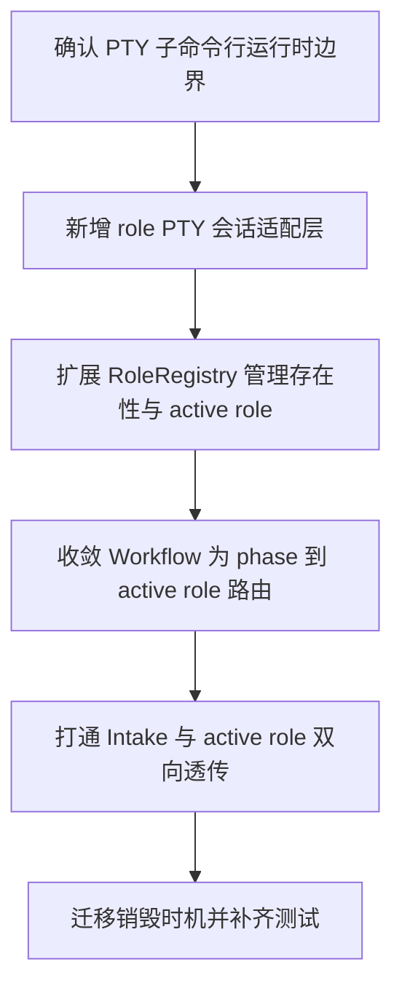

# Implementation Plan (implementationPlan)

## 概述 (summary)

- 本次实现聚焦 `default-workflow` 的 `Role` 运行时从“一次性模型/命令调用”收敛为“由 `node-pty` 驱动的持久化子命令行会话”，目标是让每个 role 真正成为一个可留存、可切换 active 状态、可双向透传的 Codex CLI 子终端。
- 实现建议拆成 6 步：收敛 PTY 运行时抽象、补齐 `RoleRegistry` 的会话管理职责、收敛 `Workflow` 到 phase/active role 路由、打通 `Intake -> active role` 输入透传、把销毁时机从任务终态迁到 `Intake` 生命周期、补齐测试与文档同步。
- 当前最大的风险不是完全没有角色执行能力，而是现有代码已经部分支持“长生命周期 executor + 流式输出”，但整体心智模型仍是 `run(input) -> RoleResult` 的一次性调用，这与 PRD 要求的“role 本质是 PTY 子命令行”还有明显差距。
- 最需要注意的是生命周期边界已经变化：新 PRD 明确 role 会话可以在任务完成后继续保留，直到 `Intake` 销毁才统一销毁；这与当前 `Workflow` 在任务终态 `disposeAll()` 的实现和旧计划假设都不一致。
- 当前仍有一个需要显式写出的架构收敛点：`project.md` 已经把 `RoleRegistry`、active role 和 `Intake` 双向透传改写成 PTY 模型，但 `src` 中的 `RoleRegistry`、`WorkflowController`、`IntakeAgent` 还没有对应的 active role 路由接口与销毁入口。

---

## 输入依据 (inputBasis)

- PRD：`roleflow/clarifications/0.1.0/default-workflow-role-node-pty-subcommand-prd.md`
- 项目上下文：`roleflow/context/project.md`
- 相关需求：`roleflow/clarifications/0.1.0/default-workflow-role-layer-prd.md`
- 相关需求：`roleflow/clarifications/0.1.0/default-workflow-workflow-layer-prd.md`
- 相关需求：`roleflow/clarifications/0.1.0/default-workflow-role-codex-cli-prd.md`
- 相关计划：`roleflow/implementation/0.1.0/default-workflow-role-codex-cli.md`
- 相关计划：`roleflow/implementation/0.1.0/default-workflow-role-codex-cli-output-passthrough.md`
- 计划模板：`roleflow/templates/plan/implementationPlan.md`
- 当前实现参考：`src/default-workflow/role/executor.ts`
- 当前实现参考：`src/default-workflow/role/model.ts`
- 当前实现参考：`src/default-workflow/runtime/dependencies.ts`
- 当前实现参考：`src/default-workflow/workflow/controller.ts`
- 当前实现参考：`src/default-workflow/intake/agent.ts`
- 当前实现参考：`src/default-workflow/runtime/builder.ts`
- 当前类型定义：`src/default-workflow/shared/types.ts`
- 当前工程配置：`package.json`
- 当前测试参考：`src/default-workflow/testing/role.test.ts`
- 当前测试参考：`src/default-workflow/testing/runtime.test.ts`

缺失信息：

- 当前仓库尚未引入 `node-pty` 依赖，也没有任何 PTY 会话封装，说明本次不是简单替换命令参数，而是新增一层运行时基础设施。
- 当前公共接口还没有 `activate`、`getActive`、`writeToActiveRole`、`destroyAllRoleSessions` 之类的明确能力，active role 路由仍停留在 `project.md` / PRD 层，尚未进入类型与实现。
- 当前 `IntakeAgent` 没有显式 `dispose` / `shutdown` 生命周期入口，无法承接“Intake 销毁时统一销毁全部 role 子命令行”这条架构约束。

---

## 实现目标 (implementationGoals)

- 引入 `node-pty` 驱动的 role 子命令行运行时抽象，让默认角色不再通过 `execa + codex exec` 一次性启动命令，而是通过可留存的 PTY 会话运行 Codex CLI。
- 将 `RoleRegistry` 从“RoleDefinition/Role 实例缓存”收敛为“role 子命令行会话注册表”，至少明确区分“已存在的 role 会话”和“当前 active role”两个概念。
- 调整 `Workflow` 的职责边界，使其主要负责 phase 推进、`hostRole -> active role` 映射和输入输出路由，而不再把角色执行理解成一次 `run(input, context)` 调用。
- 打通 `Intake -> Workflow -> active role` 的输入透传链路，以及 `active role -> Workflow -> Intake` 的输出透传链路，并保持 inactive role 不会污染当前展示。
- 把 role 会话的统一回收时机从任务终态迁移到 `Intake` 销毁时，允许任务完成后但 CLI 仍在时保留 role 会话。
- 保持 `RoleResult` 的公共语义不变；虽然底层运行时改成 PTY 子命令行，但 `Workflow` 最终仍消费 `RoleResult`，不直接把 PTY 原始文本当作工作流最终结果。
- 最终交付结果应达到：每个 role 都是可留存的 Codex CLI PTY 子终端，`Workflow` 只根据 phase 选 active role 并做路由，`Intake` 只与 active role 建立双向通路，销毁 `Intake` 时统一清理所有 role 会话。

---

## 实现策略 (implementationStrategy)

- 采用“角色运行时重构 + 路由边界收敛”的局部架构改造策略，不推翻既有 `default-workflow` phase 编排和 `RoleResult` 契约，而是在角色执行介质、注册表职责和生命周期控制上做明确收敛。
- 把当前 `CodexCliRoleAgentExecutor` 从“基于 `execa` 的短/半长调用执行器”升级为“基于 `node-pty` 的 role 子命令行会话适配器”，由它负责 PTY 创建、输入写入、输出监听和销毁。
- 将 `RoleRegistry` 扩展为会话存在性管理层：负责懒创建 role PTY、缓存已存在会话、提供 active role 切换所需的查询/路由入口，但不自行决定当前 phase。
- 将 `WorkflowController` 收敛为 phase 编排与 active role 路由层：根据 `currentPhase.hostRole` 选择 active role，控制哪些输出可以透传到 `Intake`、哪些输入可以送入当前 role。
- 将 `IntakeAgent` 从“只发起任务并接收 WorkflowEvent”扩展为“持有运行期会话并在自身销毁时触发 role PTY 统一回收”的宿主层，但不让它直接绕过 `Workflow` 选择 role。
- 对既有 `Role.run(...) -> RoleResult` 路径采用兼容式过渡处理：可以在接口层暂时保留，但实现语义必须显式转向“与 PTY 会话交互并等待本轮结果收敛”，而不是继续把它当作一次性命令调用。
- 对已有“任务终态即销毁角色 session”的清理逻辑采取迁移而非并存策略，避免同时存在“任务结束即销毁”和“Intake 销毁才销毁”两套互相矛盾的生命周期规则。

---

## 实施流程图 (implementationFlowchart)

---

## 当前实现差异与收敛项 (currentGapsAndConvergence)

- 当前 `src/default-workflow/role/executor.ts` 仍基于 `execa` 调用 `codex exec` / `codex exec resume`，并通过 `sessionId` 复用 CLI 上下文；这说明“会话复用”已有雏形，但它还不是 `node-pty` 驱动的持久化子命令行。
- 当前 `src/default-workflow/runtime/dependencies.ts` 中的 `DefaultRoleRegistry` 只负责 `register/get/list/disposeAll`，管理的是 `Role` 实例缓存，而不是 PRD 要求的“多个 role 子命令行存在性 + active role 路由”。
- 当前 `src/default-workflow/shared/types.ts` 中 `RoleRegistry`、`Role`、`WorkflowController` 的公共接口仍围绕 `get(name)`、`run(input, context)`、`runRole(roleName, input)` 展开，没有体现 active role 切换、输入透传和 PTY 输出订阅能力。
- 当前 `src/default-workflow/workflow/controller.ts` 仍把角色执行建模为一次同步的 `runRole(roleName, input)` 调用，并在任务完成、失败、取消后立刻 `disposeAll()`；这与 PRD 明确的“任务完成后可保留，直到 Intake 销毁才销毁”直接冲突。
- 当前 `src/default-workflow/intake/agent.ts` 没有独立销毁入口，CLI 关闭时也没有把“销毁 Intake -> 销毁全部 role PTY”收束成显式调用链，这会让新 PRD 的统一回收规则无处落地。
- 当前 `package.json` 尚未引入 `node-pty`，说明本次实现包含一次明确的依赖与基础设施变更，不应被默认当成纯逻辑层小修。
- 当前 `default-workflow-role-codex-cli.md` 计划仍把“任务完成、取消或失败后 session 会结束”写成验收目标；新 PRD 已把生命周期改为“Intake 销毁时统一销毁”，这属于需要显式收敛的架构变更，而不是局部实现细节。

---

## 验收目标 (acceptanceTargets)

- 默认角色运行时明确通过 `node-pty` 启动 Codex CLI 子命令行，而不是继续通过一次性 `execa` / 模型 SDK 调用来模拟会话。
- `RoleRegistry` 能同时持有多个已创建的 role 子命令行，并能区分“这个 role 已存在”和“这个 role 当前 active”。
- `Workflow` 能根据 `currentPhase` 对应的 `hostRole` 定位 active role，并保证同一时刻只有一个 active role。
- 只有 active role 的输出会被转发到 `Intake`，inactive role 的输出不会串入当前用户可见链路。
- 只有 active role 能接收来自 `Intake` 的执行输入或控制命令，输入路由不会误发给 inactive role。
- 任务完成、等待审批、恢复、失败等过程中，已创建的 role 子命令行不会因为 phase 结束或任务完成被错误提前销毁；只有 `Intake` 销毁时才统一销毁所有 role 子命令行。
- `RoleResult` 仍然存在并继续作为 `Workflow` 的最终消费对象，PTY 输出透传不会替代 `RoleResult` 的工作流语义。
- 至少存在一组自动化测试或可执行校验，覆盖 PTY 创建、active role 切换、输入只到 active role、输出只来自 active role、任务终态保留会话、以及 Intake 销毁统一清理。

---

## Open Questions

- 暂无；当前 PRD 与 `project.md` 已对 active role、销毁时机和 `v0.1` 单 phase 单 role 约束给出足够明确的架构边界，本次可直接据此规划实现。

---

## Todolist (todoList)

- [ ] 盘点 `role/executor.ts`、`runtime/dependencies.ts`、`workflow/controller.ts`、`intake/agent.ts`、`shared/types.ts` 中所有仍基于“一次性 run 调用”建模角色执行的接口和实现。
- [ ] 引入 `node-pty` 依赖并设计最小 role PTY 会话适配层，明确创建、写入、输出监听、状态持有和销毁边界。
- [ ] 扩展 `RoleRegistry` 的公共职责与内部状态，支持多 role 子命令行存在性管理，并显式区分 active role 与已存在 role。
- [ ] 收敛 `WorkflowController` 的职责边界，使其根据 `currentPhase.hostRole` 选择 active role，并负责输入输出路由而不是角色内部执行细节。
- [ ] 调整 role 执行链路，让 `RoleResult` 的收敛建立在 PTY 子命令行交互之上，而不是继续依赖 `execa` 单次执行模型。
- [ ] 打通 `Intake -> Workflow -> active role` 的输入透传与 `active role -> Workflow -> Intake` 的输出透传，并确保 inactive role 不接收输入、不污染输出。
- [ ] 将 role 会话统一销毁逻辑从 `Workflow` 任务终态迁移到 `Intake` 生命周期，补上 `IntakeAgent` 或 CLI 侧的显式销毁入口。
- [ ] 同步收敛 `roleflow/implementation/0.1.0/default-workflow-role-codex-cli.md` 中已过时的 session 生命周期表述，避免旧计划与新 PRD/`project.md` 冲突。
- [ ] 更新或新增测试，覆盖 PTY 会话创建、active role 切换、任务终态不销毁、Intake 销毁统一回收、以及双向透传链路。
- [ ] 完成自检，确认本次实现没有把 `RoleRegistry` 的“存在性管理”和 `Workflow` 的“active role 决定”重新混成一个职责。
