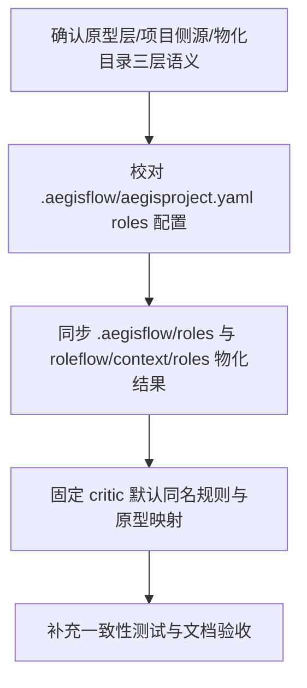

# Implementation Plan (implementationPlan)

## 概述 (summary)

- 本次实现聚焦 `default-workflow` 的“角色提示词装载落位”，目标不是新增角色能力，而是把角色原型层、AegisFlow 项目侧提示词层、`.aegisflow/roles/` 物化目录和 `.aegisflow/aegisproject.yaml` 配置表达收敛成一套稳定基线。
- 实现建议拆成 5 步：确认分层语义、收敛项目配置、校对 `.aegisflow/roles/` 物化结果、固定 `critic` 的默认同名规则、补齐一致性测试与文档验收。
- 当前最大的风险不是运行时代码缺失，而是“仓库中已有配置/物化文件与 PRD 语义轻微漂移”，例如 `project.md` 示例仍把 `critic` override 写成默认配置，而 `.aegisflow/roles/critic.md` 与 `roleflow/context/roles/critic.md` 已出现内容偏差。
- 最需要注意的是不要把这次实现扩大成角色能力改造；本期只处理“提示词从哪里来、落到哪里、配置怎么表达、默认怎么装载”，不新增角色类型，也不改写角色职责正文。
- 当前仍有一个已知但不阻塞本期的事实：`/Users/aaron/code/roleflow/roles/` 下没有 `tester.md` 原型文件；PRD 已明确这不属于本期补齐范围，因此计划只要求装载链路和回退语义稳定。

---

## 输入依据 (inputBasis)

- PRD：`roleflow/clarifications/0.1.0/default-workflow-role-prompt-bootstrap-prd.md`
- 项目上下文：`roleflow/context/project.md`
- 计划模板：`roleflow/templates/plan/implementationPlan.md`
- 当前实现参考：`src/default-workflow/role/prompts.ts`
- 当前实现参考：`src/default-workflow/testing/role.test.ts`
- 当前配置参考：`.aegisflow/aegisproject.yaml`
- 当前项目侧角色提示词源：`roleflow/context/roles/*.md`
- 当前项目侧物化目录：`.aegisflow/roles/*.md`
- 当前角色原型目录：`/Users/aaron/code/roleflow/roles/*.md`

缺失信息：

- `/Users/aaron/code/roleflow/roles/tester.md` 当前不存在；本期不补原型正文，只把它作为已知非阻塞缺口记录。
- 当前仓库中未看到独立的“角色提示词物化/同步脚本”；若本次实现需要保证 `roleflow/context/roles/` 与 `.aegisflow/roles/` 长期一致，需要通过测试、校验逻辑或显式同步约束补上。

---

## 实现目标 (implementationGoals)

- 明确并固定三层来源语义：`/Users/aaron/code/roleflow/roles/` 是跨项目角色原型层，`roleflow/context/roles/` 是 AegisFlow 项目侧提示词源，`.aegisflow/roles/` 是 AegisFlow 项目实际暴露给运行时的项目侧提示词目录。
- 让 `.aegisflow/aegisproject.yaml` 中的 `roles` 配置与上述分层一致，至少稳定表达 `prototypeDir` 与 `promptDir`，并保持 `critic` 默认按同名 `critic.md` 读取，而不是把 override 写成默认必选项。
- 校对并收敛 `.aegisflow/roles/` 的物化结果，使其与 `roleflow/context/roles/` 中当前项目侧角色提示词源保持一致，至少覆盖现有 md 文件以及 `common.md`、`index.md`。
- 保持运行时角色 prompt 装载语义不变：角色原型在前，项目侧提示词追加在后，项目侧优先；项目侧缺失时允许回退到原型层。
- 显式固定 `critic` 的双层命名规则：角色原型继续映射 `/Users/aaron/code/roleflow/roles/frontend-critic.md`，AegisFlow 项目侧默认文件为 `.aegisflow/roles/critic.md`，override 仅作为未来可选扩展。
- 最终交付结果应达到：仓库中的文档、配置、物化文件和现有 runtime 测试可以共同证明这套 bootstrap 规则已落定，且不会被误读为新增角色能力需求。

---

## 实现策略 (implementationStrategy)

- 采用“资产与配置收敛优先”的局部调整策略，以现有 `.aegisflow`、`roleflow/context/roles/`、`src/default-workflow/role/prompts.ts` 为基础对齐 PRD，而不是新增一套独立 bootstrap 框架。
- 把 `roleflow/context/roles/` 视为 AegisFlow 项目侧提示词源，把 `.aegisflow/roles/` 视为项目侧对外暴露目录；若两边文件内容存在漂移，以“源目录校对后重新物化”的方式收敛，而不是默认接受长期手工分叉。
- 把 `.aegisflow/aegisproject.yaml` 视为项目 bootstrap 配置事实来源：`roles.prototypeDir` 固定指向 `/Users/aaron/code/roleflow/roles`，`roles.promptDir` 固定指向 `.aegisflow/roles`；`roles.overrides.*.extraInstructions` 只保留为可选能力，不把 `critic` 默认同名读取改写成默认 override。
- `critic` 按“双层命名收敛”处理：原型层文件名保持 `frontend-critic.md`，项目侧物化文件保持 `critic.md`，运行时继续通过显式映射处理二者关系；本次只固定默认读取规则，不扩展新的别名策略。
- 不新增角色职责、不改写角色正文，只允许做目录落位、配置表达、索引说明、物化同步和一致性测试层面的调整。
- 若现有 runtime 已能按 PRD 语义正确组装 prompt，则本次实现优先补强“仓库静态资产一致性”与“默认配置表达”，避免只靠运行时代码约定维持正确行为。

---

## 实施流程图 (implementationFlowchart)

---

## 当前实现差异与收敛项 (currentGapsAndConvergence)

- 当前 `src/default-workflow/role/prompts.ts` 已固定角色原型目录为 `/Users/aaron/code/roleflow/roles`，并已把 `critic` 映射到 `frontend-critic.md`；这说明运行时装载链路已有基础，但 bootstrap 语义仍需通过项目配置和物化目录进一步固化。
- 当前 `.aegisflow/aegisproject.yaml` 已存在，且已包含 `roles.prototypeDir` 与 `roles.promptDir`；本次实现不需要再从零创建配置文件，而是需要校对其默认表达是否与 PRD 完全一致。
- 当前 `.aegisflow/roles/` 已存在并已包含来自 `roleflow/context/roles/` 的多数项目侧角色提示词文件；但实际校对结果显示 `critic.md` 已与源目录出现内容漂移，本次实现需要把“项目侧物化目录与源目录保持一致”写成显式收敛项。
- 当前 `project.md` 的 YAML 示例仍将 `roles.overrides.critic.extraInstructions` 写成默认配置，这与本 PRD 的“`critic` 默认同名读取，override 仅作可选扩展”不一致；本次实现需要把示例和文档口径收敛到 PRD 规则。
- 当前测试已覆盖 `critic` 原型映射、默认同名读取和 override 优先，但还没有把“`.aegisflow/roles/` 与 `roleflow/context/roles/` 的默认物化一致性”提升为更完整的静态资产验收。
- 当前 `/Users/aaron/code/roleflow/roles/` 中没有 `tester.md` 原型文件；由于 PRD 已明确这不属于本期补齐范围，本次实现只需保证该缺口不会误伤 bootstrap 规则定义。

---

## 验收目标 (acceptanceTargets)

- `.aegisflow/aegisproject.yaml` 已存在，且 `roles.prototypeDir` 指向 `/Users/aaron/code/roleflow/roles`，`roles.promptDir` 指向 `.aegisflow/roles`。
- AegisFlow 项目侧角色提示词来源、物化目录和运行时读取目录三者语义清晰：`roleflow/context/roles/` 是源，`.aegisflow/roles/` 是项目目录，运行时从 `roles.promptDir` 读取。
- `.aegisflow/roles/` 已包含来自 `roleflow/context/roles/` 的默认项目侧角色提示词文件，且至少 `common.md`、`index.md` 与当前角色 md 文件可被校对验证。
- `critic` 项目侧默认按 `.aegisflow/roles/critic.md` 同名路径装载；`roles.overrides.critic.extraInstructions` 仅作为可选扩展，不再作为默认配置前提。
- 角色 prompt 装载语义仍满足“原型层在前、项目侧追加在后、冲突时项目侧优先、项目侧缺失时回退到原型层”。
- 文档层已明确 `/Users/aaron/code/roleflow/roles/` 是角色原型层，而 `roleflow/context/roles/` 是 AegisFlow 项目侧提示词源，不再混淆两者。
- 至少存在一组自动化测试或静态校验，能够证明配置路径、`critic` 命名规则、项目侧物化目录和默认装载语义没有漂移。

---

## Open Questions

- 无。

---

## Todolist (todoList)

- [ ] 确认 `default-workflow-role-prompt-bootstrap-prd.md` 中关于原型层、项目侧源目录、物化目录和配置路径的最终口径，并据此整理实现边界。
- [ ] 校对 `.aegisflow/aegisproject.yaml` 中的 `roles.prototypeDir`、`roles.promptDir` 与 PRD 是否一致。
- [ ] 收敛 `project.md` 中与本 PRD 相关的 `roles` 配置示例，去掉把 `critic` override 当成默认前提的过时表达。
- [ ] 逐项校对 `roleflow/context/roles/*.md` 与 `.aegisflow/roles/*.md` 的物化一致性，修正当前已发现的 `critic.md` 漂移。
- [ ] 确认 `.aegisflow/roles/` 至少保留当前项目侧默认角色提示词文件以及 `common.md`、`index.md`。
- [ ] 保持 `src/default-workflow/role/prompts.ts` 中的原型层路径与 `critic -> frontend-critic.md` 映射不变，同时确认项目侧默认读取仍为 `critic.md` 同名文件。
- [ ] 明确 `roles.overrides.*.extraInstructions` 在本期中的定位是“可选覆盖能力”，而不是默认 bootstrap 依赖。
- [ ] 补充或更新测试，覆盖 `.aegisflow/aegisproject.yaml` 的 `roles` 配置、`critic` 默认同名装载、override 可选优先、以及项目侧物化目录与源目录的一致性。
- [ ] 完成自检，确认本次计划只处理角色提示词装载与配置落位，不引入新的角色集合、角色能力或推理策略。
