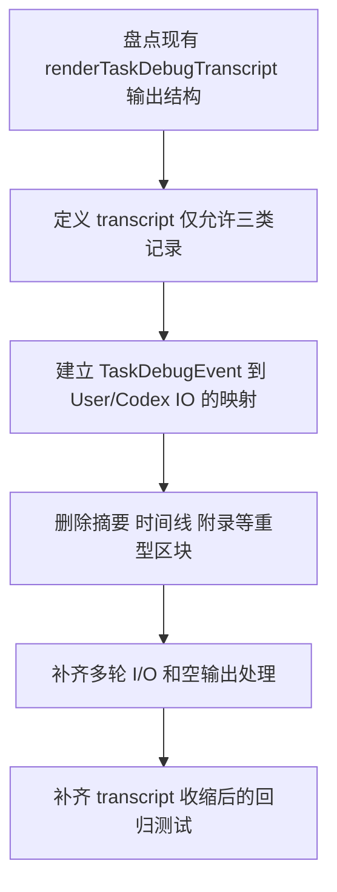

# Implementation Plan (implementationPlan)

## 概述 (summary)

- 本次实现聚焦 `default-workflow` 的 `runtime/debug-transcript.md` 内容收缩，目标是在保留 `debug-events.jsonl` 保真调试能力的前提下，把 transcript 收敛成只记录“用户输入、给 codex 的具体输入、codex 最终输出”的极简 I/O 转录件。
- 实现建议拆成 6 步：盘点当前 transcript 渲染入口、定义 transcript 允许保留的三类记录、定义 debug event 到 transcript I/O 记录的映射、移除摘要/时间线/附录等重型区块、补齐空输出与多轮调用处理、补齐 transcript 收缩后的回归测试。
- 最关键的风险点是把 transcript 收缩错误地理解成“删调试事件”；本次只收缩 `debug-transcript.md` 的展示边界，不能弱化 `debug-events.jsonl` 的保真内容。
- 最需要注意的是“codex 输入”必须是具体 prompt 原文，而不是 prompt 来源、角色名或摘要文案；如果这层映射不准，transcript 会看起来更简洁，但无法满足 PRD 的核心验收。
- 当前没有产品层未确认问题，但规范输入存在缺口：`roleflow/context/standards/common-mistakes.md` 缺失，`roleflow/context/standards/coding-standards.md` 为空；同时当前 `renderTaskDebugTranscript(...)` 的职责明显比新 PRD 更重，需要显式降权为纯 I/O 渲染器。

---

## 输入依据 (inputBasis)

- PRD：`roleflow/clarifications/0.1.0/default-workflow-task-debug-transcript-codex-io-only-prd.md`
- 相关需求：`roleflow/clarifications/0.1.0/default-workflow-task-debug-transcript-prd.md`
- 计划模板：`roleflow/templates/plan/implementationPlan.md`
- 相关历史计划：`roleflow/implementation/0.1.0/default-workflow-task-debug-transcript.md`
- 当前 transcript 渲染实现：`src/default-workflow/persistence/task-store.ts`
- 当前调试事件类型：`src/default-workflow/shared/types.ts`
- 当前 Workflow debug 事件写入：`src/default-workflow/workflow/controller.ts`
- 当前 Executor 最终结果记录：`src/default-workflow/role/executor.ts`
- 当前测试参考：`src/default-workflow/testing/runtime.test.ts`
- 当前测试参考：`src/default-workflow/testing/agent.test.ts`
- 当前工程依赖：`package.json`

缺失信息：

- `roleflow/context/standards/common-mistakes.md` 当前不存在，无法作为实现约束输入。
- `roleflow/context/standards/coding-standards.md` 当前为空，未提供可执行编码规范。
- 当前没有独立 exploration 文档解释“哪个调试事件等价于 codex input/output”；本计划需要直接基于现有 debug event 类型和执行链路做映射收敛。

---

## 实现目标 (implementationGoals)

- 修改 `renderTaskDebugTranscript(...)`，把当前“任务概览 + 结果摘要 + 关键错误 + 全量时间线 + 原始输出附录”的重型 Markdown，收敛为纯 I/O 转录件。
- 保持 `debug-events.jsonl` 原样保真，不删除 `workflow_event`、`role_visible_output`、`executor_stdout`、`executor_stderr`、`executor_exit`、`intake_message` 等事件类型，也不弱化其字段内容。
- 为 transcript 明确只保留三类正文记录：
  - 用户输入
  - codex 输入
  - codex 输出
- 保持用户输入、codex 输入、codex 输出都记录原文具体值，不替换成摘要、角色说明、来源文件列表或解析后的局部字段。
- 收敛 codex 输入/输出的事件映射规则：输入优先对应实际发送给 codex executor 的最终 prompt，输出优先对应执行器的最终结果 payload 或最终返回文本，而不是中间流式输出。
- 保持多轮调用场景可读：若一次任务含多次用户输入或多次 codex 调用，transcript 需要按真实时序重复展示这些 I/O 往返，而不是只保留最后一轮。
- 最终交付结果应达到：开发者打开 `debug-transcript.md` 后，首屏即可直接看到原始 I/O 往返；需要更底层的排障材料时，再去看 `debug-events.jsonl`。

---

## 实现策略 (implementationStrategy)

- 采用“只改 transcript 渲染器、不改 debug event 采集面”的局部收缩策略，不重写 `TaskDebugEvent` 模型，也不回退已落地的双文件调试机制。
- 将 transcript 的职责从“可读 debug report”收缩为“极简 I/O transcript”，让 `debug-events.jsonl` 继续承担过程、传输、错误和 workflow/intake 噪音的保真记录。
- 先定义允许进入 transcript 的三类记录，再从现有 `TaskDebugEvent[]` 中做过滤和映射，避免继续沿用旧的摘要/高亮/附录管线。
- 对用户输入保留原文，优先消费 `type === "user_input"` 事件；不把 `intake_message` 当成用户输入替代物。
- 对 codex 输入保留具体 prompt 原文，优先消费代表“真正发送给执行器的 prompt 文本”的事件或 payload；若现有事件模型尚未明确记录该 prompt，需要在实现中补一条最小 debug 事件，而不是拿来源列表或角色名代替。
- 对 codex 输出优先消费最终结果 payload / 最终返回文本；禁止把 `role_visible_output`、`executor_stdout`、`executor_stderr` 当成 codex 最终输出写进 transcript。
- 对 Markdown 结构采取极简但稳定的固定格式：允许保留文件标题和每轮 I/O 的固定小节，但移除概览、摘要、错误总览、附录、runtimeFiles 清单等非 I/O 区块。
- 测试层以“只出现三类正文记录”“具体 prompt/最终输出原文被保留”“过程/传输/工作流噪音不再进入 transcript”为主，而不是继续验证旧 transcript 的大区块结构。

---

## 实施流程图 (implementationFlowchart)

---

## 当前实现差异与收敛项 (currentGapsAndConvergence)

- 当前 `src/default-workflow/persistence/task-store.ts` 的 `renderTaskDebugTranscript(...)` 会输出任务概览、结果摘要、关键错误、全量时间线和原始输出附录，明显超出本 PRD 允许范围。
- 当前 transcript 的时间线会把所有 `TaskDebugEvent` 类型都映射成可读文本，其中包括 `workflow_event`、`role_visible_output`、`executor_stdout`、`executor_stderr`、`executor_exit` 和 `intake_message` 等新 PRD 明确禁止进入 transcript 的内容。
- 当前 transcript 还会渲染 `runtimeFiles`、`latestInput`、状态摘要等总览性字段，这些都属于旧版“综合排障总览”职责，不再适合保留在新 transcript 中。
- 当前底层事件模型已经足够保真：`TaskDebugEvent` 仍覆盖 `user_input`、`role_visible_output`、`executor_result_payload` 等类型，因此本期主要问题不是事件缺失，而是 Markdown transcript 选材过宽。
- 当前执行链路中，传给 executor 的最终 prompt 和 executor 返回的最终 raw payload 都是明确存在的；这意味着“给 codex 的具体输入 / codex 最终输出”在架构上可以被稳定定位，而不是纯推断概念。
- 当前测试里仍会断言 transcript 包含 `runtimeFiles` 等旧区块，这类预期在本次需求下需要显式收敛或删除。

---

## I/O 映射要求 (ioMappingRequirements)

- User Input:
  - 只来自 `type === "user_input"` 的调试事件。
  - 必须保留原始文本，不得合并、摘要化或只保留最后一次。
- Codex Input:
  - 必须对应真实发送给 codex executor 的最终 prompt 原文。
  - 不得退化成角色名、phase 名、prompt 来源文件列表或“已调用 builder/planner”之类说明。
  - 若当前 debug event 中尚未稳定携带 prompt 原文，实现必须补足这条最小记录能力。
- Codex Output:
  - 必须优先对应 executor 的最终结果 payload 或最终返回文本。
  - 不得拿 `role_visible_output`、流式 delta、stdout/stderr 过程日志或 workflow 摘要替代。
  - 若最终输出为空，应显式标记为空，而不是补入过程日志。
- 顺序要求：
  - transcript 中的三类记录必须按真实发生顺序排列。
  - 同一轮往返中至少呈现为：User Input -> Codex Input -> Codex Output。
  - 若一次用户输入触发多次 codex 调用，这些调用必须按时序分别记录。

---

## 过滤与分责要求 (filteringAndResponsibilityRequirements)

- transcript 不得包含：
  - `workflow_event`
  - `role_visible_output`
  - `executor_stdout`
  - `executor_stderr`
  - `executor_exit`
  - `intake_message`
  - 任务概览、结果摘要、关键错误、原始输出附录、runtime 文件清单
- `debug-events.jsonl` 继续保留上述事件类型和原始内容；本次不能为了让 transcript 变干净而删除底层调试事件。
- `debug-transcript.md` 与 `debug-events.jsonl` 的职责边界需要在实现与测试中同时体现：
  - transcript：极简 I/O transcript
  - debug-events：保真调试事件流
- 若后续 reviewer 看到 transcript 重新出现“总览报告”“原始输出附录”“单独工作流噪音映射”等内容，应直接视为回归。

---

## 验收目标 (acceptanceTargets)

- `debug-transcript.md` 中只出现三类正文内容：用户输入、codex 输入、codex 输出。
- 文件中不再出现 `workflow_event`、`role_visible_output`、`executor_stdout`、`executor_stderr`、`executor_exit`、`intake_message` 的可读映射内容。
- 文件中不再出现“任务概览”“结果摘要”“关键错误”“原始输出附录”“runtimeFiles”这类总览性区块。
- 对于一次真实 codex 调用，开发者可以在 transcript 中看到发送过去的完整 prompt 原文，以及返回的最终输出原文。
- 多轮用户输入和多次 codex 调用场景下，transcript 仍按时序完整呈现各轮 I/O，而不是只剩最后一轮。
- `debug-events.jsonl` 仍然保留原有保真能力，不因 transcript 收缩而丢失底层调试信息。
- 自动化测试或等价校验至少覆盖：只保留三类正文记录、codex prompt 原文保留、最终输出原文保留、过程/传输噪音不进入 transcript、以及 `debug-events.jsonl` 不受影响。

---

## Open Questions

- 无。

---

## Assumptions

- 用户此次要求收缩的是 `debug-transcript.md`，而不是删除或弱化 `debug-events.jsonl`。
- “给 codex 的输入（具体值）”应解释为实际发送给 codex executor 的最终 prompt 原文。
- “codex 的输出”应解释为最终输出原文，而非中间流式过程输出。

---

## Todolist (todoList)

- [x] 盘点当前 `renderTaskDebugTranscript(...)` 输出的所有大区块和事件映射，明确哪些内容必须从 transcript 中移除。
- [x] 定义 transcript 仅允许保留的三类记录结构：用户输入、codex 输入、codex 输出。
- [x] 确认并收敛 `TaskDebugEvent` 到 transcript I/O 三类记录的映射规则，尤其是“codex 输入 = 最终 prompt 原文”“codex 输出 = 最终结果 payload/文本原文”。
- [x] 若当前调试事件中尚未稳定保留最终 prompt 原文，补齐最小 debug event 记录能力，避免 transcript 只能输出摘要性占位文案。
- [x] 重写 `renderTaskDebugTranscript(...)`，移除任务概览、结果摘要、关键错误、时间线、原始输出附录和 runtime 文件清单等旧结构。
- [x] 为多轮用户输入与多次 codex 调用设计稳定的 Markdown 排列方式，保证同一文件中可按时序重复展示 I/O 往返。
- [x] 为空 codex 输出或异常场景定义 transcript 表达方式，确保“为空”显式可读，但不引入过程日志替代。
- [x] 校对 `debug-events.jsonl` 的写入链路，确认本次实现不会删除或弱化现有保真事件类型。
- [x] 更新或新增测试，覆盖 transcript 只剩三类正文记录、prompt 原文保留、最终输出原文保留、禁入过程/传输噪音，以及 `debug-events.jsonl` 不受 transcript 收缩影响。
- [x] 更新旧测试中的 transcript 大区块预期，移除对 `runtimeFiles`、摘要区、附录区等旧结构的断言。
- [x] 完成自检，确认本次改造只收缩 Markdown transcript，不影响 task 状态持久化、workflow-events.jsonl、debug-events.jsonl 或 Intake UI 展示。
