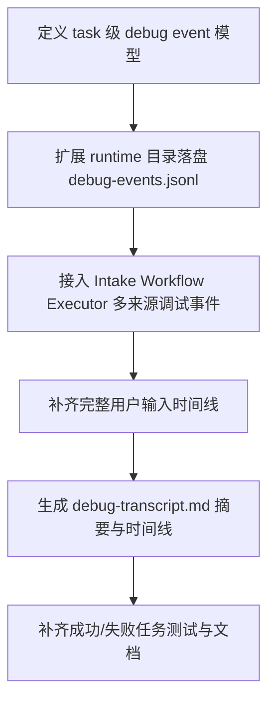

# Implementation Plan (implementationPlan)

## 概述 (summary)

- 本次实现聚焦 `default-workflow` 的任务级调试沉淀，目标是在现有 `task-state.*`、`task-context.json`、`workflow-events.jsonl` 之外，补一套“双视图”调试件：一份给人读的 `debug-transcript.md`，一份保真可复盘的 `debug-events.jsonl`。
- 实现建议拆成 6 步：定义任务级 debug 事件模型、扩展 task runtime 目录落盘能力、补齐完整输入时间线、接入 Workflow/Intake/Executor 多来源调试事件、生成可读 Markdown 转录件、补齐成功/失败任务的验收测试。
- 最关键的风险点是只做“另一份普通 log”而没有分清职责：这样既不能快速排障，也守不住原始 `stdout/stderr/exit/timeout` 等调试材料。
- 最需要注意的是双文件职责边界：`debug-events.jsonl` 必须保真，`debug-transcript.md` 必须结构化可读，且二者都只是补充，不得替代既有 `workflow-events.jsonl` 与 `task-state.*`。
- 当前没有产品层未确认问题，但规范输入存在缺口：`roleflow/context/standards/common-mistakes.md` 缺失，`roleflow/context/standards/coding-standards.md` 为空；同时当前仓库尚无 task 级 debug transcript 现成实现可复用。

---

## 输入依据 (inputBasis)

- PRD：`roleflow/clarifications/0.1.0/default-workflow-task-debug-transcript-prd.md`
- 项目上下文：`roleflow/context/project.md`
- 计划模板：`roleflow/templates/plan/implementationPlan.md`
- 相关历史计划：`roleflow/implementation/0.1.0/default-workflow-workflow-layer.md`
- 相关历史计划：`roleflow/implementation/0.1.0/default-workflow-role-child-process-subcommand.md`
- 相关历史计划：`roleflow/implementation/0.1.0/default-workflow-intake-error-explainability.md`
- 当前任务持久化：`src/default-workflow/persistence/task-store.ts`
- 当前 Workflow 控制器：`src/default-workflow/workflow/controller.ts`
- 当前 runtime 依赖与事件日志：`src/default-workflow/runtime/dependencies.ts`
- 当前角色执行器：`src/default-workflow/role/executor.ts`
- 当前类型定义：`src/default-workflow/shared/types.ts`
- 当前测试参考：`src/default-workflow/testing/runtime.test.ts`
- 当前项目配置：`package.json`

缺失信息：

- `roleflow/context/standards/common-mistakes.md` 当前不存在，无法作为实现约束输入。
- `roleflow/context/standards/coding-standards.md` 当前为空，未提供可执行编码规范。
- 当前没有与本 PRD 对应的独立 exploration 工件；本计划只能基于 PRD、项目文档和现有代码状态生成。

---

## 实现目标 (implementationGoals)

- 新增每个 task 目录下的两份调试文件：
  - `tasks/<taskId>/runtime/debug-transcript.md`
  - `tasks/<taskId>/runtime/debug-events.jsonl`
- 保留现有 `task-state.json`、`task-state.md`、`task-context.json`、`workflow-events.jsonl` 不变，本次调试件仅作为补充视图，不替代既有 runtime 文件。
- 新增统一的 task 级调试事件模型，覆盖至少：用户输入、Intake 消息、WorkflowEvent、role 可见输出、executor 原始 stdout/stderr、exit/signal/timeout、错误、快照引用。
- 新增对 Executor 最终原始结果 payload 的独立保留要求，确保 `provider.readResult()` 读出的最终结果不会被误当成 stdout 替代物而丢失。
- 修改任务上下文或等价持久化结构，确保完整输入时间线可恢复，不再退化成只有 `latestInput`。
- 修改 Intake 任务创建前的交互归档方式，确保从首次自然语言需求开始到 taskId 分配前的推荐、确认、目录收集等内容，会在 task 建立后回填到对应 task 目录的调试件中。
- 修改 Workflow / Intake / Executor 链路，使成功与失败任务都能沉淀完整调试时间线，并且失败任务额外前置失败摘要与原始错误上下文。
- 新增 Markdown 调试转录件生成逻辑，使其第一屏优先回答：任务是什么、执行到哪里、成功还是失败、为什么失败、失败发生在哪个 phase/role/executor。
- 保持现有 `workflow-events.jsonl` 的正式事件职责不变；新的 `debug-events.jsonl` 必须覆盖更宽来源，特别是现有 Workflow 视角外的输入历史和 executor 原始输出。
- 最终交付结果应达到：任意 task 目录都能同时提供适合人工排障的 `debug-transcript.md` 和适合精确复盘的 `debug-events.jsonl`，且成功任务也具备完整可追踪记录。

---

## 实现策略 (implementationStrategy)

- 采用“新增 task 级 debug recorder + 补充输入历史 + transcript 渲染器”的局部扩展策略，不重写现有 ArtifactManager / EventLogger 主体职责，而是在其旁路增加调试视图能力。
- 将 `workflow-events.jsonl` 与 `debug-events.jsonl` 的职责显式分开：
  - 前者继续作为 Workflow 正式事件流
  - 后者作为跨 Intake / Workflow / Executor 的宽口径调试事件流
- 通过新增 `DebugEventLogger` 或等价组件收集多来源事件，而不是继续尝试把所有调试信息硬塞进现有 `WorkflowEvent` 类型。
- 输入历史优先通过独立调试事件流记录，而不是继续扩展 `latestInput` 的单字段语义；`task-context.json` 可保留最近输入摘要，但调试复盘必须依赖完整事件时间线。
- Executor 链路需要显式加 instrumentation：不仅记录上游可见 `role_output`，还要记录原始 `stdout`、`stderr`、非零退出、signal、timeout、进程级异常，以及 `provider.readResult()` 读取到的最终原始结果 payload。
- 对 task 创建前的 Intake 交互，推荐采用“draft 级预任务调试缓冲区 -> taskId 分配后统一回填”的方案，而不是等 Runtime 建好后才开始记录；这样可以最小化对现有 taskId 生成时机的改动，同时保证初始需求和前置问答不丢失。
- Markdown 转录件采用“结构化整理而不是删信息”的方式：摘要区前置、时间线分层、错误与最近失败片段上提、原始输出进入专门区块或附录。
- 成功任务和失败任务都生成调试件，但 transcript 对失败场景做更强摘要优化，确保失败任务的一份 Markdown 就能看清核心问题。
- 测试层采取“双视图校验”策略：既验证 `debug-events.jsonl` 的高保真覆盖，也验证 `debug-transcript.md` 的可读摘要与失败前置信息。

---

## 实施流程图 (implementationFlowchart)

---

## 当前实现差异与收敛项 (currentGapsAndConvergence)

- 当前 `src/default-workflow/persistence/task-store.ts` 已会在 `tasks/<taskId>/runtime/` 下保存 `task-state.json`、`task-state.md`、`task-context.json` 和 `workflow-events.jsonl`，说明“完全没有任务级落盘材料”并不成立。
- 当前 `workflow-events.jsonl` 只覆盖 `WorkflowEvent` 视角，无法表达用户输入全文、Intake 控制指令、executor 原始 stdout/stderr、exit/signal/timeout 等宽口径调试信息。
- 当前 `PersistedTaskContext` 和 `WorkflowController.saveLatestInput()` 仍只维护 `latestInput`，会覆盖旧值，无法恢复完整用户输入时间线。
- 当前 `src/default-workflow/role/executor.ts` 在 child process 路径里会收集 stdout/stderr、退出码与 timeout，但这些底层信息只用于当次执行与错误包装，尚未沉淀到 task 目录下的独立调试文件；同样，`provider.readResult()` 读出的最终原始结果 payload 目前也没有 task 级保真记录。
- 当前 Intake 在 Runtime 建立前就会经历初始需求输入、workflow 推荐/确认、项目目录与工件目录收集，但这些交互发生时 taskId 尚未生成，也没有现成的 task 级缓冲与回填机制，因此存在前置时间线丢失风险。
- 当前运行失败时，`WorkflowController.failWithError()` 只会把摘要后的错误写入 `WorkflowEvent(error).metadata.error`；这对 UI 展示足够，但不等于已保留原始失败上下文。
- 当前测试中的 `MemoryEventLogger` 只覆盖 `WorkflowEvent`，还没有验证 task 级 debug 事件双文件、输入时间线或 executor 原始输出保留。

---

## 双文件收敛项 (dualViewConvergence)

- `debug-events.jsonl` 必须是高保真调试事件流，不能退化成“workflow-events.jsonl` 的重命名版”。
- `debug-events.jsonl` 至少应允许表达以下调试来源：
  - `user_input`
  - `intake_message`
  - `workflow_event`
  - `role_visible_output`
  - `executor_stdout`
  - `executor_stderr`
  - `executor_exit`
  - `executor_result_payload`
  - `error`
  - `snapshot_reference`
- 每条调试事件至少应尽量带上：
  - `taskId`
  - 时间戳
  - phase
  - role
  - 来源层级
  - 原始文本或结构化 payload
- `debug-transcript.md` 不能只是原始事件逐行拼接，至少要结构化包含：
  - 任务概览
  - 当前/最终状态
  - 成功/失败摘要
  - 时间线主体
  - 关键错误区
  - 原始输出附录或引用
- `debug-transcript.md` 可引用 `task-state.json`、`task-state.md`、`task-context.json`、`workflow-events.jsonl` 与 artifact 文件，但自身仍必须足够支持快速排障，而不是只列路径。

---

## 输入历史与失败复盘收敛项 (inputHistoryAndFailureConvergence)

- 完整用户输入时间线必须覆盖：
  - 初始需求
  - 澄清回答
  - 运行中补充输入
  - 恢复任务时输入
  - 取消、恢复、中断等控制指令
- 对 taskId 分配前发生的上述交互，必须先进入 draft 级预任务缓冲；一旦 taskId 和 task 目录可用，这些事件必须按原始时间顺序回填到 `debug-events.jsonl`，并成为 `debug-transcript.md` 时间线的开头部分。
- 失败任务的 transcript 第一屏应显式前置：
  - 失败摘要
  - 原始错误
  - phase / role / executor 位置
  - 最后一个用户输入
  - 最后一个关键事件
  - 最近的 stderr / 非零退出 / timeout 信息
- 若最终结果通过 `provider.readResult()` 单独读取而不是来自 stdout，则失败任务和成功任务的 transcript 都应能引用或摘要这份最终原始结果 payload，避免出现“中间流完整但最终结果缺失”的复盘缺口。
- 成功任务也必须生成调试件，但失败任务应拥有更强的诊断摘要，不允许把失败信息淹没在普通时间线里。

---

## 验收目标 (acceptanceTargets)

- 每个 task 目录下都会生成独立的 `runtime/debug-transcript.md` 与 `runtime/debug-events.jsonl`。
- 新的调试文件不会替代现有 `task-state.json`、`task-state.md`、`task-context.json`、`workflow-events.jsonl`。
- 成功任务和失败任务都会生成调试记录，不会只有失败任务才落盘。
- 任务目录下能够恢复完整输入序列，不再只有 `latestInput`。
- `debug-events.jsonl` 至少会保留用户输入、WorkflowEvent、role 可见输出、executor 原始 stdout/stderr、退出结果、最终原始结果 payload 和错误信息。
- task 建立后的调试件时间线会从首次用户需求开始，而不是只从 Runtime 初始化完成之后开始。
- 当存在 `stderr`、非零退出码、signal 或 timeout 时，这些原始信息至少会出现在 `debug-events.jsonl` 中，并尽量在 `debug-transcript.md` 中可见或被摘要引用。
- 当最终结果通过 `provider.readResult()` 单独读取时，这份原始结果也会在 `debug-events.jsonl` 中保留，并在 `debug-transcript.md` 中可见或被摘要引用。
- 任意失败任务打开一份 `debug-transcript.md` 后，开发者能快速看清任务是什么、执行到哪个 phase/role、AI 输出了什么、底层执行器返回了什么、以及为什么失败。
- 自动化测试或可执行验证至少覆盖：成功任务 transcript 生成、失败任务 transcript 摘要、完整输入时间线、executor 原始输出保留、以及 debug 与 workflow 双事件文件职责不混淆。

---

## Todolist (todoList)

- [ ] 盘点 `task-store`、`WorkflowController`、`IntakeAgent`、`role/executor` 中所有与任务级持久化、输入保存和执行输出相关的现有链路。
- [ ] 设计 task 级 debug 事件模型，明确 `debug-events.jsonl` 需要覆盖的事件类别、最小字段和来源层级。
- [ ] 设计 `debug-events.jsonl` 与 `workflow-events.jsonl` 的职责边界，确保新的调试流不是对现有 Workflow 事件日志的简单重命名。
- [ ] 为 task runtime 目录新增 debug 文件落盘入口，固定 `debug-transcript.md` 与 `debug-events.jsonl` 的路径和初始化时机。
- [ ] 设计 draft 级预任务调试缓冲区，明确 taskId 分配前的 Intake 交互如何暂存，并在 task 目录可用后按原始时间顺序回填。
- [ ] 收敛完整输入时间线的记录策略，确保用户输入与控制指令进入调试事件流，而不是继续只覆盖 `latestInput`。
- [ ] 扩展 Intake 链路的调试记录，覆盖初始需求、补充输入、恢复任务、取消和中断等用户侧动作。
- [ ] 扩展 Workflow 链路的调试记录，覆盖 phase 切换、role 开始/结束、错误事件、工件创建和任务结束。
- [ ] 扩展 Executor 链路的调试记录，保留原始 stdout、stderr、退出码、signal、timeout、启动失败以及 `provider.readResult()` 返回的最终原始结果 payload。
- [ ] 定义原始错误与摘要错误的双保留策略，确保 transcript 有可读摘要，debug-events 里有原始材料。
- [ ] 设计 `debug-transcript.md` 的固定摘要区，至少覆盖 taskId、任务摘要、workflow、projectDir、artifactDir、开始时间、最后更新时间、最终状态、最终 phase、active role 和失败摘要。
- [ ] 设计 `debug-transcript.md` 的时间线主体与信息分层，明确用户输入、系统事件、AI 可见输出、底层原始输出和错误的展示区块。
- [ ] 为失败任务补充前置诊断摘要规则，确保最近失败片段、最后用户输入和最近 stderr / timeout 信息会被上提展示。
- [ ] 为成功任务定义最小 transcript 结构，确保成功任务也具备完整可追踪记录而不是空摘要。
- [ ] 校对与现有 runtime 文件的关系，确保 `task-state.*`、`task-context.json`、`workflow-events.jsonl` 继续保留且可被 transcript 引用。
- [ ] 更新或新增测试，覆盖完整输入时间线、预任务缓冲回填、debug-events 高保真覆盖、失败任务 transcript 摘要、成功任务 transcript 生成，以及 executor 原始输出与最终结果 payload 保留。
- [ ] 补充手动验收清单，至少覆盖成功任务、失败任务、超时/非零退出、恢复任务和多轮输入场景。
- [ ] 更新相关文档与示例，至少同步 task 目录下新增的双文件调试件、其职责边界和与既有 runtime 文件的关系。
- [ ] 完成自检，确认本次改造没有把 debug-events 简化成摘要日志，也没有让输入历史继续退化成只保留 `latestInput`。
