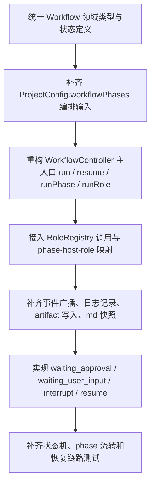

# Implementation Plan (implementationPlan)

## 概述 (summary)

- 本次实现聚焦 `default-workflow` 的 `Workflow` 层，目标是把当前偏占位的控制器收敛成一个以状态机和 phase 编排为中心的 `WorkflowController`。
- 实现建议拆成 6 步：统一状态与配置定义、补齐编排输入、实现 `run / resume / runPhase / runRole`、补齐工件/日志/事件/快照链路、实现审批与恢复、补齐测试与验收。
- 最关键的风险点是 `TaskStatus`、`PhaseStatus`、`currentPhase`、`resumeFrom` 之间的一致性，以及恢复时如何依赖快照正确回到 phase / role。
- 最需要注意的是 `WorkflowController` 只能负责编排和状态推进，不能替代 `Intake` 做展示，也不能替代 `Role` 做角色内部执行。
- 当前不存在产品层未确认问题，但规范输入存在缺口：`roleflow/context/standards/common-mistakes.md` 缺失，`roleflow/context/standards/coding-standards.md` 为空；同时 `RoleResult` 结构和各 phase 的 artifact 命名粒度仍未细化。另一个需要显式处理的点是：`project.md` 当前把 `ProjectConfig.workflowPhases` 定义为 `Phase[]`，而本期 `Workflow` 编排需求已经要求它承载更丰富的 phase 配置，这被视为本次实现内允许的结构收敛项。

---

## 输入依据 (inputBasis)

- PRD：`roleflow/clarifications/0.1.0/default-workflow-workflow-layer-prd.md`
- 项目上下文：`roleflow/context/project.md`
- 计划模板：`roleflow/templates/plan/implementationPlan.md`
- 上游接口参考：`roleflow/implementation/0.1.0/default-workflow-intake-layer.md`
- 历史实现参考：`src/default-workflow/workflow/controller.ts`
- 历史实现参考：`src/default-workflow/runtime/builder.ts`
- 历史实现参考：`src/default-workflow/shared/types.ts`

缺失信息：

- `roleflow/context/standards/common-mistakes.md` 当前不存在，无法作为实现约束输入。
- `roleflow/context/standards/coding-standards.md` 当前为空，未提供可执行编码规范。
- `Role.run` 的返回结构在项目上下文中仍偏抽象，尚未明确不同 phase 的最小 `RoleResult` 形态。
- `ArtifactManager` 对工件与快照的 md 命名、目录分层和索引规则尚未写成明确规格。
- `project.md` 当前将 `ProjectConfig.workflowPhases` 写为 `Phase[]`，但 PRD 已要求 `Workflow` 依赖更完整的编排输入；本计划将此不一致显式视为一次允许的类型/配置结构收敛。
- `test` phase 的 host role 已确认命名为 `tester`，但当前仓库下还没有对应角色职责文档；实现时需要把它视为明确的下游依赖缺口，而不是临时回退到其他角色名。

---

## 实现目标 (implementationGoals)

- 扩展当前 `WorkflowController`，使其从 Intake 验收闭环占位实现，演进为覆盖 `clarify` 到 `test` 主流程的编排控制器。
- 对齐并收敛 `Workflow` 层的核心需求对象定义，包括 `TaskState`、`TaskStatus`、`Phase`、`PhaseStatus`、`ProjectConfig.workflowPhases`、`Runtime` 依赖集合以及 `WorkflowEvent` / `IntakeEvent`。
- 显式处理 `ProjectConfig.workflowPhases` 的结构收敛问题：将其从 `project.md` 现有的 `Phase[]` 级别输入，收敛为与同文件 `aegisproject.yaml` 示例一致的结构化 phase 配置，至少包含 `name`、`hostRole`、`needApproval`，以满足 `Workflow` 层需求。
- 新增或调整 `WorkflowController` 的职责入口，至少覆盖 `run(taskId)`、`resume(taskId, input?)`、`runPhase(phase)`、`runRole(roleName, input)`，并保留 Intake 事件桥接入口。
- 新增 phase 编排输入，使 `ProjectConfig.workflowPhases` 成为流程配置来源，支撑 `clarify -> explore -> plan -> build -> review -> test-design -> unit-test -> test` 的推进。
- 新增通用状态暂停与恢复能力，覆盖 `waiting_approval`、`waiting_user_input`、`interrupted`、`failed`、`completed` 等关键路径。
- 新增角色调用、工件写入、日志记录、事件广播和快照持久化的完整执行闭环，并明确这些副作用由 `Workflow` 统一协调。
- 新增恢复执行所需的快照定位信息和 `Runtime` 重建后的续跑机制，保证恢复不是“从头再来”，而是回到可解释的 phase / role 恢复点。
- 保持 `WorkflowController` 不是 Agent、不直接做 CLI 展示、不直接承担角色推理；`TaskState` 的合法修改者仍只能是 `WorkflowController`。
- 最终交付结果应达到：`Workflow` 层可以独立支撑 `default-workflow` 的主状态机、phase 流转、暂停恢复、事件广播和工件/快照写入，并与当前 `Intake` / `Runtime` 接口稳定对接。

---

## 实现策略 (implementationStrategy)

- 采用“状态机优先、编排优先”的改造策略，先统一 `TaskState` / `Phase` / `ProjectConfig.workflowPhases` / `WorkflowController` 接口，再扩展运行链路，避免先补零散事件导致状态定义反复变化。
- 基于现有 `src/default-workflow/workflow/controller.ts` 和 `runtime/builder.ts` 局部扩展，而不是整体推翻；当前代码可作为 Intake 闭环基础，但需要向完整 phase 编排演进。
- 先把 `Workflow` 的配置输入显式化：把 phase 列表、phase 对应 host role、是否等待审批等编排信息集中到 `ProjectConfig.workflowPhases` 中，并对齐 `project.md` 里的 `aegisproject.yaml` 结构示例，再由 `runPhase` 消费。这里属于显式的类型/配置结构调整，用于解决 `project.md` 现有 `Phase[]` 接口和 `Workflow` PRD 编排需求之间的不一致。
- `WorkflowController` 对外保留 Intake 事件承接入口，但内部应收敛为 `run / resume / runPhase / runRole` 四段式职责闭环，避免所有逻辑继续堆在一个事件分支函数里。
- 状态推进以一致性约束为核心：每次 phase 开始、角色开始、等待审批、等待用户输入、中断、恢复、失败、完成，都同步推进 `TaskState`、写日志、发事件、持久化快照。
- 快照与工件采取“双写但边界分明”的方式处理：任务工件由 `ArtifactManager` 负责落盘，`WorkflowController` 决定何时写入；任务快照必须在关键节点落到 md 文件，并包含恢复所需的最小定位信息。
- 审批与等待用户输入作为通用暂停能力处理，不绑定到固定 phase；`WorkflowController` 只负责进入等待态、记录恢复点、在恢复时重跑目标 phase，不在自身内部做审批 UI。
- 恢复路径必须依赖重建后的 `Runtime` 与持久化快照信息；恢复后允许重跑当前 phase，但不允许悄悄复用旧内存状态。
- 错误路径统一收敛到失败处理：更新 `TaskStatus`、补写日志、补发 `error` / `task_end` 等事件、保存快照，避免出现中途异常但状态未落盘的悬空任务。
- 如果下游 `RoleRegistry` / `Role` / `ArtifactManager` 仍有占位实现，`Workflow` 仍需先把状态机、事件、日志和恢复链路做完整，不能用“下游未完成”为由放弃编排职责。

---

## 实施流程图 (implementationFlowchart)

---

## 状态机与编排要求 (workflowStateAndOrchestrationRequirements)

- `WorkflowController` 必须是 `TaskState` 的唯一合法修改者；`Intake` 和 `Role` 都只能通过输入和返回值影响流程，不能直接写状态。
- `TaskStatus` 只允许使用 `idle`、`running`、`waiting_user_input`、`waiting_approval`、`interrupted`、`failed`、`completed`；`PhaseStatus` 只允许使用 `pending`、`running`、`done`。
- `Workflow` 必须维护状态一致性，不允许出现“任务已 `completed`，但当前 phase 仍是 `running`”这类冲突状态。
- `ProjectConfig.workflowPhases` 必须作为主流程编排输入，至少包含 phase 顺序、host role 和审批相关配置；`v0.1` 可以先写死默认编排，但不能把 phase 顺序散落在控制器分支逻辑里。
- 上一条要求意味着本次实现需要对 `ProjectConfig.workflowPhases` 做结构收敛：`project.md` 当前给出的 `Phase[]` 不足以支撑 `Workflow` 编排需求，因此这里明确允许把它提升为结构化 phase 配置，而不是把这种变化隐含在实现细节中。
- 本次结构收敛的目标形态明确对齐 `project.md` 中的 `aegisproject.yaml` 示例：每个 phase 配置至少包含 `name`、`hostRole`、`needApproval`；如果实现中需要内部归一化结构，也应以这个外部契约作为输入基线，而不是再引入第三套未声明的外部配置格式。
- `run(taskId)` 负责进入任务主流程并启动首个可执行 phase；`resume(taskId, input?)` 负责从恢复点继续；`runPhase(phase)` 负责一个 phase 的生命周期；`runRole(roleName, input)` 负责单个 role 执行。
- `runPhase` 必须至少负责：设置当前 phase、更新 `phaseStatus`、解析 host role、触发 `runRole`、接收结果、决定是否写工件、决定是否进入等待态或下一个 phase。
- `runRole` 必须通过 `RoleRegistry` 解析角色，构造执行上下文，调用 `Role.run`，并把结果返回给 `WorkflowController`；`WorkflowController` 不能绕过注册表直接承担角色职责。
- `v0.1` 默认 phase-host-role 映射必须显式固定，至少包括：
  `clarify -> clarifier`、
  `explore -> explorer`、
  `plan -> planner`、
  `build -> builder`、
  `review -> critic`、
  `test-design -> test-designer`、
  `unit-test -> test-writer`、
  `test -> tester`。
- `unit-test` 与 `test` 不共享 host role；`unit-test` 固定映射到 `test-writer`，`test` 固定映射到 `tester`，实现时不允许把两者合并为同一个角色入口。
- `waiting_approval` 和 `waiting_user_input` 必须作为通用暂停状态存在，且进入等待态时必须同时写入 `resumeFrom` 和快照。
- `interrupt` 必须独立于审批和用户输入等待态；任务被中断时，必须写入足以恢复的 `resumeFrom` 信息，并在恢复时依赖重建后的 `Runtime`。
- `resumeFrom` 至少需要表达 `phase`、`roleName`、`currentStep?`，并足以让恢复逻辑重新定位到需要重跑的 phase / role。
- `Phase` 范围必须覆盖 `clarify`、`explore`、`plan`、`build`、`review`、`test-design`、`unit-test`、`test`；实现时需要对齐项目上下文中的命名差异，避免 `critic` / `test_design` 之类别名长期混用。

---

## 快照与副作用要求 (snapshotAndSideEffectRequirements)

- `WorkflowController` 必须在关键节点写日志，至少覆盖任务开始、phase 开始、role 开始、role 结束、工件创建、等待态进入、恢复、错误和任务结束。
- `WorkflowController` 必须通过 `EventEmitter` 广播 `WorkflowEvent`，并保持 CLI 展示逻辑停留在 `Intake` 层。
- `WorkflowController` 必须在关键节点持久化 `TaskState` 快照到 md 文件，而不是仅保存在内存中。
- 快照写入时机至少应覆盖：任务初始化后、phase 切换后、进入等待审批后、进入等待用户输入后、中断后、失败后、完成后。
- 快照内容至少应支持恢复时重新定位任务、phase 和 role，并能判断任务是否仍可恢复。
- 工件写入必须由 `WorkflowController` 决定何时触发，再调用 `ArtifactManager` 落盘；`Role` 返回结果本身不应越权写文件。
- 每次工件创建后，`Workflow` 必须发出 `artifact_created` 事件，并记录日志。
- 如果某些工件或快照能力在当前阶段只能先做受控占位，实现也必须显式标记边界，不能把未完成能力伪装成完整持久化方案。

---

## 验收目标 (acceptanceTargets)

- `WorkflowController` 可以作为 `default-workflow` 的核心编排对象驱动 `clarify` 到 `test` 的 phase 主流程，而不是只响应少量 Intake 事件占位分支。
- `TaskState`、`TaskStatus`、`Phase`、`PhaseStatus` 形成自洽的状态机；任务运行、等待审批、等待用户输入、中断、失败、完成之间的转换可解释且无冲突。
- `Workflow` 层的 phase 顺序和 `ProjectConfig.workflowPhases` 保持一致，`WorkflowController` 不再把完整编排顺序硬编码在零散条件分支中。
- `ProjectConfig.workflowPhases` 的外部契约与 `project.md` 中的 `aegisproject.yaml` 示例一致，至少能稳定表达 `name`、`hostRole`、`needApproval`，不会在实现中再引入未声明的第三套配置格式。
- `WorkflowController` 能接收 `IntakeEvent` 并转换为内部流程推进，同时也暴露 `run`、`resume`、`runPhase`、`runRole` 这四类职责入口。
- `WorkflowController` 能通过 `RoleRegistry` 获取 host role 并执行 `Role.run`，而不是把角色执行逻辑留在 `Workflow` 自身。
- `v0.1` 默认 phase-host-role 映射表在实现中是明确且可验证的，不会在 `review/critic`、`test-design/test designer`、`unit-test/test-writer`、`test/tester` 等命名上继续漂移。
- `unit-test` 与 `test` 在实现中会保持为两个不同的 host role 入口，不会被收敛成同一个角色。
- `Workflow` 层能在关键节点发出 `task_start`、`task_end`、`phase_start`、`phase_end`、`role_start`、`role_end`、`artifact_created`、`progress`、`error` 等事件。
- `Workflow` 层能在关键节点写日志，并将 `TaskState` 快照持久化到 md 文件。
- 当任务进入 `waiting_approval`、`waiting_user_input` 或 `interrupted` 时，系统会保存足以恢复执行的 `resumeFrom` 信息和快照。
- 恢复执行时，系统依赖重建后的 `Runtime` 和快照信息继续执行，而不是复用旧内存实例，也不是静默重头开始整个任务。
- 当角色执行失败、工件写入失败或 phase 执行失败时，系统会进入失败收敛路径，更新状态、发错误事件、写日志并保存快照。
- 最终交付物必须包含可验证状态机与 phase 流转的测试或手动验收清单，且验收重点优先落在状态推进、快照、恢复和 phase 主链路上。

---

## Todolist (todoList)

- [ ] 确认 `Workflow` 层改造边界，明确会涉及 `shared/types`、`runtime/builder`、`workflow/controller`、持久化和测试模块。
- [ ] 对齐 `TaskState`、`TaskStatus`、`Phase`、`PhaseStatus`、`WorkflowEventType`、`ProjectConfig.workflowPhases` 的命名与字段定义，修正与 PRD 不一致的别名或占位命名。
- [ ] 显式收敛 `ProjectConfig.workflowPhases` 的类型/配置结构，解决 `project.md` 当前 `Phase[]` 定义与 Workflow PRD 编排需求之间的不一致，并在实现中同步更新相关接口约束。
- [ ] 定义 `ProjectConfig.workflowPhases` 的最小编排结构，外部契约对齐 `project.md` 中 `aegisproject.yaml` 示例，至少覆盖 `name`、`hostRole`、`needApproval` 和恢复所需字段。
- [ ] 固定 `v0.1` 默认 phase-host-role 映射表，避免 `review/critic`、`test-design/test-designer`、`unit-test/test-writer`、`test/tester` 等命名在实现时再次漂移。
- [ ] 将 `unit-test` 与 `test` 的 host role 作为两个独立入口实现，确保 `unit-test -> test-writer`、`test -> tester` 不被合并。
- [ ] 标记并补齐 `tester` 角色文档缺口；在文档未补齐前，至少在实现边界和依赖说明中显式记录该角色是当前 Workflow 落地的外部前置项。
- [ ] 定义 `WorkflowController` 的职责入口边界，明确 `run(taskId)`、`resume(taskId, input?)`、`runPhase(phase)`、`runRole(roleName, input)` 与 Intake 事件桥接的关系。
- [ ] 实现或重构 `WorkflowController` 主流程，使任务启动不再停留在 `handleIntakeEvent` 的少量分支处理。
- [ ] 实现 phase 推进逻辑，覆盖 `clarify -> explore -> plan -> build -> review -> test-design -> unit-test -> test` 的主链路。
- [ ] 接入 `RoleRegistry` 与 host role 解析逻辑，确保 `WorkflowController` 通过注册表获取角色并调用 `Role.run`。
- [ ] 补齐 `ExecutionContext` / `RoleResult` 的最小传递边界，保证 `Workflow` 能接收角色返回并决定后续工件与状态处理。
- [ ] 实现任务开始、phase 开始、role 开始、role 结束、phase 结束、任务结束等关键事件的广播与日志记录。
- [ ] 实现 `ArtifactManager` 协同写工件能力，并在工件创建后发出 `artifact_created` 事件。
- [ ] 实现 `TaskState` md 快照持久化策略，覆盖启动后、phase 变化、等待态、中断、失败、完成等关键节点。
- [ ] 实现 `waiting_approval` 和 `waiting_user_input` 作为通用暂停能力的状态推进与恢复点记录。
- [ ] 实现 `interrupt` 与 `resume` 链路，保证恢复依赖重建后的 `Runtime` 和快照信息，而不是复用旧内存实例。
- [ ] 实现错误收敛路径，保证 role / artifact / phase 失败时都能统一落到失败状态、错误事件、日志和快照。
- [ ] 更新 `runtime/builder`，确保其向 `Workflow` 提供完整的 `Runtime` 依赖集合和编排输入。
- [ ] 校对与上游 `Intake` 层计划和现有代码的接口契约，避免 `IntakeEvent` / `WorkflowEvent` 语义与 `Workflow` 实现脱节。
- [ ] 添加或更新测试，覆盖状态机一致性、phase 顺序、等待审批、等待用户输入、中断恢复、错误收敛、快照恢复和事件广播。
- [ ] 完成自检，确认 `WorkflowController` 未越权承担 Agent/CLI/Role 职责，并复核命名与 PRD、`project.md` 一致。
