# default-workflow intake initial requirement bootstrap 代码图解

## 文档目的

本文只讲这次改动后的真实代码链路，重点解释：

- 为什么 Intake 要从“一段需求草稿”改成“两段式输入”
- task 目录为什么要在正式执行前就创建
- `initial-requirement.md` 为什么前移到 Intake 写入
- Clarify 现在如何消费预写入工件
- 输入类型差异如何在 Runtime、角色上下文和测试里保持一致

核心文件：

- `src/default-workflow/intake/agent.ts`
- `src/default-workflow/runtime/builder.ts`
- `src/default-workflow/shared/types.ts`
- `src/default-workflow/workflow/controller.ts`
- `src/default-workflow/workflow/clarify-artifacts.ts`
- `src/default-workflow/role/model.ts`
- `src/default-workflow/testing/agent.test.ts`
- `src/default-workflow/testing/runtime.test.ts`
- `src/default-workflow/testing/role.test.ts`

---

## 1. 总览：新启动链路

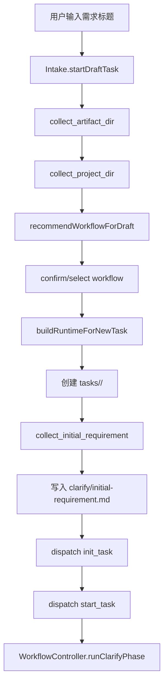

这张图对应的核心变化是：  
`Intake` 不再在 workflow 一确认后立刻开跑，而是先 bootstrap 一个“已建 task、未正式执行”的中间态。

关键代码：

- `startDraftTask()`：`src/default-workflow/intake/agent.ts`
- `bootstrapRuntimeForInitialRequirement()`：`src/default-workflow/intake/agent.ts`
- `collectInitialRequirement()`：`src/default-workflow/intake/agent.ts`
- `buildRuntimeForNewTask()`：`src/default-workflow/runtime/builder.ts`
- `runClarifyPhase()`：`src/default-workflow/workflow/controller.ts`

---

## 2. Intake 状态机：从单段 description 改成两段式输入

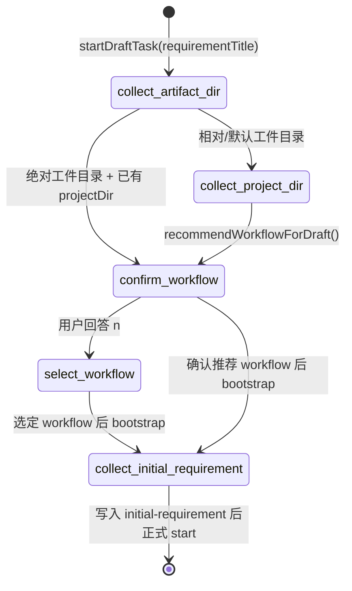

`PendingStep` 现在不再有 `collect_description`，改成了 `collect_initial_requirement`。  
对应 `DraftTask` 也不再保存 `description / initialDescriptionHint`，而是显式拆成：

- `requirementTitle`
- `initialRequirementInput`
- `initialRequirementInputKind`

代码位置：

- `PendingStep`：`src/default-workflow/intake/agent.ts`
- `DraftTask`：`src/default-workflow/intake/agent.ts`

这一步的真实意义是把“标题”和“初始需求正文/PRD 路径”从数据结构上拆开，而不是只改提示词。

---

## 3. Workflow 推荐为什么前移到详细描述之前

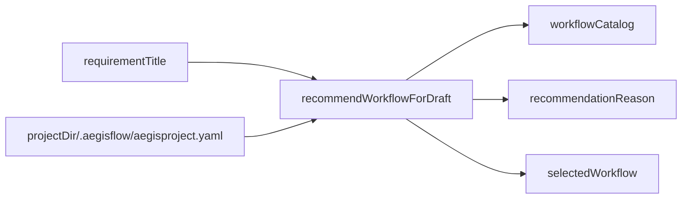

`recommendWorkflowForDraft()` 现在基于 `this.draft.requirementTitle` 做推荐，而不是基于完整描述。  
这样用户在第二轮输入前就能拿到稳定 `taskId` 和 task 目录。

关键代码：

- `recommendWorkflowForDraft()`：`src/default-workflow/intake/agent.ts`
- `recommendProjectWorkflow()`：`src/default-workflow/intake/agent.ts`

---

## 4. Bootstrap Runtime：为什么 task 目录能提前出现

```mermaid
flowchart TD
    A[buildRuntimeForNewTask] --> B[validateRuntimeInput]
    B --> C[createTaskTitle(requirementTitle)]
    C --> D[createNextTaskId]
    D --> E[artifactManager.initializeTask]
    E --> F[saveTaskContext]
    F --> G[saveTaskState]
    G --> H[返回 runtime + persistedContext]
```

这里有两个关键点：

1. `createTaskTitle(...)` 现在取 `requirementTitle`，保证 taskId 不受第二轮输入影响。
2. `PersistedTaskContext` 增加了 `awaitingInitialRequirement`，用来表达“task 已建好，但还不能 start”。

新增/调整的数据字段：

- `requirementTitle`
- `initialRequirementInput`
- `initialRequirementInputKind`
- `awaitingInitialRequirement`

代码位置：

- `BuildNewRuntimeInput`：`src/default-workflow/runtime/builder.ts`
- `PersistedTaskContext`：`src/default-workflow/shared/types.ts`
- `buildRuntimeForNewTask()`：`src/default-workflow/runtime/builder.ts`

---

## 5. 持久化语义：bootstrap 态如何落盘

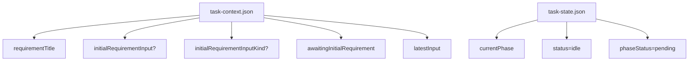

bootstrap 完成但未正式启动时，磁盘上已经有：

- `tasks/<taskId>/runtime/task-context.json`
- `tasks/<taskId>/runtime/task-state.json`
- `tasks/<taskId>/artifacts/`

但此时还没有正式 workflow 执行产物，`awaitingInitialRequirement=true`。  
这就是恢复链路能识别“继续补初始需求”，而不是直接恢复运行的原因。

关键代码：

- `buildRuntimeForNewTask()`：`src/default-workflow/runtime/builder.ts`
- `resumeTask()`：`src/default-workflow/intake/agent.ts`
- `restoreDraftFromPersistedContext()`：`src/default-workflow/intake/agent.ts`

---

## 6. 第二轮输入：initial-requirement 的真正写入点

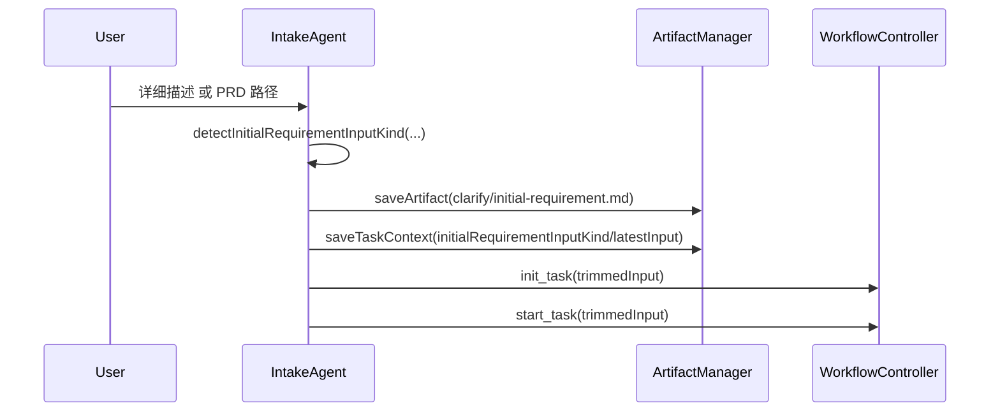

`collectInitialRequirement()` 做了三件事：

1. 判定输入类型
2. 先写 `clarify/initial-requirement.md`
3. 再发送 `init_task` 和 `start_task`

这里的关键收敛是：

- `start_task` 不再传空字符串，而是传第二轮真实输入
- `latestInput` 会保持为初始需求输入，不会被后续空消息冲掉

代码位置：

- `collectInitialRequirement()`：`src/default-workflow/intake/agent.ts`

---

## 7. PRD 路径识别：为什么现在改成“显式路径 or 已存在文件”

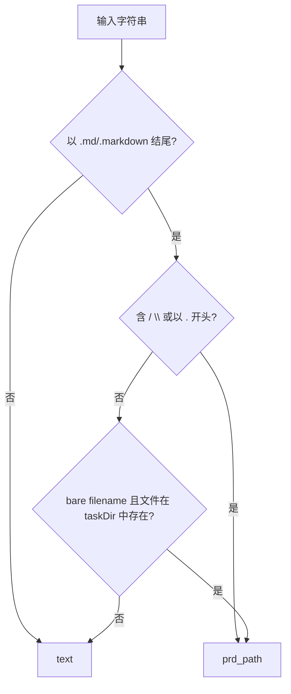

当前判定逻辑的目的，是同时满足两件事：

- 允许 `tasks/task_x/docs/input-prd.md`、`./prd.md`
- 允许 `需求说明 (最终).md`、`input prd.md` 这类 bare filename
- 但不把“把默认导出文件名改成 report.md”这种自然语言句子误判成路径

因此现在的策略是：

- 显式路径形态：直接判为 `prd_path`
- 仅文件名形态：必须是 markdown 文件名，而且该文件已真实存在于当前 `taskDir`

代码位置：

- `detectInitialRequirementInputKind()`：`src/default-workflow/intake/agent.ts`
- `isBareMarkdownFilename()`：`src/default-workflow/intake/agent.ts`

---

## 8. `initial-requirement.md` 的内容语义

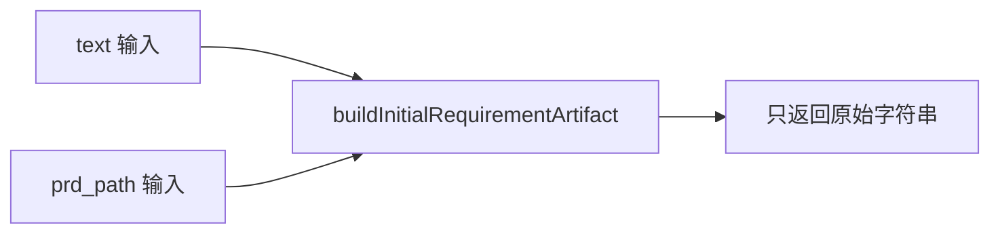

`buildInitialRequirementArtifact(...)` 现在不再包：

- `# Initial Requirement`
- `## Input Type`
- `## PRD Path`

而是直接返回原始输入字符串。

这样满足两条约束：

1. PRD 路径场景下，文件里只记录路径本身
2. 角色层读取工件时拿到的就是最原始输入，不被包装文案干扰

代码位置：

- `buildInitialRequirementArtifact()`：`src/default-workflow/workflow/clarify-artifacts.ts`

---

## 9. Clarify 职责边界：为什么不再补写 initial-requirement

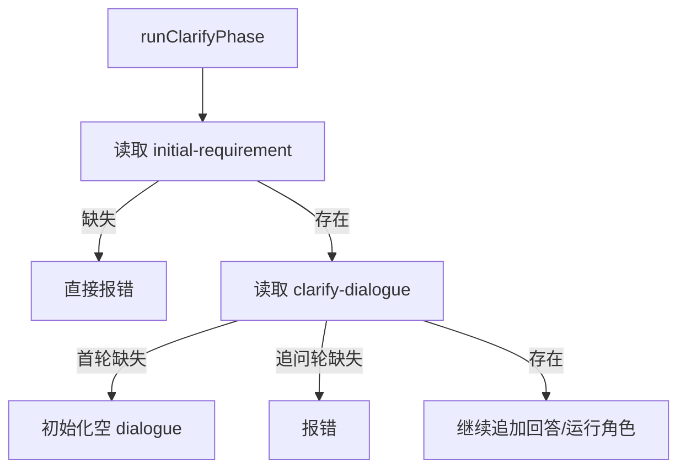

这里收紧了两个边界：

- `Clarify` 缺失 `initial-requirement` 时直接失败，不再兜底补写
- `clarify-dialogue` 只允许在首轮 Clarify 自动创建；如果已经进入 `clarify_waiting_user_answer` 恢复路径却缺失，则视为工件损坏

`resumeInputCurrentStep` 的作用，就是区分：

- 首轮 Clarify 的普通输入
- 真正的“追问后恢复”输入

代码位置：

- `runClarifyPhase()`：`src/default-workflow/workflow/controller.ts`
- `resumeInternal()`：`src/default-workflow/workflow/controller.ts`

---

## 10. 角色上下文：输入类型差异如何传到角色层

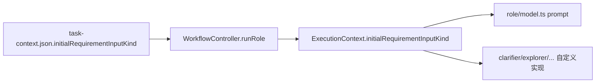

这次没有把完整 `PersistedTaskContext` 暴露给角色。  
角色仍然只拿最小上下文，但新增了一个只读字段：

- `initialRequirementInputKind?: "text" | "prd_path"`

这样既保持边界不失控，又能让 Clarify 角色知道当前 `initial-requirement` 是：

- 普通详细描述
- PRD 路径

代码位置：

- `ExecutionContext`：`src/default-workflow/shared/types.ts`
- `runRole()`：`src/default-workflow/workflow/controller.ts`
- `buildRoleExecutionPrompt()`：`src/default-workflow/role/model.ts`

---

## 11. 恢复链路：bootstrap 态和运行态怎么分流

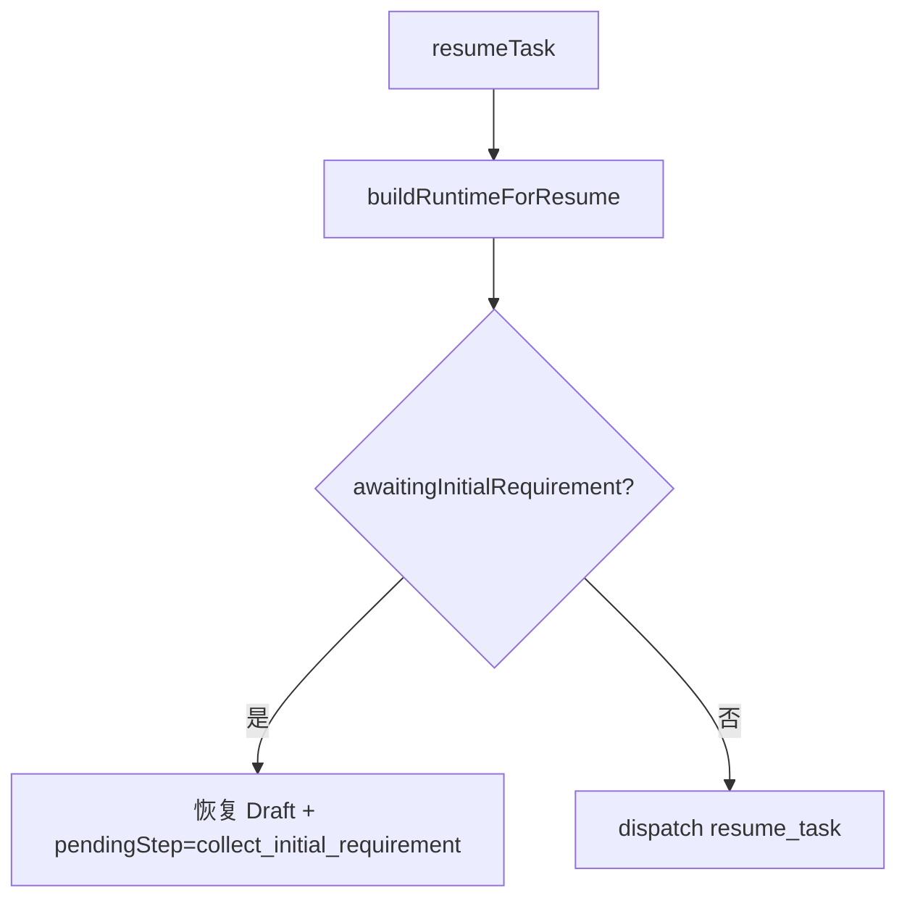

这部分是本次改动真正容易漏掉的点。  
如果没有 `awaitingInitialRequirement`，CLI 重启后只能二选一：

- 把任务当成未创建
- 或错误地当成可直接 resume 的运行态

现在恢复时会先看持久化上下文：

- `true`：继续收第二轮输入
- `false`：走原有 Runtime 恢复

代码位置：

- `resumeTask()`：`src/default-workflow/intake/agent.ts`
- `buildRuntimeForResume()`：`src/default-workflow/runtime/builder.ts`

---

## 12. 测试怎么锁住这套语义

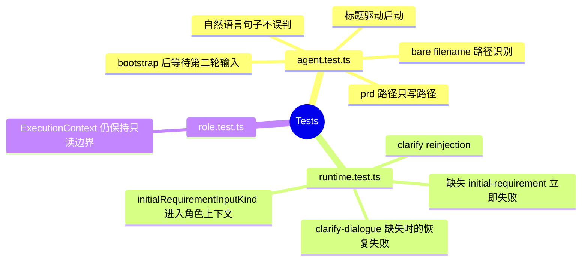

重点测试点：

- `src/default-workflow/testing/agent.test.ts`
  - 第二轮输入前 task 目录已存在
  - `initial-requirement.md` 只写 PRD 路径
  - `input-prd.md`
  - `需求说明 (最终).md`
  - 自然语言句子误判保护
- `src/default-workflow/testing/runtime.test.ts`
  - Clarify 缺少 `initial-requirement` 直接失败
  - `initialRequirementInputKind` 会进入 Clarify 角色上下文
- `src/default-workflow/testing/role.test.ts`
  - 角色看不到 `latestInput`
  - 角色上下文仍然是只读、最小暴露

---

## 13. 代码阅读顺序建议

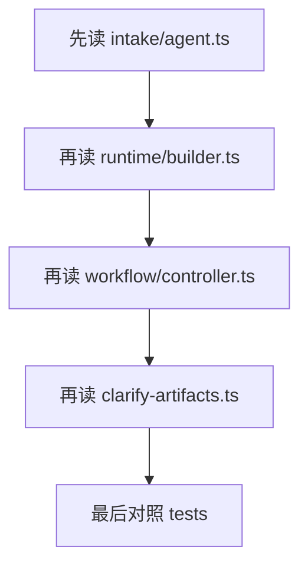

推荐顺序：

1. [agent.ts](/Users/aaron/code/Aegisflow/src/default-workflow/intake/agent.ts)
2. [builder.ts](/Users/aaron/code/Aegisflow/src/default-workflow/runtime/builder.ts)
3. [controller.ts](/Users/aaron/code/Aegisflow/src/default-workflow/workflow/controller.ts)
4. [clarify-artifacts.ts](/Users/aaron/code/Aegisflow/src/default-workflow/workflow/clarify-artifacts.ts)
5. [agent.test.ts](/Users/aaron/code/Aegisflow/src/default-workflow/testing/agent.test.ts)
6. [runtime.test.ts](/Users/aaron/code/Aegisflow/src/default-workflow/testing/runtime.test.ts)

这样读最容易把“入口交互 -> bootstrap 落盘 -> workflow 消费 -> 回归保护”串起来。

---

## 14. 最后总结

这次改动不是简单的 Intake 文案调整，而是把启动链路拆成了两个明确阶段：

- 第一阶段：标题、目录、workflow、bootstrap task
- 第二阶段：详细描述 / PRD 路径、预写入 `initial-requirement`、正式启动 workflow

对应到代码层，真正关键的收敛点有 6 个：

- `DraftTask` 从单字段需求草稿改成双阶段字段
- workflow 推荐输入从 `description` 改成 `requirementTitle`
- Runtime 允许 bootstrap 态落盘
- `initial-requirement.md` 前移到 Intake 写入
- Clarify 不再兜底补写 `initial-requirement`
- 输入类型差异通过 `initialRequirementInputKind` 进入角色上下文

如果后续要继续扩展这条链路，最需要小心的仍然是两件事：

- 不要让 `taskId` 在 bootstrap 后变化
- 不要让 Clarify 再次偷偷承担 Intake 的前置职责
