# default-workflow intake layer 关键代码图解

## 文档目的

本文聚焦“代码怎么走”，尽量用多张小型 mermaid 图，以“整体 -> 局部 -> 关键点”的方式解释当前 `default-workflow` Intake 层实现。

核心对应文件：

- `src/cli/index.ts`
- `src/default-workflow/intake/agent.ts`
- `src/default-workflow/runtime/builder.ts`
- `src/default-workflow/workflow/controller.ts`
- `src/default-workflow/persistence/task-store.ts`

---

## 1. 整体图：入口到运行时的总链路

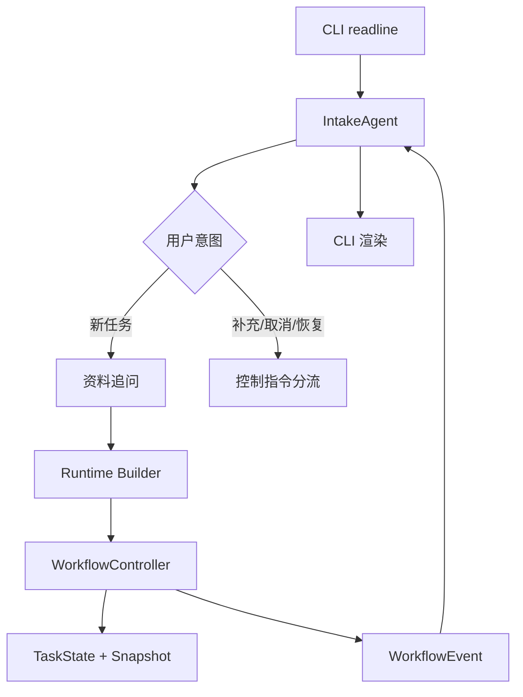

这一层只看模块关系，不看内部细节。  
重点是：

- CLI 只做输入输出
- `IntakeAgent` 负责入口交互和轻决策
- `Runtime Builder` 负责装配运行对象
- `WorkflowController` 负责推进 `TaskState`

---

## 2. 整体图：文件职责划分

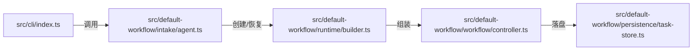

这张图只回答一个问题：逻辑分别放在哪个文件里。

- `src/cli/index.ts`：终端壳层
- `src/default-workflow/intake/agent.ts`：入口协调中心
- `src/default-workflow/runtime/builder.ts`：Runtime 装配
- `src/default-workflow/workflow/controller.ts`：状态推进
- `src/default-workflow/persistence/task-store.ts`：快照与上下文持久化

---

## 3. 局部图：CLI 为什么保持很薄

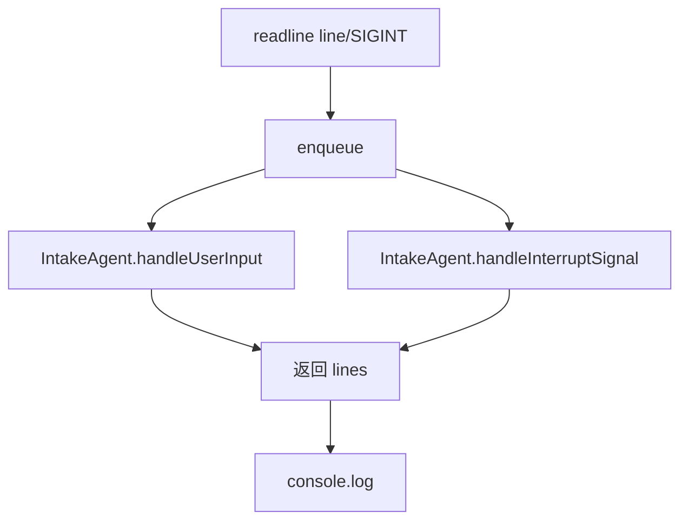

文件：

- `src/cli/index.ts`

这里刻意不放业务状态判断。  
CLI 只负责：

- 接收一行输入
- 串行排队，避免并发交互混乱
- 把输入交给 `IntakeAgent`
- 把结果打印出来

这样后续即使把 CLI 换成别的入口，核心逻辑也还能保留在 `IntakeAgent`。

---

## 4. 局部图：`IntakeAgent.handleUserInput()` 总分流

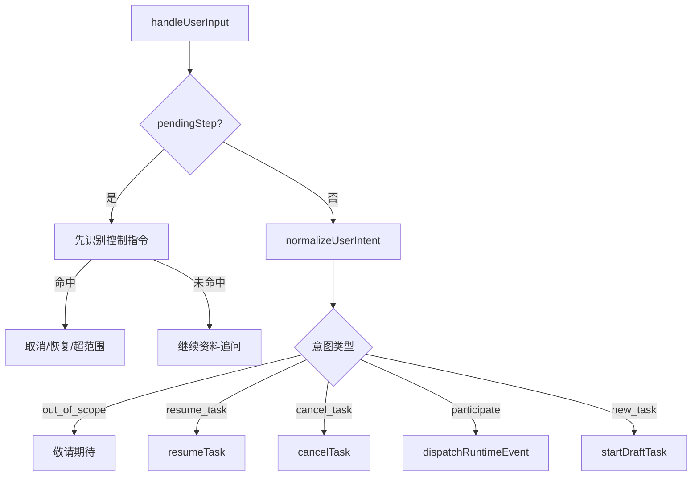

文件：

- `src/default-workflow/intake/agent.ts`

这是最关键的入口分流图。  
这里有两个特别重要的设计点：

1. `pendingStep` 阶段仍然先识别控制指令
2. 只有在不追问资料时，才走统一意图归一化

第 1 点是 review 修复后的关键逻辑，用来避免把“取消任务”误当成项目目录或工件目录。

---

## 5. 局部图：新任务创建的追问状态机

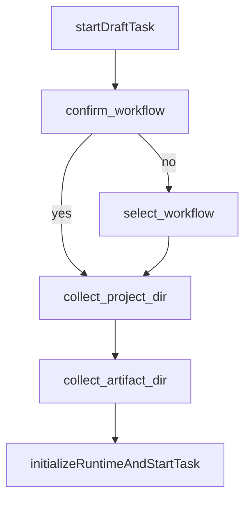

文件：

- `src/default-workflow/intake/agent.ts`

这里不是完整 workflow 状态机，只是 Intake 自己的追问状态。

这样拆开的目的：

- 每一步只采一类资料
- 容易知道当前 CLI 在问什么
- 出错时可以阻断在本步，不污染后续 Runtime

当前 Intake 只追问这几类最小资料：

- workflow 类型确认
- 目标项目目录
- 工件保存目录

---

## 6. 关键图：追问阶段为什么要先识别控制指令

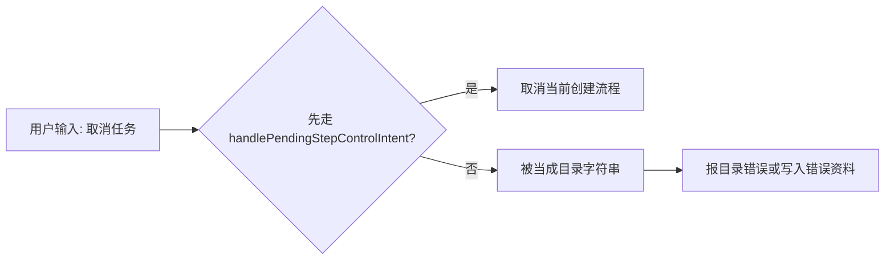

文件：

- `src/default-workflow/intake/agent.ts`

这是本轮修复里最关键的一处。  
如果没有这层优先分流，以下输入都会出错：

- `取消任务`
- `恢复任务`
- 明显超范围的越权请求

所以现在 `pendingStep` 不是“只收资料”，而是“先识别控制指令，识别不到再收资料”。

---

## 7. 局部图：新任务初始化链路

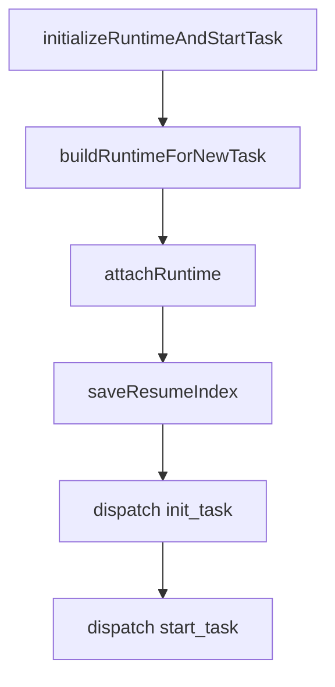

文件：

- `src/default-workflow/intake/agent.ts`

这一段是“Intake 负责初始化 Runtime”的真正落地点。

注意这里的顺序：

1. 先创建 Runtime
2. 再绑定事件监听
3. 再保存最近恢复索引
4. 再发 `init_task`
5. 再发 `start_task`

不能反过来，否则事件还没监听就发出去，CLI 就看不到初始化回显。

---

## 8. 局部图：`Runtime Builder` 的装配顺序

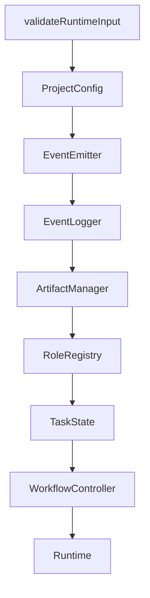

文件：

- `src/default-workflow/runtime/builder.ts`

这张图对应计划文档里要求的初始化顺序。  
这里刻意把 `Runtime` 装配独立出去，是为了让：

- `IntakeAgent` 负责问和转发
- builder 负责创建运行对象

而不是让入口类自己一边问问题一边 new 一堆依赖。

---

## 9. 中层图：恢复链路的整体结构

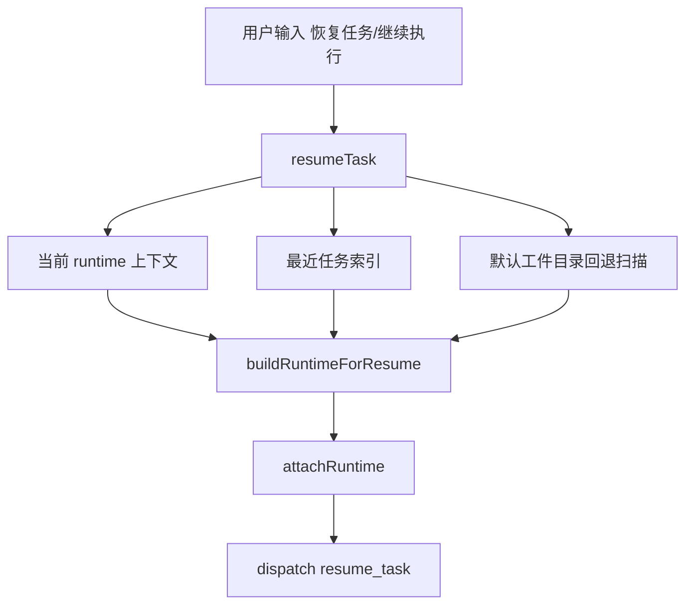

文件：

- `src/default-workflow/intake/agent.ts`
- `src/default-workflow/runtime/builder.ts`

这是恢复路径的总图。  
核心原则是：

- 优先恢复“最明确知道的那条任务”
- 实在没有，再回退到默认目录扫描

这样才能尽量避免恢复错任务。

---

## 10. 关键图：为什么要单独存“最近任务索引”

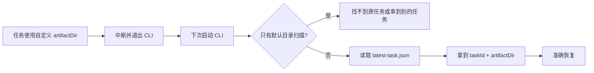

文件：

- `src/default-workflow/intake/agent.ts`

这张图是 review 里最高优先级 bug 的根因图。  
之前的问题是：恢复只会扫默认 `.aegisflow/artifacts`，不知道用户上次实际把工件放到了哪里。

现在额外在当前 CLI 工作目录下维护：

- `.aegisflow/latest-task.json`

它至少记录：

- `taskId`
- `artifactDir`
- `updatedAt`

这样 CLI 重启后仍然知道该去哪个工件目录找那条任务。

---

## 11. 局部图：`buildRuntimeForResume()` 为什么必须重建

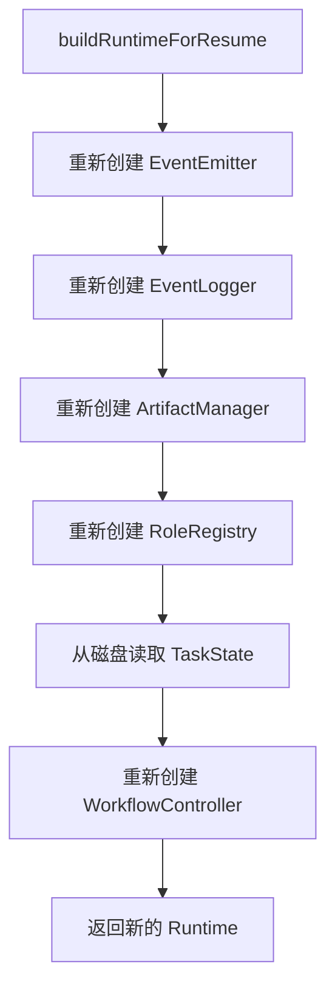

文件：

- `src/default-workflow/runtime/builder.ts`

这里不是“恢复旧 Runtime”，而是“重建新 Runtime”。  
这么做是为了满足项目约束：

- Runtime 只存在内存
- 恢复时必须重新创建

它解决的问题是：

- 旧监听器残留
- 旧内存状态污染
- 恢复依赖旧进程还活着

---

## 12. 局部图：`WorkflowController` 的事件推进逻辑

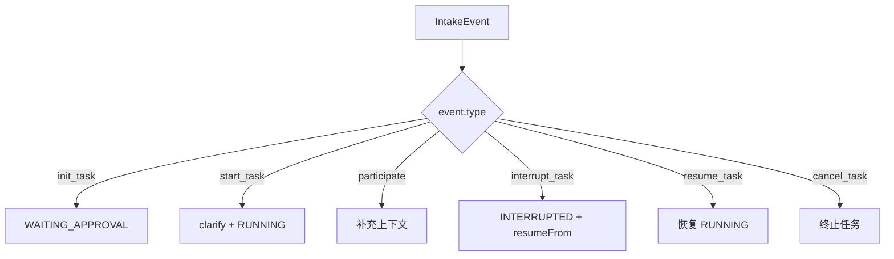

文件：

- `src/default-workflow/workflow/controller.ts`

这张图只看“收到什么事件，就把任务推进到哪里”。  
重点不是 phase 细节，而是职责边界：

- `IntakeAgent` 不直接改 `TaskState`
- `WorkflowController` 才是唯一推进者

这条边界是当前实现最重要的架构约束之一。

---

## 13. 关键图：每次事件后为什么都要落盘

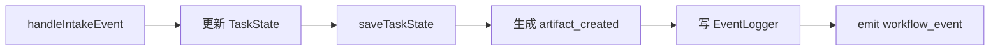

文件：

- `src/default-workflow/workflow/controller.ts`
- `src/default-workflow/persistence/task-store.ts`

这张图解释的是“状态推进之后还做了什么”。

每次事件后都保存快照，是因为恢复能力要求很硬：

- `Ctrl+C` 中断后必须能恢复
- 恢复不能依赖旧内存

所以当前策略不是“任务结束时统一保存”，而是“每次关键事件都刷新快照”。

---

## 14. 局部图：CLI 事件渲染链

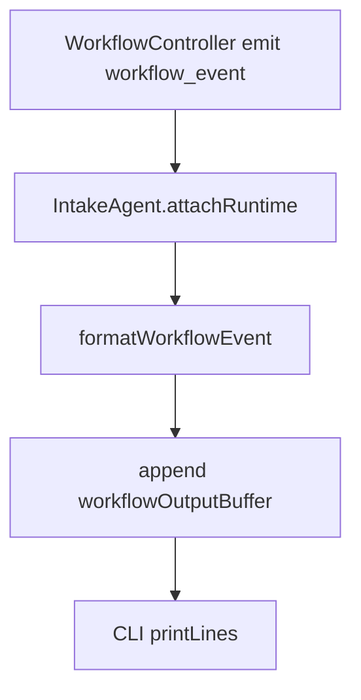

文件：

- `src/default-workflow/intake/agent.ts`
- `src/cli/index.ts`

当前展示内容包括：

- `WorkflowEvent.type`
- `taskId`
- `timestamp`
- `message`
- `metadata`
- `TaskState` 摘要

之所以展示得比较全，是因为当前阶段的目标不是做精简 UI，而是先保证 CLI 可观测性和可验收性。

---

## 15. 局部图：超范围请求为什么在入口层拦截

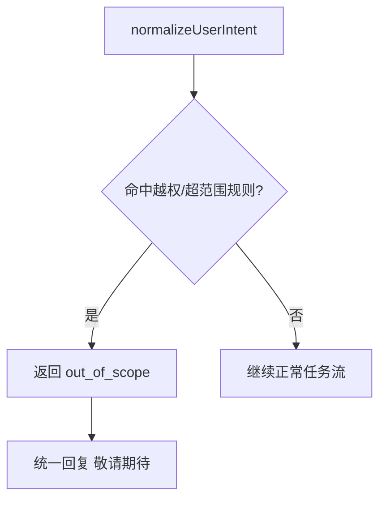

文件：

- `src/default-workflow/intake/intent.ts`
- `src/default-workflow/shared/constants.ts`

这层拦截的目的是保护 Intake 边界。  
比如下面这些都不该继续往下走：

- 跳过 Clarify 直接 Build
- 帮我编排 workflow / phase
- Archive / Architect / Web UI 之类超范围诉求

如果不在入口层拦住，用户会误以为 Intake 有权决定下游 phase 编排。

---

## 16. 整体图：当前测试分层

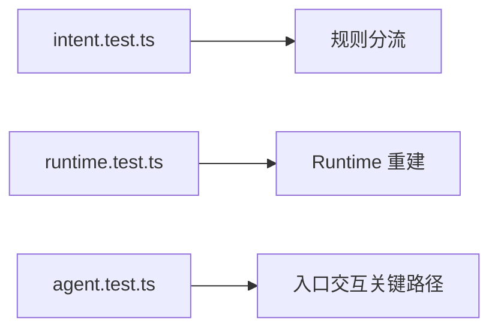

当前测试分层不是按技术栈拆，而是按风险点拆：

- `intent.test.ts`：先守住规则归一化
- `runtime.test.ts`：守住恢复语义
- `agent.test.ts`：守住 Intake 层最关键交互

这样回归时更容易快速定位问题在哪一层。

---

## 17. 最后一张图：当前实现边界

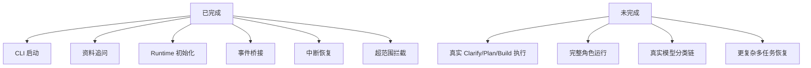

这张图是为了防止误解当前交付物范围。  
本次交付已经是“可运行的 Intake 成品”，但还不是“完整 workflow 引擎”。
