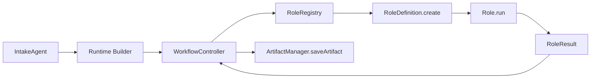
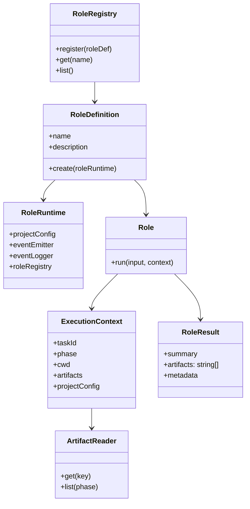
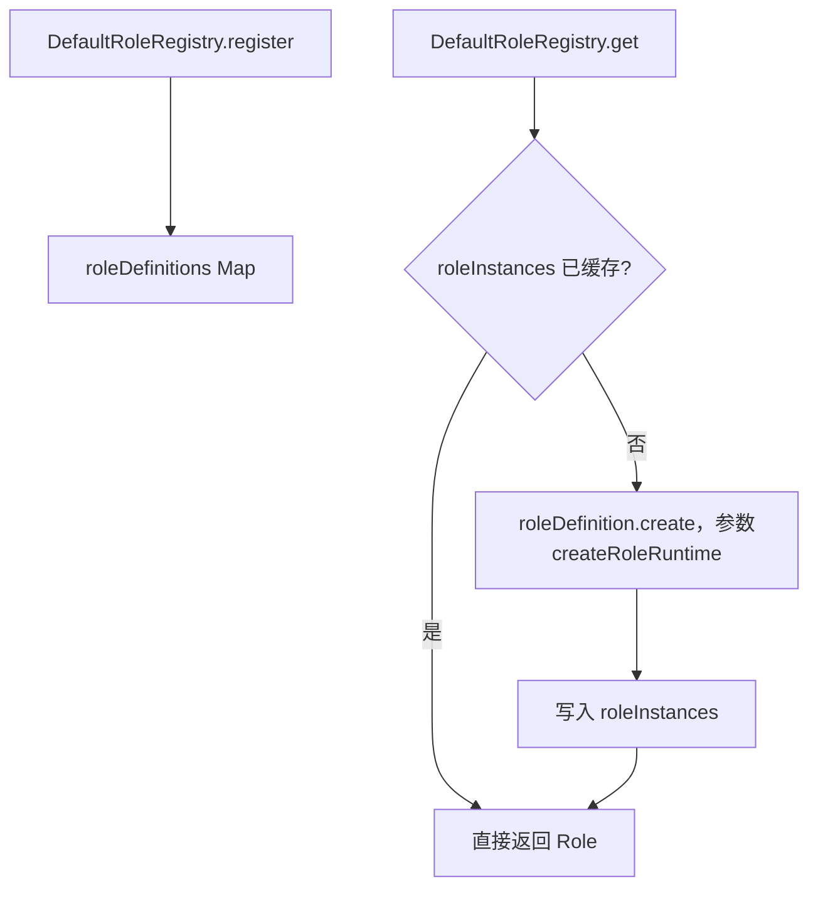
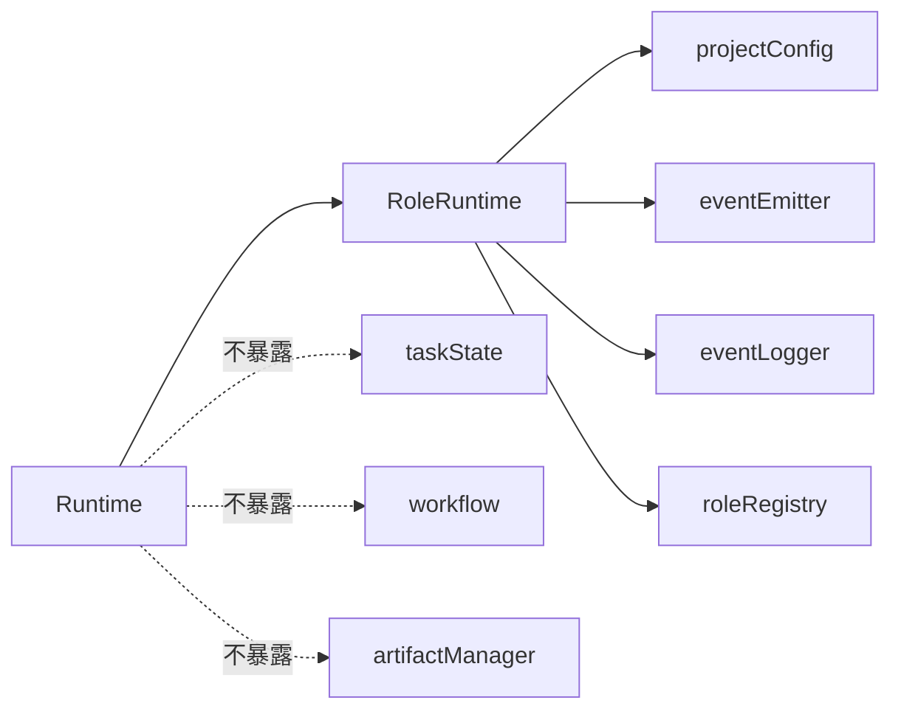
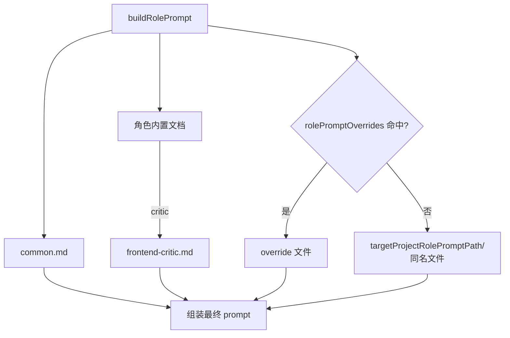
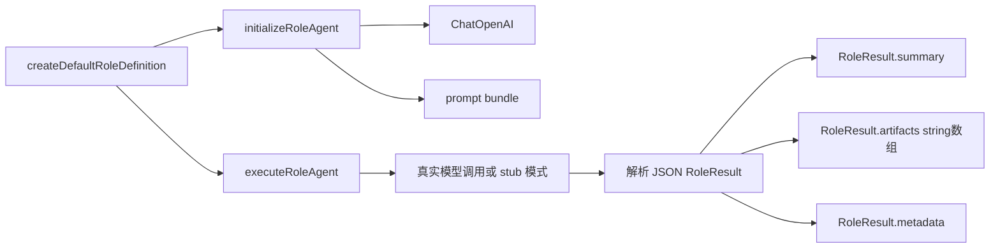
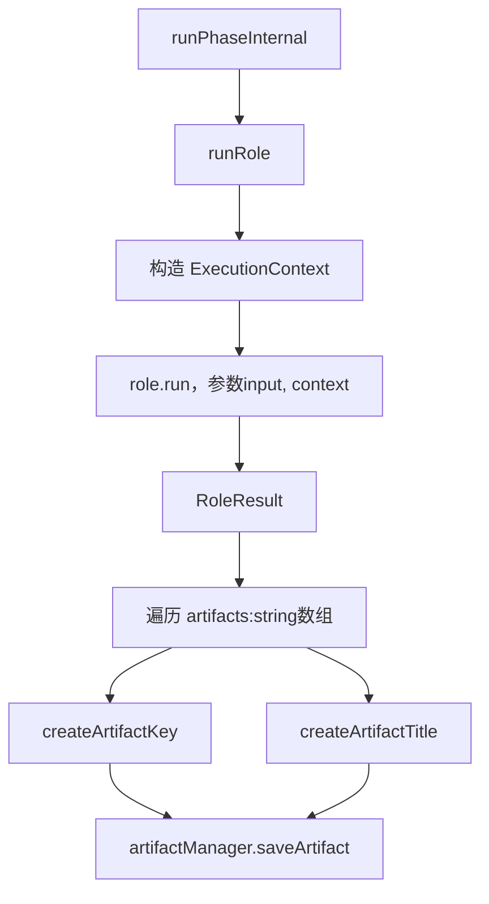
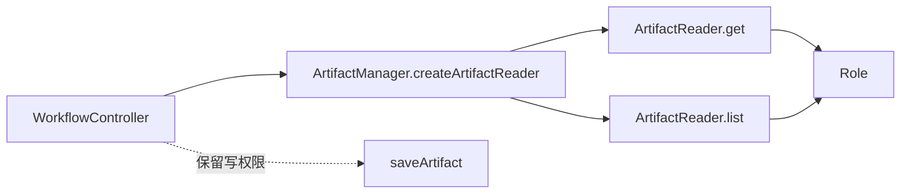
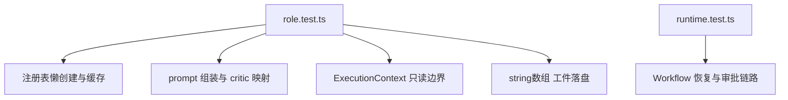
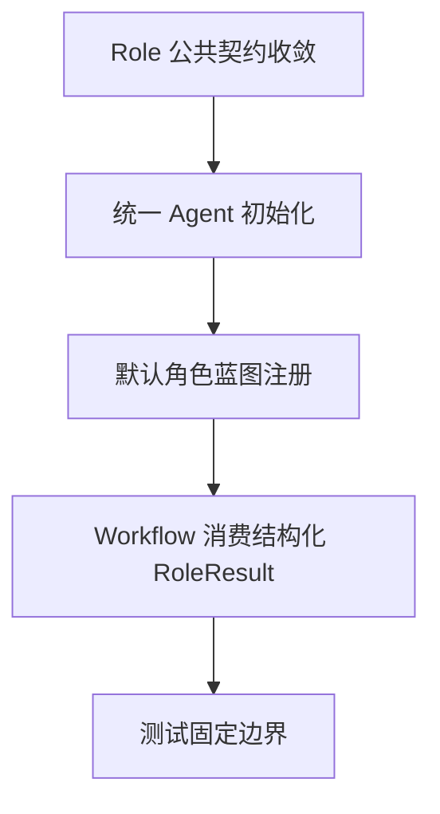

# default-workflow role layer 关键代码图解

## 文档目的

本文聚焦本次 `role layer` 相对于既有 intake / workflow 主链路新增了什么，尽量使用“整体 -> 局部 -> 关键点”的多张小型 mermaid 图，把关键类、关键函数和代码边界对应起来。

核心对应文件：

- `src/default-workflow/shared/types.ts`
- `src/default-workflow/shared/utils.ts`
- `src/default-workflow/persistence/task-store.ts`
- `src/default-workflow/role/config.ts`
- `src/default-workflow/role/prompts.ts`
- `src/default-workflow/role/model.ts`
- `src/default-workflow/runtime/dependencies.ts`
- `src/default-workflow/runtime/builder.ts`
- `src/default-workflow/workflow/controller.ts`
- `src/default-workflow/testing/role.test.ts`

---

## 1. 整体图：相对于 intake-layer 新增了哪条链路

`intake-layer` 文档主要解释的是“怎么把任务拉起来”；本次新增的重点是中间这条 `Workflow -> RoleRegistry -> Role -> RoleResult` 的稳定执行链路。

关键代码对应：

- `Runtime Builder`：`buildRuntimeForNewTask()`、`buildRuntimeForResume()`
- `WorkflowController`：`DefaultWorkflowController.runRole()`、`DefaultWorkflowController.runPhaseInternal()`
- `RoleRegistry`：`DefaultRoleRegistry`
- `RoleDefinition.create`：`RoleDefinition.create(roleRuntime)`
- `Role.run`：`Role.run(input, context)`
- `RoleResult`：`RoleResult.summary`、`RoleResult.artifacts`、`RoleResult.metadata`
- `ArtifactManager.saveArtifact`：`FileArtifactManager.saveArtifact()`

---

## 2. 整体图：本次新增的公共契约

这张图对应的是本期最重要的“公共接口收敛”。

相对于之前的实现，新增或收敛了这些点：

- `RoleRegistry` 不再只存静态角色对象，而是显式支持 `register(roleDef)`
- `RoleDefinition` 成为角色蓝图
- `RoleRuntime` 成为 `RoleDefinition.create(...)` 的受限运行时输入
- `ExecutionContext` 只保留最小公共字段，不再暴露 `taskState`、`latestInput`
- `ExecutionContext.artifacts` 从完整 `ArtifactManager` 收敛为只读 `ArtifactReader`
- `RoleResult.artifacts` 从 richer artifact object 收敛为 `string[]`

关键代码对应：

- 类型定义：`src/default-workflow/shared/types.ts`
- 配置装配：`createProjectConfig()`，位于 `src/default-workflow/shared/utils.ts`
- 只读工件实现：`FileArtifactManager.createArtifactReader()`，位于 `src/default-workflow/persistence/task-store.ts`

---

## 3. 局部图：`RoleRegistry` 从“存实例”改为“存蓝图 + 懒创建”

这里解决的是“角色蓝图”和“角色实例”混在一起的问题。

关键代码对应：

- `class DefaultRoleRegistry`
- `DefaultRoleRegistry.register()`
- `DefaultRoleRegistry.get()`
- `DefaultRoleRegistry.list()`
- `DefaultRoleRegistry.createRoleRuntime()`
- `createDefaultRoleDefinitions()`
- `createDefaultRoleDefinition()`

这层的关键约束：

- 注册表存的是 `RoleDefinition`
- 同一 `Runtime` 内同名角色只初始化一次
- `WorkflowController` 不直接 new 角色，只能通过注册表取角色

---

## 4. 局部图：`RoleRuntime` 为什么是受限视图

这张图只回答一个问题：角色初始化时能看到什么，不能看到什么。

关键代码对应：

- `RoleRuntime` 类型：`src/default-workflow/shared/types.ts`
- `DefaultRoleRegistry.createRoleRuntime()`：`src/default-workflow/runtime/dependencies.ts`
- `buildRuntimeForNewTask()`、`buildRuntimeForResume()`：`src/default-workflow/runtime/builder.ts`

这也是本次修复 review 风险的核心点之一：

- `RoleDefinition.create(roleRuntime)` 不再接收完整 `Runtime`
- 初始化阶段拿不到 `taskState`
- 初始化阶段拿不到 `workflow`
- 初始化阶段拿不到完整 `ArtifactManager`

---

## 5. 局部图：角色 prompt 的组装链路

这里对应的是“角色职责来源怎么拼起来”。

关键代码对应：

- `buildRolePrompt()`
- `resolveProjectRolePromptFilePath()`
- `BUILTIN_ROLE_FILE_MAP`
- `resolveRoleModelConfig()`
- `initializeRoleAgent()`

本次新增的关键点：

- 内置公共角色约束来自 `roleflow/context/roles/common.md`
- `critic` 显式映射到 `frontend-critic.md`
- 项目侧角色提示词来自 `ProjectConfig.targetProjectRolePromptPath`
- 若 `projectConfig.rolePromptOverrides[roleName]` 存在，则 override 文件优先
- 内置角色文档路径改为相对模块解析，不再依赖 `process.cwd()`

---

## 6. 局部图：默认角色是怎么接入统一 Agent 基座的

当前这一层已经不是单纯占位执行器，而是统一的 Agent 执行链：

- 默认模式真实调用 `ChatOpenAI.invoke(...)`
- 离线测试模式通过 `AEGISFLOW_ROLE_EXECUTION_MODE=stub` 走本地 stub
- 两种模式都统一收敛到结构化 `RoleResult`

关键代码对应：

- `createDefaultRoleDefinitions()`
- `createDefaultRoleDefinition()`
- `initializeRoleAgent()`
- `executeRoleAgent()`
- `buildRoleExecutionPrompt()`
- `parseRoleResultPayload()`
- `buildStubRoleResult()`

这层已经固定的规则：

- 角色层统一用 `ChatOpenAI`
- 角色层初始化不传 `temperature`
- 默认角色执行时会显式消费 `prompt`、`ExecutionContext` 和角色能力画像
- 角色返回结果统一是结构化 `RoleResult`
- 工件内容只通过 `RoleResult.artifacts: string[]` 往外返回

---

## 7. 局部图：`WorkflowController` 怎样消费新的 `RoleResult`

这是本次 role-layer 对 workflow 边界最直接的改动点。

关键代码对应：

- `DefaultWorkflowController.runRole()`
- `DefaultWorkflowController.runPhaseInternal()`
- `createArtifactKey()`
- `createArtifactTitle()`
- `FileArtifactManager.saveArtifact()`

这里明确了两层职责：

- `Role` 只返回工件内容字符串
- 工件命名、落盘路径、事件发射仍由 `WorkflowController` 决定

---

## 8. 局部图：`ExecutionContext.artifacts` 为什么必须只读

这张图对应的是“角色能看历史工件，但不能控制工件生命周期”。

关键代码对应：

- `ArtifactReader`
- `FileArtifactManager.createArtifactReader()`
- `listArtifactKeysFromRoot()`
- `readArtifactByKey()`

相对于旧实现，新增的边界是：

- `Role` 仍可读历史工件
- `Role` 不能写工件
- `Role` 不能删工件
- `Role` 不能决定工件落盘路径

---

## 9. 局部图：自动化测试如何覆盖这些边界

关键测试对应：

- `src/default-workflow/testing/role.test.ts`
  - `lazily creates and caches role instances with limited RoleRuntime`
  - `registers the full v0.1 default role definition set`
  - `builds critic prompts from builtin docs and project override files`
  - `passes read-only ExecutionContext into roles and persists string artifacts`
- `src/default-workflow/testing/runtime.test.ts`
  - 回归验证 `WorkflowController` 与 role-layer 改动后的主链路仍然可运行

---

## 10. 最终收敛点

最终新增内容，可以压缩成四句话：

- 新增了 `RoleDefinition / RoleRuntime / ArtifactReader` 三个关键契约
- `RoleRegistry` 改成了“注册蓝图、懒建实例”的工厂结构
- `WorkflowController` 改为消费 `RoleResult.artifacts: string[]` 并统一落盘
- 新增了 role-layer 单测，固定 prompt、上下文、工件和实例化边界
