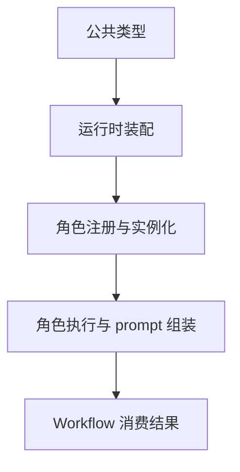
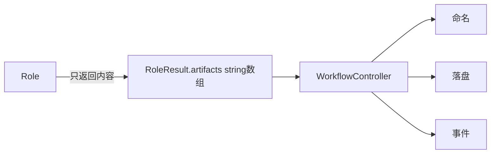
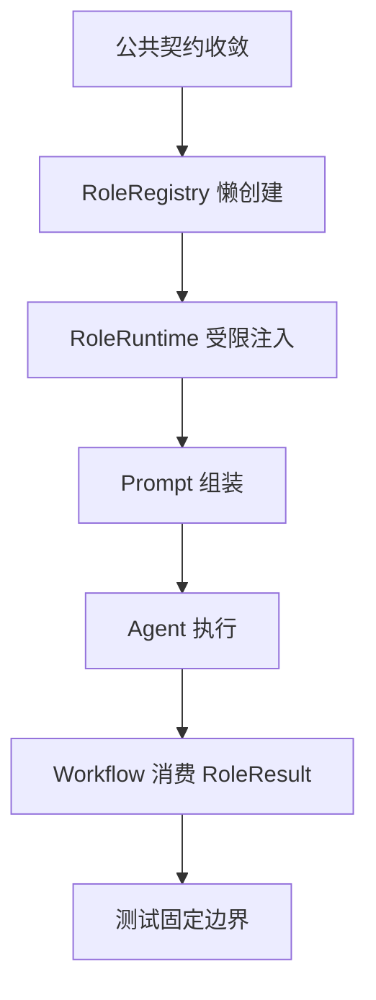

# default-workflow role layer 思路回溯

## 文档说明

本文不是逐字还原当时的内部思维流，而是基于当前代码、计划文档、修复轨迹和测试补丁，重建一份可验证、可复用的“设计推演记录”。

目标是回答四个问题：

1. 当时为什么先这样拆问题
2. 为什么做了这些接口收敛
3. review 指出问题后，是怎么继续修的
4. 如果以后还要继续扩展 role layer，应该沿着什么方向接着做

---

## 1. 最初的理解

当时对 `role layer` 的判断，不是“新增几个角色对象”这么简单，而是一次边界重构。

核心原因有三个：

- 现有 `WorkflowController` 已经能跑 phase，但 `Role` 还只是非常松散的占位对象
- 计划文档明确要求把 `RoleRegistry / RoleDefinition / RoleRuntime / ExecutionContext / RoleResult` 收敛成公共契约
- 后续 `builder / critic / tester / test-writer` 这类角色会越来越像真正的专职 Agent，如果公共边界现在不立住，后面只会越来越乱

所以一开始的判断是：

- 这次不能只补“角色列表”
- 必须先把“谁负责初始化、谁负责执行、谁负责落盘、谁能看到什么”这些边界写死

---

## 2. 第一轮拆解思路

第一轮拆解时，我把问题分成了 5 层。

对应的思考是：

- 先修公共类型，否则后面每改一层都要返工
- 再修 Runtime 装配，否则 `RoleDefinition.create(...)` 没法真正落地
- 再修 `RoleRegistry`
- 再接 prompt / Agent 初始化
- 最后让 `WorkflowController` 按新契约消费 `RoleResult`

这一步的关键判断是：

- `Workflow` 本身已经是主状态机，不应该继续把角色执行细节内联进去
- `Role` 不应该直接接触 `ArtifactManager`
- `Role` 也不应该看到 `taskState` / `workflow`

---

## 3. 为什么先收敛契约，而不是先写真实 Agent

当时有一个很明确的取舍：

- 方案 A：先直接把角色全接成真实 LLM 调用
- 方案 B：先把公共契约、装配链路和落盘边界收敛，再补真实执行

我当时先走的是方案 B。

原因是：

- 如果 `ExecutionContext`、`RoleResult`、`RoleRegistry` 还不稳定，先接真实 Agent 只会把错误放大
- 计划文档里最刚性的部分，其实是“边界”，不是“提示词写多漂亮”
- 真正难的是跨层职责切分，不是 `ChatOpenAI` 那一行初始化代码

所以第一轮重点是：

- `RoleResult.artifacts` 改成 `string[]`
- `ExecutionContext.artifacts` 改成只读 `ArtifactReader`
- `RoleDefinition.create` 改收 `RoleRuntime`
- `RoleRegistry` 改成“注册蓝图、按需创建实例”

这是为什么第一轮实现看起来“壳先搭好了”，而默认执行逻辑最开始还只是占位实现。

---

## 4. 第一轮最重要的接口判断

### 4.1 `RoleDefinition` 必须存在

原因不是为了抽象而抽象，而是要把：

- “角色蓝图”
- “角色实例”
- “运行时依赖注入”

这三件事拆开。

如果只有 `Role`，那 `WorkflowController` 最后一定会开始自己拼角色依赖，边界马上就会塌。

### 4.2 `RoleRuntime` 必须是受限视图

这里最重要的判断是：

- 角色初始化阶段需要共享依赖
- 但绝不能把完整 `Runtime` 暴露出去

因为一旦把完整 `Runtime` 暴露出去，角色初始化就可能开始：

- 读 `taskState`
- 调 `workflow.run()`
- 拿完整 `ArtifactManager`

这会直接让 Role 层反向侵入 Workflow 层。

所以我当时坚持把 `RoleRuntime` 收得很小，只保留：

- `projectConfig`
- `eventEmitter`
- `eventLogger`
- `roleRegistry`

后面又进一步补了：

- `roleCapabilityProfiles`

但依然没有放出 `workflow`、`taskState`、`artifactManager`

### 4.3 `ExecutionContext.artifacts` 必须只读

这是另一个特别关键的边界。

因为角色可以：

- 看历史工件
- 基于历史工件继续推理

但不能：

- 自己决定工件路径
- 自己写工件
- 自己删工件

否则 `WorkflowController` 就不再是工件生命周期的唯一协调者。

---

## 5. 第一轮为什么把 `RoleResult.artifacts` 收敛成 `string[]`

这是一个非常明确的跨层收敛动作。

之前 richer artifact object 的问题在于：

- `Role` 既在“产出内容”
- 又在“决定文件命名和持久化语义”

这会把 Role 层和 Workflow 层绑死。

所以我当时的判断是：

- `Role` 只应该负责“给出可落盘内容”
- `Workflow` 负责“命名、分目录、落盘、发事件”

于是把 `RoleResult.artifacts` 收敛成了 `string[]`。

这一步虽然简单，但它其实决定了整个调用边界：

---

## 6. 第一轮对 prompt 组装的判断

最开始我对 prompt 的判断是：

- 角色原型和项目侧角色约束都必须参与组装
- `critic` 需要显式映射，因为原型文件名不是 `critic.md`
- 项目侧 override 要优先于同名默认文件

所以一开始做的是：

- 原型公共文档
- 原型角色文档
- 项目侧同名角色文件 / override 文件

后面 review 证明，这个判断还差一层：

- 项目侧 `common.md`

也就是：

- 我第一轮抓住了“角色原型 + 项目侧角色文档”
- 但漏掉了“项目侧公共实例层约束”

这就是后面第二轮修复里要补的点。

---

## 7. 第一次 review 后的判断变化

第一次 review 最重要的提醒是：

- 默认角色虽然初始化了 `ChatOpenAI`
- 但根本没有真正“执行”

这个问题一旦被指出，其实很明确：

- 契约层虽然搭好了
- 但执行语义还没闭环

所以第二轮我的判断变成：

- 不能再让默认角色只是“占位字符串生成器”
- 至少要有一条真正的统一 Agent 执行链

于是补了：

- `executeRoleAgent()`
- `llm.invoke(...)`
- 返回 JSON 协议
- 解析模型输出为结构化 `RoleResult`
- 失败时的 parse fallback

同时，我还做了一个很现实的工程取舍：

- 生产默认走 `agent`
- 测试允许走 `stub`

因为如果所有测试都真的打模型：

- 测试会变慢
- 会受外部网络影响
- 很难稳定跑 CI

所以最终引入了 `AEGISFLOW_ROLE_EXECUTION_MODE=stub`

这个决定的本质是：

- 让真实执行语义进入主链路
- 但不让测试体系被外部依赖拖垮

---

## 8. 为什么又补了 `RoleCapabilityProfile`

第二次重要 review 指出另一个问题：

- 虽然角色真的会跑了
- 但 `builder / tester / test-designer / test-writer` 这些允许副作用的角色，公共层没有显式能力画像

这时我的判断是：

- 不能只靠“角色名字不同”来表达差异
- 差异必须进入公共契约

所以补了 `RoleCapabilityProfile`。

它不是为了炫技，而是为了把这些差异显式化：

- 这是分析型角色，还是交付型角色，还是验证型角色
- 这个角色允许不允许副作用
- 这个角色当前聚焦什么
- 这个角色允许哪些动作

于是角色的公共边界从：

- 只有 `name + run`

变成了：

- `name + capabilityProfile + run`

对应地：

- `RoleRuntime` 能看到全量能力画像
- `ExecutionContext` 能看到当前角色自己的能力画像

这一步的价值在于：

- 后续如果要做工具权限映射，不用重新发明一套协议
- 角色差异不再只是文档描述，而是进入运行时数据结构

---

## 9. 为什么后面又改了项目侧 `critic.md`

后续 review 继续往前推进时，问题开始从“执行链”转移到了“配置和约束来源是否一致”。

我当时重新检查后，发现有两类漂移：

### 9.1 配置文件位置漂移

- 根目录有 `aegisproject.yaml`
- 但 review 要求和现有约束已经收敛到 `.aegisflow/aegisproject.yaml`

如果这时不改，后面真的接配置加载时，路径一定会继续打架。

所以我的处理是：

- 删除根目录 `aegisproject.yaml`
- 改成 `.aegisflow/aegisproject.yaml`

### 9.2 `critic` 项目侧文件名漂移

这一步的关键判断是：

- 原型层已统一为 `critic.md`
- 项目侧实例层也应继续保持 `critic.md`

因为项目侧按 role name 同名读取更稳定。

所以我最终收敛成：

- 原型层：`/Users/aaron/code/roleflow/roles/critic.md`
- 项目侧实例层：`.aegisflow/roles/critic.md`
- 源文档层：`roleflow/context/roles/critic.md`

也就是说：

- 保留原型层历史文件名
- 但让项目侧实例层和运行时 role name 同名

这是为了减少后续 override 依赖和命名漂移。

---

## 10. 为什么补项目侧 `common.md`

这是后面我认为最典型的“第一轮逻辑没错，但还不完整”的地方。

当时重新看 `.aegisflow/roles/common.md` 之后，马上能判断出问题：

- 这里放的是所有角色共享的项目级约束
- 但 `buildRolePrompt()` 只拼了“原型 common + 原型角色 + 项目角色”
- 没拼“项目 common”

这意味着：

- 所有角色都可能漏掉中文输出要求
- 所有角色都可能漏掉项目预读材料

所以这里没有继续犹豫，直接补了：

- `resolveProjectCommonPromptFilePath()`
- 项目侧 `common.md` 进入 `promptSources`
- 项目侧 `common.md` 进入最终 `prompt`

这一步的判断很明确：

- 项目侧 `common.md` 不是某个角色的可选附件
- 它是实例层公共约束，本来就应该对所有角色生效

---

## 11. 测试思路是怎么补出来的

每次修边界之后，我基本都按“这个问题未来怎么再次坏掉”来补测试。

### 11.1 第一类测试：契约边界测试

目的：

- 防止 `RoleRuntime` 又开始暴露过多对象
- 防止 `ExecutionContext` 又把 `taskState` 混回来
- 防止 `ArtifactReader` 又变成可写

### 11.2 第二类测试：执行语义测试

目的：

- 防止默认角色又退化成模板字符串输出
- 防止只是初始化了 `llm` 却不真正执行

### 11.3 第三类测试：prompt 来源测试

目的：

- 防止 `critic.md` 默认路径再次漂移
- 防止项目侧 `common.md` 再次漏装
- 防止 override 优先级回退错

### 11.4 第四类测试：配置一致性测试

目的：

- 防止 `.aegisflow/aegisproject.yaml` 又被挪回根目录
- 防止角色索引里的实例文件名继续写旧名

换句话说，测试不是围着“函数对不对”写，而是围着“这次 review 报过的问题以后别再回来”写。

---

## 12. 到目前为止，我对这套代码的整体判断

现在这套 role-layer 在我看来已经从“只有壳”进到了“主链路闭环”：

当前已经比较稳定的点：

- 契约边界是清楚的
- 默认角色会真实进入 Agent 执行链
- 测试有 stub 模式，不依赖外网
- 角色能力画像已进入运行时
- prompt 组装已经覆盖原型公共、原型角色、项目公共、项目角色
- 项目配置和 critic 文件名漂移基本收住了

---

## 13. 如果以后继续往下做，我会怎么接

如果继续做下一步，我会沿这个顺序推进：

1. 把默认角色从“统一 Agent 执行器 + 能力画像”进一步演进成“统一执行框架 + 角色专属工具入口”
2. 把 `RoleCapabilityProfile` 和工具/权限系统真正打通
3. 把 `.aegisflow/aegisproject.yaml` 的加载链路真正接进运行时
4. 给 prompt 组装补更系统的“配置一致性检查”
5. 再考虑是否需要把角色输出从“纯 JSON 协议”演进到“结构化 schema”

我不会优先做的事情：

- 不会先追求提示词写得多复杂
- 不会先把所有角色都塞进一个超大执行器里
- 不会让 Role 层重新获得工件写权限
- 不会把 Workflow 内部状态再暴露回 Role 层

---

## 14. 一句话总结

到目前为止，这次代码实现的核心思路，可以压缩成一句话：

先把 `Role` 层从“会被随手绕过的占位对象集合”收敛成“边界清楚、可注入、可执行、可测试的专职 Agent 层”，再沿着 review 暴露出的真实问题，一步步把执行语义、能力画像、prompt 来源和项目配置漂移补齐。
