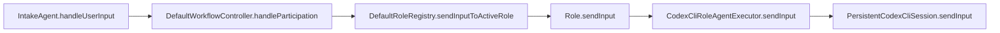
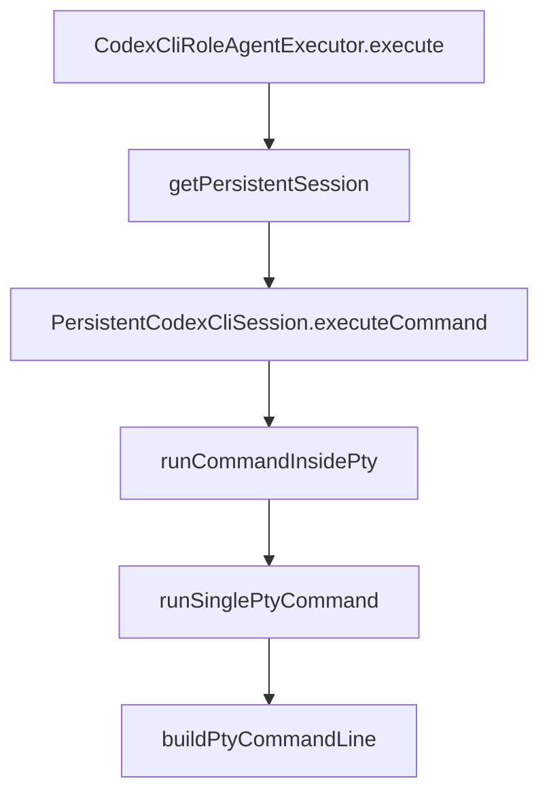
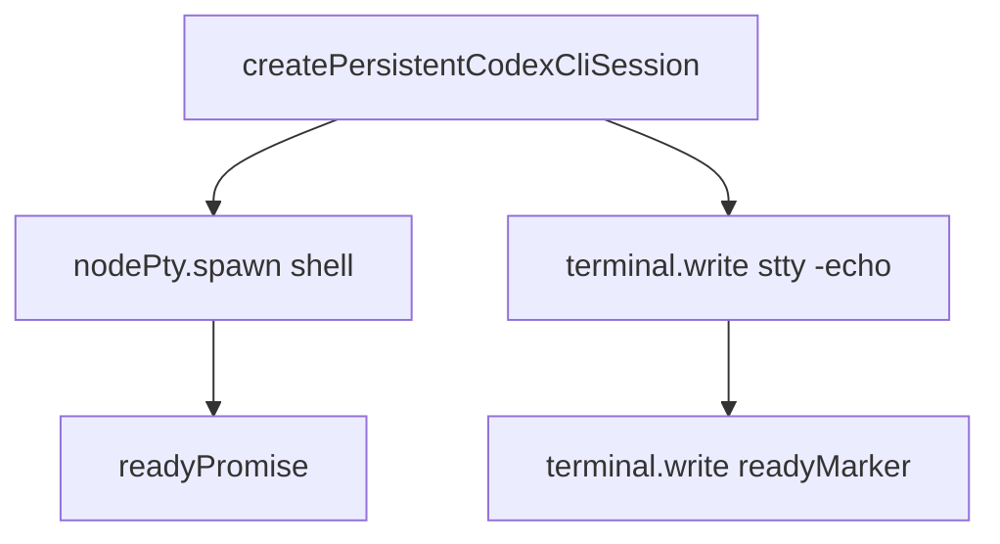
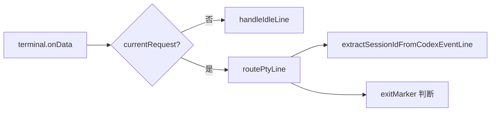
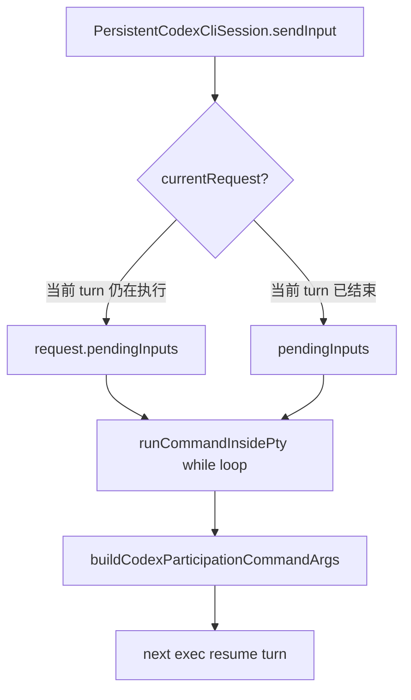
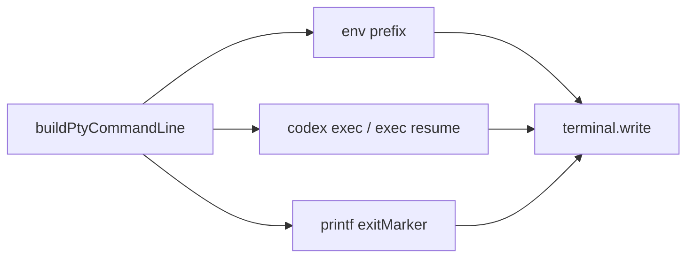
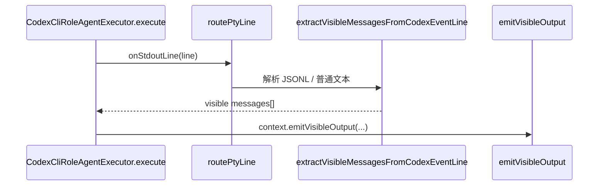
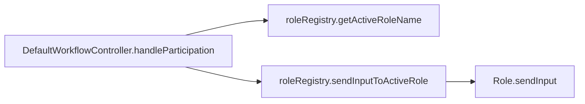
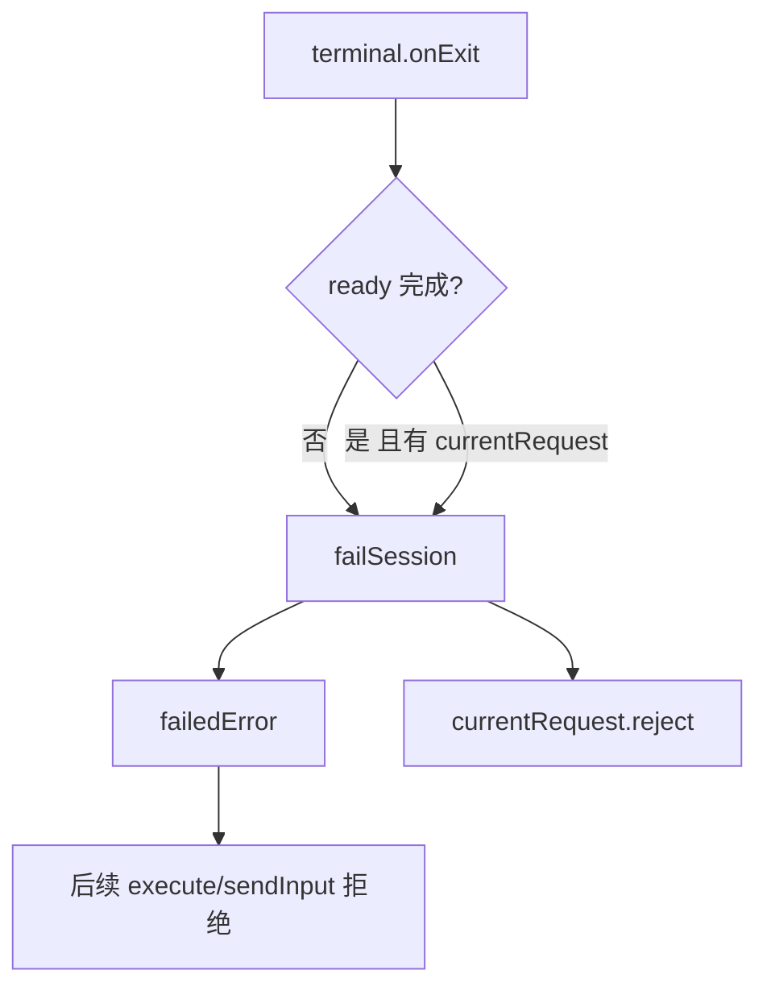
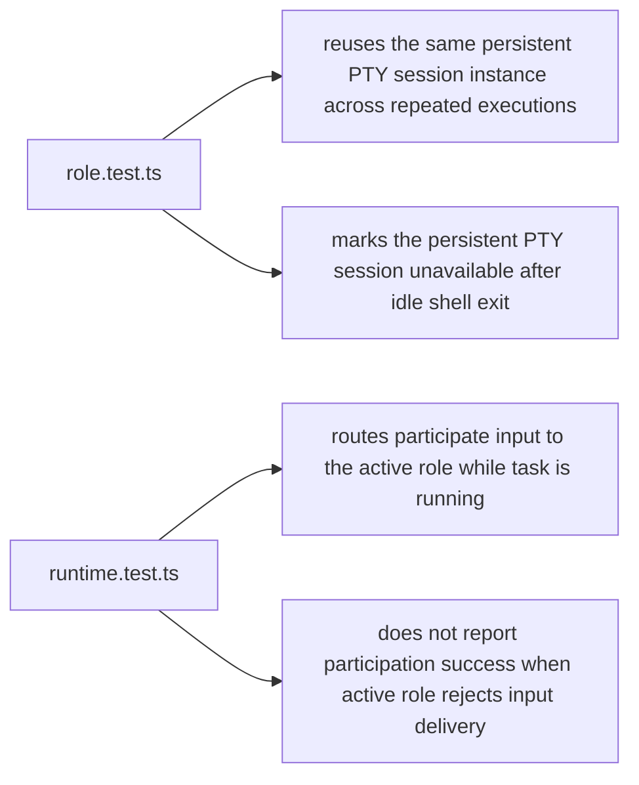

# default-workflow role node-pty subcommand 关键流程图解

## 文档目的

本文聚焦当前 `default-workflow` 里“角色通过 `node-pty` 调用子命令行”的真实执行链路。

重点解释三件事：

- `Role` 是怎么把一次角色执行收敛成一轮 `codex` 子命令 turn 的
- 运行中的补充输入是怎么进入当前 active role 的后续 turn 的
- PTY 异常退出、会话销毁时，失败态是怎么收口的

核心对应文件：

- `src/default-workflow/role/executor.ts`
- `src/default-workflow/runtime/dependencies.ts`
- `src/default-workflow/workflow/controller.ts`
- `src/default-workflow/intake/agent.ts`
- `src/default-workflow/shared/types.ts`
- `src/default-workflow/testing/role.test.ts`
- `src/default-workflow/testing/runtime.test.ts`

---

## 1. 整体图：谁负责把输入送进子命令行

这条链路只负责“运行中补充输入”。

关键代码对应：

- 入口判定：`IntakeAgent.handleUserInput()`、`IntakeAgent.shouldHandleInputAsLiveParticipation()`
- Workflow 路由：`DefaultWorkflowController.handleParticipation()`
- active role 定位：`DefaultRoleRegistry.sendInputToActiveRole()`
- 角色执行器：`CodexCliRoleAgentExecutor.sendInput()`
- PTY 会话排队：`createPersistentCodexCliSession().sendInput()`

---

## 2. 整体图：一次角色执行如何变成一轮子命令 turn

这里的关键点是：

- `Role` 级别复用的是一个长期存在的 PTY terminal
- 具体的 `codex exec` / `codex exec resume` 是这个 terminal 里的单轮 turn
- 每轮 turn 结束靠 `exitMarker` 回收，不靠外层进程对象直接判断

关键代码对应：

- 执行入口：`CodexCliRoleAgentExecutor.execute()`
- PTY 会话工厂：`createPersistentCodexCliSession()`
- turn 串行器：`PersistentCodexCliSession.executeCommand()`
- turn 主循环：`runCommandInsidePty()`
- 单轮命令下发：`runSinglePtyCommand()`
- shell 命令拼装：`buildPtyCommandLine()`

---

## 3. 局部图：持久 PTY terminal 的初始化

这一步对应的是“role 级别长期存在的 PTY terminal”。

关键代码对应：

- `createPersistentCodexCliSession()`
- `buildPtyEnv()`
- `readyMarker`
- `readyPromise`

说明：

- `nodePty.spawn(...)` 启动的是 shell，不是每轮业务 turn
- `readyMarker` 用来确认这个 shell 已经进入可接收命令的空闲态
- `readyPromise` 后续会被 `executeCommand()` await

---

## 4. 局部图：PTY 空闲态和运行态如何共享一条输出流

关键代码对应：

- 输出监听：`terminal.onData(...)`
- 空闲态处理：`handleIdleLine()`
- 运行态解析：`routePtyLine()`
- session id 提取：`extractSessionIdFromCodexEventLine()`

说明：

- 空闲态只关心 `readyMarker`
- 运行态同时处理三类东西：
  - Codex JSONL 事件
  - `thread.started` 里的 `thread_id`
  - shell 打出来的 `exitMarker`

---

## 5. 局部图：运行中补充输入为什么不会直接写当前 stdin

关键代码对应：

- 输入接收：`PersistentCodexCliSession.sendInput()`
- 当前 turn 缓冲：`request.pendingInputs`
- turn 间缓冲：`pendingInputs`
- 后续 turn 构造：`buildCodexParticipationCommandArgs()`
- 主循环：`runCommandInsidePty()`

说明：

- 运行中输入不会继续追加到当前 `codex` 的 stdin
- 它会被转换成“同一个 role PTY terminal 里的下一轮 `exec resume` turn”
- 这样当前 turn 和后续补充输入之间有明确协议边界

---

## 6. 局部图：子命令如何真正落到 shell 里

关键代码对应：

- `buildPtyCommandLine()`
- `buildShellEnvPrefix()`
- `escapeShellArg()`
- `runSinglePtyCommand()`

说明：

- shell 实际执行的是“带环境前缀的 codex 子命令 + 唯一 exitMarker”
- `exitMarker` 是这轮 turn 在共享 PTY 流里的结束边界

---

## 7. 局部图：可见输出是怎么回到 Workflow 的

关键代码对应：

- `routePtyLine()`
- `extractVisibleMessagesFromCodexEventLine()`
- `collectVisibleMessages()`
- `CodexCliRoleAgentExecutor.execute()` 里的 `onStdoutLine`

说明：

- `thread.started`、`turn.completed` 这类控制事件不会直接展示给用户
- 真正用户可见的文本会通过 `emitVisibleOutput` 回到 Workflow / CLI

---

## 8. 局部图：active role 路由

关键代码对应：

- `DefaultWorkflowController.handleParticipation()`
- `DefaultRoleRegistry.activate()`
- `DefaultRoleRegistry.getActiveRoleName()`
- `DefaultRoleRegistry.sendInputToActiveRole()`

说明：

- 只有 `RUNNING` 状态下的 `participate` 会走这条链路
- `resume_task`、`cancel_task`、`interrupt_task` 仍然是独立控制链路

---

## 9. 局部图：异常退出和销毁如何收口

关键代码对应：

- `terminal.onExit(...)`
- `failSession()`
- `assertSessionAvailable()`
- `shutdown()`

说明：

- 空闲态 shell 提前退出时，`readyPromise` 会进入失败态
- 当前 turn 正在执行时退出，会立即 reject 当前请求
- 后续 `executeCommand()` 和 `sendInput()` 不会再假装 session 仍然可用

---

## 10. 测试图：当前有哪些回归点在守这个链路

关键测试对应：

- `reuses the same persistent PTY session instance across repeated executions`
- `marks the persistent PTY session unavailable after idle shell exit`
- `routes participate input to the active role while task is running`
- `does not report participation success when active role rejects input delivery`

---

## 11. 一句话总结

当前这套实现的核心心智模型是：

- `Role` 复用一个长期存在的 PTY terminal
- 每次角色执行是这个 terminal 里的一轮 `codex` turn
- 运行中补充输入不会写同一条 stdin，而是排成下一轮 `exec resume`
- Workflow 只负责 active role 路由和交付反馈，不负责子命令内部执行逻辑
