# default-workflow workflow layer 关键代码图解

## 文档目的

本文模仿 `roleflow/implementation/0.1.0/delivery/default-workflow-intake-layer-code-walkthrough.md` 的写法，但聚焦当前 git 修改区里真正新增到 `Workflow` 层的内容。

重点不是重复解释 Intake 已经讲过的入口交互，而是回答下面这几个问题：

- 相对于 Intake walkthrough，这次代码把哪些能力从“占位”推进成了“真实编排”
- `WorkflowController` 现在到底多了哪些主流程职责
- `ProjectConfig`、`Runtime Builder`、`ArtifactManager`、`RoleRegistry`、测试分别补了什么

核心对应文件：

- `src/default-workflow/shared/types.ts`
- `src/default-workflow/shared/constants.ts`
- `src/default-workflow/shared/utils.ts`
- `src/default-workflow/persistence/task-store.ts`
- `src/default-workflow/runtime/dependencies.ts`
- `src/default-workflow/runtime/builder.ts`
- `src/default-workflow/workflow/controller.ts`
- `src/default-workflow/intake/agent.ts`
- `src/default-workflow/intake/intent.ts`
- `src/default-workflow/testing/runtime.test.ts`

---

## 1. 整体图：相对于 Intake walkthrough，新增了哪一层

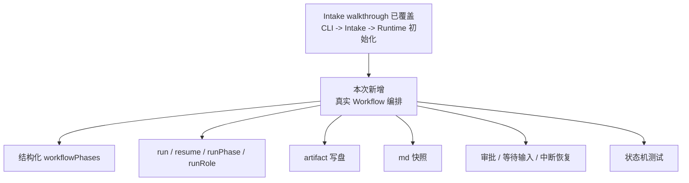

上一份 walkthrough 讲清楚了“怎么把任务收进来”。  
这次新增的是“任务收进来以后，Workflow 怎么真的跑起来”。

关键代码对应：

- `结构化 workflowPhases`：`ProjectConfig`、`WorkflowPhaseConfig`，位于 `src/default-workflow/shared/types.ts`
- `run / resume / runPhase / runRole`：`class DefaultWorkflowController`，位于 `src/default-workflow/workflow/controller.ts`
- `artifact 写盘`：`FileArtifactManager.saveArtifact()`，位于 `src/default-workflow/persistence/task-store.ts`
- `md 快照`：`FileArtifactManager.saveTaskState()`、`renderTaskStateMarkdown()`
- `审批 / 等待输入 / 中断恢复`：`runPhaseInternal()`、`resume()`、`interrupt()`
- `状态机测试`：`src/default-workflow/testing/runtime.test.ts`

---

## 2. 整体图：这次真正新增的文件职责变化

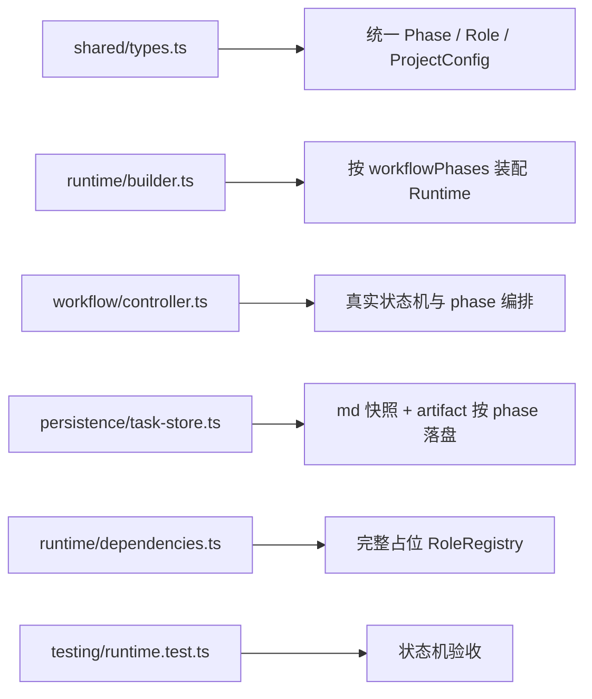

相对于 Intake walkthrough 里那条“CLI 很薄、Intake 负责追问、Builder 负责装配”的主线，这次新增的重点是：

- `shared/*` 不再只是辅助类型，而是变成 Workflow 主状态机的契约
- `workflow/controller.ts` 不再只是 IntakeEvent 占位桥
- `persistence/task-store.ts` 不再只存 `task-state.json`
- `testing/runtime.test.ts` 不再只测“能恢复”，而是测“怎么流转”

关键代码对应：

- `统一 Phase / Role / ProjectConfig`：`Phase`、`RoleName`、`WorkflowPhaseConfig`、`ProjectConfig`
- `按 workflowPhases 装配 Runtime`：`buildRuntimeForNewTask()`、`buildRuntimeForResume()`
- `真实状态机与 phase 编排`：`handleIntakeEvent()`、`executeFromPhase()`、`runPhaseInternal()`
- `md 快照 + artifact 按 phase 落盘`：`saveTaskState()`、`saveArtifact()`
- `完整占位 RoleRegistry`：`StaticRoleRegistry`
- `状态机验收`：`runtime.test.ts`

---

## 3. 关键图：`ProjectConfig` 从“workflow 类型”升级成“workflow 编排输入”

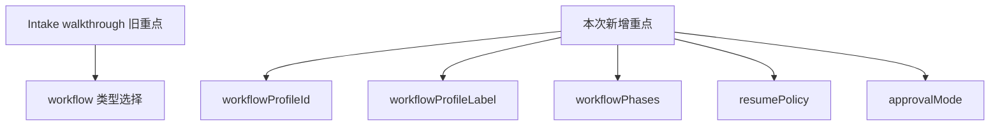

上一份 walkthrough 里，`Runtime Builder` 主要解释的是“收齐资料后装配 Runtime”。  
这次新增的是：`Runtime` 初始化输入里，真正把“具体流程编排”落成结构化配置。

关键代码对应：

- `ProjectConfig`：`interface ProjectConfig`，位于 `src/default-workflow/shared/types.ts`
- `workflowPhases`：`WorkflowPhaseConfig[]`
- `workflowProfileId / workflowProfileLabel`：`createProjectConfig()`
- `resumePolicy / approvalMode`：`createProjectConfig()`

---

## 4. 局部图：默认 phase-host-role 映射是如何固定下来的

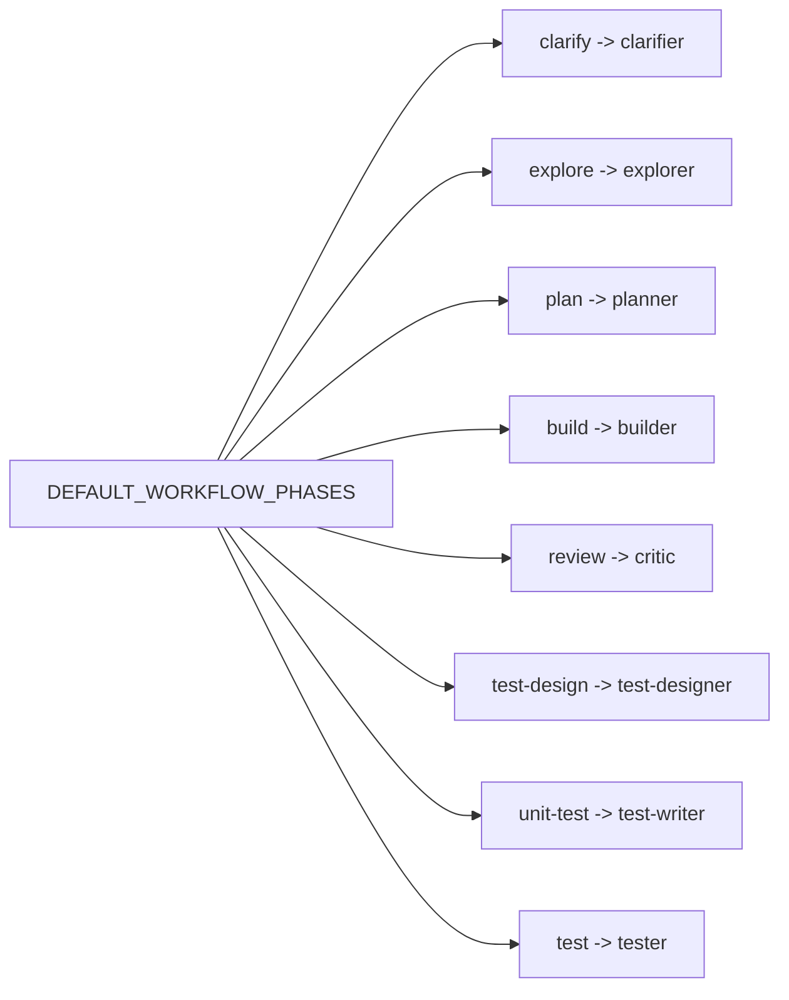

这张图对应的，是相对于 Intake walkthrough 的第一类新增内容：  
之前只是“确认编排字符串”，现在是“编排结构真的进代码了”。

关键代码对应：

- `DEFAULT_WORKFLOW_PHASES`：`src/default-workflow/shared/constants.ts`
- `DEFAULT_PHASE_ROLE_MAPPING`：`src/default-workflow/shared/constants.ts`
- `createDefaultWorkflowPhases()`：`src/default-workflow/shared/utils.ts`

---

## 5. 局部图：`Runtime Builder` 新增的装配输入变化

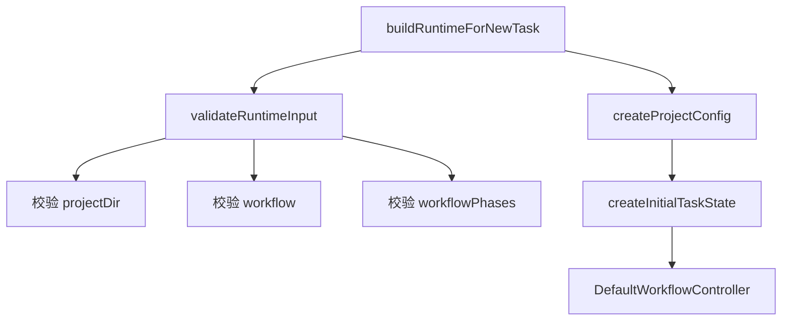

相对于 Intake walkthrough 里那张“Runtime Builder 装配顺序图”，这次新增了一个关键差异：

- 旧图里是 `workflow + orchestration`
- 现在变成 `workflow + workflowPhases`

同时 `validateRuntimeInput()` 现在不只验证目录和 workflow，还会验证每个 phase 至少有：

- `name`
- `hostRole`

关键代码对应：

- `buildRuntimeForNewTask()`：`src/default-workflow/runtime/builder.ts`
- `BuildNewRuntimeInput.workflowPhases`
- `validateRuntimeInput(projectDir, artifactDir, workflow, workflowPhases)`
- `createInitialTaskState(taskId, title, workflowPhases)`

---

## 6. 关键图：`WorkflowController` 从“事件桥”升级成“四段式主流程”

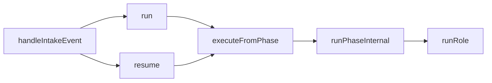

这是相对于 Intake walkthrough 最大的一处新增。  
上一份文档里的 `WorkflowController` 还只是“收到事件，改几个状态”。  
现在它已经变成真实编排控制器。

关键代码对应：

- `handleIntakeEvent()`：入口桥接
- `run(taskId, input?)`：正式启动主流程
- `resume(taskId, input?)`：从 `resumeFrom` 恢复
- `executeFromPhase()`：按 `workflowPhases` 顺序推进
- `runPhaseInternal()`：单个 phase 的完整生命周期
- `runRole(roleName, input)`：调用 `RoleRegistry`

---

## 7. 中层图：`run()` 相对于旧 walkthrough 新增了什么

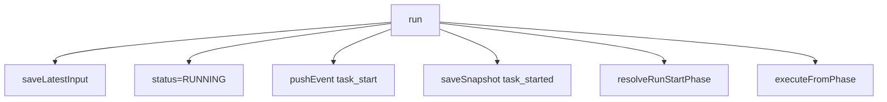

上一份 walkthrough 里的 `start_task` 只是把状态推到 `clarify + RUNNING`。  
这次新增的是：`run()` 会真的继续跑下去，而不是停在“已启动”。

关键代码对应：

- `run()`：`src/default-workflow/workflow/controller.ts`
- `saveLatestInput()`：把最新用户输入写回 `PersistedTaskContext.latestInput`
- `pushEvent("task_start", ...)`
- `saveSnapshot("task_started")`
- `resolveRunStartPhase()`

---

## 8. 中层图：`resume()` 相对于旧 walkthrough 新增了什么

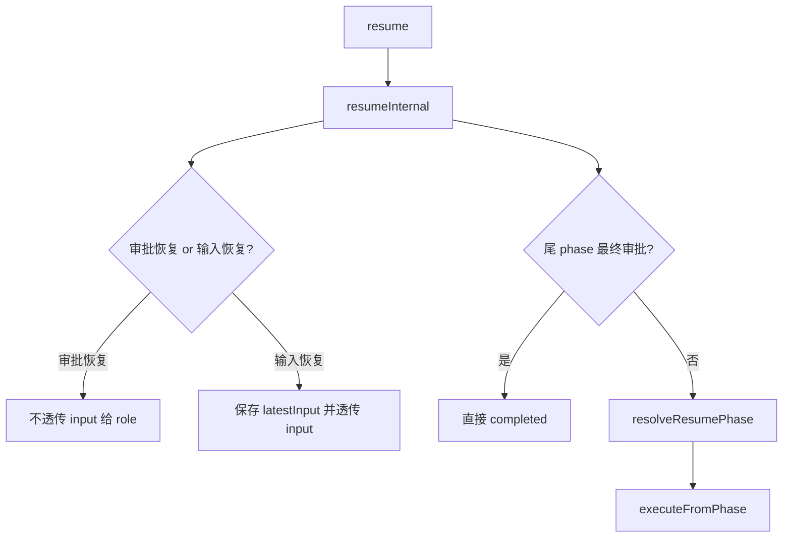

上一份 walkthrough 已经讲过“为什么 Runtime 恢复必须重建”。  
这次新增的是“Runtime 重建以后，Workflow 到底怎么继续跑”，以及“恢复输入什么时候是控制信号、什么时候才是业务输入”。

关键代码对应：

- `resume()`：`src/default-workflow/workflow/controller.ts`
- `resumeInternal()`：统一处理恢复语义
- `shouldUseResumeInput()`：区分审批恢复和输入恢复
- `shouldCompleteAfterFinalApproval()`：处理尾 phase 最终审批
- `resolveResumePhase()`：优先信任 `resumeFrom`
- `executeFromPhase()`

---

## 9. 关键图：单个 phase 现在真的有完整生命周期了

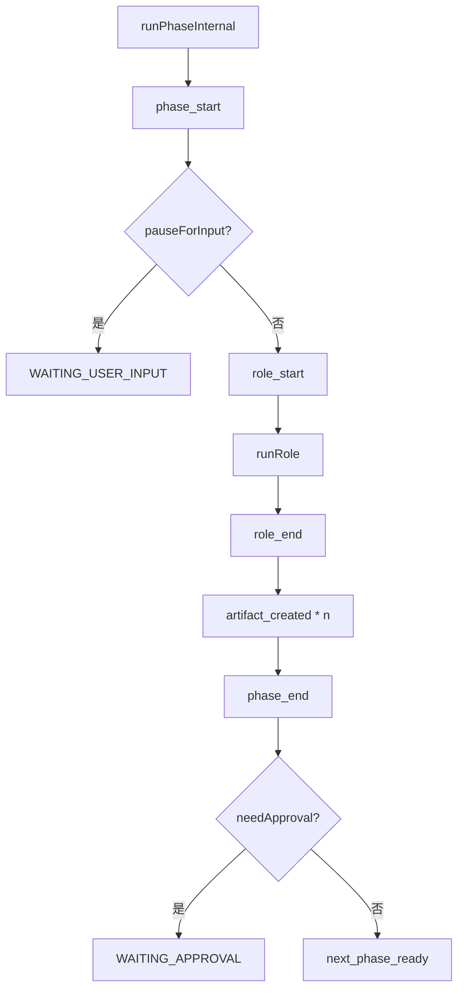

这张图是整份文档里最核心的一张。  
它解释了相对于 Intake walkthrough 的第二类新增内容：

- 以前只有 `handleIntakeEvent()` 的状态跳转
- 现在有真实的 phase 生命周期

关键代码对应：

- `runPhaseInternal()`：`src/default-workflow/workflow/controller.ts`
- `phase_start`：`pushEvent("phase_start", ...)`
- `WAITING_USER_INPUT`：`pauseForInput && !hasUsableInput(input)`
- `role_start / role_end`
- `artifact_created`：遍历 `roleResult.artifacts`
- `phase_end`
- `WAITING_APPROVAL`：`phaseConfig.needApproval`

---

## 10. 局部图：等待用户输入新增了什么

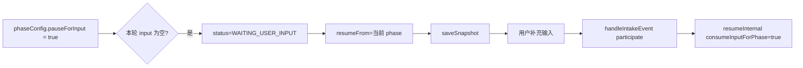

Intake walkthrough 主要讲“用户补充信息怎么进系统”。  
这次新增的是“Workflow 如何把补充信息和 phase 暂停机制接起来”。

关键代码对应：

- `pauseForInput?: boolean`：`WorkflowPhaseConfig`
- `runPhaseInternal()` 的 `pauseForInput` 分支
- `handleParticipation()`：等待输入或中断时直接走 `resumeInternal(..., true)`

---

## 11. 局部图：等待审批新增了什么

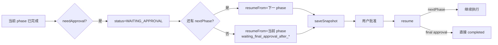

这一块是相对于 Intake walkthrough 的新增重点之一。  
旧实现虽然有 `WAITING_APPROVAL` 字样，但没有把“审批停在哪个边界、恢复从哪继续”做实。

现在明确为：

- 审批停在“当前 phase 已完成、下一 phase 尚未开始”
- 中间 phase 的 `resumeFrom` 指向下一 phase 的 `phase + roleName`
- 尾 phase 的 `resumeFrom` 留在当前 phase，等待最终人工确认后再收敛为 `completed`

关键代码对应：

- `needApproval`：`WorkflowPhaseConfig`
- `runPhaseInternal()` 中 `if (phaseConfig.needApproval)`
- `waiting_approval_after_*`：普通审批恢复点
- `waiting_final_approval_after_*`：尾 phase 最终审批恢复点
- `shouldCompleteAfterFinalApproval()`：审批通过后直接完成任务

---

## 12. 局部图：中断逻辑相对于旧 walkthrough 补强了什么

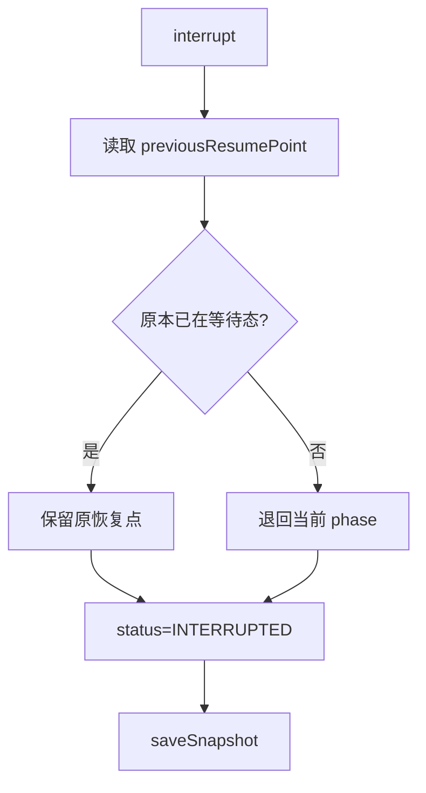

Intake walkthrough 已经讲过 “Ctrl+C 中断后要能恢复”。  
这次新增的是更细的恢复语义：

- 如果原本已经在 `WAITING_APPROVAL` / `WAITING_USER_INPUT`
- 中断时优先保留原 `resumeFrom`
- 避免恢复位置被错误回退

关键代码对应：

- `interrupt()`：`src/default-workflow/workflow/controller.ts`
- `previousResumePoint`
- `phase: previousResumePoint?.phase ?? currentPhase`
- `roleName: previousResumePoint?.roleName ?? currentPhaseConfig.hostRole`

---

## 13. 关键图：artifact 和 md 快照是这次新增落地的另一半

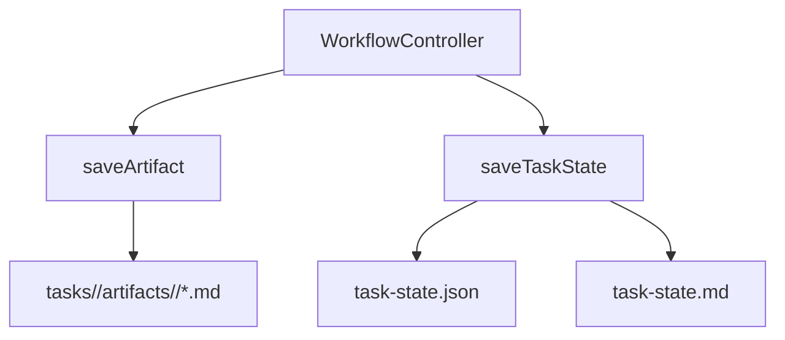

相对于 Intake walkthrough 里“每次事件后保存快照”的说明，这次新增了两件更具体的事：

1. `TaskState` 快照双写成 `json + md`
2. `RoleResult.artifacts` 真正按 phase 目录落盘

关键代码对应：

- `FileArtifactManager.saveTaskState()`：同时写 `task-state.json` 和 `task-state.md`
- `renderTaskStateMarkdown()`
- `FileArtifactManager.saveArtifact()`
- `getArtifactsRoot()`

---

## 14. 中层图：`RoleRegistry` 相对于旧 walkthrough 新增了什么

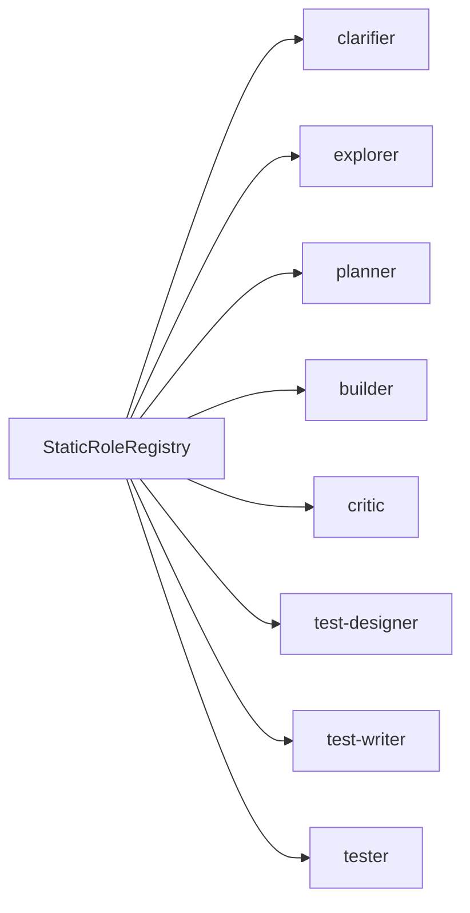

在 Intake walkthrough 里，`RoleRegistry` 还只是“Clarifier 占位角色挂上去”。  
这次新增的是：默认 workflow 主链路上的 host role 占位都补齐了。

同时还显式暴露了一个外部缺口：

- `tester` 角色文档缺失

关键代码对应：

- `StaticRoleRegistry`：`src/default-workflow/runtime/dependencies.ts`
- `createPlaceholderRole()`
- `tester` 的说明文本

---

## 15. 局部图：Intake 相对于旧 walkthrough 也同步做了哪些对接修改

```mermaid
flowchart TD
    A[IntakeAgent]
    A --> B[draft.workflowPhases]
    A --> C[confirm_workflow_profile]
    A --> D[buildRuntimeForNewTask(workflowPhases)]
    A --> E[CLI 展示 workflowProfileLabel + phases]
```

虽然这次主体是 Workflow layer，但相对于 Intake walkthrough，也有几处必须同步的新增：

- `DraftTask` 不再保存 `orchestration`
- 改为保存 `workflowPhases`
- `confirm_workflow_orchestration` 更名为 `confirm_workflow_profile`
- CLI 展示内容改成 `workflowProfileLabel + formatWorkflowPhases(...)`

关键代码对应：

- `DraftTask.workflowPhases`
- `confirmWorkflowProfile()`
- `handleWorkflowProfileConfirmation()`
- `getWorkflowProfilePrompt()`
- `initializeRuntimeAndStartTask()`

---

## 16. 关键图：测试相对于 Intake walkthrough 扩成了“状态机验收”

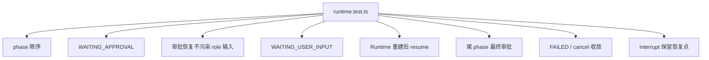

上一份 walkthrough 里的测试更多是：

- 追问阶段能不能取消
- CLI 重启能不能恢复
- 文案是不是正确

这次新增成了 Workflow 层验收测试，真正覆盖：

- 主 phase 顺序
- 审批等待
- 审批恢复不污染角色输入
- 用户输入等待
- 恢复继续执行
- 尾 phase 最终审批
- 失败和取消的 `phaseStatus` 收敛
- 中断保留恢复点

关键代码对应：

- `runs phases in configured order and waits for approval at plan`
- `rebuilds runtime on resume and continues from the next approved phase`
- `does not pass approval control text into the next phase role input`
- `waits for user input on paused phases and resumes from the same phase`
- `waits for final approval on the last phase before completing`
- `converges to failed state when role execution throws`
- `settles phaseStatus when cancelling a running task`
- `preserves resume point when interrupted during approval wait`

文件：

- `src/default-workflow/testing/runtime.test.ts`

---

## 17. 汇总图：当前 git 修改区相对于 Intake walkthrough 新增的核心闭环

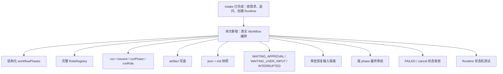

如果只用一句话概括这次相对于 `default-workflow-intake-layer-code-walkthrough.md` 的新增内容，就是：

> 上一份文档解释了“任务怎么被收进系统”，这次的修改把“任务收进来之后怎么按 phase 真实推进、暂停、恢复、落盘、验证”补齐了。

---

## 18. 新增点清单：方便和上一份 walkthrough 对照

- 新增 `ProjectConfig.workflowPhases`、`workflowProfileId`、`workflowProfileLabel`，替代旧 `orchestration` 结构。
- 新增 `Phase` / `RoleName` / `WorkflowPhaseConfig` 的稳定契约，并固定 `review`、`test-design`、`unit-test`、`test` 命名。
- 新增 `DefaultWorkflowController.run()`、`resume()`、`runPhase()`、`runRole()` 主链路实现。
- 新增 `executeFromPhase()` 和 `runPhaseInternal()`，把 phase 顺序、审批等待、用户输入等待落成代码。
- 新增 `resumeInternal()`，把“审批恢复控制信号”和“业务补充输入”分开处理。
- 新增 `RoleResult.artifacts -> ArtifactManager.saveArtifact()` 的真实工件写盘。
- 新增 `task-state.md` 渲染与双写快照。
- 新增完整 placeholder `RoleRegistry`，覆盖 `clarifier` 到 `tester`。
- 新增尾 phase 最终审批语义，不再要求 `needApproval` 后面必须还有下一个 phase。
- 新增失败与取消的 `phaseStatus` 收敛规则，避免出现 `failed + running` 这种冲突状态。
- 新增针对审批恢复输入污染、尾 phase 审批、取消态一致性的回归测试。
- 新增恢复语义：`resumeFrom` 优先级、审批边界、等待输入边界、中断保留恢复点。
- 新增 Workflow 层验收测试，而不是只停留在 Intake 层交互测试。
