# default-workflow-workflow-layer 实现说明

## 修改文件列表

- `src/default-workflow/shared/types.ts`
- `src/default-workflow/shared/constants.ts`
- `src/default-workflow/shared/utils.ts`
- `src/default-workflow/persistence/task-store.ts`
- `src/default-workflow/runtime/dependencies.ts`
- `src/default-workflow/runtime/builder.ts`
- `src/default-workflow/workflow/controller.ts`
- `src/default-workflow/intake/agent.ts`
- `src/default-workflow/intake/intent.ts`
- `src/default-workflow/testing/runtime.test.ts`
- `src/default-workflow/testing/agent.test.ts`
- `roleflow/implementation/0.1.0/default-workflow-workflow-layer.md`

## 改动摘要

### 1. Runtime 初始化输入收敛到结构化 `workflowPhases`

- 关键函数 / 类型：`createProjectConfig()`、`createDefaultWorkflowPhases()`、`buildRuntimeForNewTask()`、`buildRuntimeForResume()`、`ProjectConfig`、`WorkflowPhaseConfig`
- 将 `ProjectConfig` 收敛为 `workflowProfileId`、`workflowProfileLabel`、`workflowPhases`、`resumePolicy`、`approvalMode` 结构。
- `buildRuntimeForNewTask()` 不再接收旧的 `orchestration`，而是显式接收 `workflowPhases` 并校验 `name`、`hostRole`。
- `createInitialTaskState()` 改为基于 `workflowPhases[0]` 初始化 `currentPhase`。

整体图：

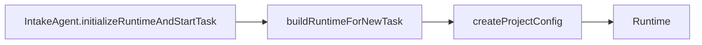

局部图：

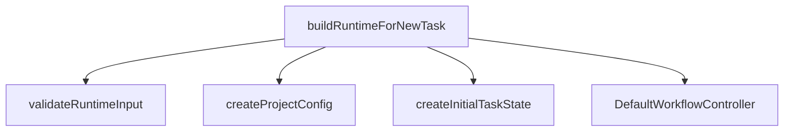

### 2. `DefaultWorkflowController` 落成真实状态机

- 关键函数 / 类：`DefaultWorkflowController`、`handleIntakeEvent()`、`run()`、`resume()`、`runPhase()`、`runRole()`
- `handleIntakeEvent()` 现在只负责桥接 Intake 事件，再分发到 `initializeTask()`、`run()`、`resume()`、`interrupt()`、`cancel()`。
- `run()` 和 `resume()` 都通过 `executeFromPhase()` 进入 phase 主链路，不再停留在占位分支。
- `runPhaseInternal()` 统一推进 `currentPhase`、`phaseStatus`、`status`、`resumeFrom`，并集中处理事件、工件、快照。

整体图：

中层图：

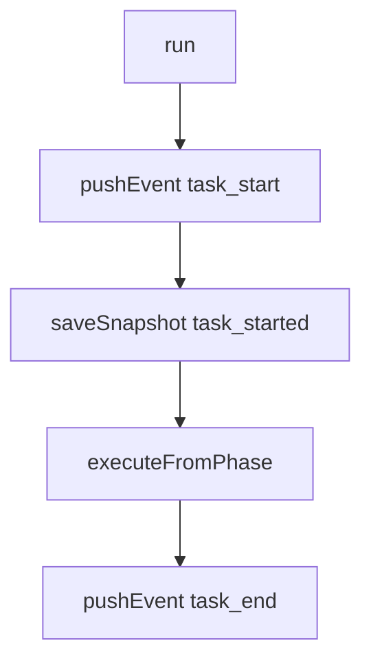

局部图：

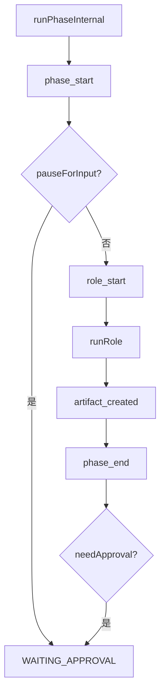

### 3. 审批、等待输入、中断、恢复全部走统一恢复点

- 关键函数 / 字段：`resume()`、`interrupt()`、`resolveResumePhase()`、`resumeFrom`
- `waiting_approval`：phase 已完成，`resumeFrom` 指向下一 phase 的 `phase + roleName`。
- `waiting_user_input`：phase 已进入但未执行 role，`resumeFrom` 指向当前 phase。
- `interrupted`：如果原本已经在等待审批或等待输入，会保留原 `resumeFrom`，只覆盖 `currentStep`，避免恢复点回退。

整体图：

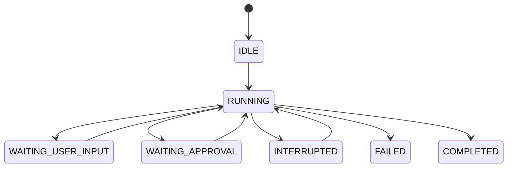

局部图：

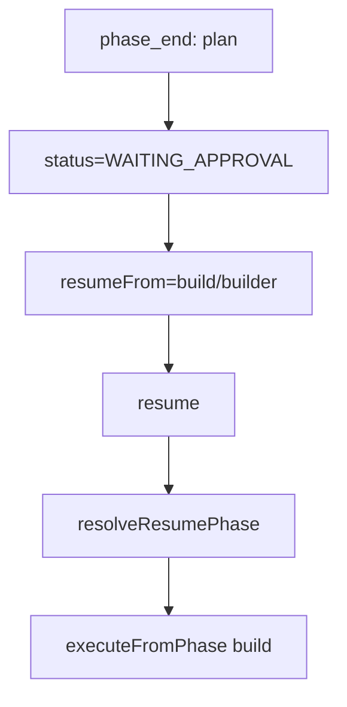

### 4. 工件、日志、md 快照由 Workflow 统一协调

- 关键函数 / 类：`FileArtifactManager.saveArtifact()`、`FileArtifactManager.saveTaskState()`、`pushEvent()`、`saveSnapshot()`、`JsonlEventLogger.append()`
- `TaskState` 关键节点持续双写到 `task-state.json` 和 `task-state.md`。
- `WorkflowController` 在角色执行完成后逐个保存 artifact，并发出 `artifact_created` 事件。
- `saveSnapshot()` 每次会同步刷新 `TaskState` 和持久化上下文，保证恢复依赖磁盘状态而不是旧内存。

整体图：

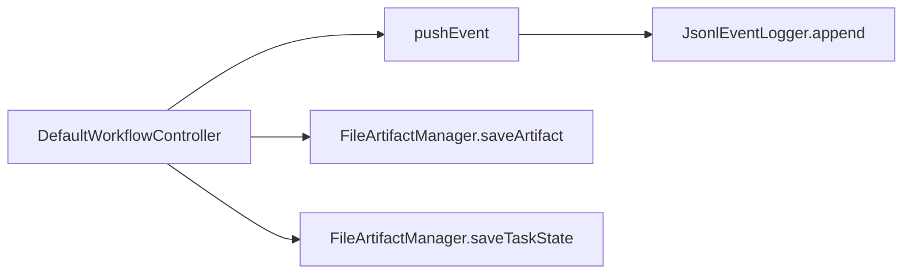

局部图：

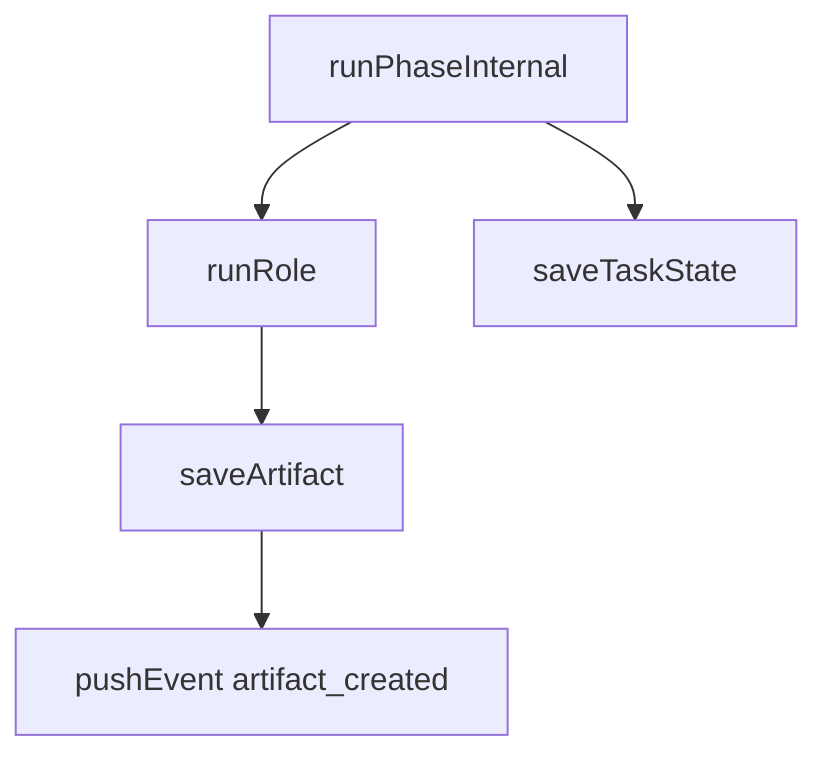

### 5. Intake 对接到新的 workflow profile / phases 模型

- 关键函数 / 类：`IntakeAgent.startDraftTask()`、`IntakeAgent.confirmWorkflowProfile()`、`IntakeAgent.initializeRuntimeAndStartTask()`、`formatWorkflowPhases()`
- `DraftTask` 改为保存 `workflowPhases`，CLI 展示 `workflowProfileLabel + workflowPhases`。
- `dispatchRuntimeEvent()` 在任务进入终止态后会清理恢复索引。
- `normalizeUserIntent()` 的运行中阶段跳转拦截命名同步到 `review / test-design / unit-test / test`。

整体图：

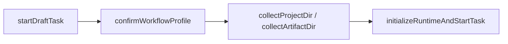

局部图：

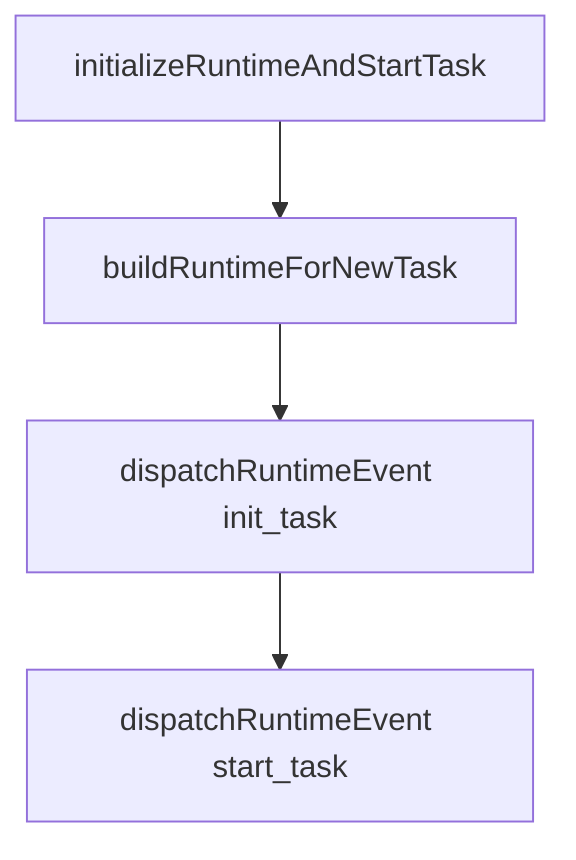

### 6. 测试改为覆盖 workflow layer 验收点

- 关键测试：`runtime.test.ts`、`agent.test.ts`
- `runtime.test.ts` 覆盖 phase 顺序、等待审批、等待输入、中断恢复、失败收敛、md 快照。
- `agent.test.ts` 同步验证 CLI 侧的 workflow 编排确认文案与恢复链路。

整体图：

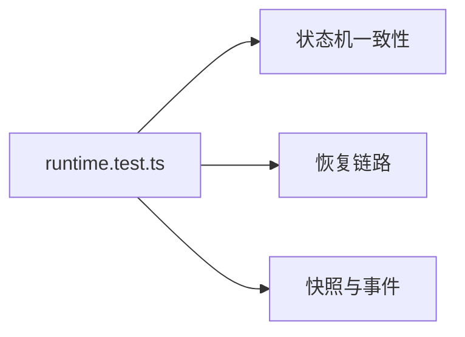

局部图：

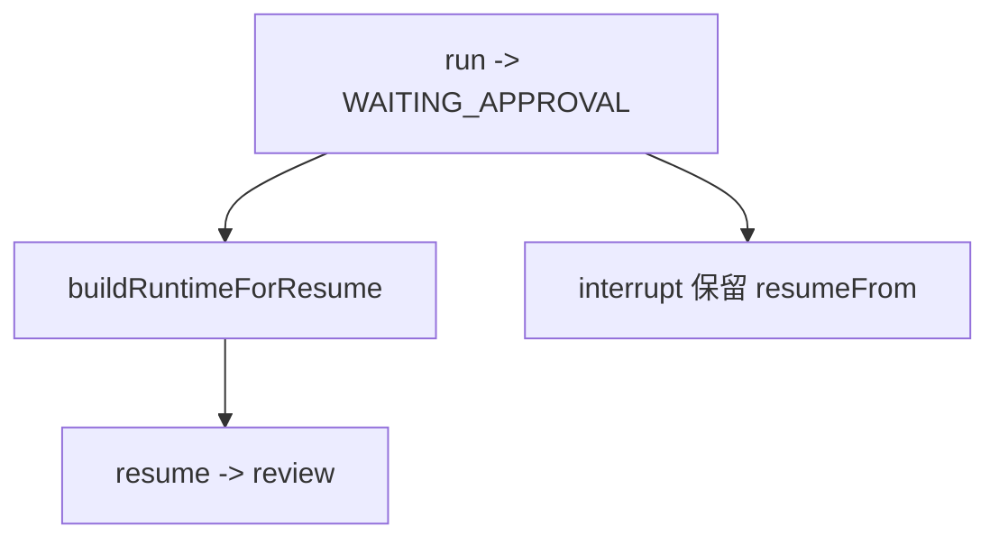

## 改动理由

- 计划文档要求 `Workflow` 成为真正的编排核心，而不是只处理少量 Intake 占位事件，因此必须把 `run / resume / runPhase / runRole` 做实。
- `ProjectConfig.workflowPhases` 是 Runtime 初始化输入的一部分，之前只停留在“workflow 类型选择”，不足以支撑恢复和 phase 编排。
- `waiting_approval`、`waiting_user_input`、`interrupted` 如果没有统一的 `resumeFrom` 规则，恢复链路会变成不可靠的隐式行为。
- `TaskState` 快照和 artifact 必须由 `WorkflowController` 统一协调，否则状态写盘和工件写盘会出现职责漂移。

## 未解决的不确定项

- `tester` 角色职责文档仍缺失；当前代码只是在 `StaticRoleRegistry` 和 capability warning 中显式暴露这个外部缺口，没有伪装成真实能力。
- `Role` 仍是占位实现，当前测试验证的是 Workflow 编排、状态机和持久化边界，不代表真实多 Agent 执行已经接入。
- `task-state.md` 目前是快照型 markdown，后续如果要做更强的人读导航，可能还需要补充 phase 历史索引或 artifact 链接。

## 自检结果

- 已做：`pnpm build`
- 已做：`pnpm test`
- 已做：检查 `src/default-workflow` 中旧 `orchestration` 结构和非法 `phaseStatus` 残留是否还存在
- 未做：`pnpm cli` 端到端人工交互烟测
- 未做：真实角色 Agent 接入后的联调验证
