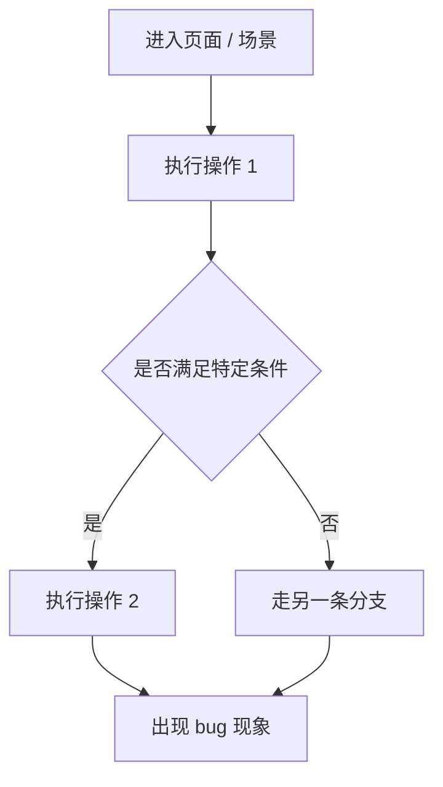

# Exploration: Bug Fix (explorationBugFix)

## 概述 (summary)
请用 3～5 行说明：
- 当前 bug 现象是什么
- 影响范围大概是什么
- 初步怀疑问题出在哪
- 当前最大的未知点是什么

## 问题描述 (problemDescription)
整理原始 bug 信息：
- 用户看到的现象是什么
- 预期行为是什么
- 实际行为是什么
- 是否稳定复现
- 是否和特定环境 / 账户 / 网络有关

## 复现路径 (reproductionPath)
优先用 Mermaid 流程图展示复现路径；只有路径极短时才退回列表：

如果复现条件不完整，也要写清楚缺什么。

## 相关入口点 (relatedEntryPoints)
列出这次 bug 最可能相关的入口：
- 页面入口
- 按钮 / 事件入口
- 请求入口
- 状态更新入口

## 关键逻辑链路 (keyLogicFlow)
优先用 Mermaid 流程图展示最相关的调用链或逻辑路径：

## 相关模块 (relatedModules)
列出最可疑或最相关的模块：
- 模块 A：当前作用
- 模块 B：当前作用
- 模块 C：当前作用

## 可能根因 (possibleRootCauses)
列出当前怀疑的原因：
- 状态未更新
- 条件判断错误
- 异步时序问题
- 空值 / 边界处理遗漏
- 历史兼容逻辑冲突
- 回归改动影响

## 影响面 (impactScope)
除了当前 bug，本次修复理论上可能波及：
- 哪些页面
- 哪些共用逻辑
- 哪些状态流
- 哪些历史行为

## 风险点 (risks)
- 修复当前问题但引入新回归
- 影响其他分支逻辑
- 影响共享状态
- 误判根因导致修错位置

## 待确认问题 (openQuestions)
- 问题 1
- 问题 2
- 问题 3

## 当前探索结论 (currentExplorationConclusion)
三选一：
- 可以进入 Planner
- 可以进入 Planner，但需要保留 open questions
- 暂时不能进入 Planner，必须先补充上下文
